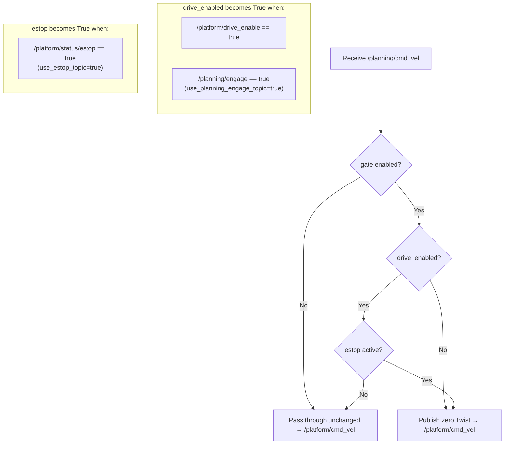

# camrod_platform

## 1. Summary

`camrod_platform` is the **last safety boundary before hardware**. It sits between the planning stack and the Ranger CAN driver, and it is responsible for three distinct concerns:

1. **`cmd_vel_gate_node`** — gates `/planning/cmd_vel` behind a four-signal safety interlock before the velocity command reaches the robot's drive motors.
2. **`robot_visualization_node`** — renders the robot body, sensor frames, planning boundary, and debug range rings as RViz MarkerArray at 20 Hz.
3. **`sensor_kit_bridge`** — includes `camrod_sensor_kit` to publish all static TF transforms and `/robot_description` (URDF) for every sensor frame.

> **Safety Boundary**
>
> `/platform/cmd_vel` is only published when ALL four conditions hold simultaneously:
> - `/platform/drive_enable` has published `true`
> - `/planning/engage` has published `true` (when `use_planning_engage_topic:=true`)
> - `/platform/status/estop` is `false` (when `use_estop_topic:=true`)
> - The gate node itself is running (`cmd_vel_gate_enable:=true`)
>
> When any condition is not met, the gate publishes a zero `Twist` on `/platform/cmd_vel` (`publish_zero_when_blocked: true`). The gate never passes through a stale velocity from a previous engage cycle.

---

## 2. Quick Start

```bash
# Full platform stack (gate + visualization + Ranger CAN + sensor_kit TF)
ros2 launch camrod_platform platform.launch.py

# Without Ranger CAN driver (simulation or bench testing)
ros2 launch camrod_platform platform.launch.py ranger_driver_enable:=false

# Disable the cmd_vel gate (direct pass-through, use only for hardware bench tests)
ros2 launch camrod_platform platform.launch.py cmd_vel_gate_enable:=false
```

---

## 3. System Position

```mermaid
graph LR
  PLAN[camrod_planning] -->|/planning/cmd_vel\n/planning/engage| PLAT[camrod_platform]
  LOC[camrod_localization] -->|/localization/pose| PLAT
  SENS[camrod_sensing] -->|/sensing/gnss/pose| PLAT
  MAP[camrod_map] -->|/map/markers| PLAT
  PLAT -->|/platform/cmd_vel\n/platform/status/*\nTF static| HW{{Ranger CAN Driver}}
  PLAT -->|/platform/status/odometry\n/platform/status/wheel_odometry| LOC
  PLAT -->|/platform/status/velocity| SENS
  PLAT -->|/platform/drive_enabled\n/platform/status/estop| SYS[camrod_system]
  PLAT -->|TF static (sensor frames)\n/robot_description| ALL[All Packages]
```

Legend: `[node]` = ROS node, `((topic))` = ROS topic, `{{file/hw}}` = external file or hardware, `[[stack]]` = external package.

**Upstream:** camrod_planning, camrod_localization, camrod_sensing, camrod_map

**Downstream (platform outputs consumed by):** camrod_localization (odometry), camrod_sensing (velocity), camrod_system (diagnostics), Ranger CAN hardware driver

---

## 4. Runtime Architecture

`platform.launch.py` includes four sub-launches in parallel (no inter-launch stagger within platform):

| Sub-launch | File | Condition |
|---|---|---|
| `cmd_vel_gate.launch.py` | `launch/cmd_vel_gate.launch.py` | `cmd_vel_gate_enable:=true` (default) |
| `robot_visualization.launch.py` | `launch/robot_visualization.launch.py` | Always |
| `ranger.launch.py` | `launch/ranger.launch.py` | `ranger_driver_enable:=true` (default) |
| `sensor_kit_bridge.launch.py` | `launch/sensor_kit_bridge.launch.py` | Always |

---

## 5. Interface Contract

### Inputs

| Topic | Type | Required | Producer | Rate | Meaning |
|---|---|---|---|---|---|
| `/planning/cmd_vel` | `geometry_msgs/Twist` | Yes | camrod_planning | ~10–20 Hz | Velocity command from Nav2 controller or planning gate |
| `/planning/engage` | `std_msgs/Bool` | Yes (if `use_planning_engage_topic:=true`) | camrod_planning | On change | Operator or state-machine engage signal; `true` arms the gate |
| `/platform/drive_enable` | `std_msgs/Bool` | Yes | External (UI / operator) | On change | Hardware drive-enable signal; `true` arms the gate |
| `/platform/status/estop` | `std_msgs/Bool` | Yes (if `use_estop_topic:=true`) | Ranger CAN driver (via bridge) | ~50 Hz | E-stop status from CAN bus; `true` blocks the gate |
| `/localization/pose` | `geometry_msgs/PoseStamped` | Yes | camrod_localization | ~20 Hz | Primary robot pose for visualization anchor |
| `/sensing/gnss/pose` | `geometry_msgs/PoseStamped` | No (fallback) | camrod_sensing | ~10 Hz | GNSS pose used when localization is stale |
| `/map/markers` | `visualization_msgs/MarkerArray` | No | camrod_map | On change | Lanelet markers; used to estimate ground Z for visualization |

### Outputs

| Topic | Type | Consumer | Rate | Meaning |
|---|---|---|---|---|
| `/platform/cmd_vel` | `geometry_msgs/Twist` | Ranger CAN driver | ~10–20 Hz | Gated velocity command; zero when gate blocked |
| `/platform/drive_enabled` | `std_msgs/Bool` | camrod_system (diagnostics) | On change | Current gate state (true = drive armed and not estopped) |
| `/platform/status/odometry` | `nav_msgs/Odometry` | camrod_localization (primary wheel) | 50 Hz | Normalized odometry from Ranger CAN bridge |
| `/platform/status/velocity` | `geometry_msgs/TwistStamped` | camrod_sensing (platform_velocity_converter) | 50 Hz | Velocity status from Ranger CAN bridge |
| `/platform/status/estop` | `std_msgs/Bool` | camrod_planning (cmd_vel gate), camrod_localization | 50 Hz | Derived e-stop from CAN bus |
| `/platform/status` | `avg_msgs/AvgPlatformStatus` | camrod_system | 50 Hz | Aggregated CAN status (vehicle_state, control_mode, battery, motor RPM) |
| `/rmp401/odom` | `nav_msgs/Odometry` | camrod_localization (wheel fallback) | 50 Hz | Fallback odometry (activated when `/odom` primary is silent) |
| `/platform/robot/markers` | `visualization_msgs/MarkerArray` | RViz | 20 Hz | Robot body, sensor axes, range rings, world origin |
| `/platform/robot/planning_boundary` | `geometry_msgs/PolygonStamped` | RViz, camrod_planning (collision reference) | 20 Hz | Body footprint + `planning_boundary_margin` polygon |
| TF static (all sensor frames) | `tf2_msgs/TFMessage` | All packages | Static | Sensor-to-base-link transforms from `robot_params.yaml` |
| `/robot_description` | `std_msgs/String` | All packages (TF, RViz) | Latched | URDF description from `camrod_sensor_kit` |

---

## 6. Sub-System Details

### 6.1 cmd_vel_gate_node

The gate node (`camrod_platform/cmd_vel_gate_node`) subscribes to four signals and decides whether to forward or zero-out the incoming velocity command.

#### Gate Logic



**Key node parameters** (set via `cmd_vel_gate.launch.py`):

| Parameter | Default | Description |
|---|---|---|
| `input_cmd_vel_topic` | `/planning/cmd_vel` | Gate input topic |
| `output_cmd_vel_topic` | `/platform/cmd_vel` | Gate output topic |
| `enable_topic` | `/platform/drive_enable` | Drive-enable signal topic |
| `engage_topic` | `/planning/engage` | Planning engage signal topic |
| `use_engage_topic` | `true` | Mirror `/planning/engage` to drive-enable logic |
| `state_topic` | `/platform/drive_enabled` | Published gate state |
| `use_estop_topic` | `true` | Subscribe to e-stop topic |
| `estop_topic` | `/platform/status/estop` | E-stop source topic |
| `allow_on_start` | `false` | Arm gate at startup without explicit enable signal |
| `publish_zero_when_blocked` | `true` | Actively publish zero Twist when gate is closed |

---

### 6.2 robot_visualization_node

Publishes a single `MarkerArray` on `/platform/robot/markers` at 20 Hz, anchored to the latest `/localization/pose`. Falls back to `/sensing/gnss/pose` if localization has been silent for longer than `localization_pose_timeout_s` (3.0 s default).

**Marker contents:**

- Robot footprint outline at ground plane (sized from `robot_params.yaml`)
- Planning boundary polygon (footprint + `planning_boundary_margin: 0.3 m`)
- Sensor frame axes labels (IMU, GNSS, LiDAR, camera)
- Debug range rings at radii `[2.0, 4.0, 6.0, 8.0]` m (configurable)
- World origin and map origin axes

**Key parameters** (from `config/robot_visualization.yaml`):

| Parameter | Default | Description |
|---|---|---|
| `publish_rate_hz` | `20.0` | Marker and boundary publish rate [Hz] |
| `localization_pose_timeout_s` | `3.0` | Max localization age before GNSS fallback [s] |
| `planning_boundary_margin` | `0.3` | Extra margin around footprint for boundary polygon [m] |
| `heading_yaw_offset_deg` | `0.0` | Heading correction [deg] applied to all markers |
| `range_ring_radii` | `[2.0, 4.0, 6.0, 8.0]` | Debug ring radii [m] |
| `use_gnss_fallback` | `true` | Enable GNSS fallback pose source |
| `use_map_ground_z` | `true` | Estimate ground Z from `/map/markers` lanelet samples |

---

### 6.3 sensor_kit_bridge

Includes `camrod_sensor_kit/launch/sensor_kit.launch.py` with `enable_status:=false`. This publishes:

- All static TF transforms (sensor frame → `robot_base_link`) read from `robot_params.yaml`.
- `/robot_description` (URDF) for RViz and TF consumers.

The geometry source file is controlled by the `params_file` argument, which defaults to `camrod_sensor_kit/config/robot_params.yaml` and is overridden by `camrod_bringup` via `config/sensor_kit/robot_params.yaml` (mount-offset edits apply without rebuilding either package).

---

## 7. Key Behaviors

### Robot Does Not Move at Startup (by Design)

**Trigger:** Startup condition.

**Internal logic:** `allow_on_start: false` means the gate initializes in the closed (zeroed) state. Neither `/planning/engage` nor `/platform/drive_enable` is latched from a previous run.

**Output effect:** `/platform/cmd_vel` publishes zero Twist from startup until an explicit enable is received.

**Operator-visible symptom:** Robot is stationary even when Nav2 publishes a non-zero `/planning/cmd_vel`. This is the correct behavior.

**Related params:** `drive_allow_on_start`

**Related topics:** `/platform/drive_enable`, `/planning/engage`

---

### E-stop Overrides All Enables

**Trigger:** `/platform/status/estop` transitions to `true`.

**Internal logic:** Gate immediately publishes zero Twist regardless of the drive-enable or engage state. The estop signal comes from the Ranger CAN bridge (`ranger_params.yaml: estop_on_exception_state: true`).

**Output effect:** `/platform/cmd_vel` becomes zero within one gate processing cycle.

**Operator-visible symptom:** Robot decelerates and stops. `/platform/drive_enabled` transitions to `false`.

**Related params:** `use_estop_topic`, `estop_topic`, `estop_on_exception_state`

**Related topics:** `/platform/status/estop`, `/platform/drive_enabled`, `/platform/cmd_vel`

---

### Localization Fallback in Visualization

**Trigger:** `/localization/pose` has not been received for longer than `localization_pose_timeout_s` (3.0 s).

**Internal logic:** `robot_visualization_node` switches its pose anchor from `/localization/pose` to `/sensing/gnss/pose`.

**Output effect:** Robot marker in RViz continues to update using GNSS position, but marker color or a log warning may indicate the fallback state.

**Operator-visible symptom:** Robot marker does not freeze even if localization is restarting.

**Related params:** `localization_pose_timeout_s`, `use_gnss_fallback`

**Related topics:** `/localization/pose`, `/sensing/gnss/pose`, `/platform/robot/markers`

---

## 8. Launch

### platform.launch.py arguments

| Argument | Default | Description |
|---|---|---|
| `cmd_vel_gate_enable` | `true` | Enable velocity gate node |
| `cmd_vel_in_topic` | `/planning/cmd_vel` | Gate input topic |
| `cmd_vel_out_topic` | `/platform/cmd_vel` | Gate output topic |
| `drive_enable_topic` | `/platform/drive_enable` | Drive-enable signal topic |
| `planning_engage_topic` | `/planning/engage` | Planning engage signal topic |
| `use_planning_engage_topic` | `true` | Mirror `/planning/engage` to drive-enable logic |
| `drive_state_topic` | `/platform/drive_enabled` | Gate state output topic |
| `use_estop_topic` | `true` | Subscribe to e-stop topic |
| `estop_topic` | `/platform/status/estop` | E-stop source topic |
| `drive_allow_on_start` | `false` | Arm gate at startup without explicit enable |
| `ranger_driver_enable` | `true` | Launch Ranger CAN driver sub-launch |
| `ranger_params_file` | `config/ranger_params.yaml` | Ranger driver parameter file |
| `params_file` | `camrod_sensor_kit/config/robot_params.yaml` | Robot geometry for TF and visualization |
| `robot_visualization_param_file` | `config/robot_visualization.yaml` | Robot visualization node parameters |
| `map_frame_id` | `map` | Global frame ID |
| `base_frame_id` | `robot_base_link` | Robot base frame ID |
| `sensor_kit_base_frame_id` | `sensor_kit_base_link` | Sensor kit base frame ID |

---

## 9. Config

| File | Purpose |
|---|---|
| `config/robot_visualization.yaml` | `robot_visualization_node` parameters: pose topics, timeout, heading offset, boundary margin, range rings, publish rate |
| `config/ranger_params.yaml` | Ranger CAN driver: `port_name: can0`, `update_rate: 50`, odom topics, e-stop behavior, platform status bridge topics |
| `config/vehicle_params.yaml` | Vehicle kinematics reference: wheelbase, track width, tire radius, max velocity/acceleration (read-only reference; not passed as a launch override automatically) |

---

## 10. Validation

After `ros2 launch camrod_platform platform.launch.py`:

```bash
# Confirm gate node is running
ros2 node list | grep cmd_vel_gate

# Check gate is publishing zeros (before engage)
ros2 topic echo /platform/cmd_vel --once

# Check drive state
ros2 topic echo /platform/drive_enabled --once

# Confirm sensor TF is up
ros2 run tf2_tools view_frames
# Expect: robot_base_link → sensor_kit_base_link → imu_link / gnss_link / lidar_link

# Check visualization markers are publishing
ros2 topic hz /platform/robot/markers   # expect ~20 Hz

# Check Ranger odometry (real hardware only)
ros2 topic hz /platform/status/odometry  # expect ~50 Hz
```

---

## 11. Troubleshooting

### Robot Does Not Move

Work through this checklist in order:

1. **Is the gate armed?**
   ```bash
   ros2 topic echo /platform/drive_enabled --once
   ```
   Expected: `data: true`. If `false`, continue.

2. **Has `/planning/engage` been published?**
   ```bash
   ros2 topic echo /planning/engage --once
   ```
   If no message or `data: false`, the planning engage signal has not been sent. Use the UI or publish manually:
   ```bash
   ros2 topic pub /planning/engage std_msgs/Bool "data: true" --once
   ```

3. **Has `/platform/drive_enable` been published?**
   ```bash
   ros2 topic echo /platform/drive_enable --once
   ```
   Same action as above if missing.

4. **Is e-stop active?**
   ```bash
   ros2 topic echo /platform/status/estop --once
   ```
   If `data: true`, the Ranger CAN driver is reporting a hardware fault. Check CAN bus (`ip link show can0`) and `ranger_params.yaml` (`estop_on_exception_state`, `estop_on_error_code`).

5. **Is `/planning/cmd_vel` non-zero?**
   ```bash
   ros2 topic echo /planning/cmd_vel --once
   ```
   If the planning gate itself is outputting zeros, the problem is upstream in `camrod_planning`.

---

### Robot Moves at Startup Unexpectedly

**Cause:** `drive_allow_on_start` was set to `true` in a previous launch or override.

**Fix:**
```bash
ros2 launch camrod_platform platform.launch.py drive_allow_on_start:=false
```
Or ensure `bringup/launch_defaults.yaml` has `platform/cmd_vel_gate_enable: false` only for the intended scenario.

---

### `/platform/cmd_vel` Publishing Zeros Forever (Gate Armed, No E-stop)

1. Verify `cmd_vel_gate_node` is running: `ros2 node list | grep cmd_vel_gate`.
2. Verify the input topic is correct: `ros2 param get /platform/cmd_vel_gate input_cmd_vel_topic`. It should be `/planning/cmd_vel`.
3. Check if the planning cmd_vel gate (in `camrod_planning`) is also blocked — it would appear as zeros on `/planning/cmd_vel`.
4. If `cmd_vel_gate_enable:=false` was set, `/platform/cmd_vel` is published directly from the platform sub-launch without gating. In this case there is no gate node to query.

---

### Robot Markers Missing in RViz

1. Confirm `robot_visualization_node` is running: `ros2 node list | grep robot_visualization`.
2. Check pose source: `ros2 topic hz /localization/pose` and `ros2 topic hz /sensing/gnss/pose`.
3. If both are silent, the visualization node has no pose anchor and will not publish.
4. Check `/platform/robot/markers` is being published: `ros2 topic hz /platform/robot/markers`.
5. In RViz, confirm the MarkerArray display is subscribed to `/platform/robot/markers` and the fixed frame is `map`.

---

### TF Tree Broken (sensor frames missing)

1. Check `sensor_kit_bridge` included `camrod_sensor_kit`: `ros2 node list | grep sensor_kit`.
2. Verify `/robot_description` is published: `ros2 topic echo /robot_description --once | head -5`.
3. Run `ros2 run tf2_tools view_frames` and look for disconnected subtrees.
4. Confirm `params_file` points to the correct `robot_params.yaml` with non-zero sensor offsets.
5. If `params_file` was overridden via `camrod_bringup/config/sensor_kit/robot_params.yaml`, verify that file has the correct mount offsets.

---

## 12. Related Docs

| Document | Location |
|---|---|
| Monorepo overview | `../README.md` |
| Parameter naming standard | `../PARAMETER_NAMING_STANDARD.md` |
| camrod_planning | `../camrod_planning/README.md` |
| camrod_localization | `../camrod_localization/README.md` |
| camrod_sensor_kit | `../camrod_sensor_kit/README.md` |
| camrod_system | `../camrod_system/README.md` |
| camrod_parking | `../camrod_parking/README.md` |
