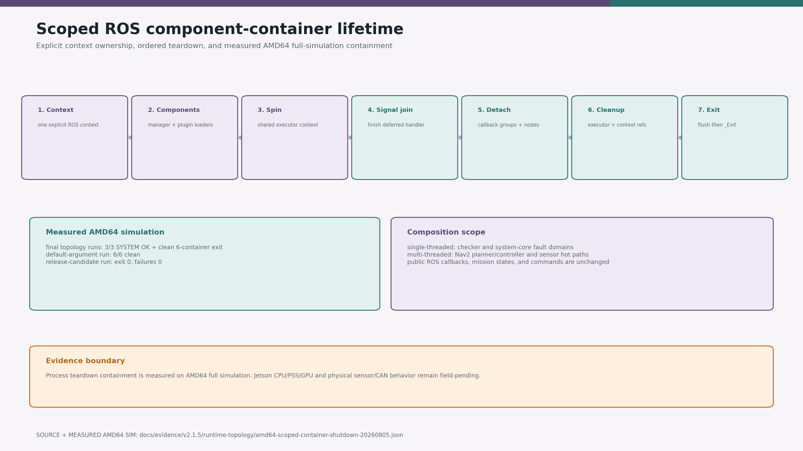
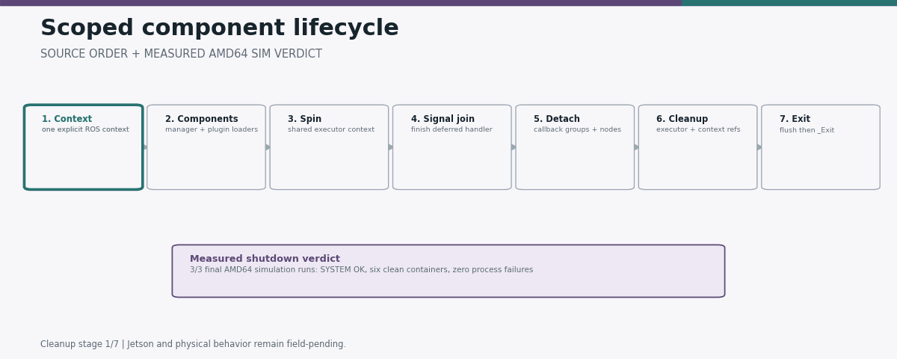

# camrod_runtime

`camrod_runtime` contains process-level helpers shared by composed CAMROD
modules. It does not implement robot behavior.

<!-- HH_260810 - Expose the package's process-lifetime technology with a
source-bound diagram and measured AMD64 simulation shutdown record. -->

| Evidence | Result |
|---|---|
| Source contract | One explicit context, joined signal handler, detached callback groups, retained loaders, explicit executor/context cleanup, process-exit containment |
| Final AMD64 simulation runs | `3/3` reached `SYSTEM OK`; all six component containers exited cleanly; process failures `0` |
| Default-argument simulation | `6/6` containers exited cleanly; process failures `0` |
| Physical/Jetson claim | Not measured; CPU/PSS/GPU and sensor/CAN behavior remain field-pending |

## Scoped component containers

| Executable | Executor | Intended use |
|---|---|---|
| `scoped_component_container` | single-threaded | Serialized low-rate components |
| `scoped_component_container_mt` | multi-threaded | Nav2 and sensor pipelines |

Both executables give the manager and every loaded component one explicitly
owned ROS context. On termination they join the ROS signal-handler thread,
detach callback groups, destroy component instances, retain plugin code through
context cleanup, and release the executor-options context reference.

ROS 2 Humble may still retain entity/guard-condition Context owners until DSO
static destruction. After explicit runtime cleanup, the executable uses
`std::_Exit()` so CycloneDDS `tev`/`recv` workers cannot race RMW code unload.
This process-exit-only containment removed intermittent checker/Nav2 `-11`
failures in three final amd64 full-simulation runs. It does not change node
callbacks, mission logic, or commands. Jetson lifecycle/resource acceptance is
still required.
