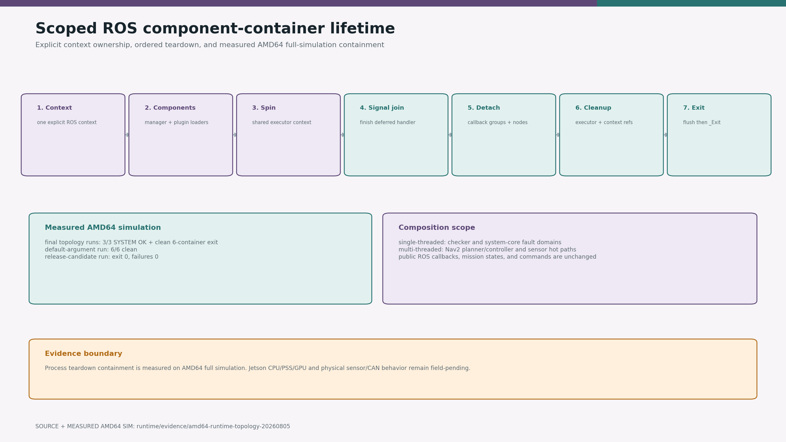

# camrod_runtime

`camrod_runtime` contains process-level helpers shared by composed CAMROD
modules. It does not implement robot behavior.

<!-- HH_260810 - Keep executable lifetime ownership separate from generated
interfaces so ARM64 deployments can depend on only the layer they need. -->
The package was introduced on 2026-08-05 (`1f751476a`) when explicit-context
component shutdown became a shared requirement. It intentionally remains
separate from `camrod_common`: `camrod_common` owns generated message/service
interfaces and lightweight data contracts, while `camrod_runtime` owns C++
executables, plugin loaders, executors, signal handling, and process lifetime.
Merging them would force every message-only consumer to link runtime/container
dependencies and would enlarge rebuild and fault scope on the 8-core ARM64
target.

<!-- HH_260810 - Expose the package's process-lifetime technology with a
source-bound diagram and measured AMD64 simulation shutdown record. -->

| Evidence | Result |
|---|---|
| Source contract | One explicit context, joined signal handler, detached callback groups, retained loaders, explicit executor/context cleanup, process-exit containment |
| Final AMD64 controlled-stop runs | `3/3` reached `SYSTEM OK`; all component and standalone processes exited cleanly; process failures `0` |
| Post-fix no-goal full graph | `1/1`; UI READY, 44/44 clean exits, failures/forced kills/descendants `0`; raw log retained |
| Default-argument simulation | `6/6` containers exited cleanly; process failures `0` |
| Physical/Jetson claim | Not measured; CPU/PSS/GPU and sensor/CAN behavior remain field-pending |

## Scoped component containers

| Executable | Executor | Intended use |
|---|---|---|
| `scoped_component_container` | single-threaded | Serialized low-rate components |
| `scoped_component_container_mt` | multi-threaded | Nav2 and sensor pipelines |

Both executables give the manager and every loaded component one explicitly
owned ROS context. On termination they join the ROS signal-handler thread,
detach callback groups, destroy component instances, retain plugin code through
context cleanup, and release the executor-options context reference.

ROS 2 Humble may still retain entity/guard-condition Context owners until DSO
static destruction. After explicit runtime cleanup, the executable uses
`std::_Exit()` so CycloneDDS `tev`/`recv` workers cannot race RMW code unload.
This process-exit-only containment removed intermittent checker/Nav2 `-11`
failures in three final amd64 full-simulation runs. It does not change node
callbacks, mission logic, or commands. Jetson lifecycle/resource acceptance is
still required.

The Nav2 lifecycle manager remains a standalone fault domain because Humble's
bond client and private executor use the default ROS context. Composing it into
the scoped Nav2 context was tested and rejected: planner activation timed out
at the 20-second bond boundary. Its standalone `main.cpp` now releases the node,
flushes output, and exits after explicit ROS cleanup, bypassing only the same
shutdown-only DSO/DDS static-destruction race. Three fresh controlled full-graph
runs reached `SYSTEM OK` and ended with lifecycle-manager exit code `0`; no
`-11`, `-9`, forced kill, or descendant remained. The manager also sends only
state-valid transitions during shutdown and cancels stale bond-respawn timers
when startup/reset/shutdown supersedes recovery. Its isolated upstream CTest
suite passes `10/10`, including lifecycle and bond launch tests.

The post-fix [raw full-graph record](../docs/assets/module-guides/runtime/test-results/nav2-lifecycle-shutdown-20260810/README.md)
contains the command, map/source hashes, `/ui/state` assertions, all process
counts, and the unfiltered 789-line log.
