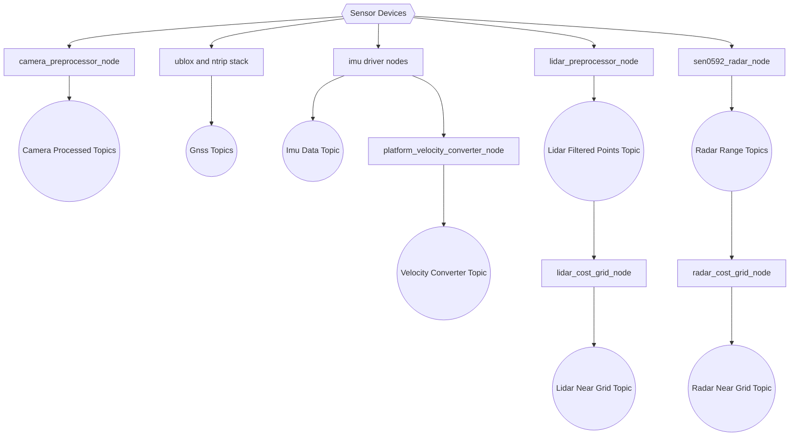
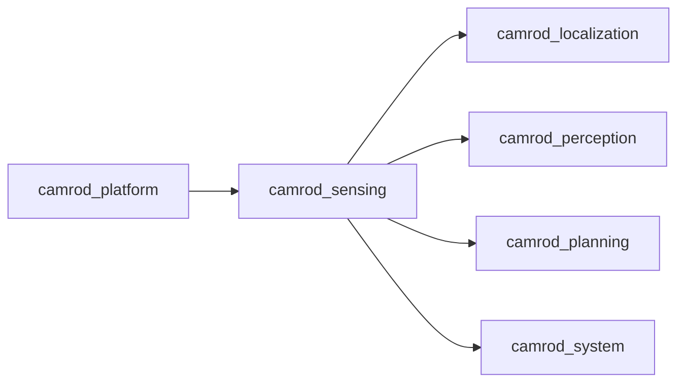

# camrod_sensing

## Role
`camrod_sensing` runs camera/GNSS/IMU/LiDAR/radar acquisition and preprocessing pipelines, and publishes sensor outputs used by localization/perception/planning/system.

## Package Diagram


Diagram legend: `[node/process]`, `((topic stream))`, `[(config or interface)]`, `[[external package or launch]]`, `{{hardware source}}`.

## Node Data Flow
| Node / Group | Main Inputs | Main Outputs |
|---|---|---|
| `camera_preprocessor_node` | camera raw image/camera_info | `/sensing/camera/processed/image`, `/sensing/camera/processed/camera_info` |
| `ublox_gps_node` | GNSS device + optional RTCM | `/sensing/gnss/ublox_gps_node/fix` and GNSS stack outputs |
| `ntrip_client` (optional) | NTRIP caster | `/sensing/gnss/rtcm` |
| IMU driver (`imu_cv7` or `imu_gq7_ntrip`) | IMU device | `/sensing/imu/data` |
| `platform_velocity_converter_node` | `/platform/status/velocity`, IMU topic | `/sensing/platform_velocity_converter/twist_with_covariance` |
| `lidar_preprocessor_node` | `/sensing/lidar/vanjee/points_raw` | `/sensing/lidar/points_filtered` |
| `lidar_cost_grid_node` | LiDAR/perception obstacles (by config) | `/sensing/lidar/near_cost_grid` |
| `sen0592_radar_node` | serial radar sensors | `/sensing/radar/*/range` |
| `radar_cost_grid_node` | radar range topics | `/sensing/radar/near_cost_grid` |

## Inter-Package Connections


## Topic Summary
### Input Topics
| Input Topic | Purpose |
|---|---|
| (none: primary inputs are hardware/device interfaces) | Camera, GNSS, IMU, LiDAR, and radar drivers ingest physical sensor streams |

### Output Topics
| Output Topic | Purpose |
|---|---|
| `/sensing/gnss/ublox_gps_node/fix` | GNSS fix for localization |
| `/sensing/imu/data` | IMU for localization/filtering |
| `/sensing/lidar/points_filtered` | LiDAR for perception/planning |
| `/sensing/camera/processed/*` | Camera stream for perception |
| `/sensing/radar/near_cost_grid` | Radar near obstacle grid |
| `/sensing/lidar/near_cost_grid` | LiDAR near obstacle grid |
| `/sensing/platform_velocity_converter/twist_with_covariance` | Converted platform velocity |

## Practical Usage
```bash
ros2 launch camrod_sensing sensing.launch.py
```

Sub-launch examples:
```bash
ros2 launch camrod_sensing lidar.launch.py
ros2 launch camrod_sensing gnss.launch.py
ros2 launch camrod_sensing imu.launch.py
ros2 launch camrod_sensing camera.launch.py
ros2 launch camrod_sensing radar.launch.py
```

Build note for nested external stacks:
```bash
cd ~/camrod_ws
colcon build --symlink-install \
  --base-paths src src/camrod_sensing/external/ublox src/camrod_sensing/external/vanjee_lidar \
  --packages-up-to camrod_sensing ublox_gps vanjee_lidar_sdk
```

## Config Files
- `config/sensing_params.yaml`
- `config/camera/preprocessor.yaml`
- `config/gnss/zed_f9p_rover.yaml`, `config/gnss/ntrip_client.yaml`
- `config/imu/microstrain_cv7.yaml`, `config/imu/microstrain_gq7.yaml`, `config/imu/platform_velocity_converter.yaml`
- `config/lidar/preprocessor.yaml`, `config/lidar/cost_grid.yaml`, `config/lidar/vanjee/config.yaml`
- `config/radar/sen0592_radar.yaml`, `config/radar/cost_grid.yaml`
