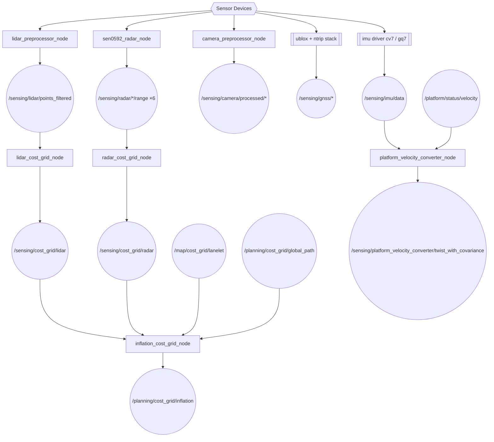
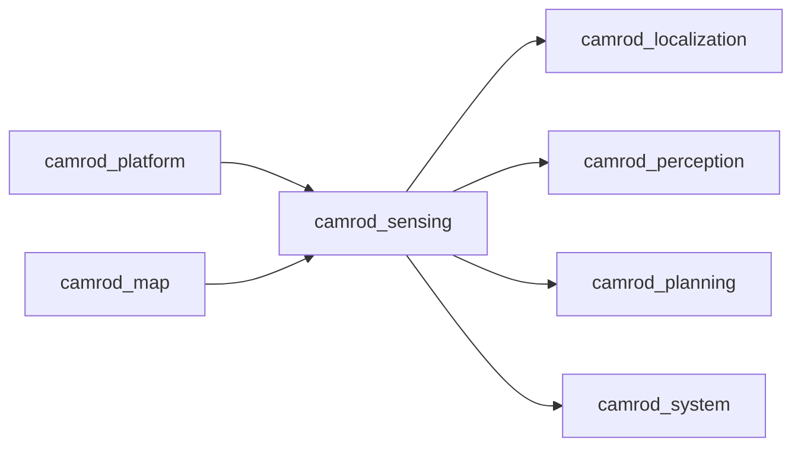

# camrod_sensing

## Role
Sensor acquisition, preprocessing, and obstacle cost-grid generation. Converts raw hardware streams (LiDAR, radar, camera, IMU, GNSS) into filtered topics and robot-centred occupancy grids consumed by localization, perception, and planning.

## Package Diagram


Diagram legend: `[node]`, `((topic))`, `[[external stack]]`, `{{hardware}}`.

## Node Data Flow

| Node | Inputs | Outputs | Key Params |
|---|---|---|---|
| `lidar_preprocessor_node` | `/sensing/lidar/vanjee/points_raw` | `/sensing/lidar/points_filtered` | method: ransac, voxel_leaf: 0.10 m |
| `lidar_cost_grid_node` | `/sensing/lidar/points_filtered` | `/sensing/cost_grid/lidar` | 150×150 @ 0.08 m, cost range 0.4–7.5 m |
| `sen0592_radar_node` | Serial (CH9344 USB, 6 sensors) | `/sensing/radar/{front,left1,left2,right1,right2,rear}/range` | poll_period_s: 0.06, max ranges 0.5–1.5 m |
| `radar_cost_grid_node` | `/sensing/radar/*/range` ×6 | `/sensing/cost_grid/radar` | 120×120 @ 0.10 m, cost range 0.3–2.0 m |
| `inflation_cost_grid_node` | `/map/cost_grid/lanelet`, `/sensing/cost_grid/lidar`, `/sensing/cost_grid/radar`, `/planning/cost_grid/global_path` | `/planning/cost_grid/inflation` | 120×120 @ 0.10 m, cell-wise max merge, 10 Hz |
| `camera_preprocessor_node` | `/sensing/camera/image_raw`, `/sensing/camera/camera_info` | `/sensing/camera/processed/image`, `/sensing/camera/processed/camera_info` | frame_id_override: camera_link |
| `platform_velocity_converter_node` | `/platform/status/velocity`, `/sensing/imu/data` | `/sensing/platform_velocity_converter/twist_with_covariance` | linear_variance: [0.05, 0.05, 0.1] |
| `ublox_gps_node` | GNSS device + RTCM | `/sensing/gnss/ublox_gps_node/fix` | — |
| `ntrip_client` (optional) | NTRIP caster | `/sensing/gnss/rtcm` | — |
| IMU driver (`cv7` / `gq7`) | IMU device | `/sensing/imu/data` | imu_mode: cv7 or gq7 |

### Cost Grid Architecture

All grids are robot-centred and transform-stamped to the `map` frame via TF2.

| Grid | Size | Resolution | Cost Range | Staleness Limit |
|---|---|---|---|---|
| `/sensing/cost_grid/lidar` | 150×150 | 0.08 m | 30–95 | 0.50 s |
| `/sensing/cost_grid/radar` | 120×120 | 0.10 m | 35–95 | 0.35 s |
| `/planning/cost_grid/inflation` (merged) | 120×120 | 0.10 m | 0–100 | per-input (see below) |

`inflation_cost_grid_node` per-input staleness limits:

| Input | Limit |
|---|---|
| `/map/cost_grid/lanelet` | 5.0 s |
| `/sensing/cost_grid/lidar` | 0.50 s |
| `/sensing/cost_grid/radar` | 0.50 s |
| `/planning/cost_grid/global_path` | 10.0 s |

## Inter-Package Connections


## Topic Summary

### Inputs (from other packages)
| Topic | Type | Source |
|---|---|---|
| `/platform/status/velocity` | TwistStamped | camrod_platform |
| `/map/cost_grid/lanelet` | OccupancyGrid | camrod_map |
| `/planning/cost_grid/global_path` | OccupancyGrid | camrod_planning |

### Outputs (consumed by other packages)
| Topic | Type | Consumers |
|---|---|---|
| `/sensing/gnss/ublox_gps_node/fix` | NavSatFix | camrod_localization |
| `/sensing/gnss/pose` | PoseStamped | camrod_localization |
| `/sensing/gnss/pose_with_covariance` | PoseWithCovarianceStamped | camrod_localization |
| `/sensing/imu/data` | Imu | camrod_localization |
| `/sensing/lidar/points_filtered` | PointCloud2 | camrod_perception, camrod_planning (via cost grid) |
| `/sensing/platform_velocity_converter/twist_with_covariance` | TwistWithCovarianceStamped | camrod_localization |
| `/sensing/cost_grid/lidar` | OccupancyGrid | inflation_cost_grid_node, camrod_planning (Nav2 global costmap) |
| `/sensing/cost_grid/radar` | OccupancyGrid | inflation_cost_grid_node, camrod_planning (Nav2 global costmap) |
| `/planning/cost_grid/inflation` | OccupancyGrid | camrod_planning (Nav2 local costmap, cmd_vel_gate) |

## Launch

```bash
# Full sensing stack
ros2 launch camrod_sensing sensing.launch.py

# Sub-stacks
ros2 launch camrod_sensing lidar.launch.py
ros2 launch camrod_sensing radar.launch.py
ros2 launch camrod_sensing gnss.launch.py
ros2 launch camrod_sensing imu.launch.py
ros2 launch camrod_sensing camera.launch.py
```

Key launch arguments:

| Argument | Default | Description |
|---|---|---|
| `enable_lidar_driver` | `true` | LiDAR preprocessor |
| `enable_lidar_cost_grid` | `true` | LiDAR obstacle grid |
| `enable_radar` | `true` | Ultrasonic radar driver |
| `enable_radar_cost_grid` | `true` | Radar obstacle grid |
| `enable_inflation_cost_grid` | `true` | Merged planning grid |
| `enable_gnss` | `true` | GNSS driver |
| `enable_ntrip` | `true` | NTRIP RTK corrections |
| `enable_imu` | `true` | IMU driver |
| `imu_mode` | `cv7` | `cv7` or `gq7` |

## Config Files

| File | Purpose |
|---|---|
| `config/lidar/preprocessor.yaml` | Ground filter (RANSAC), voxel size, frame ID |
| `config/lidar/cost_grid.yaml` | LiDAR grid geometry, cost thresholds, ego clear radius |
| `config/radar/sen0592_radar.yaml` | Serial ports, per-sensor range limits, angle config |
| `config/radar/cost_grid.yaml` | Radar grid geometry, near-field cost range |
| `config/inflation_cost_grid.yaml` | Merged grid geometry, per-input staleness limits |
| `config/sensing_params.yaml` | Radar output topic, sensing-level overrides |
| `config/imu/platform_velocity_converter.yaml` | Velocity/IMU fusion covariance |
| `config/camera/preprocessor.yaml` | Frame override, camera_info requirement |
| `config/gnss/zed_f9p_rover.yaml` | ublox GNSS driver parameters |
| `config/gnss/ntrip_client.yaml` | NTRIP caster connection |
