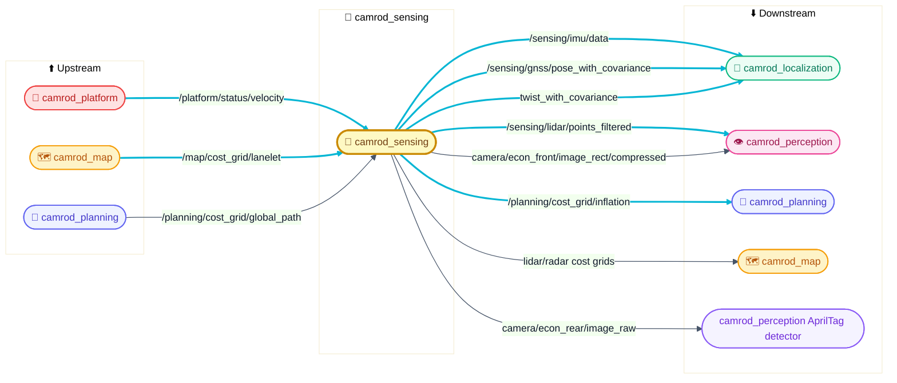
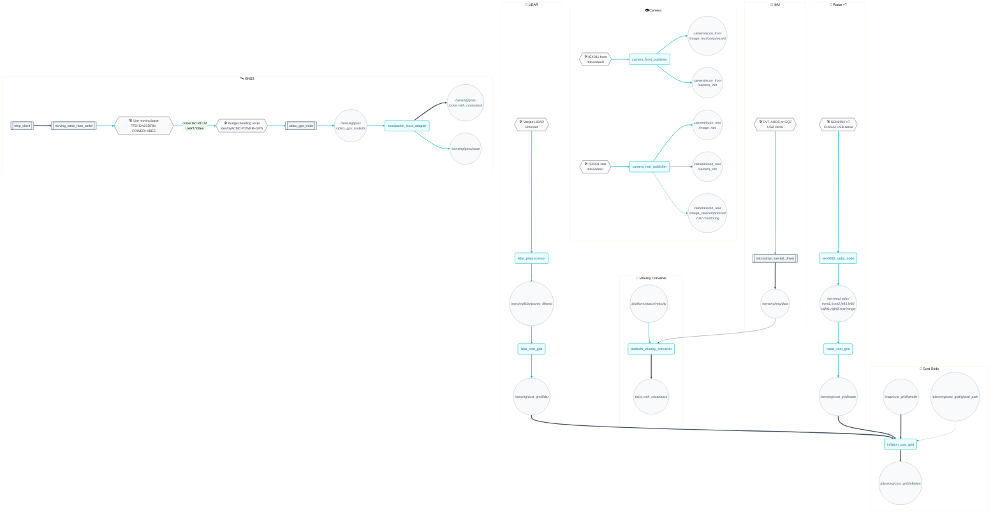
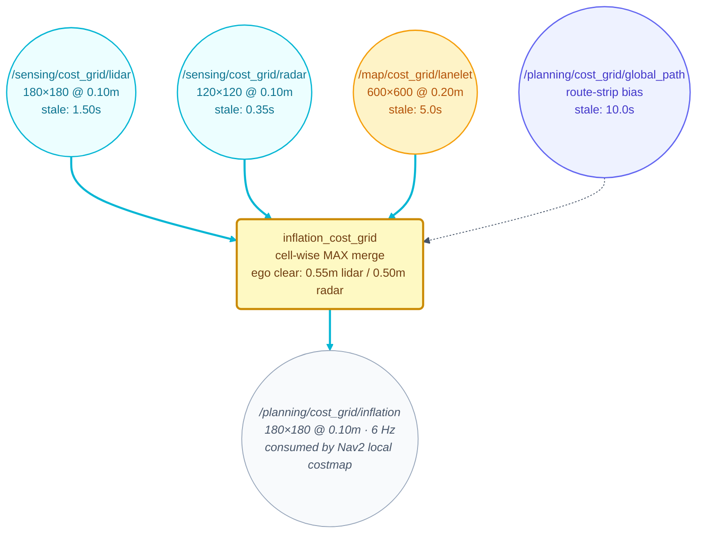

# 🎯 camrod_sensing — Sensors, preprocessing & near-range cost grids

## 1. 📋 Summary

`camrod_sensing` acquires raw data from all physical sensors (LiDAR, radar, camera, IMU, GNSS), preprocesses the streams, and produces the filtered topics and obstacle cost grids consumed by localization, perception, and planning. It also fuses the map lanelet cost grid with real-time sensor grids into a single inflation grid for the Nav2 local costmap.

> 📌 **Hardware covered:** Vanjee LiDAR (Ethernet), DFRobot SEN0592 near-range radar ×7 (CH9344 USB serial: front1, front2, left1, left2, right1, right2, rear), ECON dual cameras — front (`camera_front_publisher_node`, GPU VPI+NvJPEG, `/dev/video0`) + rear (`camera_rear_publisher_node`, raw `image_raw` plus rate-limited CPU JPEG monitoring, `/dev/video1`), MicroStrain CV7-AHRS or GQ7 IMU (USB serial, selected via `imu_model`), u-blox SparkFun ZED-F9P (single antenna, current field device `/dev/ttyACM0`, `ublox_dual_antenna:=false`) or ArduSimple simpleRTK2B Heading (dual antenna, moving-baseline heading, `ublox_dual_antenna:=true`), NTRIP RTK correction stream (gnssdata.or.kr).

<!-- HH_260721 - Document the single-package ground-segmentation source layout. -->
> `external/ground_segmentation_ros2` is the only ground-segmentation package.
> It owns the ROS 2 node and the integrated header-only algorithm; the redundant
> standalone `external/ground_segmentation` package was removed and must not be
> restored. `colcon_build.sh` rejects a stale source tree containing both copies.

---

## 2. 🚀 Quick Start

```bash
# Full sensing stack (all sensors enabled)
ros2 launch camrod_sensing sensing.launch.py

# Disable sensors not present on the platform
ros2 launch camrod_sensing sensing.launch.py \
  enable_gnss:=false \
  enable_ntrip:=false

# Switch IMU hardware (HH_260528 - imu_mode → imu_model)
ros2 launch camrod_sensing sensing.launch.py imu_model:=gq7

# Sub-stacks (for isolated bringup or debug)
ros2 launch camrod_sensing lidar.launch.py
ros2 launch camrod_sensing radar.launch.py
# HH_260727 - The default dual route requires both role-specific GNSS ports.
ls -l /dev/ttyACM0 \
  /dev/serial/by-id/usb-FTDI_FT230X_Basic_UART_DN03DF8V-if00-port0
ros2 launch camrod_sensing gnss.launch.py                            # dual antenna, corrected base
ros2 launch camrod_sensing gnss.launch.py ublox_dual_antenna:=false  # single antenna
ros2 launch camrod_sensing gnss.launch.py enable_ntrip:=false        # dual, no NTRIP
ros2 launch camrod_sensing imu.launch.py
ros2 launch camrod_sensing camera.launch.py
```

<!-- HH_260722 - Distinguish standalone GNSS topics from aggregate sensing topics. -->
`gnss.launch.py` alone uses `/gnss/*`. `sensing.launch.py` and full bringup use
`/sensing/gnss/*`; package-wide topic tables below describe the aggregate path.

> 💡 Verify: `ros2 topic hz /sensing/lidar/points_filtered` should show a stable obstacle-only stream around 6 Hz under field load; `ros2 topic echo /sensing/gnss/ublox_gps_node/fix --once` should return a `NavSatFix` with `status.status >= 0`.

---

## 3. 🗺️ System Position



> **Diagram legend** 🧩 ROS node · 📡 Topic · ==> critical path · -.-> optional

*Figure 1 — camrod_sensing is the hub between all physical hardware and the rest of the CAMROD stack.*

---

## 4. 🏗️ Runtime Architecture



> **Diagram legend** 🧩 ROS node · 📡 Topic · 🛠️ Hardware · 📦 External pkg · ==> critical path · -.-> optional

*Figure 2 — Full runtime architecture with one subgraph per sensor pipeline plus the inflation cost grid fusion.*

---

## 5. 🧮 Cost Grid Strategy



> **Diagram legend** 📡 Topic · 🧩 ROS node · ==> required input · -.-> optional input

<!-- HH_260720 - Name the final command gate by its current control-package node name. -->
*Figure 3 — Four input grids are merged by cell-wise MAX into the single inflation grid consumed by Nav2 local costmap and `camrod_control/cmd_vel_safety_gate`.*

---

## 6. 🔌 Interface Contract

### Inputs (from other packages)

| Topic | Type | Required | Producer | Rate | Meaning |
|---|---|---|---|---|---|
<!-- HH_260720 - Document generated internal contracts and explicit sensor boundaries. -->
| `/platform/status/velocity` | `avg_msgs/AvgTwistStamped` | Yes | camrod_platform | ~20 Hz | Generated forward speed used by `platform_velocity_converter` |
| `/map/cost_grid/lanelet` | `avg_msgs/AvgOccupancyGrid` | Yes (stale ≤ 5 s) | camrod_map | Static (transient_local) | All-lanelet centerline cost layer merged into inflation grid |
| `/map/cost_grid/route_lanelet_mask` | `avg_msgs/AvgOccupancyGrid` | No until route exists | camrod_map | On route update + 1 Hz | Active-route lanelet mask used to clip dynamic sensor costs |
| `/planning/cost_grid/global_path` | `avg_msgs/AvgOccupancyGrid` | No (stale ≤ 10 s) | camrod_planning | On replan | Route-strip bias merged into inflation grid |

### Outputs (consumed by other packages)

| Topic | Type | Consumer | Rate | Meaning |
|---|---|---|---|---|
| `/sensing/lidar/points_filtered` | `sensor_msgs/PointCloud2` | camrod_perception, camrod_planning | ~6 Hz field target | Ground-filtered, voxel-downsampled obstacle points in `lidar_link` frame |
<!-- HH_260720 - Cost grids are generated CAMROD messages, not nav_msgs aliases. -->
<!-- HH_260723 - The compatibility grid defaults to perception-only dynamic obstacles. -->
| `/sensing/cost_grid/lidar` | `avg_msgs/AvgOccupancyGrid` | `inflation_cost_grid`, camrod_planning, camrod_control | 10 Hz | Route-clipped 180×180 @ 0.10 m grid from `/perception/obstacles`; raw filtered LiDAR is optional |
| `/sensing/cost_grid/radar` | `avg_msgs/AvgOccupancyGrid` | `inflation_cost_grid`, camrod_planning, camrod_control | 10 Hz | Route-clipped 120×120 @ 0.10 m near-field obstacle grid from radar |
| `/sensing/radar/obstacle_evidence` | `avg_msgs/AvgString` | Operator diagnostics | 10 Hz | `clear`, or only fresh unfiltered radar hits that remain in the published grid, with sensor, frame, range, map x/y, and cost |
| `/planning/cost_grid/inflation` | `avg_msgs/AvgOccupancyGrid` | camrod_planning and `camrod_control/cmd_vel_safety_gate` | 6 Hz | 180×180 @ 0.10 m merged grid: max(lanelet, lidar, radar, global_path) |
| `/sensing/gnss/ublox_gps_node/fix` | `sensor_msgs/NavSatFix` | camrod_localization (`localization_input_adapter`) | 10 Hz single / 1 Hz dual field rate | Raw position and covariance; verify RTK carrier state on NAV-PVT; dual rate matches moving-base epochs and diagnostics accept >= 0.8 Hz |
| `/sensing/gnss/pose` | `avg_msgs/AvgPoseStamped` | CAMROD localization nodes | follows fix | Generated GNSS pose in `map` frame |
| `/sensing/gnss/pose_with_covariance` | `avg_msgs/AvgPoseWithCovarianceStamped` | CAMROD localization monitor | follows fix | Generated GNSS pose and covariance |
| `/sensing/gnss/pose_with_covariance_ros` | `geometry_msgs/PoseWithCovarianceStamped` | robot_localization only | follows fix | Explicit EKF boundary mirror |
| `/sensing/imu/data_ros` | `sensor_msgs/Imu` | converter and robot_localization | 100 Hz | Raw standard IMU driver boundary |
| `/sensing/imu/data` | `avg_msgs/AvgImu` | CAMROD localization monitor and diagnostics | 100 Hz | Generated internal IMU stream |
| `/sensing/platform_velocity_converter/twist_with_covariance` | `avg_msgs/AvgTwistWithCovarianceStamped` | CAMROD localization | ~20 Hz | Generated platform velocity with covariance |
| `/sensing/camera/econ_front/image_rect/compressed` | `sensor_msgs/CompressedImage` | camrod_perception (YOLOv9) | 10 Hz | GPU-rectified 1920×1080 JPEG in `camera_front` frame (VPI VIC + NvJPEG) |
| `/sensing/camera/econ_front/camera_info` | `sensor_msgs/CameraInfo` | camrod_perception | 10 Hz | Calibrated intrinsics — equidistant 4-coefficient (k1–k4) |
| `/sensing/camera/econ_rear/image_raw` | `sensor_msgs/Image` | camrod_perception AprilTag detector | 10 Hz | Uncompressed rear image at the camera-driver boundary |
| `/sensing/camera/econ_rear/image_raw/compressed` | `sensor_msgs/CompressedImage` | monitoring | 2 Hz | Rate-limited CPU-JPEG rear stream |
| `/sensing/camera/econ_rear/camera_info` | `sensor_msgs/CameraInfo` | camrod_perception AprilTag detector | 10 Hz | Rear camera intrinsics |

---

## 7. ⚙️ Key Behaviors

### LiDAR — ground filter and voxel downsample

| Field | Detail |
|---|---|
| Trigger | Each incoming PointCloud2 from `vanjee/points_raw` |
| Internal logic | `lidar_preprocessor_node` applies range clipping (0.3–35 m), Z-band filter (−1.0 to 2.0 m), then RANSAC ground plane removal. Points within Z −0.25 to 0.25 m of the estimated ground plane are discarded. Remaining points are re-stamped with the current ROS clock and re-framed to `lidar_link`. HH_260701 - field load relief uses `downsample_resolution: 0.10` so the obstacle-only output remains stable around 6 Hz on Orin. |
| Output effect | `/sensing/lidar/points_filtered` contains obstacle-only returns; zero points can be normal when the ROI is clear. |
| Operator-visible symptom | If the topic is empty, verify the Vanjee driver is publishing on `/sensing/lidar/vanjee/points_raw`. If points look like the ground plane is still present, the RANSAC plane fit may have failed — check that the robot is on reasonably flat ground at startup. |
| Related params | `method`, `min_range`, `max_range`, `min_z`, `max_z`, `z_min`, `z_max`, `frame_id_override` |
| Related topics | `/sensing/lidar/vanjee/points_raw` → `/sensing/lidar/points_filtered` |

### LiDAR cost grid

| Field | Detail |
|---|---|
| Trigger | Fresh PointCloud2/MarkerArray input; publishes at 10 Hz |
| Internal logic | HH_260723 - `lidar_cost_grid_node` rasterizes `/perception/obstacles` and configured perception markers by default. `raw_lidar_cost_enabled: false` excludes both preprocessed filtered-cloud inputs; setting it to `true` restores them after restart. Costs scale from 65 to 95, the 0.55 m ego disk remains clear, and cells outside the active route-lanelet mask plus margin are cleared when that mask is valid. |
| Output effect | `/sensing/cost_grid/lidar`: 180×180 @ 0.10 m (18 m square centred on robot). |
| Operator-visible symptom | Silent topic → LiDAR/perception inputs are not publishing. Grid frozen → TF `robot_base_link → map` is stale (localization not running). |
| Related params | `input_topic`, `extra_input_topics`, `raw_lidar_cost_enabled`, `raw_lidar_input_topics`, `cloud_min_z_m`, `cloud_max_z_m`, `perception_marker_topics`, `resolution`, `width`, `height`, `cost_range_min_m`, `cost_range_max_m`, `ego_clear_radius_m`, `route_lanelet_filter_enable`, `route_lanelet_margin_m`, `route_lanelet_mask_max_age_s`, `route_lanelet_filter_fail_open_when_robot_outside`, `max_message_age_s`, `publish_rate_hz`, `rebuild_min_pose_delta_m` |
| Related topics | obstacle inputs + `/map/cost_grid/route_lanelet_mask` → `/sensing/cost_grid/lidar` |

### Radar (SEN0592 ×7)

<!-- HH_260623 - Updated radar documentation to match the latest todo/camrod_sensing 7-channel layout. -->
<!-- HH_260729 - Separate physical-register settings, software acceptance,
message metadata, and channel wiring with the same names used in YAML. -->

| Field | Detail |
|---|---|
| Trigger | Enabled channel: `poll_period_s` timer (60 ms cycle). Disabled channel: `disabled_channel_dummy_publish_rate_hz` (2 Hz). |
| Internal logic | `sen0592_radar_node` polls seven DFRobot SEN0592 ultrasonic sensors over seven CH9344 USB serial ports at 115200 baud. HH_260702 - current field port order is FRONT1=USB0, FRONT2=USB1, LEFT1=USB4, LEFT2=USB5, RIGHT1=USB2, RIGHT2=USB3, REAR=USB6 because the LEFT/RIGHT harness branches are crossed. `hardware_angle_levels` is the requested/read-back `0x0208` level (1–4, narrowest to widest), while `hardware_range_levels` is the requested/read-back `0x021F` level (1–5). HH_260729 - startup reads before writing, changes only mismatched registers, and accepts FC03 readback—not a sometimes-missing FC06 echo—as authority. The active near-field profile requests angle level 1 on all channels, range level 2 (~1.5 m) on front/sides, and level 1 (~0.5 m) at the rear. Exact acceptance remains software logic: FRONT1/FRONT2 1.50 m, LEFT/RIGHT 0.80 m, REAR 0.50 m. Use `sensor_enabled[i]: false` plus a restart to disable one channel. The driver then opens no serial port for that channel and publishes only `max_range + 0.001 m` no-target heartbeats plus its per-channel `dummy_active=true` marker. `range_message_field_of_view_rad` is visualization metadata only and does not change the physical beam. Each enabled sensor publishes generated `AvgRange` for internal consumers and a `sensor_msgs/Range` `_ros` mirror for RViz per fresh valid/no-target reply. |
| Output effect | Seven AvgRange topics and `_ros` mirrors: `/sensing/radar/{front1,front2,left1,left2,right1,right2,rear}/range[_ros]`. A disabled channel additionally owns only its `/sensing/radar/<channel>/dummy_active` marker. |
| Operator-visible symptom | If any enabled topic is silent, inspect the startup per-sensor hardware readback and verify the corresponding CH9344 port with `ls /dev/ttyCH9344USB*`. A deliberately disabled channel stays fresh with a no-target value and is identified as dummy by its channel marker; an enabled/physical channel never publishes that marker. |
| Parameter updates | Hardware topology, timing, range/angle configuration, names, frames, ports, and topics are startup-only/read-only ROS parameters and require a restart. Only `log_status` and `publish_radar_status` are dynamically changeable while the node is running. |
| Related params | `hardware_write_on_startup`, `hardware_angle_levels`, `hardware_range_levels`, `sensor_enabled`, `disabled_channel_dummy_publish_rate_hz`, `software_min_range_m`, `software_default_max_range_m`, `software_max_ranges_m`, `range_message_field_of_view_rad`, `sensor_names`, `frame_ids`, `ports`, `topics`, `standard_ros_topics`, `log_status`, `publish_radar_status` |
| Related topics | `/sensing/radar/{front1,front2,left1,left2,right1,right2,rear}/range`, matching `_ros` and `dummy_active` topics |

Register meanings follow the
[DFRobot SEN0592 Modbus register reference](https://wiki.dfrobot.com/sen0592/docs/19640):
`0x0208` is an angle **level** (1–4, default 4), and `0x021F` is a range
**level** (1≈0.5 m, 2≈1.5 m, 3≈2.5 m, 4≈3.5 m, 5≈5.0 m).

HH_260729 full-bringup readback originally found FRONT1/FRONT2/REAR angle level
4, all four LEFT/RIGHT angle levels 2, and range level 5 on all channels. The
requested near-field profile now writes and verifies angle level 1 everywhere,
range level 2 on front/sides, and range level 1 at the rear. `0x0208` is one
combined angle/sensitivity level; it cannot preserve a wide horizontal beam
while narrowing only vertical coverage. That beam shape requires rotating the
asymmetric physical sensor around its forward axis.

HH_260729 post-write stationary sampling confirmed all seven register
readbacks. In the current area—which was explicitly not completely clear—the
existing self-return filter still passed persistent candidates at LEFT2
0.365–0.382 m, RIGHT1 0.391–0.406 m, and RIGHT2 0.362–0.369 m. They remain
obstacles because filtering them would also hide a real object only 0.36–0.41 m
from the corresponding sensor. Repeat the sample in a supervised, completely
clear area before classifying any of these three intervals as floor/chassis
echo.

#### Disabled-hardware dummy behavior

<!-- HH_260729 - Keep intentionally disabled hardware distinguishable from both
a crashed driver and verified physical data. -->

`publish_sensor_dummies_when_disabled:=true` is the single policy for physical
input switches. It does not add another `enable_*` flag per sensor. In a real,
non-simulation launch, each disabled input keeps its public message schema alive
with a deliberately lightweight placeholder:

| Disabled input | Placeholder contract | Safety meaning |
|---|---|---|
| `enable_gnss:=false` | `NavSatFix STATUS_NO_FIX` with NaN LLH plus unusable heading covariance | The localization adapter rejects it before LLH conversion |
| `enable_imu:=false` | Stationary `sensor_msgs/Imu` with high covariance | The converter stays alive, but diagnostics identify dummy IMU |
| `enable_lidar_driver:=false` | Valid empty raw and filtered XYZ clouds | Clears stale markers without inventing an obstacle or a measured free space |
| Camera master/front/rear `false` | 1×1 black image/JPEG and `CameraInfo` | Preserves transport only; never reported as a working camera |
| `enable_radar:=false` | Seven no-target ranges at each maximum + 0.001 m | The radar cost grid rejects the numeric no-target value and independently suppresses every channel while its fresh dummy marker is active |

Every group publishes a fresh `dummy_active=true` marker. Sensor and downstream
diagnostics report **DUMMY DATA / WARN (physical hardware disabled)** and include
the sensor name, topic, and configured mounting location; they never label the
placeholder as hardware-OK. If the marker becomes false or stale, the ordinary
missing/stale ERROR behavior returns immediately.

Radar uses a dedicated 10 Hz publisher so all seven `AvgRange` topics and their
`sensor_msgs/Range` `_ros` RViz mirrors retain the real driver's no-target
contract. It publishes the existing group marker and seven channel markers.
An individual `sensor_enabled[i]: false` likewise opens no serial port and
publishes only that channel's no-target heartbeat and channel marker at the
configured low rate; enabled physical channels never own a channel marker. In
`sim:=true`, bringup always forces all of these auxiliary dummies off because
`fake_sensor_publisher.py` already owns the synthetic topics.

This policy applies only to hardware acquisition. Disabling NTRIP, a cost grid,
perception, planning, control, UI, or another processing/safety feature does not
create a fake-success output; doing so could hide a disabled safety layer.

### Radar cost grid

<!-- HH_260729 - Use stage-based names, named sensors, and exact
minimum/maximum body-return intervals. -->

| Field | Detail |
|---|---|
| Trigger | Each incoming Range message (async per sensor) |
| Internal logic | `radar_cost_grid_node` projects each generated `AvgRange` into `map`. Hits at or below `cost_near_distance_m` receive `max_cost`; cost then decreases to `min_cost` at `cost_far_distance_m`. Invalid/no-target values and the named `fixed_return_bands` are removed first. HH_260729 - fresh `/sensing/radar/dummy_active` or derived per-channel dummy markers independently suppress cost painting for the marked channels; a stale marker stops suppressing after `dummy_active_timeout_s`, so a later physical restart remains fail-visible. Only values inside the exact fixed bands are excluded; all other valid returns remain obstacle costs, so a LEFT2 obstacle at 0.50 m is safety-relevant. Automatic startup learning is disabled in the field-driving profile so an object present during startup cannot become a boot-local blind interval. When explicitly enabled for supervised clear-area calibration, each sensor receives a complete disengaged 8 s window beginning at its first valid sample, subject to the absolute 15 s first-sample deadline and transient-local `/control/planning_engaged=false` authorization. Candidates remain limited by `startup_return_max_ranges_m` to 0.20–0.30 m per sensor, and insufficient, weak, or broad clusters are rejected. HH_260720 - completed radar disks are clipped to the same active-route mask and 0.35 m margin as LiDAR, with the same startup/stale/off-route fail-open behavior. Route clipping is skipped for an empty/dummy grid to avoid a misleading active-route-mask warning. Messages older than 0.35 s are discarded. |
| Output effect | `/sensing/cost_grid/radar`: 120×120 @ 0.10 m (12 m square centred on robot), published at 10 Hz. `/sensing/radar/obstacle_evidence` publishes `clear` or entries such as `SENSOR=RIGHT1 frame_id=radar_right1_link range_m=0.068 output_frame=map x=... y=... cost=95`. Only fresh, valid, unfiltered hits whose painted cells survive route clipping are included. |
| No-target behavior | HH_260729 - SEN0592 no-target/invalid responses publish a heartbeat slightly above `max_range`; diagnostics treat this as fresh no-target data and cost-grid consumers ignore it as an obstacle. Dummy state is also checked directly, so disabled hardware has two independent no-cost barriers. |
| Operator-visible symptom | Empty grid → serial port permission denied or CH9344 driver not loaded. Near-field obstacles missing → ego_clear_radius_m is too large; current value 0.50 m is already minimal. Active accepted hits also emit a throttled WARN containing the exact radar channel and projected location. |
| Parameter updates | All cost-grid parameters are startup-only. Runtime `ros2 param set` is rejected; edit the selected YAML and restart. |
| Related params | `dummy_active_topic`, `dummy_active_timeout_s`, `cost_near_distance_m`, `cost_far_distance_m`, `fixed_return_filter_enable`, `fixed_return_bands`, `startup_return_*`, `ego_clear_radius_m`, `route_lanelet_filter_enable`, `route_lanelet_margin_m`, `route_lanelet_mask_max_age_s`, `route_lanelet_filter_fail_open_when_robot_outside`, `obstacle_evidence_topic`, `obstacle_evidence_warn_interval_s`, `max_message_age_s`, `publish_rate_hz` |
| Related topics | `/sensing/radar/*/range` + `/control/planning_engaged` + `/map/cost_grid/route_lanelet_mask` → `/sensing/cost_grid/radar` + `/sensing/radar/obstacle_evidence` |

The `fixed_return_bands` below are inclusive range intervals in metres.
They are persistent returns classified during the current clear-area field
experiment, not a general minimum-distance floor. A scalar SEN0592 cannot prove
whether an equal-distance return came from the body or a real object. In
particular, the side bands extend slightly beyond the planning footprint along
the nominal sensor centerline, so they are an explicit temporary blind-zone
tradeoff pending mounting/beam shielding:

| Radar | Ignored fixed intervals (m) |
|---|---|
| FRONT1 | 0.099–0.123; 0.152–0.220 |
| FRONT2 | 0.097–0.117 |
| LEFT1 | 0.182–0.226; 0.234–0.258 |
| LEFT2 | 0.210–0.280 |
| RIGHT1 | 0.055–0.080; 0.253–0.277 |
| RIGHT2 | 0.248–0.278 |
| REAR | 0.090–0.190 |

### Camera — dual econ (front + rear)

**Front camera (`camera_front_publisher_node`, GPU pipeline)**

| Field | Detail |
|---|---|
| Trigger | Continuous capture; started when `enable_front_camera: true` in `camera_launch_config.yaml` (`camrod_sensing_camera` section) |
| Internal logic | Opens `/dev/video0` via GStreamer (`v4l2src` → UYVY @ 30 fps → `videorate` → `nvvidconv` → NV12). Falls back to `cv::CAP_V4L2` direct if GStreamer fails (ISX031 Tegra CSI cameras can fail `v4l2src`; see §14). In fallback mode, BGR→NV12 conversion runs on CPU. Fisheye undistortion via VPI VIC (equidistant 4-coeff). Output JPEG-encoded by NvJPEG hardware. Exposure set to `exposure_time_us` in V4L2 manual mode at startup. |
| Output effect | `/sensing/camera/econ_front/image_rect/compressed`, `/sensing/camera/econ_front/camera_info` at 10 Hz. |
| Operator-visible symptom | Node crash at startup → `/dev/video0` not present or permissions issue. Distorted image → stale `camera_matrix`/`distortion_coefficients` in `camera_params.yaml`. Log shows `"V4L2 direct"` → GStreamer unavailable (normal on this platform; see §14). |
| Related params | `device_path`, `image_width`, `image_height`, `fps`, `exposure_time_us`, `jpeg_quality`, `camera_matrix`, `distortion_coefficients`, `intrinsics_source` |
| Related topics | `/sensing/camera/econ_front/image_rect/compressed`, `/sensing/camera/econ_front/camera_info` |

HH_260730 / TODOLIST 2: every front frame is checked at the capture, VPI, CUDA,
and NvJPEG boundaries. Invalid dimensions/stride, CUDA/NvJPEG failures,
zero/oversized payloads, and malformed SOI/SOF/SOS/EOI structure drop only the
affected frame with a throttled reason. The front component constructs optional
raw `sensor_msgs/Image` messages directly, so its process loads only OpenCV 4.8
and does not mix the workspace OpenCV 4.5 `cv_bridge` ABI.

**Rear camera (`camera_rear_publisher_node`, OpenCV + VIC-assisted pipeline)**

| Field | Detail |
|---|---|
| Trigger | Continuous GStreamer capture; started when `enable_rear_camera: true` in `camrod_sensing_camera` |
| Internal logic | Opens `/dev/video1` via OpenCV GStreamer. Captures the sensor at 30 Hz and uses `videorate` before VIC conversion to publish 10 Hz raw frames. `image_raw` is subscriber-gated; `image_raw/compressed` is CPU JPEG and rate-limited for monitoring. |
| Output effect | `/sensing/camera/econ_rear/image_raw` and `/sensing/camera/econ_rear/camera_info` at 10 Hz; `/sensing/camera/econ_rear/image_raw/compressed` at 2 Hz. |
| Operator-visible symptom | AprilTag detection silent → check `/sensing/camera/econ_rear/image_raw` is live and `/dev/video1` exists. |
| Related params | `device`, `width`, `height`, `fps`, `jpeg_quality`, `frame_id`, `camera_info_url` |
| Related topics | `/sensing/camera/econ_rear/image_raw`, `/sensing/camera/econ_rear/image_raw/compressed`, `/sensing/camera/econ_rear/camera_info` |

### IMU (CV7-AHRS or GQ7, selectable)

| Field | Detail |
|---|---|
| Trigger | Node startup; `imu_model` launch argument selects `cv7` (default) or `gq7` |
| Internal logic | **cv7:** `microstrain_inertial_driver` node launched directly with `respawn=true` (recovers serial lock). Filter output 100 Hz, ENU frame, GNSS aiding disabled. **gq7:** upstream `microstrain_launch.py` + optional `ntrip_client` for RTK-heading. Model auto-resolves param file: `config/imu/microstrain_cv7.yaml` or `microstrain_gq7.yaml`. |
| Output effect | HH_260720 - Raw `/sensing/imu/data_ros` is converted to generated `/sensing/imu/data` at 100 Hz. |
| Operator-visible symptom | Wrong model selected → driver connects on wrong port, zeroed or noisy orientation. Check: `ls /dev/serial/by-id/usb-Lord_Microstrain*`. |
| Related params | `imu_model`, `imu_param_file`, `imu_data_rate`, `use_enu_frame`, `timestamp_source`, `frame_id` |
| Related topics | `/sensing/imu/data` |

### GNSS (HH_260611 - ublox_gps single/dual antenna)

Select the antenna mode via `ublox_dual_antenna` (`false` = SparkFun single
antenna, `true` = simpleRTK2B Heading dual antenna). Both modes use
`ublox_gps_node` and Python `ntrip_client` with GGA feedback. Single mode sends
NTRIP to the rover topic; the production dual mode sends NTRIP only to
`moving_base_rtcm_writer`, which corrects the Lite moving base first.

#### Single antenna — SparkFun ZED-F9P (`ublox_dual_antenna:=false`)

| Field | Detail |
|---|---|
| Trigger | Node startup; `enable_ntrip` controls whether the NTRIP client is also started |
| Internal logic | `ublox_gps_node` opens `/dev/ttyACM0` on the current field robot and requests 10 Hz measurement output (`rate: 10.0`, `nav_rate: 1`). TMODE3 is set to 0 (rover mode). UBX-NAV-PVT and NMEA are published. `ntrip_client` subscribes to `gnssdata.or.kr:2101`, active mountpoint `JECH-RTCM32`, and forwards RTCM3.2 corrections to the rover. Fix converges from no-fix -> float -> RTK-fixed under open sky. HH_260708 - diagnostics accept a stable 1 Hz field-rate floor and the GNSS device intentionally stays on an operator-verified `/dev/ttyACM*` path rather than by-id. |
| Output effect | `/sensing/gnss/ublox_gps_node/fix`; downstream adapter produces `/sensing/gnss/pose` and `/sensing/gnss/pose_with_covariance`. |
| Operator-visible symptom | GNSS stays in float -> NTRIP not delivering RTCM. No fix -> check `/dev/ttyACM0`, cable state, and `config_on_startup: false`. |
| Related params | `config/gnss/zed_f9p_rover.yaml`: `device` (`/dev/ttyACM0`), `rate`, `nav_rate`, `tmode3` |
| Related topics | `/sensing/gnss/ublox_gps_node/fix`, `/sensing/gnss/rtcm` |

#### Dual antenna — ArduSimple simpleRTK2B Heading (`ublox_dual_antenna:=true`)

<!-- HH_260723 - Document the current field wiring and independent absolute/relative RTK paths. -->
| Field | Detail |
|---|---|
| Trigger | `ublox_gps_node` startup with `dual_antenna:=true`. `enable_ntrip` controls Python NTRIP client. |
| Internal logic | NTRIP publishes `/sensing/gnss/ntrip_client/rtcm`; `moving_base_rtcm_writer` writes it to the Lite moving base through the FTDI DN03DF8V by-id path (currently `/dev/ttyUSB0`). The corrected base sends RTCM `4072.0`, MSM4 (`1074/1084/1094/1124`), and `1230` through XBee to the Budget heading rover UART2. `/dev/ttyACM0` remains the rover's ROS output and does not receive CORS directly. This is the default path with `ublox_dual_forward_ntrip_to_rover:=false`. |
| Output effect | Rover USB publishes absolute `UBX-NAV-PVT` and moving-baseline `UBX-NAV-RELPOSNED` together, exposed as `/sensing/gnss/ublox_gps_node/navpvt`, `/sensing/gnss/navrelposned`, `/sensing/gnss/navheading`, and `/sensing/gnss/ublox_gps_node/fix`. |
| Operator-visible symptom | Heading fixed but absolute pose float means the base-to-rover link works while moving-base CORS input or its ambiguity solution does not. Absolute fixed but heading invalid means to check Lite UART1 -> XBee -> rover UART2 and RELPOSNED flags. |
| Related params | `config/gnss/zed_f9p_rover.yaml`: `/**/ublox_gps_node.device`, `/**/moving_base_rtcm_writer.device`, `/**/moving_base_rtcm_writer.baud`; launch routing: `dual_antenna.usb_rtcm_in`, `dual_antenna.block_rtcm_ids`, `ublox_dual_forward_ntrip_to_rover`. |
| Related topics | `/sensing/gnss/ntrip_client/rtcm`, `/sensing/gnss/rxmrtcm`, `/sensing/gnss/ublox_gps_node/navpvt`, `/sensing/gnss/navrelposned`, `/sensing/gnss/navheading` |

<!-- HH_260722 - Record the verified dual-antenna production topology and A/B evidence. -->
#### Dual antenna production topology

##### What changed on 2026-07-22 and why

The previous dual mode sent two independent reference streams into the heading
rover: moving-base RTCM on UART2 and CORS RTCM on rover USB. Both live streams
were measured with RTCM station ID `0`. The CORS side used `1006` plus MSM5
(`1075/1085/1095/1115/1125`); the moving-base side used `4072.0` plus MSM4
(`1074/1084/1094/1124`) and `1230`. Blocking only message `4072` on the ROS
path did not separate the remaining reference observations.

The corrected implementation changes ownership rather than filtering arbitrary
message types:

| Item | Previous implementation | Corrected implementation |
|---|---|---|
| CORS destination | Heading rover `/dev/ttyACM0` | Lite moving base FTDI DN03DF8V |
| Rover USB RTCM input | Enabled by default | Disabled by default |
| Moving-base host port | Not opened by the launch | Opened by `moving_base_rtcm_writer` |
| Rover correction source | CORS USB and moving-base UART2 mixed | Corrected moving-base UART2 only |
| Dual update rate | Rover requested 5 Hz while field base emitted 1 Hz | Rover and stored base output both 1 Hz |
| Aggregate sensing launch | Did not pass a moving-base port | Passes one GNSS config whose node-specific blocks configure both rover and writer |

Hardware A/B acceptance results:

- Direct CORS to rover USB, moving-base writer off: about 226 seconds without
  recovery; NAV-PVT fixed `0/8` in the sampled window (`hAcc` median `462 mm`),
  RELPOSNED valid/fixed `0/8`, flags `3`, baseline and heading zero.
- CORS to moving base only: NAV-PVT fixed `18/18` (`hAcc` median `27.5 mm`),
  RELPOSNED fixed/valid `18/18`, heading accuracy about `0.417 deg`.
- Independent moving-base UBX poll while corrected: decoded carrier solution
  fixed, `hAcc=36 mm`, `vAcc=54 mm`. A later rerun reached rover `hAcc=15 mm`,
  `vAcc=22 mm`.
- After the one-port negative tests, a one-shot rover warm start followed by a
  normal launch recovered NAV-PVT `flags=131` in every sampled epoch
  (`hAcc=37..43 mm`) and RELPOSNED `flags=311` in every sampled epoch. The
  measured baseline was about `1.178 m` and heading accuracy about `0.489 deg`.

Do not hard-code one historical baseline length as the acceptance criterion.
Compare `rel_pos_length` with the antennas' current measured physical spacing
and require it to remain stable while flags indicate moving/fixed/heading-valid.

| Path | Owner | Physical link | ROS/software action | Purpose |
|---|---|---|---|---|
| Heading/relative baseline | Moving base -> heading rover | Existing UART/XBee -> rover UART2 | Keep rover launch at `1 Hz` and run `ublox_dual_forward_ntrip_to_rover:=false` | Preserve `NAV-RELPOSNED` fixed heading |
| Absolute CORS RTK | NTRIP client -> moving base | Second USB/UART connection to the moving-base receiver | Set `/**/moving_base_rtcm_writer.device` in `zed_f9p_rover.yaml` so the writer sends `/sensing/gnss/ntrip_client/rtcm` to the base-side serial input, not rover USB | Let the base solve absolute RTK before it sends moving-baseline RTCM to the rover |
| Rover USB | Heading rover -> ROS | Existing `/dev/ttyACM0` | Read `NAV-PVT`, `NAV-RELPOSNED`, and heading topics only; do not inject CORS here while validating heading | Keep the measured heading behavior stable |

With both GNSS ports connected, the verified topology is now the no-argument
default:

```bash
ros2 launch camrod_sensing gnss.launch.py
```

The following explicit form is equivalent and useful when auditing deployment
overrides:

```bash
ros2 launch camrod_sensing gnss.launch.py \
  ublox_dual_antenna:=true \
  ublox_dual_forward_ntrip_to_rover:=false \
  ublox_dual_base_rtcm_device:=/dev/serial/by-id/usb-FTDI_FT230X_Basic_UART_DN03DF8V-if00-port0 \
  ublox_dual_base_rtcm_baud:=115200
```

Expected improvement is not automatic from the extra USB cable alone: the launch must open that new moving-base port and write `/sensing/gnss/ntrip_client/rtcm` to it. If the base does not accept RTCM on that port, the rover pose will remain meter-level even though heading can stay fixed.

##### Can the PC use only one GNSS port?

With the current board wiring, not for both correction injection and final ROS
output using software alone:

- The FTDI DN03DF8V by-id path (currently `/dev/ttyUSB0`) is POWER+XBEE and
  terminates at the Lite moving base UART1. It can accept CORS but does not
  carry the heading rover's NAV-RELPOSNED output.
- `/dev/ttyACM0` is POWER+GPS and terminates at the Budget heading rover USB. It
  carries both final NAV-PVT and NAV-RELPOSNED, but there is no transparent
  bridge from that receiver back into the Lite moving base.

One physical PC cable is possible with a USB hub, although Linux still exposes
two logical serial devices. One logical GNSS port is possible when an independent
Wi-Fi/LTE/radio NTRIP device feeds the Lite moving base; the PC then connects only
to `/dev/ttyACM0` and reads NAV-PVT plus NAV-RELPOSNED.

This distinction follows the receiver and board topology, not a ROS limitation:
u-blox specifies that the moving base can apply external RTCM while generating
the moving-base stream, and ArduSimple maps POWER+GPS to the heading rover while
POWER+XBEE maps to the Lite UART1. See the
[u-blox moving-base application note](https://content.u-blox.com/sites/default/files/documents/ZED-F9P-MovingBase_AppNote_UBX-19009093.pdf),
[ZED-F9P integration manual](https://content.u-blox.com/sites/default/files/ZED-F9P_IntegrationManual_UBX-18010802.pdf),
and [ArduSimple heading guide](https://www.ardusimple.com/simplertk2heading-hookup-guide/).

A software-only station-ID separation was tested and rejected rather than left
in production:

- CORS rewritten from station `0` to `42`, moving base left at `0`: NAV-PVT was
  fixed (`hAcc=14 mm`), but RELPOS flags were `279` (not moving) and its vector
  was about 11 km, the distance to the CORS reference rather than antenna spacing.
- CORS left at `0`, moving-base `CFG-RTCM-DF003_OUT` changed in RAM to station
  `1`: the same failure repeated (`hAcc=17 mm`, RELPOS flags `279`, ~11 km).
- Both streams had valid CRC and were reported as used by RXM-RTCM. On this
  receiver/firmware, changing station IDs did not create two independent RTK
  solutions; NAV-RELPOSNED still selected the distant CORS reference.

The temporary station-ID rewrite executable was removed after this negative
test. The moving-base RAM station ID was restored to `0` and verified by VALGET.

### NTRIP/RTK operating conditions

| Field | Detail |
|---|---|
| Trigger | `ntrip_client` node startup (if `enable_ntrip:=true`) |
| Internal logic | The NTRIP client connects to `gnssdata.or.kr:2101` using the active `JECH-RTCM32` mountpoint and authenticated credentials. It sends a GGA sentence to the caster and receives continuous RTCM 3.2. In dual mode, `moving_base_rtcm_writer` writes that stream to the Lite moving base through POWER+XBEE. The corrected base then generates `4072.0`, MSM4, and `1230` for the heading rover; CORS is not mixed into rover USB. If the connection drops, the client retries up to 10 times with an 8 s wait (`reconnect_attempt_max: 10`, `reconnect_attempt_wait_seconds: 8`). |
| Output effect | Absolute RTK is fixed only when the decoded NAV-PVT carrier solution is fixed; `fix_type=3` alone means a 3D fix, not RTK Fixed. In the ROS `NavPVT` message this is `(flags & 0xC0) == 0x80`. Heading is fixed independently when NAV-RELPOSNED reports moving baseline, valid relative position, valid heading, and fixed carrier solution. |
| Operator-visible symptom | NAV-PVT remains carrier-float (`(flags & 0xC0) == 0x40`) for > 5 min under clear sky → base corrections are received but ambiguity resolution is failing. Common causes: multipath environment, antenna quality, or RTCM stream gaps. |
| Required conditions | Active internet connection, CORS network reachable, open-sky GNSS antenna with good ground plane, F9P firmware ≥ HPG 1.13. |
| Related params | `host`, `port`, `mountpoint`, `username`, `password`, `rtcm_timeout_seconds`, `reconnect_attempt_max`, `reconnect_attempt_wait_seconds` |
| Related topics | Single: `/sensing/gnss/rtcm`; dual production: `/sensing/gnss/ntrip_client/rtcm`; output: `/sensing/gnss/ublox_gps_node/fix` |

### Velocity converter

<!-- HH_260720 - Correct the converter contract: the default EKF consumes the explicit ROS boundary topics, not this auxiliary twist output. -->
| Field | Detail |
|---|---|
| Trigger | Each `/sensing/imu/data_ros` message for the generated IMU stream; each `/platform/status/velocity` message for the auxiliary motion stream |
| Internal logic | `platform_velocity_converter_node` converts the hardware-driver `sensor_msgs/Imu` stream to `avg_msgs/AvgImu`. It also combines platform forward speed with IMU angular rate and emits `avg_msgs/AvgTwistWithCovarianceStamped`. |
| Output effect | `/sensing/imu/data` is the generated internal IMU contract used by localization monitoring. `/sensing/platform_velocity_converter/twist_with_covariance` is an auxiliary diagnostics stream; the default EKF directly consumes `/sensing/imu/data_ros` and `/localization/input/wheel_odometry_ros`. |
| Operator-visible symptom | Topic silent → either platform velocity or IMU is not publishing. The node requires IMU (`require_imu: true`). |
| Related params | `linear_variance`, `angular_variance`, `require_imu` |
| Related topics | `/sensing/imu/data_ros` → `/sensing/imu/data`; `/platform/status/velocity` + `/sensing/imu/data_ros` → `/sensing/platform_velocity_converter/twist_with_covariance` |

### Inflation cost grid (sensor fusion)

| Field | Detail |
|---|---|
| Trigger | Any updated input grid; publishes at 6 Hz |
| Internal logic | `inflation_cost_grid_node` maintains up to four input grids and computes a cell-wise **maximum** merge: lanelet cost (stale limit 5.0 s), lidar cost (1.50 s), radar cost (0.50 s), global_path cost (10.0 s). The output is a 180×180 @ 0.10 m grid (18 m square centred on robot) clipped to a robot-frame window of 8.0 m front, 1.5 m rear, and 2.2 m side. HH_260703 - Static lanelet/global-path costs are masked inside the 0.50 m ego footprint, but live LiDAR/Radar costs are preserved there for safety gating. Messages older than their per-input limit are treated as absent. |
| Output effect | `/planning/cost_grid/inflation` at 6 Hz; consumed by Nav2 local costmap and `camrod_control/cmd_vel_safety_gate`. |
| Operator-visible symptom | If inflation grid stops updating at 6 Hz, check each input: LiDAR grid must arrive within 1.50 s, radar within 0.50 s; lanelet grid arrives once (transient_local) and is valid for 5.0 s after last receipt. |
| Related params | `resolution`, `width`, `height`, `ego_clear_radius_m`, `publish_rate_hz`, `input_topics`, `input_max_ages_s` |
| Related topics | `/map/cost_grid/lanelet`, `/sensing/cost_grid/lidar`, `/sensing/cost_grid/radar`, `/planning/cost_grid/global_path` → `/planning/cost_grid/inflation` |

---

## 8. 📊 Cost Grid Reference

All cost grids are robot-centred and published in the `map` frame via TF2.

| Grid | Size | Resolution | Cost range | Max staleness | Ego clear radius |
|---|---|---|---|---|---|
| `/sensing/cost_grid/lidar` | 180×180 | 0.10 m | 65–95 | 1.50 s | 0.55 m |
| `/sensing/cost_grid/radar` | 120×120 | 0.10 m | 35–95 | 0.35 s | 0.50 m |
| `/planning/cost_grid/inflation` | 180×180 | 0.10 m | 0–100 | per-input (below) | 0.50 m |

`inflation_cost_grid_node` per-input staleness limits:

| Input | Staleness limit |
|---|---|
| `/map/cost_grid/lanelet` | 5.0 s |
| `/sensing/cost_grid/lidar` | 1.50 s |
| `/sensing/cost_grid/radar` | 0.50 s |
| `/planning/cost_grid/global_path` | 10.0 s |

---

## 9. 🚀 Launch

```bash
# Full sensing stack
ros2 launch camrod_sensing sensing.launch.py

# Sub-stacks
ros2 launch camrod_sensing lidar.launch.py
ros2 launch camrod_sensing radar.launch.py
ros2 launch camrod_sensing gnss.launch.py
ros2 launch camrod_sensing imu.launch.py
ros2 launch camrod_sensing camera.launch.py
```

### Launch arguments for `sensing.launch.py`

| Argument | Default | Description |
|---|---|---|
| `sensing_namespace` | `sensing` | ROS 2 namespace for all sensing nodes |
| `enable_lidar_driver` | `true` | Vanjee LiDAR driver + preprocessor |
| `publish_sensor_dummies_when_disabled` | `true` | Publish explicit low-rate DUMMY/WARN contracts for disabled physical inputs; bringup forces `false` in sim |
| `enable_lidar_cost_grid` | `true` | LiDAR obstacle cost grid |
| `enable_radar` | `true` | SEN0592 radar driver |
| `enable_radar_cost_grid` | `true` | Radar obstacle cost grid |
| `enable_inflation_cost_grid` | `true` | Merged inflation cost grid |
| `enable_camera` | `true` | Enable camera stack (gate for both front + rear) |
| `enable_front_camera` | `true` | Front econ camera node (`camera_front_publisher_node`) |
| `enable_rear_camera` | `true` | Rear econ camera node (`camera_rear_publisher_node`) |
| `enable_gnss` | `true` | u-blox F9P GNSS driver |
| `enable_ntrip` | `true` | NTRIP RTK correction client |
| `ublox_dual_antenna` | `true` | Enable simpleRTK2B moving-baseline heading rover mode |
| `ublox_dual_forward_ntrip_to_rover` | `false` | Keep CORS off rover USB; `true` switches to a direct-rover diagnostic and suppresses the moving-base writer |
| `ublox_dual_warm_start_on_startup` | `false` | One-shot recovery after a wrong-reference diagnostic; return to `false` after the rover reacquires |
| `ublox_dual_base_rtcm_device` | `__config__` | Uses `/**/moving_base_rtcm_writer.device` from `gnss_param_file`; an explicit path overrides it |
| `ublox_dual_base_rtcm_baud` | `__config__` | Uses `/**/moving_base_rtcm_writer.baud` from `gnss_param_file`; an explicit value overrides it |
| `enable_imu` | `true` | Physical MicroStrain IMU driver; velocity converter remains active for explicit dummy input |
| `imu_model` | `cv7` | IMU hardware model: `cv7` (CV7-AHRS) or `gq7` (GQ7 with optional NTRIP) |
| `imu_param_file` | `__model_default__` | IMU param YAML; auto-resolves to `config/imu/microstrain_<model>.yaml` |
| `camera_device_path` | `/dev/video0` | Front camera V4L2 device (rear is always `/dev/video1`) |
| `imu_velocity_topic` | `/platform/status/velocity` | Platform velocity input to velocity converter |
| `imu_output_topic` | `/sensing/platform_velocity_converter/twist_with_covariance` | Velocity converter output (fixed) |
| `gnss_namespace` | `gnss` | Sub-namespace for GNSS nodes (resolves to `/sensing/gnss/`) |

---

## 10. 🔧 Config

| File | Purpose |
|---|---|
| `config/camera/camera_launch_config.yaml` | Launch-only enable flags (`enable_front_camera`, `enable_rear_camera`); separated from ROS params to prevent rcl SIGABRT on top-level key (HJ_260529) |
| `config/camera/camera_params.yaml` | ROS node params: device paths, front intrinsics (`/sensing/` and `/camera/` FQN sections for sensing.launch.py and standalone camera.launch.py), rear `camera_info_url` |
| `config/camera/camera_rear_calibration.yaml` | Rear econ camera intrinsics (plumb_bob, 1920×1080): K, D, R, P matrices — loaded by `camera_info_url` at startup |
| `config/lidar/preprocessor.yaml` | Ground filter (RANSAC), range limits, voxel size, frame ID override |
| `config/lidar/cost_grid.yaml` | LiDAR grid geometry, cost thresholds, ego clear radius |
| `config/lidar/vanjee/config.yaml` | Vanjee LiDAR driver hardware config |
| `config/radar/sen0592_radar.yaml` | Categorized seven-channel serial wiring, physical register levels, software acceptance limits, and ROS output metadata |
| `config/radar/cost_grid.yaml` | Categorized radar grid geometry, distance-scaled cost painting, named fixed-return exclusions, and guarded startup return learning |
| `config/inflation_cost_grid.yaml` | Merged grid geometry, per-input staleness limits |
| `config/imu/microstrain_cv7.yaml` | CV7-AHRS driver: port, rates, frame, filter aiding flags |
| `config/imu/microstrain_gq7.yaml` | GQ7 driver config (used with `imu_model:=gq7`) |
| `config/imu/platform_velocity_converter.yaml` | Velocity/IMU fusion covariance |
| `config/gnss/zed_f9p_rover.yaml` | u-blox F9P: device, measurement rate, rover mode, publish flags |
| `config/gnss/ntrip_client.yaml` | NTRIP caster host/port/mountpoint, authentication, retry policy |

### Key params by sensor

<details><summary>LiDAR preprocessor — <code>config/lidar/preprocessor.yaml</code></summary>

| Param | Value | Meaning |
|---|---|---|
| `min_range` | `0.3` m | Minimum valid point range |
| `max_range` | `35.0` m | Maximum valid point range |
| `min_z` / `max_z` | `−1.0` / `2.0` m | Z-axis band filter |
| `method` | `ransac` | Ground segmentation algorithm |
| `z_min` / `z_max` | `−0.25` / `0.25` m | Ground plane inlier Z window |
| `frame_id_override` | `lidar_link` | Frame stamped into output cloud |

</details>

<details><summary>Radar driver — <code>config/radar/sen0592_radar.yaml</code></summary>

<!-- HH_260729 - Mirror the five YAML categories and canonical parameter names. -->

| Param | Value | Meaning |
|---|---|---|
| `poll_period_s` | `0.06` s | Sensor polling interval (≈16.7 Hz cycle) |
| `sensor_enabled` | `[true, true, true, true, true, true, true]` | Explicit per-channel enable. `false` prevents that port from opening and replaces only that channel with no-target range + `_ros` + `dummy_active=true` heartbeats; restart required. |
| `disabled_channel_dummy_publish_rate_hz` | `2.0` Hz | Low-load heartbeat rate for channels disabled through `sensor_enabled`; startup-only. |
| `hardware_write_on_startup` | `true` | Read first, write only mismatched `0x0208`/`0x021F` registers, and require exact FC03 readback. |
| `hardware_angle_levels` | `[1, 1, 1, 1, 1, 1, 1]` | Physical `0x0208` level in FRONT1, FRONT2, LEFT1, LEFT2, RIGHT1, RIGHT2, REAR order. Level 1 is the narrowest combined angle/sensitivity setting; horizontal and vertical are not independently configurable. |
| `hardware_range_levels` | `[2, 2, 2, 2, 2, 2, 1]` | Physical `0x021F` near-field profile: ~1.5 m front/sides and ~0.5 m rear. Exact shorter operating cutoffs are still applied in software. |
| `software_min_range_m` | `0.02` m | Common lower bound accepted by the driver. |
| `software_default_max_range_m` | `4.50` m | Fallback upper bound if no per-channel value is supplied. |
| `software_max_ranges_m` | `[1.50, 1.50, 0.80, 0.80, 0.80, 0.80, 0.50]` | Always-active exact software cutoff in sensor order; longer replies become no-target heartbeats. |
| `range_message_field_of_view_rad` | `0.26` rad | `sensor_msgs/Range` visualization metadata only; it does not change the SEN0592 beam and is ignored by the cost grid. |
| `ports` | `[USB0, USB1, USB4, USB5, USB2, USB3, USB6]` | CH9344 serial port assignments for FRONT1, FRONT2, LEFT1, LEFT2, RIGHT1, RIGHT2, REAR |
| Runtime mutability | startup fields read-only | Restart for topology/timing/hardware/software range changes; only `log_status` and `publish_radar_status` are dynamic. |
| Cost-grid fixed-return policy | narrow measured bands + at most one per-sensor startup band | No one-sided distance floor; all valid values outside accepted bands remain obstacle costs. |

</details>

<details><summary>Radar fixed/startup return filters — <code>config/radar/cost_grid.yaml</code></summary>

<!-- HH_260729 - Describe the cost-grid stages with their canonical YAML names. -->

| Param | Active value | Meaning |
|---|---|---|
| `cost_near_distance_m` / `cost_far_distance_m` | `0.30` / `2.00` m | `max_cost` applies through the near distance, then decreases to `min_cost` at the far distance. |
| `fixed_return_filter_enable` | `true` | Exclude only the measured fixed body-return bands listed below. |
| `fixed_return_bands` | `SENSOR:min_m:max_m` list | Named inclusive fixed intervals; each sensor name must match the sensor segment of `input_topics`. |
| Fixed intervals | FRONT1 `0.099–0.123`, `0.152–0.220`; FRONT2 `0.097–0.117`; LEFT1 `0.182–0.226`, `0.234–0.258`; LEFT2 `0.210–0.280`; RIGHT1 `0.055–0.080`, `0.253–0.277`; RIGHT2 `0.248–0.278`; REAR `0.090–0.190` m | Field-classified persistent returns, including the HH_260729 all-true live sample (FRONT1 `0.204–0.211`, LEFT2 body-return tail `0.216–0.271`, REAR up to `0.179` m). The separate LEFT2 `0.629–0.637` m cluster remains an obstacle. Other valid ranges remain obstacles, but an equal-range real object is indistinguishable and is also suppressed. |
| `startup_return_learning_enable` | `false` | Disabled for field driving so an object present at startup cannot become a temporary blind interval; enable only for supervised stationary clear-area calibration. |
| `startup_return_learning_duration_s` / `startup_return_first_sample_timeout_s` | `8.0` / `15.0` s | Give each sensor 8 s from its first valid sample, but reject a sensor that first appears at or after the absolute 15 s startup deadline. |
| `startup_return_max_ranges_m` | `[0.25, 0.25, 0.30, 0.30, 0.30, 0.30, 0.20]` | Maximum learning candidate range in FRONT1, FRONT2, LEFT1, LEFT2, RIGHT1, RIGHT2, REAR order. |
| `startup_return_authorization_topic` | `/control/planning_engaged` | Learning is allowed only after an explicit disengaged state and stops immediately when planning engages. |
| `dummy_active_topic` / `dummy_active_timeout_s` | `/sensing/radar/dummy_active` / `1.0` s | Fresh global or per-channel dummy state suppresses cost painting independently of the numeric no-target contract; stale state never masks a restarted physical channel. |
| `obstacle_evidence_topic` | `/sensing/radar/obstacle_evidence` | Publish `clear` or the exact fresh, unfiltered channels still represented in the final radar grid. |
| `obstacle_evidence_warn_interval_s` | `1.0` s | Throttle active-hit WARN output without changing the 10 Hz evidence topic. |

</details>

<details><summary>Inflation cost grid — <code>config/inflation_cost_grid.yaml</code></summary>

| Param | Value | Meaning |
|---|---|---|
| `resolution` | `0.10` m | Grid cell size |
| `width` / `height` | `180` cells | 18 m square window |
| `ego_clear_radius_m` | `0.50` m | Always-free disk around robot |
| `publish_rate_hz` | `6.0` Hz | Output rate |
| `input_max_ages_s` | `[5.0, 1.50, 0.50, 10.0]` | Per-input staleness limits (lanelet, lidar, radar, path) |

</details>

---

## 11. ✅ Validation

```bash
# LiDAR pipeline
ros2 topic hz /sensing/lidar/points_filtered          # expect ~6 Hz field target
ros2 topic hz /sensing/cost_grid/lidar                # expect 10 Hz

# Radar
ros2 topic hz /sensing/radar/front1/range             # expect ~10 Hz field target
ros2 topic hz /sensing/radar/front2/range             # expect ~10 Hz field target
ros2 topic hz /sensing/radar/left1/range              # expect ~10 Hz field target
ros2 topic hz /sensing/radar/right1/range             # expect ~10 Hz field target
ros2 topic hz /sensing/cost_grid/radar                # expect 10 Hz

# GNSS
ros2 topic echo /sensing/gnss/ublox_gps_node/fix --once
# HH_260722 - A 3D NavSatFix is not proof of RTK Fixed; inspect UBX flags.
ros2 topic echo /sensing/gnss/ublox_gps_node/navpvt --once
ros2 topic echo /sensing/gnss/navrelposned --once
ros2 topic echo /sensing/gnss/rxmrtcm --once

# IMU
ros2 topic hz /sensing/imu/data                       # expect 100 Hz

# Velocity converter
ros2 topic hz /sensing/platform_velocity_converter/twist_with_covariance

# Inflation grid
ros2 topic hz /planning/cost_grid/inflation           # expect 6 Hz

# Camera — front (GPU VPI pipeline)
ros2 topic hz /sensing/camera/econ_front/image_rect/compressed   # expect 10 Hz
ros2 topic echo /sensing/camera/econ_front/camera_info --once

# Camera — rear (CPU GStreamer pipeline)
ros2 topic hz /sensing/camera/econ_rear/image_raw                # expect 10 Hz
ros2 topic echo /sensing/camera/econ_rear/camera_info --once
```

---

## 12. 🔍 Troubleshooting

### LiDAR topic silent

`/sensing/lidar/points_filtered` has no messages.

1. Check that the Vanjee LiDAR driver is running and publishing on `/sensing/lidar/vanjee/points_raw`: `ros2 topic hz /sensing/lidar/vanjee/points_raw`.
2. HH_260707 - If raw finite points all have `y=0` and `z=0`, verify `angle_path_ver` and `angle_path_hor` point to `install/camrod_sensing/share/camrod_sensing/config/lidar/Vanjee_750C_*.csv` without an extra `vanjee/` directory.
3. Confirm `enable_lidar_driver:=true` and `enable_lidar_cost_grid:=true` in the launch command.
4. Check the preprocessor node is alive: `ros2 node list | grep lidar_preprocessor`.
5. If raw and `/sensing/lidar/filtered_cloud` are populated but `/sensing/lidar/points_filtered` is empty, the ground segmentation stage classified the current ROI as ground. The LiDAR cost grid still uses height-gated `/sensing/lidar/filtered_cloud` as a fallback for vehicle/body returns.

### GNSS stays in float

NAV-PVT remains carrier-float (`(flags & 0xC0) == 0x40`) after more than 5
minutes under open sky.

> ⚠️ If the flags stay carrier-float for > 5 min under clear sky, ambiguity
> resolution is failing — check for multipath, antenna quality, or RTCM gaps.

1. Confirm RTCM stream is arriving: `ros2 topic hz /sensing/gnss/ntrip_client/rtcm`. If silent, the NTRIP client is not connected.
2. Check network reachability: `ping www.gnssdata.or.kr`. Firewall or mobile data restrictions can block port 2101.
3. Check the NTRIP node log for authentication errors: `ros2 node info /sensing/gnss/ntrip_client`.
4. If RTCM is arriving but float persists, the antenna may have poor sky view or multipath. Try a different antenna location.
<!-- HH_260723 - Match troubleshooting guidance to the active NTRIP configuration. -->
5. Verify that the active `JECH-RTCM32` mountpoint is appropriate for the site; change it only after confirming the required station with an NTRIP browser.

<!-- HH_260723 - Record hardware acceptance checks for simultaneous absolute RTK and heading. -->
### Dual GNSS hardware acceptance

Confirm both role-specific ports and launch the default dual-GNSS topology:

```bash
ls -l /dev/ttyACM0 \
  /dev/serial/by-id/usb-FTDI_FT230X_Basic_UART_DN03DF8V-if00-port0
ros2 launch camrod_sensing gnss.launch.py
```

If a previous direct-CORS/one-port diagnostic leaves RELPOSNED at flags `3` or
pointing to a distant CORS reference, perform exactly one warm-start launch:

```bash
ros2 launch camrod_sensing gnss.launch.py \
  ublox_dual_forward_ntrip_to_rover:=false \
  ublox_dual_warm_start_on_startup:=true
```

After RTK Fixed and moving-baseline heading return, restart normally (or omit
the argument) so an ordinary relaunch does not reset a healthy carrier solution.

Verify the ROS correction connection without printing credential parameters:

```bash
ros2 topic info /gnss/ntrip_client/rtcm -v
# HH_260722 - Expect one publisher and one subscriber (the moving-base writer).
ros2 topic hz /gnss/ntrip_client/rtcm
```

On `/gnss/rxmrtcm`, confirm moving-base `4072.0`, MSM4, and `1230`
arrive through rover UART2.
For absolute RTK Fixed, NAV-PVT must have differential solution enabled and
`(flags & 0xC0) == 0x80`. For Heading Fixed, NAV-RELPOSNED must have moving
baseline, relative-position-valid, heading-valid, and fixed-carrier bits; the
verified receiver normally reports decimal flags `311` (`0x137`).
Do not use NAV-PVT `fix_type=3` alone as an RTK Fixed criterion.

### Radar serial port not found

One or more `/sensing/radar/*/range` topics are silent.

1. Verify all seven CH9344 ports exist: `ls /dev/ttyCH9344USB*`. Expect USB0–USB6. If fewer ports appear, the CH9344 kernel module may not be loaded: `sudo modprobe ch9344`.
2. Check port permissions: `ls -l /dev/ttyCH9344USB*`. The user must be in the `dialout` group.
3. Identify which sensor maps to which port by checking `sensor_names` and `ports` arrays in `config/radar/sen0592_radar.yaml` (current field order: FRONT1=USB0, FRONT2=USB1, LEFT1=USB4, LEFT2=USB5, RIGHT1=USB2, RIGHT2=USB3, REAR=USB6).
4. If a specific sensor is silent after hardware check, try swapping its USB cable/port.

### Inflation grid stops updating

`/planning/cost_grid/inflation` drops below 6 Hz or freezes.

1. Check each input: `ros2 topic hz /sensing/cost_grid/lidar` and `ros2 topic hz /sensing/cost_grid/radar`. Both should target 10 Hz; `/sensing/lidar/points_filtered` itself may be closer to 6 Hz after HH_260701 load relief.
2. The lanelet grid (`/map/cost_grid/lanelet`) is published once with `transient_local` QoS. It is valid for 5 s after last receipt. If camrod_map has not been launched, the inflation node will hold indefinitely waiting for this input.
3. Check `max_message_age_s: 1.50` in `inflation_cost_grid.yaml` — if the inflation node itself is lagging heavily (CPU overload), its own timer may still miss the 6 Hz target.
4. Restart `inflation_cost_grid` node: `ros2 lifecycle set /sensing/inflation_cost_grid configure` (if managed) or kill and re-launch.

### IMU mode mismatch

`/sensing/imu/data` is silent or produces constant-zero orientation.

1. Confirm the physical hardware matches `imu_model`. Default `cv7` expects the CV7-AHRS device at the configured MicroStrain serial path. Check: `ls /dev/serial/by-id/ | grep Microstrain`.
2. For GQ7 hardware, launch with `imu_model:=gq7` and ensure the configured IMU serial port is the GQ7/CV7 device, not the F9P GNSS (`/dev/ttyACM0` in the current field harness).
3. Check the driver log for `Invalid Parameter` errors. This typically means `filter_pps_source` or `filter_declination_source` is set to a value unsupported by the connected model.

### Front camera node crashes at startup

`camera_front_publisher_node` exits immediately (exit code -6 / SIGABRT).

1. Check `/dev/video0` exists: `ls /dev/video0`. If missing, the ISX031 driver is not loaded or the CSI cable is disconnected.
2. Check permissions: `ls -l /dev/video0`. The user must be in the `video` group (`sudo usermod -aG video $USER`).
3. GStreamer failure is normal on this platform — the node falls back to V4L2 direct automatically. Look for `"Camera opened successfully (V4L2 direct)"` in the node log. If the log still shows a crash after the fallback attempt, both GStreamer and V4L2 direct failed, which indicates a hardware issue.
4. See §14 for a detailed explanation of why GStreamer fails and what the V4L2 fallback does.

### Camera image not reaching `apriltag_node`

<!-- HH_260720 - AprilTag detection is owned by perception and parking motion by control. -->
`apriltag_parking_detector_node` does not detect the configured parking tag even when it is in view.

1. Confirm the **rear** camera (not front) is publishing: `ros2 topic hz /sensing/camera/econ_rear/image_raw`. The `apriltag_node` consumes the uncompressed rear stream.
2. Verify `camrod_perception/config/apriltag_parking_detector.yaml` matches the rear image and camera-info topics.
3. Check exposure: if the environment is very dark or the dock marker is overexposed, image quality may prevent detection. The rear camera uses OpenCV JPEG and does not have manual exposure control.

---

## 13. ⚠️ Known Hardware Behaviors

Platform-specific behaviors that are not bugs but require documentation to avoid confusion during maintenance.

---

### Front camera: GStreamer `v4l2src` failure and V4L2 direct fallback

**Background**

The ECONSYSTEM ISX031 front camera (`/dev/video0`) is connected to the Jetson Orin via the Tegra VI (Video Input) subsystem — a MIPI CSI interface managed by the `tegra-camrtc-ca` media controller driver. The V4L2 device entry (`vi-output, isx031 10-0043`, driver `tegra-video`) is registered by the kernel, and `v4l2-ctl` shows it as `UYVY 1920×1080 @ 30 fps`. However, the device appears in `v4l2-ctl --all` as:

```
Video input : 0 (Camera 2: no power)
```

This `no power` state means the MIPI lanes are not yet active. Activating them requires the full media controller pipeline to be initialized — a step that GStreamer's generic `v4l2src` plugin does not perform for Tegra VI devices. As a result, `v4l2src` fails immediately with:

```
Embedded video playback halted; module v4l2src0 reported: Internal data stream error.
```

OpenCV's `cv::CAP_V4L2` backend handles the Tegra VI initialization internally (via direct `ioctl` calls that trigger the media controller), so it succeeds where GStreamer fails.

The rear camera (`/dev/video1`, same ISX031 hardware) has the same GStreamer failure. It already had a `cv::CAP_V4L2` fallback in its original implementation. The front camera did not — it threw `std::runtime_error` and crashed. The fallback was added on 2026-06-17. HH_260720 - rear compressed publishing is monitoring-only and rate-limited by `compressed_publish_rate_hz` (default 2 Hz), while `/sensing/camera/econ_rear/image_raw` and `/sensing/camera/econ_rear/camera_info` remain unchanged for AprilTag parking and diagnostics.

---

**Capture mode selection (constructor, `camera_front_publisher_node.cpp`)**

```
GStreamer pipeline attempt
  v4l2src → UYVY@30fps → videorate → NV12 → appsink
         │
         ▼ fails (Internal data stream error)
V4L2 direct fallback
  cv::CAP_V4L2 → UYVY FOURCC → 1920×1080 @ 30fps
```

The active mode is logged at startup:

```
[INFO] Camera opened successfully (GStreamer)   ← GStreamer succeeded
[INFO] Camera opened successfully (V4L2 direct) ← fallback active
```

On the current Jetson Orin platform, **V4L2 direct is always active**.

---

**Processing pipeline per capture mode**

| Stage | GStreamer mode | V4L2 direct mode |
|---|---|---|
| Capture | `v4l2src` kernel DMA | `cv::CAP_V4L2` kernel DMA |
| UYVY → NV12 | `nvvidconv` (Tegra VIC hardware) | CPU: `cv::cvtColor` BGR→I420 + manual I420→NV12 interleave |
| Fisheye remap | VPI VIC hardware | VPI VIC hardware (unchanged) |
| JPEG encode | NvJPEG hardware | NvJPEG hardware (unchanged) |

In V4L2 direct mode, **VPI fisheye remap and NvJPEG encoding remain GPU-accelerated**. Only the format conversion step (UYVY→NV12) moves to CPU. For 1920×1080 @ 30 fps this is approximately 180 MB/s of color-space conversion work on the ARM cores — within the Orin's capacity but non-zero load.

The conversion path in V4L2 mode has one redundant step: OpenCV's V4L2 backend converts UYVY→BGR internally, and `captureThread` then converts BGR→I420→NV12. A future optimization is to read raw UYVY via `CAP_PROP_CONVERT_RGB = 0` and convert UYVY→NV12 directly, halving the CPU conversion cost.

---

**How to verify the fallback is active**

```bash
# Check the startup log
ros2 launch camrod_sensing camera.launch.py 2>&1 | grep "Camera opened"
# Expected on this platform:
#   [INFO] [...] Camera opened successfully (V4L2 direct)

# Confirm the topic is publishing
ros2 topic hz /sensing/camera/econ_front/image_rect/compressed
# Expected: ~10 Hz (30 fps native, VPI+NvJPEG pipeline runs at publish rate)

# Decode every physical payload and verify single-publisher/dimension ownership
ros2 run camrod_bringup field_test_tool.sh camera-yolo 300
```

---

**Affected files**

| File | Change |
|---|---|
| `src/camera_front_publisher_node.cpp` | V4L2 fallback in constructor; BGR→NV12 conversion in `captureThread` |
| `include/camrod_sensing/camera_front_publisher_node.hpp` | `use_v4l2_fallback_` member added |

---

## 14. 📚 Related Docs

- [../README.md](../README.md) — monorepo overview and inter-package data flow
- [../camrod_localization/README.md](../camrod_localization/README.md) — consumes IMU, GNSS, velocity converter outputs from this package
- [../camrod_perception/README.md](../camrod_perception/README.md) — consumes `/sensing/lidar/points_filtered` and `camera/image_rect/compressed`
- [../camrod_planning/README.md](../camrod_planning/README.md) — consumes `/planning/cost_grid/inflation`, `/sensing/cost_grid/lidar`, `/sensing/cost_grid/radar`
- [../camrod_platform/README.md](../camrod_platform/README.md) — produces `/platform/status/velocity` consumed by velocity converter
- [../camrod_bringup/README.md](../camrod_bringup/README.md) — forwards the synchronized dual-GNSS defaults into the full robot launch
- [../camrod_bringup/docs/field_test_runbook.md](../camrod_bringup/docs/field_test_runbook.md) — dual-port preflight and hardware acceptance checklist
- [../camrod_perception/README.md](../camrod_perception/README.md) - consumes rear camera data for AprilTag parking detection
- [../PARAMETER_NAMING_STANDARD.md](../PARAMETER_NAMING_STANDARD.md) — canonical parameter naming conventions used across the stack

## 2026-06-17 Runtime Update

> HH_260617 - Current GNSS baseline is `ublox_gps_node` with simpleRTK2B Heading dual-antenna support.

Radar remains launched through the existing `radar_sensor.launch.py` path and should be validated by checking `/sensing/radar/*` plus `/system/status` sensing entries.

## 2026-07-23 GNSS Runtime Update

<!-- HH_260723 - Synchronize the current moving-base correction port and mountpoint. -->
The simpleRTK2B Heading rover publishes RELPOSNED heading and absolute RTK pose
through its USB connection. Current field defaults send external NTRIP RTCM to
the Lite moving base through the FTDI DN03DF8V by-id path (currently
`/dev/ttyUSB0`); its corrected moving-base RTCM then enters the heading rover
through UART2. Direct CORS injection into rover USB is disabled because the two
reference streams broke heading in the field A/B test.

## 2026-07-02 Runtime Update

> HH_260702 - Latest field/sim baseline keeps LiDAR, perception, and radar cost-grid semantics aligned with planning safety.

- HH_260707: `/sensing/lidar/cost_grid` consumes `/sensing/lidar/points_filtered`, height-gated `/sensing/lidar/filtered_cloud`, `/perception/obstacles`, `/perception/lidar/bboxes`, and `/perception/camera_lidar/markers`. Perception markers are written as cost 90 with a 0.35-0.75 m radius window and remain valid for the same 1.50 s freshness window as filtered LiDAR.
- HH_260707: LiDAR preprocessing uses shallow QoS and reusable point-cloud buffers, and LiDAR/inflation cost grids skip full rebuilds when inputs and vehicle pose/yaw are effectively unchanged.
- HH_260728: Radar validation target is ~10 Hz per range topic and 10 Hz for `/sensing/cost_grid/radar`; no-target values remain invalid while only measured narrow fixed-return bands are removed. Do not restore one-sided distance floors because they hide closer real obstacles.
- HH_260720 - Full-stack tests with RViz/UI/voice/camera/YOLO/AprilTag parking enabled can saturate the Jetson and delay cost-grid publication. Treat that mode as a load probe, then repeat drive validation with the lighter outdoor profile.
- HH_260708: ZED-F9P single-antenna GNSS is documented and configured as `/dev/ttyACM0`; diagnostics tolerate 1 Hz effective fix/pose rates while preserving freshness/fix/covariance/jump checks.
- HH_260729 - The active field NTRIP mountpoint is `JECH-RTCM32`. Radar configuration is grouped by physical hardware, software acceptance, ROS output, and channel wiring. Startup now reads before changing mismatched registers, requests the near-field profile `hardware_angle_levels=[1,1,1,1,1,1,1]` and `hardware_range_levels=[2,2,2,2,2,2,1]`, and requires exact FC03 readback; `software_max_ranges_m` applies the final shorter cutoffs. Use `sensor_enabled` for explicit per-channel dummy replacement. The cost grid uses named `fixed_return_bands` plus guarded `startup_return_*` learning. Driver topology/configuration parameters are startup-only/read-only, while `log_status` and `publish_radar_status` remain dynamic.
