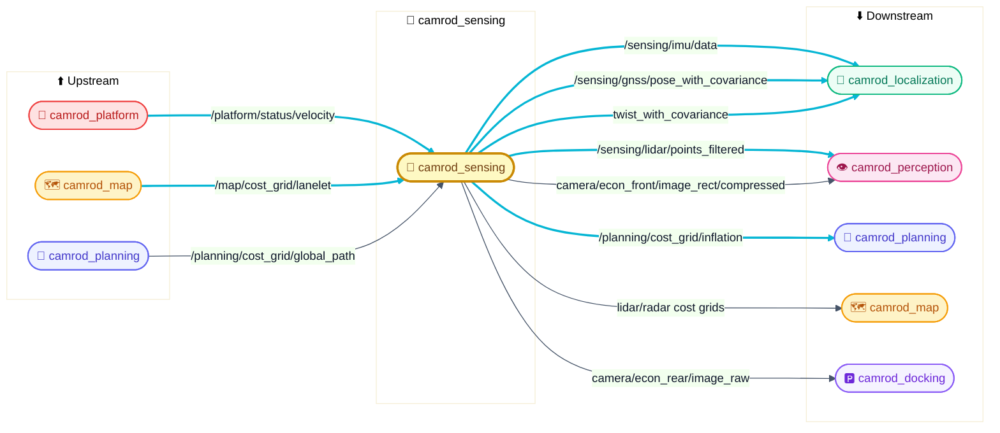
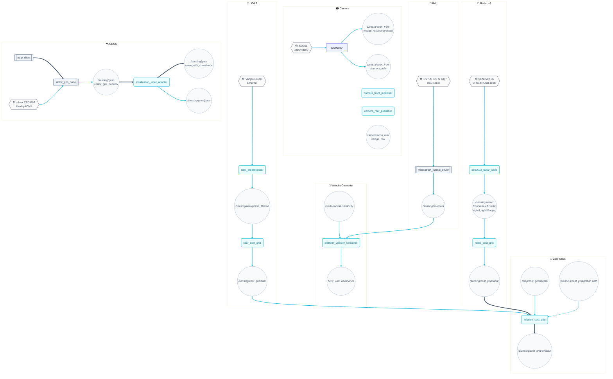
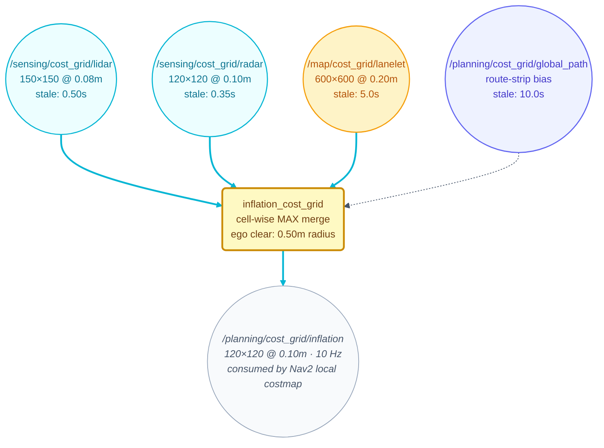

# 🎯 camrod_sensing — Sensors, preprocessing & near-range cost grids

## 1. 📋 Summary

`camrod_sensing` acquires raw data from all physical sensors (LiDAR, radar, camera, IMU, GNSS), preprocesses the streams, and produces the filtered topics and obstacle cost grids consumed by localization, perception, and planning. It also fuses the map lanelet cost grid with real-time sensor grids into a single inflation grid for the Nav2 local costmap.

> 📌 **Hardware covered:** Vanjee LiDAR (Ethernet), DFRobot SEN0592 ultrasonic radar ×6 (CH9344 USB serial), Econ dual cameras — front (`camera_front_publisher_node`, GPU VPI+NvJPEG, `/dev/video0`) + rear (`camera_rear_publisher_node`, CPU OpenCV, `/dev/video1`), MicroStrain CV7-AHRS or GQ7 IMU (USB serial, selected via `imu_model`), u-blox SparkFun ZED-F9P (single antenna, `/dev/ttyACM0`, `ublox_dual_antenna:=false`) or ArduSimple simpleRTK2B Heading (dual antenna, moving-baseline heading, `ublox_dual_antenna:=true`), NTRIP RTK correction stream (gnssdata.or.kr).

---

## 2. 🚀 Quick Start

```bash
# Full sensing stack (all sensors enabled)
ros2 launch camrod_sensing sensing.launch.py

# Disable sensors not present on the platform
ros2 launch camrod_sensing sensing.launch.py \
  enable_gnss:=false \
  enable_ntrip:=false

# Switch IMU hardware (HH_260528: imu_mode → imu_model)
ros2 launch camrod_sensing sensing.launch.py imu_model:=gq7

# Sub-stacks (for isolated bringup or debug)
ros2 launch camrod_sensing lidar.launch.py
ros2 launch camrod_sensing radar.launch.py
ros2 launch camrod_sensing gnss.launch.py                          # dual antenna (default)
ros2 launch camrod_sensing gnss.launch.py ublox_dual_antenna:=false  # single antenna
ros2 launch camrod_sensing gnss.launch.py enable_ntrip:=false        # dual, no NTRIP
ros2 launch camrod_sensing imu.launch.py
ros2 launch camrod_sensing camera.launch.py
```

> 💡 Verify: `ros2 topic hz /sensing/lidar/points_filtered` should show ~10 Hz; `ros2 topic echo /sensing/gnss/ublox_gps_node/fix --once` should return a `NavSatFix` with `status.status >= 0`.

---

## 3. 🗺️ System Position



> **Diagram legend** 🧩 ROS node · 📡 Topic · ==> critical path · -.-> optional

*Figure 1 — camrod_sensing is the hub between all physical hardware and the rest of the CAMROD stack.*

---

## 4. 🏗️ Runtime Architecture



> **Diagram legend** 🧩 ROS node · 📡 Topic · 🛠️ Hardware · 📦 External pkg · ==> critical path · -.-> optional

*Figure 2 — Full runtime architecture with one subgraph per sensor pipeline plus the inflation cost grid fusion.*

---

## 5. 🧮 Cost Grid Strategy



> **Diagram legend** 📡 Topic · 🧩 ROS node · ==> required input · -.-> optional input

*Figure 3 — Four input grids are merged by cell-wise MAX into the single inflation grid consumed by Nav2 local costmap and `cmd_vel_gate`.*

---

## 6. 🔌 Interface Contract

### Inputs (from other packages)

| Topic | Type | Required | Producer | Rate | Meaning |
|---|---|---|---|---|---|
| `/platform/status/velocity` | `geometry_msgs/TwistStamped` | Yes | camrod_platform | ~20 Hz | Forward speed used by `platform_velocity_converter` to project odometric velocity |
| `/map/cost_grid/lanelet` | `nav_msgs/OccupancyGrid` | Yes (stale ≤ 5 s) | camrod_map | Static (transient_local) | Lanelet centerline cost layer merged into inflation grid |
| `/planning/cost_grid/global_path` | `nav_msgs/OccupancyGrid` | No (stale ≤ 10 s) | camrod_planning | On replan | Route-strip bias merged into inflation grid |

### Outputs (consumed by other packages)

| Topic | Type | Consumer | Rate | Meaning |
|---|---|---|---|---|
| `/sensing/lidar/points_filtered` | `sensor_msgs/PointCloud2` | camrod_perception, camrod_planning | ~10 Hz | Ground-filtered, voxel-downsampled LiDAR points in `lidar_link` frame |
| `/sensing/cost_grid/lidar` | `nav_msgs/OccupancyGrid` | `inflation_cost_grid`, camrod_planning, camrod_map | 10 Hz | 150×150 @ 0.08 m robot-centred obstacle grid from LiDAR |
| `/sensing/cost_grid/radar` | `nav_msgs/OccupancyGrid` | `inflation_cost_grid`, camrod_planning, camrod_map | 10 Hz | 120×120 @ 0.10 m robot-centred near-field obstacle grid from radar |
| `/planning/cost_grid/inflation` | `nav_msgs/OccupancyGrid` | camrod_planning (Nav2 local costmap, `cmd_vel_gate`) | 6 Hz | 80×80 @ 0.10 m merged grid: max(lanelet, lidar, radar, global_path) |
| `/sensing/gnss/ublox_gps_node/fix` | `sensor_msgs/NavSatFix` | camrod_localization (`localization_input_adapter`) | 10 Hz | Raw GNSS fix with RTK status |
| `/sensing/gnss/pose` | `geometry_msgs/PoseStamped` | camrod_localization (`localization_monitor_node`) | 10 Hz | GNSS-derived pose in `map` frame (no covariance) |
| `/sensing/gnss/pose_with_covariance` | `geometry_msgs/PoseWithCovarianceStamped` | camrod_localization (ESKF) | 10 Hz | GNSS-derived pose with position covariance for filter fusion |
| `/sensing/imu/data` | `sensor_msgs/Imu` | camrod_localization (ESKF), `platform_velocity_converter` | 100 Hz | Filtered orientation + angular velocity + linear acceleration in `imu_link` frame |
| `/sensing/platform_velocity_converter/twist_with_covariance` | `geometry_msgs/TwistWithCovarianceStamped` | camrod_localization (ESKF) | ~20 Hz | Platform forward velocity with fixed covariance for wheel-odometry fusion |
| `/sensing/camera/econ_front/image_rect/compressed` | `sensor_msgs/CompressedImage` | camrod_perception (YOLOv9) | 10 Hz | GPU-rectified 1920×1080 JPEG in `camera_front` frame (VPI VIC + NvJPEG) |
| `/sensing/camera/econ_front/camera_info` | `sensor_msgs/CameraInfo` | camrod_perception | 10 Hz | Calibrated intrinsics — equidistant 4-coefficient (k1–k4) |
| `/sensing/camera/econ_rear/image_raw` | `sensor_msgs/Image` | camrod_docking (Isaac ROS AprilTag) | 10 Hz | Uncompressed 1920×1080 in `camera_rear` frame; required by RectifyNode |
| `/sensing/camera/econ_rear/image_raw/compressed` | `sensor_msgs/CompressedImage` | monitoring | 10 Hz | CPU-JPEG compressed rear stream |
| `/sensing/camera/econ_rear/camera_info` | `sensor_msgs/CameraInfo` | camrod_docking | 10 Hz | Rear camera intrinsics |

---

## 7. ⚙️ Key Behaviors

### LiDAR — ground filter and voxel downsample

| Field | Detail |
|---|---|
| Trigger | Each incoming PointCloud2 from `vanjee/points_raw` |
| Internal logic | `lidar_preprocessor_node` applies range clipping (0.3–35 m), Z-band filter (−1.0 to 2.0 m), then RANSAC ground plane removal. Points within Z −0.25 to 0.25 m of the estimated ground plane are discarded. Remaining points are re-stamped with the current ROS clock and re-framed to `lidar_link`. |
| Output effect | `/sensing/lidar/points_filtered` contains obstacle-only returns. |
| Operator-visible symptom | If the topic is empty, verify the Vanjee driver is publishing on `/sensing/lidar/vanjee/points_raw`. If points look like the ground plane is still present, the RANSAC plane fit may have failed — check that the robot is on reasonably flat ground at startup. |
| Related params | `method`, `min_range`, `max_range`, `min_z`, `max_z`, `z_min`, `z_max`, `frame_id_override` |
| Related topics | `/sensing/lidar/vanjee/points_raw` → `/sensing/lidar/points_filtered` |

### LiDAR cost grid

| Field | Detail |
|---|---|
| Trigger | Each `/sensing/lidar/points_filtered` message |
| Internal logic | `lidar_cost_grid_node` projects each filtered point into the `map` frame via TF2 and increments the corresponding cell. Cost is linearly scaled between `min_cost` (30) and `max_cost` (95) over the distance range 0.4–7.5 m. An ego-clear disk of radius 0.90 m around the robot base is always set to free. Grid is published at 10 Hz. Messages older than 0.50 s are discarded. |
| Output effect | `/sensing/cost_grid/lidar`: 150×150 @ 0.08 m (12 m square centred on robot). |
| Operator-visible symptom | Silent topic → LiDAR not publishing filtered points. Grid frozen → TF `robot_base_link → map` is stale (localization not running). |
| Related params | `resolution`, `width`, `height`, `cost_range_min_m`, `cost_range_max_m`, `ego_clear_radius_m`, `max_message_age_s`, `publish_rate_hz` |
| Related topics | `/sensing/lidar/points_filtered` → `/sensing/cost_grid/lidar` |

### Radar (SEN0592 ×6)

| Field | Detail |
|---|---|
| Trigger | `poll_period_s` timer (60 ms cycle) |
| Internal logic | `sen0592_radar_node` polls six DFRobot SEN0592 sensors over six CH9344 USB serial ports at 115200 baud. Detection angle is configured to 75° (register 0x0208, value 5) at startup. Per-sensor max ranges are written to register 0x021F: REAR 0.50 m, LEFT1/LEFT2/RIGHT1/RIGHT2 0.80 m, FRONT 1.50 m. Each sensor publishes one `sensor_msgs/Range` message per poll cycle. |
| Output effect | Six topics: `/sensing/radar/{front,rear,left1,left2,right1,right2}/range`. |
| Operator-visible symptom | If any topic is silent, the corresponding CH9344 port may not be enumerated. Run `ls /dev/ttyCH9344USB*` to verify all six ports exist. |
| Related params | `ports`, `sensor_names`, `frame_ids`, `sensor_max_ranges_m`, `poll_period_s`, `baud`, `angle_config_value` |
| Related topics | `/sensing/radar/{front,rear,left1,left2,right1,right2}/range` |

### Radar cost grid

| Field | Detail |
|---|---|
| Trigger | Each incoming Range message (async per sensor) |
| Internal logic | `radar_cost_grid_node` projects each Range into the `map` frame using the sensor's TF frame ID (`radar_*_link`). Cost is linearly scaled between `min_cost` (35) and `max_cost` (95) over 0.3–2.0 m. Ego-clear disk radius is 0.50 m (reduced from LiDAR's 0.90 m to preserve near-field side/rear readings). Messages older than 0.35 s are discarded. |
| Output effect | `/sensing/cost_grid/radar`: 120×120 @ 0.10 m (12 m square centred on robot), published at 10 Hz. |
| Operator-visible symptom | Empty grid → serial port permission denied or CH9344 driver not loaded. Near-field obstacles missing → ego_clear_radius_m is too large; current value 0.50 m is already minimal. |
| Related params | `cost_range_min_m`, `cost_range_max_m`, `ego_clear_radius_m`, `max_message_age_s`, `publish_rate_hz` |
| Related topics | `/sensing/radar/*/range` → `/sensing/cost_grid/radar` |

### Camera — dual econ (front + rear)

**Front camera (`camera_front_publisher_node`, GPU pipeline)**

| Field | Detail |
|---|---|
| Trigger | Continuous capture; started when `enable_front_camera: true` in `camera_launch_config.yaml` (`camrod_sensing_camera` section) |
| Internal logic | Opens `/dev/video0` via GStreamer (`v4l2src` → UYVY @ 30 fps → `videorate` → `nvvidconv` → NV12). Falls back to `cv::CAP_V4L2` direct if GStreamer fails (ISX031 Tegra CSI cameras can fail `v4l2src`; see §14). In fallback mode, BGR→NV12 conversion runs on CPU. Fisheye undistortion via VPI VIC (equidistant 4-coeff). Output JPEG-encoded by NvJPEG hardware. Exposure set to `exposure_time_us` in V4L2 manual mode at startup. |
| Output effect | `/sensing/camera/econ_front/image_rect/compressed`, `/sensing/camera/econ_front/camera_info` at 10 Hz. |
| Operator-visible symptom | Node crash at startup → `/dev/video0` not present or permissions issue. Distorted image → stale `camera_matrix`/`distortion_coefficients` in `camera_params.yaml`. Log shows `"V4L2 direct"` → GStreamer unavailable (normal on this platform; see §14). |
| Related params | `device_path`, `image_width`, `image_height`, `fps`, `exposure_time_us`, `jpeg_quality`, `camera_matrix`, `distortion_coefficients`, `intrinsics_source` |
| Related topics | `/sensing/camera/econ_front/image_rect/compressed`, `/sensing/camera/econ_front/camera_info` |

**Rear camera (`camera_rear_publisher_node`, CPU pipeline)**

| Field | Detail |
|---|---|
| Trigger | Continuous GStreamer capture; started when `enable_rear_camera: true` in `camrod_sensing_camera` |
| Internal logic | Opens `/dev/video1` via OpenCV GStreamer pipeline. Publishes `image_raw` (uncompressed, on-demand when subscribed) and `image_raw/compressed` (always). Uncompressed stream is required by Isaac ROS RectifyNode in camrod_docking. |
| Output effect | `/sensing/camera/econ_rear/image_raw`, `/sensing/camera/econ_rear/image_raw/compressed`, `/sensing/camera/econ_rear/camera_info` at 10 Hz. |
| Operator-visible symptom | AprilTag detection silent → check `/sensing/camera/econ_rear/image_raw` is live and `/dev/video1` exists. |
| Related params | `device`, `width`, `height`, `fps`, `jpeg_quality`, `frame_id`, `camera_info_url` |
| Related topics | `/sensing/camera/econ_rear/image_raw`, `/sensing/camera/econ_rear/image_raw/compressed`, `/sensing/camera/econ_rear/camera_info` |

### IMU (CV7-AHRS or GQ7, selectable)

| Field | Detail |
|---|---|
| Trigger | Node startup; `imu_model` launch argument selects `cv7` (default) or `gq7` |
| Internal logic | **cv7:** `microstrain_inertial_driver` node launched directly with `respawn=true` (recovers serial lock). Filter output 100 Hz, ENU frame, GNSS aiding disabled. **gq7:** upstream `microstrain_launch.py` + optional `ntrip_client` for RTK-heading. Model auto-resolves param file: `config/imu/microstrain_cv7.yaml` or `microstrain_gq7.yaml`. |
| Output effect | `/sensing/imu/data` (sensor_msgs/Imu) at 100 Hz in `imu_link` frame. |
| Operator-visible symptom | Wrong model selected → driver connects on wrong port, zeroed or noisy orientation. Check: `ls /dev/serial/by-id/usb-Lord_Microstrain*`. |
| Related params | `imu_model`, `imu_param_file`, `imu_data_rate`, `use_enu_frame`, `timestamp_source`, `frame_id` |
| Related topics | `/sensing/imu/data` |

### GNSS (HH_260611: ublox_gps single/dual antenna)

Select the antenna mode via `ublox_dual_antenna` (`false` = SparkFun single antenna, `true` = simpleRTK2B Heading dual antenna). Both modes use `ublox_gps_node` and Python `ntrip_client` for NTRIP RTK corrections with GGA feedback, required for gnssdata.or.kr VRS network.

#### Single antenna — SparkFun ZED-F9P (`ublox_dual_antenna:=false`)

| Field | Detail |
|---|---|
| Trigger | Node startup; `enable_ntrip` controls whether the NTRIP client is also started |
| Internal logic | `ublox_gps_node` opens `/dev/ttyACM0` and configures the F9P for 10 Hz measurement output (`rate: 10.0`, `nav_rate: 1`). TMODE3 is set to 0 (rover mode). UBX-NAV-PVT and NMEA are published. `ntrip_client` subscribes to `gnssdata.or.kr:2101`, mountpoint `CNJU-RTCM32`, and forwards RTCM3.2 corrections. Fix converges from no-fix → float → RTK-fixed over ~60 s under open sky. |
| Output effect | `/sensing/gnss/ublox_gps_node/fix` at 10 Hz; downstream adapter produces `/sensing/gnss/pose` and `/sensing/gnss/pose_with_covariance`. |
| Operator-visible symptom | GNSS stays in float → NTRIP not delivering RTCM. No fix → check `/dev/ttyACM0` and `config_on_startup: false`. |
| Related params | `config/gnss/zed_f9p_rover.yaml`: `device` (`/dev/ttyACM0`), `rate`, `nav_rate`, `tmode3` |
| Related topics | `/sensing/gnss/ublox_gps_node/fix`, `/sensing/gnss/ntrip_client/rtcm` |

#### Dual antenna — ArduSimple simpleRTK2B Heading (`ublox_dual_antenna:=true`)

| Field | Detail |
|---|---|
| Trigger | `ublox_gps_node` startup with `dual_antenna:=true`. `enable_ntrip` controls Python NTRIP client. |
| Internal logic | Board contains two ZED-F9P chips (BASE + ROVER) on one PCB. BASE sends moving-baseline RTCM to ROVER through UART2 at the u-center saved 115200 baudrate. ROVER computes `UBX-NAV-RELPOSNED` and publishes heading over USB. NTRIP improves absolute RTK position but is not forwarded into rover USB by default, because a second RTCM stream can break moving-baseline heading. |
| Output effect | `/sensing/gnss/navheading` (heading from RELPOSNED), `/sensing/gnss/navrelposned`, `/sensing/gnss/ublox_gps_node/fix`. |
| Operator-visible symptom | Heading valid but pose float → external RTCM/sky/base state issue. Heading invalid → check BASE→ROVER UART2 moving-baseline RTCM and confirm `ublox_dual_forward_ntrip_to_rover:=false`. |
| Related params | `config/gnss/zed_f9p_rover.yaml` plus launch inline dual-antenna params. |
| Related topics | `/sensing/gnss/navheading`, `/sensing/gnss/navrelposned`, `/sensing/gnss/ntrip_client/rtcm` |

### NTRIP/RTK operating conditions

| Field | Detail |
|---|---|
| Trigger | `ntrip_client` node startup (if `enable_ntrip:=true`) |
| Internal logic | The NTRIP client connects to `www.gnssdata.or.kr:2101` (Korean CORS network) with authenticated credentials. It sends a GGA sentence (up to 96 chars) to the caster and receives a continuous RTCM 3.2 stream. The stream is relayed to `ublox_gps_node` via the `rtcm` topic. If the connection drops, the client retries up to 10 times with an 8 s wait between attempts (`reconnect_attempt_max: 10`, `reconnect_attempt_wait_seconds: 8`). The F9P transitions to RTK-float when RTCM is first received and to RTK-fixed after resolving carrier-phase ambiguity (typically < 60 s under open sky). |
| Output effect | F9P `carrSoln` field in NAV-PVT: 0 = none, 1 = float, 2 = fixed. `NavSatFix.status.status`: 0 = fix, 2 = RTK-float, 3+ = RTK-fixed (depending on ublox_gps driver version). |
| Operator-visible symptom | `carrSoln` stays at 1 (float) for > 5 min under clear sky → base corrections are received but ambiguity resolution is failing. Common causes: multipath environment, rover antenna quality, or RTCM stream has gaps. |
| Required conditions | Active internet connection, CORS network reachable, open-sky GNSS antenna with good ground plane, F9P firmware ≥ HPG 1.13. |
| Related params | `host`, `port`, `mountpoint`, `username`, `password`, `rtcm_timeout_seconds`, `reconnect_attempt_max`, `reconnect_attempt_wait_seconds` |
| Related topics | `/sensing/gnss/ublox_gps_node/fix`, `/sensing/gnss/rtcm` |

### Velocity converter

| Field | Detail |
|---|---|
| Trigger | Each `/platform/status/velocity` message |
| Internal logic | `platform_velocity_converter_node` combines the platform forward speed (from camrod_platform) with the IMU angular rate (from `/sensing/imu/data`) and emits a `TwistWithCovarianceStamped`. Fixed covariances: linear [0.05, 0.05, 0.10] m²/s², angular [0.2, 0.2, 0.2] rad²/s². |
| Output effect | `/sensing/platform_velocity_converter/twist_with_covariance` — the primary odometric input to the ESKF in camrod_localization. |
| Operator-visible symptom | Topic silent → either platform velocity or IMU is not publishing. The node requires IMU (`require_imu: true`). |
| Related params | `linear_variance`, `angular_variance`, `require_imu` |
| Related topics | `/platform/status/velocity`, `/sensing/imu/data` → `/sensing/platform_velocity_converter/twist_with_covariance` |

### Inflation cost grid (sensor fusion)

| Field | Detail |
|---|---|
| Trigger | Any updated input grid; publishes at 10 Hz |
| Internal logic | `inflation_cost_grid_node` maintains up to four input grids and computes a cell-wise **maximum** merge: lanelet cost (stale limit 5.0 s), lidar cost (0.50 s), radar cost (0.50 s), global_path cost (10.0 s). The output is an 80×80 @ 0.10 m grid (8 m square centred on robot; HH_260618: sized for the 2.8 s MPPI horizon at 1.4 m/s). An ego-clear disk of radius 0.50 m is always free. Messages older than their per-input limit are treated as absent. |
| Output effect | `/planning/cost_grid/inflation` at 6 Hz; consumed by Nav2 local costmap and `cmd_vel_gate`. |
| Operator-visible symptom | If inflation grid stops updating at 6 Hz, check each input: lidar/radar grids must arrive within 0.50 s; lanelet grid arrives once (transient_local) and is valid for 5.0 s after last receipt. |
| Related params | `resolution`, `width`, `height`, `ego_clear_radius_m`, `publish_rate_hz`, `input_topics`, `input_max_ages_s` |
| Related topics | `/map/cost_grid/lanelet`, `/sensing/cost_grid/lidar`, `/sensing/cost_grid/radar`, `/planning/cost_grid/global_path` → `/planning/cost_grid/inflation` |

---

## 8. 📊 Cost Grid Reference

All cost grids are robot-centred and published in the `map` frame via TF2.

| Grid | Size | Resolution | Cost range | Max staleness | Ego clear radius |
|---|---|---|---|---|---|
| `/sensing/cost_grid/lidar` | 150×150 | 0.08 m | 30–95 | 0.50 s | 0.90 m |
| `/sensing/cost_grid/radar` | 120×120 | 0.10 m | 35–95 | 0.35 s | 0.50 m |
| `/planning/cost_grid/inflation` | 80×80 | 0.10 m | 0–100 | per-input (below) | 0.50 m |

`inflation_cost_grid_node` per-input staleness limits:

| Input | Staleness limit |
|---|---|
| `/map/cost_grid/lanelet` | 5.0 s |
| `/sensing/cost_grid/lidar` | 0.50 s |
| `/sensing/cost_grid/radar` | 0.50 s |
| `/planning/cost_grid/global_path` | 10.0 s |

---

## 9. 🚀 Launch

```bash
# Full sensing stack
ros2 launch camrod_sensing sensing.launch.py

# Sub-stacks
ros2 launch camrod_sensing lidar.launch.py
ros2 launch camrod_sensing radar.launch.py
ros2 launch camrod_sensing gnss.launch.py
ros2 launch camrod_sensing imu.launch.py
ros2 launch camrod_sensing camera.launch.py
```

### Launch arguments for `sensing.launch.py`

| Argument | Default | Description |
|---|---|---|
| `sensing_namespace` | `sensing` | ROS 2 namespace for all sensing nodes |
| `enable_lidar_driver` | `true` | Vanjee LiDAR driver + preprocessor |
| `enable_lidar_cost_grid` | `true` | LiDAR obstacle cost grid |
| `enable_radar` | `true` | SEN0592 radar driver |
| `enable_radar_cost_grid` | `true` | Radar obstacle cost grid |
| `enable_inflation_cost_grid` | `true` | Merged inflation cost grid |
| `enable_camera` | `true` | Enable camera stack (gate for both front + rear) |
| `enable_front_camera` | `true` | Front econ camera node (`camera_front_publisher_node`) |
| `enable_rear_camera` | `true` | Rear econ camera node (`camera_rear_publisher_node`) |
| `enable_gnss` | `true` | u-blox F9P GNSS driver |
| `enable_ntrip` | `true` | NTRIP RTK correction client |
| `enable_imu` | `true` | MicroStrain IMU driver |
| `imu_model` | `cv7` | IMU hardware model: `cv7` (CV7-AHRS) or `gq7` (GQ7 with optional NTRIP) |
| `imu_param_file` | `__model_default__` | IMU param YAML; auto-resolves to `config/imu/microstrain_<model>.yaml` |
| `camera_device_path` | `/dev/video0` | Front camera V4L2 device (rear is always `/dev/video1`) |
| `imu_velocity_topic` | `/platform/status/velocity` | Platform velocity input to velocity converter |
| `imu_output_topic` | `/sensing/platform_velocity_converter/twist_with_covariance` | Velocity converter output (fixed) |
| `gnss_namespace` | `gnss` | Sub-namespace for GNSS nodes (resolves to `/sensing/gnss/`) |

---

## 10. 🔧 Config

| File | Purpose |
|---|---|
| `config/camera/camera_launch_config.yaml` | Launch-only enable flags (`enable_front_camera`, `enable_rear_camera`); separated from ROS params to prevent rcl SIGABRT on top-level key (HJ_260529) |
| `config/camera/camera_params.yaml` | ROS node params: device paths, front intrinsics (`/sensing/` and `/camera/` FQN sections for sensing.launch.py and standalone camera.launch.py), rear `camera_info_url` |
| `config/camera/camera_rear_calibration.yaml` | Rear econ camera intrinsics (plumb_bob, 1920×1080): K, D, R, P matrices — loaded by `camera_info_url` at startup |
| `config/lidar/preprocessor.yaml` | Ground filter (RANSAC), range limits, voxel size, frame ID override |
| `config/lidar/cost_grid.yaml` | LiDAR grid geometry, cost thresholds, ego clear radius |
| `config/lidar/vanjee/config.yaml` | Vanjee LiDAR driver hardware config |
| `config/radar/sen0592_radar.yaml` | Serial ports, per-sensor range limits, detection angle config |
| `config/radar/cost_grid.yaml` | Radar grid geometry, near-field cost range |
| `config/inflation_cost_grid.yaml` | Merged grid geometry, per-input staleness limits |
| `config/imu/microstrain_cv7.yaml` | CV7-AHRS driver: port, rates, frame, filter aiding flags |
| `config/imu/microstrain_gq7.yaml` | GQ7 driver config (used with `imu_model:=gq7`) |
| `config/imu/platform_velocity_converter.yaml` | Velocity/IMU fusion covariance |
| `config/gnss/zed_f9p_rover.yaml` | u-blox F9P: device, measurement rate, rover mode, publish flags |
| `config/gnss/ntrip_client.yaml` | NTRIP caster host/port/mountpoint, authentication, retry policy |

### Key params by sensor

<details><summary>LiDAR preprocessor — <code>config/lidar/preprocessor.yaml</code></summary>

| Param | Value | Meaning |
|---|---|---|
| `min_range` | `0.3` m | Minimum valid point range |
| `max_range` | `35.0` m | Maximum valid point range |
| `min_z` / `max_z` | `−1.0` / `2.0` m | Z-axis band filter |
| `method` | `ransac` | Ground segmentation algorithm |
| `z_min` / `z_max` | `−0.25` / `0.25` m | Ground plane inlier Z window |
| `frame_id_override` | `lidar_link` | Frame stamped into output cloud |

</details>

<details><summary>Radar driver — <code>config/radar/sen0592_radar.yaml</code></summary>

| Param | Value | Meaning |
|---|---|---|
| `poll_period_s` | `0.06` s | Sensor polling interval (≈16.7 Hz cycle) |
| `angle_config_value` | `5` | Detection angle: 5 = 75° (max for SEN0592) |
| `sensor_max_ranges_m` | `[0.50, 0.80, 0.80, 0.80, 0.80, 1.50]` | Per-sensor max range (REAR, L2, L1, R2, R1, FRONT) |
| `ports` | `/dev/ttyCH9344USB2` – `USB7` | CH9344 serial port assignments |

</details>

<details><summary>Inflation cost grid — <code>config/inflation_cost_grid.yaml</code></summary>

| Param | Value | Meaning |
|---|---|---|
| `resolution` | `0.10` m | Grid cell size |
| `width` / `height` | `120` cells | 12 m square window |
| `ego_clear_radius_m` | `0.50` m | Always-free disk around robot |
| `publish_rate_hz` | `10.0` Hz | Output rate |
| `input_max_ages_s` | `[5.0, 0.50, 0.50, 10.0]` | Per-input staleness limits (lanelet, lidar, radar, path) |

</details>

---

## 11. ✅ Validation

```bash
# LiDAR pipeline
ros2 topic hz /sensing/lidar/points_filtered          # expect ~10 Hz
ros2 topic hz /sensing/cost_grid/lidar                # expect 10 Hz

# Radar
ros2 topic hz /sensing/radar/front/range              # expect ~16 Hz
ros2 topic hz /sensing/cost_grid/radar                # expect 10 Hz

# GNSS
ros2 topic echo /sensing/gnss/ublox_gps_node/fix --once
# Check status.status: 2 = RTK-float, check carrSoln field in NavSatFix header

# IMU
ros2 topic hz /sensing/imu/data                       # expect 100 Hz

# Velocity converter
ros2 topic hz /sensing/platform_velocity_converter/twist_with_covariance

# Inflation grid
ros2 topic hz /planning/cost_grid/inflation           # expect 6 Hz

# Camera — front (GPU VPI pipeline)
ros2 topic hz /sensing/camera/econ_front/image_rect/compressed   # expect 10 Hz
ros2 topic echo /sensing/camera/econ_front/camera_info --once

# Camera — rear (CPU GStreamer pipeline)
ros2 topic hz /sensing/camera/econ_rear/image_raw                # expect 10 Hz
ros2 topic echo /sensing/camera/econ_rear/camera_info --once
```

---

## 12. 🔍 Troubleshooting

### LiDAR topic silent

`/sensing/lidar/points_filtered` has no messages.

1. Check that the Vanjee LiDAR driver is running and publishing on `/sensing/lidar/vanjee/points_raw`: `ros2 topic hz /sensing/lidar/vanjee/points_raw`.
2. Confirm `enable_lidar_driver:=true` and `enable_lidar_cost_grid:=true` in the launch command.
3. Check the preprocessor node is alive: `ros2 node list | grep lidar_preprocessor`.
4. If raw points arrive but filtered points don't, the RANSAC ground filter may be failing — this can happen if the robot is not on a flat surface at startup. Try restarting the preprocessor after placing the robot on flat ground.

### GNSS stays in float

`NavSatFix.status.status` does not reach RTK-fixed after > 5 minutes under open sky.

> ⚠️ If `carrSoln` stays at 1 (float) for > 5 min under clear sky, ambiguity resolution is failing — check for multipath, antenna quality, or RTCM stream gaps.

1. Confirm RTCM stream is arriving: `ros2 topic hz /sensing/gnss/rtcm`. If silent, the NTRIP client is not connected.
2. Check network reachability: `ping www.gnssdata.or.kr`. Firewall or mobile data restrictions can block port 2101.
3. Check the NTRIP node log for authentication errors: `ros2 node info /sensing/gnss/ntrip_client`.
4. If RTCM is arriving but float persists, the antenna may have poor sky view or multipath. Try a different antenna location.
5. Verify the mountpoint `CNJU-RTCM32` is appropriate for the site (use an NTRIP browser to confirm the nearest base station).

### Radar serial port not found

One or more `/sensing/radar/*/range` topics are silent.

1. Verify all six CH9344 ports exist: `ls /dev/ttyCH9344USB*`. Expect USB2–USB7. If fewer ports appear, the CH9344 kernel module may not be loaded: `sudo modprobe ch9344`.
2. Check port permissions: `ls -l /dev/ttyCH9344USB*`. The user must be in the `dialout` group.
3. Identify which sensor maps to which port by checking `sensor_names` and `ports` arrays in `config/radar/sen0592_radar.yaml` (order: REAR, LEFT2, LEFT1, RIGHT2, RIGHT1, FRONT → USB2–USB7).
4. If a specific sensor is silent after hardware check, try swapping its USB cable/port.

### Inflation grid stops updating

`/planning/cost_grid/inflation` drops below 6 Hz or freezes.

1. Check each input: `ros2 topic hz /sensing/cost_grid/lidar` and `ros2 topic hz /sensing/cost_grid/radar`. Both must be at 10 Hz.
2. The lanelet grid (`/map/cost_grid/lanelet`) is published once with `transient_local` QoS. It is valid for 5 s after last receipt. If camrod_map has not been launched, the inflation node will hold indefinitely waiting for this input.
3. Check `max_message_age_s: 0.50` in `inflation_cost_grid.yaml` — if the inflation node itself is lagging (CPU overload), its own timer may expire before it can publish.
4. Restart `inflation_cost_grid` node: `ros2 lifecycle set /sensing/inflation_cost_grid configure` (if managed) or kill and re-launch.

### IMU mode mismatch

`/sensing/imu/data` is silent or produces constant-zero orientation.

1. Confirm the physical hardware matches `imu_mode`. Default `cv7` expects the CV7-AHRS device at `/dev/serial/by-id/usb-Lord_Microstrain_Lord_Inertial_Sensor_0000_6286.226900-if00`. Check: `ls /dev/serial/by-id/ | grep Microstrain`.
2. For GQ7 hardware, launch with `imu_mode:=gq7_ntrip` and ensure `/dev/ttyACM1` is the GQ7 (not the F9P GNSS — both appear as `ttyACM*`).
3. Check the driver log for `Invalid Parameter` errors. This typically means `filter_pps_source` or `filter_declination_source` is set to a value unsupported by the connected model.

### Front camera node crashes at startup

`camera_front_publisher_node` exits immediately (exit code -6 / SIGABRT).

1. Check `/dev/video0` exists: `ls /dev/video0`. If missing, the ISX031 driver is not loaded or the CSI cable is disconnected.
2. Check permissions: `ls -l /dev/video0`. The user must be in the `video` group (`sudo usermod -aG video $USER`).
3. GStreamer failure is normal on this platform — the node falls back to V4L2 direct automatically. Look for `"Camera opened successfully (V4L2 direct)"` in the node log. If the log still shows a crash after the fallback attempt, both GStreamer and V4L2 direct failed, which indicates a hardware issue.
4. See §14 for a detailed explanation of why GStreamer fails and what the V4L2 fallback does.

### Camera image not reaching `apriltag_node`

`camrod_docking` does not detect dock markers even when the dock is in view.

1. Confirm the **rear** camera (not front) is publishing: `ros2 topic hz /sensing/camera/econ_rear/image_raw`. The `apriltag_node` consumes the uncompressed rear stream.
2. Verify the topic remapping in `camrod_docking/launch/docking.launch.py` maps `/sensing/camera/econ_rear/image_raw` to the Isaac ROS `RectifyNode` input.
3. Check exposure: if the environment is very dark or the dock marker is overexposed, image quality may prevent detection. The rear camera uses OpenCV JPEG and does not have manual exposure control.

---

## 13. ⚠️ Known Hardware Behaviors

Platform-specific behaviors that are not bugs but require documentation to avoid confusion during maintenance.

---

### Front camera: GStreamer `v4l2src` failure and V4L2 direct fallback

**Background**

The ECONSYSTEM ISX031 front camera (`/dev/video0`) is connected to the Jetson Orin via the Tegra VI (Video Input) subsystem — a MIPI CSI interface managed by the `tegra-camrtc-ca` media controller driver. The V4L2 device entry (`vi-output, isx031 10-0043`, driver `tegra-video`) is registered by the kernel, and `v4l2-ctl` shows it as `UYVY 1920×1080 @ 30 fps`. However, the device appears in `v4l2-ctl --all` as:

```
Video input : 0 (Camera 2: no power)
```

This `no power` state means the MIPI lanes are not yet active. Activating them requires the full media controller pipeline to be initialized — a step that GStreamer's generic `v4l2src` plugin does not perform for Tegra VI devices. As a result, `v4l2src` fails immediately with:

```
Embedded video playback halted; module v4l2src0 reported: Internal data stream error.
```

OpenCV's `cv::CAP_V4L2` backend handles the Tegra VI initialization internally (via direct `ioctl` calls that trigger the media controller), so it succeeds where GStreamer fails.

The rear camera (`/dev/video1`, same ISX031 hardware) has the same GStreamer failure. It already had a `cv::CAP_V4L2` fallback in its original implementation. The front camera did not — it threw `std::runtime_error` and crashed. The fallback was added on 2026-06-17.

---

**Capture mode selection (constructor, `camera_front_publisher_node.cpp`)**

```
GStreamer pipeline attempt
  v4l2src → UYVY@30fps → videorate → NV12 → appsink
         │
         ▼ fails (Internal data stream error)
V4L2 direct fallback
  cv::CAP_V4L2 → UYVY FOURCC → 1920×1080 @ 30fps
```

The active mode is logged at startup:

```
[INFO] Camera opened successfully (GStreamer)   ← GStreamer succeeded
[INFO] Camera opened successfully (V4L2 direct) ← fallback active
```

On the current Jetson Orin platform, **V4L2 direct is always active**.

---

**Processing pipeline per capture mode**

| Stage | GStreamer mode | V4L2 direct mode |
|---|---|---|
| Capture | `v4l2src` kernel DMA | `cv::CAP_V4L2` kernel DMA |
| UYVY → NV12 | `nvvidconv` (Tegra VIC hardware) | CPU: `cv::cvtColor` BGR→I420 + manual I420→NV12 interleave |
| Fisheye remap | VPI VIC hardware | VPI VIC hardware (unchanged) |
| JPEG encode | NvJPEG hardware | NvJPEG hardware (unchanged) |

In V4L2 direct mode, **VPI fisheye remap and NvJPEG encoding remain GPU-accelerated**. Only the format conversion step (UYVY→NV12) moves to CPU. For 1920×1080 @ 30 fps this is approximately 180 MB/s of color-space conversion work on the ARM cores — within the Orin's capacity but non-zero load.

The conversion path in V4L2 mode has one redundant step: OpenCV's V4L2 backend converts UYVY→BGR internally, and `captureThread` then converts BGR→I420→NV12. A future optimization is to read raw UYVY via `CAP_PROP_CONVERT_RGB = 0` and convert UYVY→NV12 directly, halving the CPU conversion cost.

---

**How to verify the fallback is active**

```bash
# Check the startup log
ros2 launch camrod_sensing camera.launch.py 2>&1 | grep "Camera opened"
# Expected on this platform:
#   [INFO] [...] Camera opened successfully (V4L2 direct)

# Confirm the topic is publishing
ros2 topic hz /sensing/camera/econ_front/image_rect/compressed
# Expected: ~10 Hz (30 fps native, VPI+NvJPEG pipeline runs at publish rate)
```

---

**Affected files**

| File | Change |
|---|---|
| `src/camera_front_publisher_node.cpp` | V4L2 fallback in constructor; BGR→NV12 conversion in `captureThread` |
| `include/camrod_sensing/camera_front_publisher_node.hpp` | `use_v4l2_fallback_` member added |

---

## 14. 📚 Related Docs

- [../README.md](../README.md) — monorepo overview and inter-package data flow
- [../camrod_localization/README.md](../camrod_localization/README.md) — consumes IMU, GNSS, velocity converter outputs from this package
- [../camrod_perception/README.md](../camrod_perception/README.md) — consumes `/sensing/lidar/points_filtered` and `camera/image_rect/compressed`
- [../camrod_planning/README.md](../camrod_planning/README.md) — consumes `/planning/cost_grid/inflation`, `/sensing/cost_grid/lidar`, `/sensing/cost_grid/radar`
- [../camrod_platform/README.md](../camrod_platform/README.md) — produces `/platform/status/velocity` consumed by velocity converter
- [../camrod_docking/README.md](../camrod_docking/README.md) — consumes `camera/image_rect/compressed` for AprilTag-based dock detection
- [../PARAMETER_NAMING_STANDARD.md](../PARAMETER_NAMING_STANDARD.md) — canonical parameter naming conventions used across the stack

## 2026-06-17 Runtime Update

> HH_260617: Current GNSS baseline is `ublox_gps_node` with simpleRTK2B Heading dual-antenna support.

The simpleRTK2B Heading rover publishes RELPOSNED/heading and RTK pose through the USB-connected rover. NTRIP RTCM should not be injected into the rover USB path when it conflicts with moving-base RTCM; keep `ublox_dual_forward_ntrip_to_rover: false` unless intentionally testing a different RTCM topology. Bringup defaults keep dual-antenna heading enabled and route GNSS config through `sensing/gnss_param_file`.

Radar remains launched through the existing `radar_sensor.launch.py` path and should be validated by checking `/sensing/radar/*` plus `/system/status` sensing entries.
