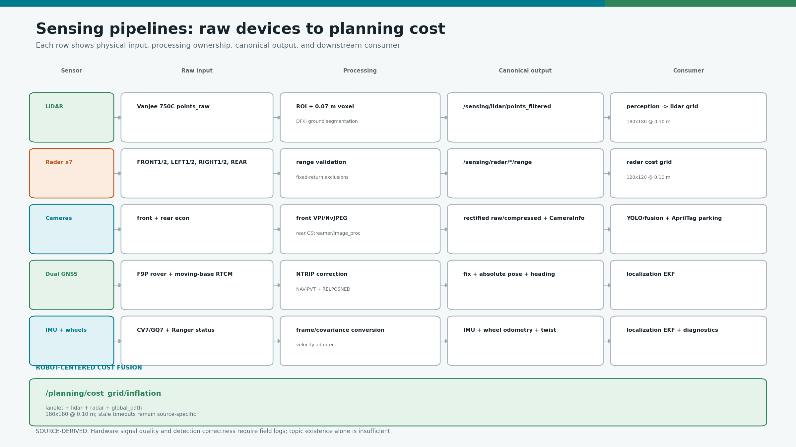

# camrod_sensing

<!-- HH_260804 - Replace the 1,100-line sensor narrative with a sensor matrix,
active numerical values, evidence labels, and direct config/run references. -->

Physical sensor acquisition, preprocessing, disabled-hardware dummy contracts,
near-field cost grids, and robot-centered cost fusion.



## At A Glance

| Sensor/source | Processing | Main output / consumer |
|---|---|---|
| Vanjee 750C LiDAR | ROI, voxel downsample, DFKI ground segmentation | Filtered cloud and LiDAR cost grid -> perception/control |
| SEN0592 x7 | Serial polling, fixed-return filter, map projection | Range topics and radar cost grid -> control |
| Front econ camera | VPI rectification + NvJPEG | Compressed image + CameraInfo -> YOLO/fusion |
| Rear econ camera | GStreamer/OpenCV raw + monitoring JPEG | Raw image + CameraInfo -> AprilTag parking |
| F9P GNSS | NTRIP/RTK, optional moving-base heading | Fix, pose, and heading -> localization |
| CV7 or GQ7 IMU | Driver selection and frame/covariance conversion | IMU -> localization |
| Ranger wheel feedback | Velocity conversion | Twist/odometry -> localization |
| Map + LiDAR + radar + path grids | Robot-centered fusion | `/planning/cost_grid/inflation` -> Nav2/control |

## Cost Grids

| Grid | Geometry | Configured rate | Obstacle radius / role |
|---|---|---:|---|
| LiDAR | `180 x 180 @ 0.10 m` | `10 Hz` | `0.20 m` |
| Radar | `120 x 120 @ 0.10 m` | `10 Hz` | `0.30 m` |
| Inflation/fusion | `180 x 180 @ 0.10 m` | `6 Hz` | Merges lanelet, LiDAR, radar, and path |

LiDAR and radar costs are clipped to active-route lanelets plus a `0.35 m`
margin. Missing or stale route-mask data fails open for obstacle pass-through;
the downstream safety gate still evaluates current source freshness and costs.

## LiDAR Ground Filter


| Parameter | Active value |
|---|---:|
| Voxel resolution | `0.07 m` |
| Ground cells | `0.50 x 0.50 m` |
| Maximum slope | `20 deg` |
| Ground inlier threshold | `0.05 m` |

The image uses deterministic synthetic points to explain the algorithm. It is
not a field point-cloud capture and does not measure ground-classification
accuracy.

## Radar Profile

| Item | Active value |
|---|---|
| Channels | FRONT1, FRONT2, LEFT1, LEFT2, RIGHT1, RIGHT2, REAR |
| Serial | CH9344 USB ports, `115200` baud |
| Hardware beam | angle level `1` on all channels |
| Hardware range | front/sides level `2`; rear level `1` |
| Software maximum | front `1.50 m`, sides `0.80 m`, rear `0.50 m` |
| Automatic startup learning | disabled in field-driving profile |
| Fixed-return filter | named narrow bands only |
| Cost message maximum age | `0.35 s` |

The side harness order is explicitly configured; do not infer left/right from
USB index. A supervised calibration requires a clear, stationary, disengaged
robot and remains bounded by the configured per-channel windows.

## Camera And GNSS Values

| Stream | Configured output | Evidence note |
|---|---|---|
| Front camera | `1920 x 1080`, rectified JPEG target `10 Hz` | Physical decode/rate requires Jetson probe |
| Rear raw camera | `1920 x 1080`, target `10 Hz` | AprilTag input; subscriber-gated |
| Rear monitoring JPEG | `2 Hz` | CPU worker avoids blocking raw publication |
| Single F9P | requested `10 Hz` | RTK state must be checked from UBX flags |
| Dual moving-base F9P | field behavior near `1 Hz` | Heading accuracy depends on baseline and open sky |

For dual-GNSS acceptance, verify `NAV-PVT` carrier state and
`NAV-RELPOSNED` validity/heading flags. A valid `NavSatFix` alone is not proof
of RTK Fixed.

## Reported Physical Stationary Performance


| 2026-07-31 check | Result | Verdict |
|---|---:|---|
| Radar disabled | `600.063 s`, 5,976 grids, zero active/high-cost/stop events | FIELD-PASS dummy/cost isolation |
| Front camera | 2,750 frames, `9.167 Hz`, decode `2750/2750` | FIELD-PASS lifetime |
| Rear raw camera | `3.633 Hz`, max gap `0.717 s` vs `10 Hz` target | FIELD-FAIL rate |
| GNSS | NAV-PVT `1.002 Hz`, RTK Fixed `0` samples | PARTIAL / Fixed failed |
| IMU | `99.9 Hz` | Stream present; startup warning still investigated |

The normalized values come from the committed field report, but its raw logs
are referenced only by Jetson paths and are not in this repository. Detection
correctness, seven-channel radar-on separation, and moving performance remain
open.

## Disabled Hardware

| Disabled source | Published placeholder | Diagnostic result |
|---|---|---|
| GNSS | `NO_FIX` | `DUMMY DATA / WARN` |
| LiDAR | Valid empty clouds/grids | `DUMMY DATA / WARN` |
| Radar channel | No-target range + channel marker | `DUMMY DATA / WARN` |
| Camera | 1x1 black image/JPEG + CameraInfo | `DUMMY DATA / WARN` |
| IMU/Ranger velocity | Stationary typed message | `DUMMY DATA / WARN` |

Dummy data preserves graph contracts but never claims working hardware or free
space. Ordinary simulation disables these auxiliary dummies because the fake
sensor publisher already owns the same schemas.

## Key Topics

| Topic | Purpose |
|---|---|
| `/sensing/lidar/points_filtered` | Nonground cloud for perception |
| `/sensing/cost_grid/lidar` | LiDAR obstacle cost |
| `/sensing/cost_grid/radar` | Seven-channel near-field cost |
| `/planning/cost_grid/inflation` | Merged robot-centered cost |
| `/sensing/gnss/ublox_gps_node/fix` | Absolute GNSS position/status |
| `/sensing/gnss/navheading` | Moving-base heading |
| `/sensing/imu/data_ros` | ROS IMU boundary for EKF |
| `/sensing/camera/econ_front/image_rect/compressed` | Front YOLO image |
| `/sensing/camera/econ_rear/image_raw` | Rear AprilTag image |

## Run And Validate

```bash
ros2 launch camrod_sensing sensing.launch.py
ros2 launch camrod_sensing lidar.launch.py
ros2 launch camrod_sensing radar.launch.py
ros2 launch camrod_sensing camera.launch.py
ros2 launch camrod_sensing gnss.launch.py

ros2 topic hz /sensing/lidar/points_filtered
ros2 topic hz /planning/cost_grid/inflation
ros2 topic echo --once /sensing/gnss/ublox_gps_node/fix
```

| Config directory | Owns |
|---|---|
| `config/lidar/` | Driver, ground segmentation, and LiDAR grid |
| `config/radar/` | Ports, hardware profile, filtering, and radar grid |
| `config/camera/` | Front/rear device, calibration, and publish rates |
| `config/gnss/` | F9P rover/base, NTRIP, and dual-heading profile |
| `config/imu/` | CV7/GQ7 selection and output policy |
| `config/inflation_cost_grid.yaml` | Multi-source merged grid |

Configured rates are targets. Sensor quality, physical rate under full Jetson
load, calibration, and detection correctness require preserved field logs.
