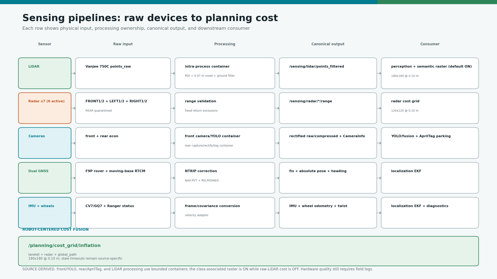
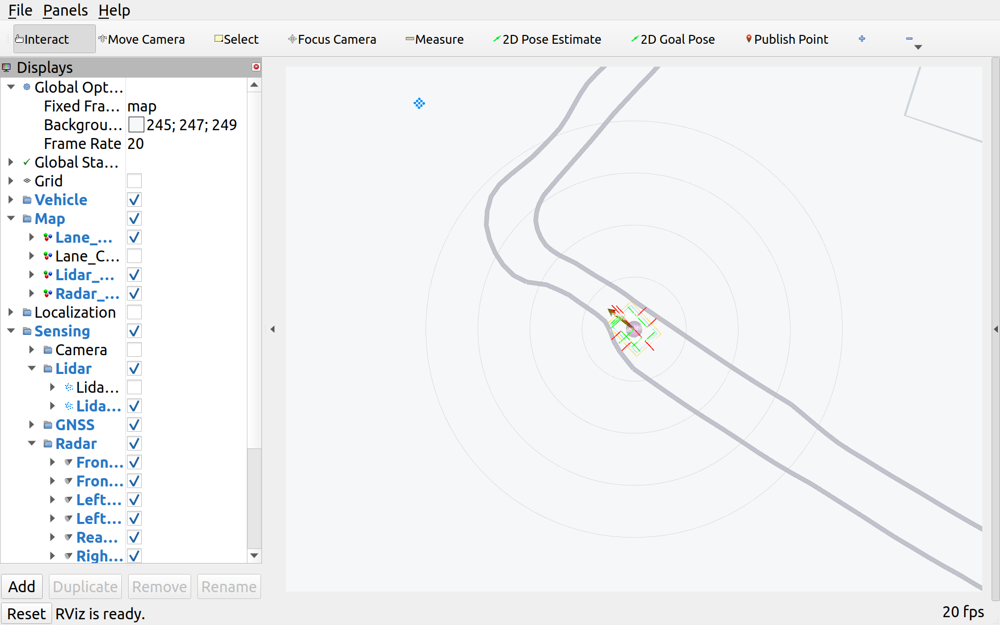
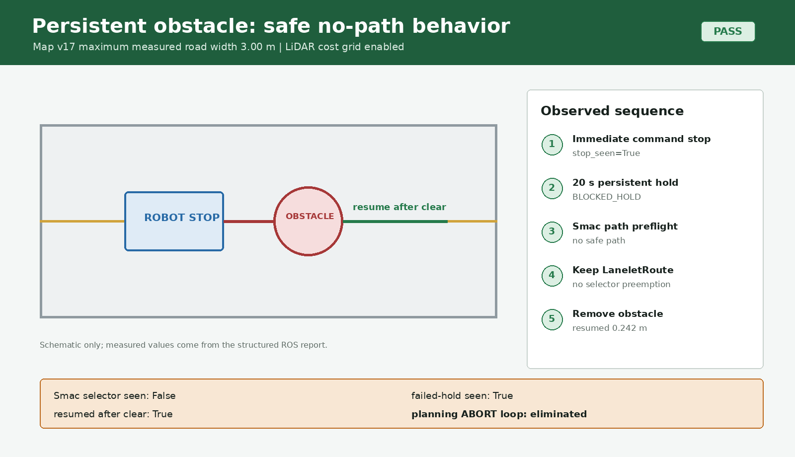
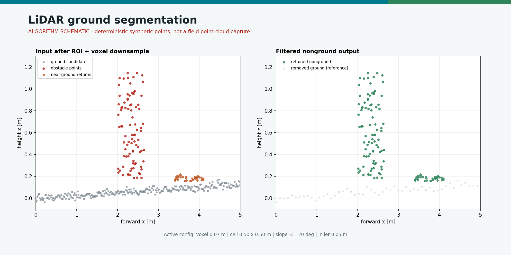
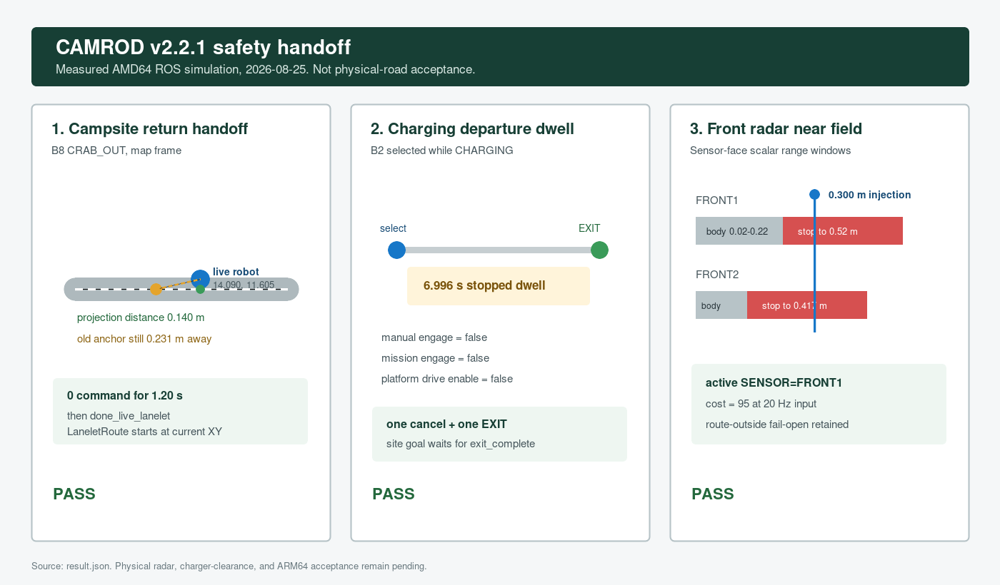
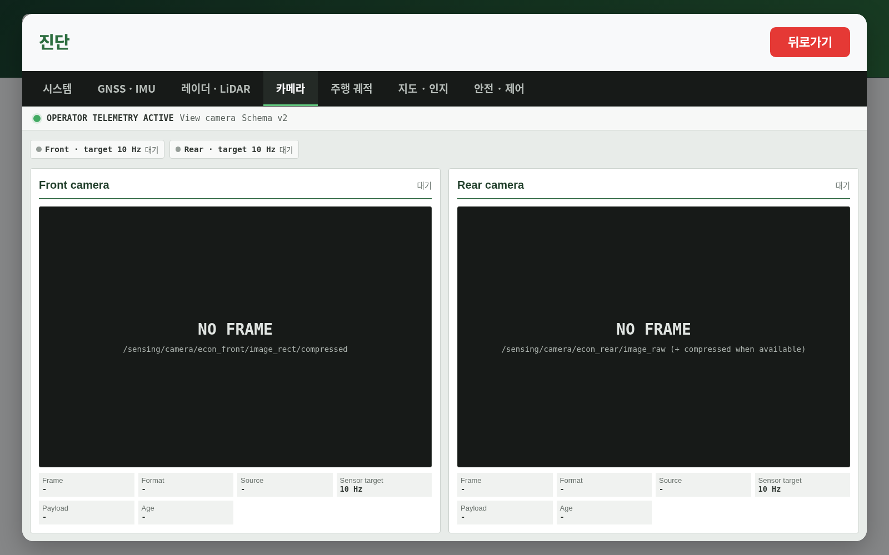

# camrod_sensing

<!-- HH_260805 - Document the front, rear-parking, and LiDAR composition
boundaries while keeping hardware measurements field-pending. -->
<!-- HH_260807 - Bind optional LiDAR TF subscriptions to the scoped container context. -->
<!-- HH_260818 - Reassign the legacy LiDAR grid topic to classified camera-LiDAR
points and document the measured front-radar acceptance windows separately. -->
<!-- HH_260825 - Extend only FRONT1/FRONT2 to a 0.30 m usable near-field stop
window while retaining route/path clipping and side/rear 0.10 m policy. -->

Physical sensor acquisition, preprocessing, disabled-hardware dummy contracts,
near-field cost grids, and robot-centered cost fusion.



## Actual Simulation Runtime



`SIM RUNTIME CAPTURE`: actual filtered LiDAR, radar range sectors, and dynamic
LiDAR/radar cost layers from the running graph. It verifies wiring and display,
not physical sensor accuracy or field rate.

## At A Glance

| Sensor/source | Processing | Main output / consumer |
|---|---|---|
| Vanjee 750C LiDAR | Intra-process ROI, voxel downsample, DFKI ground segmentation | Filtered cloud -> perception; direct raw-LiDAR cost remains disabled |
| SEN0592 x7 | Serial polling, fixed-return filter, map projection | Six active channels plus one fail-visible quarantined rear channel -> radar cost grid |
| Front econ camera | VPI rectification + NvJPEG | Compressed image + CameraInfo -> YOLO/fusion |
| Rear econ camera | GStreamer/OpenCV raw + monitoring JPEG | Raw image + CameraInfo -> AprilTag parking |
| F9P GNSS | NTRIP/RTK, optional moving-base heading | Fix, pose, and heading -> localization |
| CV7 or GQ7 IMU | Driver selection and frame/covariance conversion | IMU -> localization |
| Ranger wheel feedback | Velocity conversion | Twist/odometry -> localization |
| Lanelet + radar + global-path grids | Robot-centered fusion | `/planning/cost_grid/inflation` -> Nav2/control |

## Cost Grids

| Grid | Geometry | Configured rate | Obstacle radius / role |
|---|---|---:|---|
| Classified camera-LiDAR raster | `180 x 180 @ 0.10 m` | `10 Hz` | legacy `/sensing/cost_grid/lidar`; default `ON`, raw LiDAR inputs `OFF` |
| Radar | `120 x 120 @ 0.10 m` | `10 Hz` | `0.30 m` |
| Inflation/fusion | `180 x 180 @ 0.10 m` | `6 Hz` | Merges lanelet, radar, and global path in production |

Radar costs and classified camera-LiDAR costs are clipped to
active-route lanelets plus a `0.35 m` margin. Missing or stale route-mask data
fails open for obstacle pass-through; the downstream safety gate still
evaluates current source freshness and costs. Production inflation consumes
only lanelet, radar, and global-path grids. The final command gate checks the
classified raster directly for the active path's first `2.0 m`, while Nav2's
lanelet overlay still consumes it for avoidance. It is not merged into the
aggregate inflation grid and does not consume raw/preprocessed LiDAR points.

`enable_lidar_cost_grid:=true` is now the production default for the semantic
raster. Setting it to `false` removes `/sensing/lidar/lidar_cost_grid` and
`/sensing/cost_grid/lidar` from graph readiness/diagnostics without disabling
the filtered cloud or perception. The component-owned TF listener is
bound to the same scoped node context/executor and uses a dedicated buffer
thread with nonblocking lookups. A historical map-v17 full graph with the option ON
published the 10 Hz grid, reached `[SYSTEM] OK`, and produced no null
guard-condition or blocking TF-timeout loop.



This amd64 run validates component/topic/checker wiring and safe no-path
behavior. It does not validate physical LiDAR calibration or obstacle shape.

## Runtime Transport

| Boundary | Active implementation | Reason |
|---|---|---|
| Front camera -> YOLO | Existing camera/YOLO component container, intra-process message ownership | Avoids an extra serialized image copy |
| Rear camera -> rectify -> AprilTag | Bringup-owned three-node container for physical AprilTag parking, intra-process raw/rectified images | Keeps the rear image hot path in one process without duplicating publishers |
| LiDAR preprocessor -> ground segmentation | `lidar_processing_container`, intra-process `unique_ptr` publication | Keeps large clouds in one process |
| Ground segmentation -> optional LiDAR grid | Same container only when `enable_lidar_cost_grid:=true`; DDS transport preserves transient-local output | Humble cannot combine intra-process publication with the grid's latched QoS |
| Remaining process boundaries | Host RMW by default; CycloneDDS/iceoryx bench opt-in | Full-graph SHM is guarded OFF on Humble due static endpoint/history limits |

The Vanjee vendor driver remains a separate process because it is not a CAMROD
component. `use_lidar_processing_container:=false` retains standalone
executables for fault isolation.

The combined rear path is selected only when `sim:=false`, rear camera and
parking are enabled, and `parking_method:=apriltag`. Setting
`use_rear_camera_apriltag_container:=false` restores the regular sensing camera,
`image_proc`, and detector launches with the same public topics. The rear camera
component is ARM64-only, so 10 Hz, tag latency, GPU/CPU, and restart acceptance
remain Jetson tasks rather than amd64 claims.

### Measured LiDAR A/B

On this amd64 workstation, two isolated runs per topology used the same
synthetic `60,000`-point, `0.916 MiB`, `10 Hz` PointCloud2 input.

| Mean | Standalone processing | Intra-process container | Change |
|---|---:|---:|---:|
| Processes | `4` | `3` | `-1` |
| CPU, one-core basis | `8.36%` | `6.90%` | `-17.5%` |
| PSS | `84.75 MiB` | `128.76 MiB` | `+44.01 MiB` |
| Output rate | `10.005 Hz` | `10.002 Hz` | unchanged |
| Received / published | `324 / 324` | `324 / 324` | zero sample loss |
| Clean shutdown | `2/2` | `2/2` | no regression |

The isolated component loader costs memory but reduces point-cloud processing
CPU. Shared-library memory can amortize differently in full bringup, so the
default remains enabled for the known CPU bottleneck while Jetson rate/PSS is
measured separately. The normalized per-run record is
[`amd64-container-ab-20260805.json`](../docs/assets/module-guides/runtime/evidence/amd64-runtime-topology-20260805/amd64-container-ab-20260805.json).

## LiDAR Ground Filter



| Parameter | Active value |
|---|---:|
| Voxel resolution | `0.07 m` |
| Ground cells | `0.50 x 0.50 m` |
| Maximum slope | `20 deg` |
| Ground inlier threshold | `0.05 m` |
| Raw/filtered cadence target | `10 Hz` |
| Preprocessor rate cap | `0.0` (process every input cloud) |

The image uses deterministic synthetic points to explain the algorithm. It is
not a field point-cloud capture and does not measure ground-classification
accuracy.

## Radar Profile

| Item | Active value |
|---|---|
| Active channels | FRONT1, FRONT2, LEFT1, LEFT2, RIGHT1, RIGHT2; REAR is quarantined |
| Serial | CH9344 USB ports, `115200` baud |
| Hardware beam | angle level `4` on all channels (widest; approximately 65 deg horizontal / 80 deg vertical) |
| Hardware range level | FRONT1/FRONT2 level 2; remaining channels level 1 |
| Software observation maximum | front `0.55 m`; remaining channels `0.50 m` |
| Radar stop windows | FRONT1 `(0.220, 0.520] m`, FRONT2 `(0.117, 0.417] m`; side/rear retain 0.10 m usable windows |
| Front spatial gate | active lanelet mask plus the `1.27 m` local-path corridor in `cmd_vel_safety_gate` |
| Automatic startup learning | disabled in field-driving profile |
| Fixed-return filter | measured front/rear body envelopes plus named side-return bands |
| Cost message maximum age | `0.35 s` |

<!-- HH_260904 - Separate raw SEN0592 visibility from cost-stop authority. -->
A finite side or rear range, such as `0.43 m`, is only a raw radar echo. It is
not painted into `/sensing/cost_grid/radar` unless it is inside that channel's
configured stop window and survives fixed-return and route clipping. The
operator UI therefore labels an ordinary finite sample `ECHO` and uses the
authoritative `/sensing/radar/obstacle_evidence` output for the red `COST`
state. LEFT1/2 and RIGHT1/2 remain absolute `0.10 m` candidates. REAR remains
disabled; its configured `0.206 m` scalar cutoff is its measured body-return
upper edge (`0.106 m`) plus the same `0.10 m` usable window.



The measured integration probe published a fresh FRONT1 `AvgRange` at
`0.300 m` and `20 Hz`. The radar grid reported active FRONT1 evidence at cost
`95`; while the robot was outside the active route corridor, the configured
fail-open behavior retained that obstacle rather than suppressing it. This
proves the software path, not physical SEN0592 multipath or stopping distance.

The side harness order is explicitly configured; do not infer left/right from
USB index. A supervised calibration requires a clear, stationary, disengaged
robot and remains bounded by the configured per-channel windows.

`radar_status_gui.py` is a read-only visualization of all seven configured
`sen0592_radar_node` `/range_ros` streams. It neither launches nor publishes a
dummy radar source; the disabled rear channel remains explicitly marked dummy
instead of being mistaken for live hardware.

## Camera And GNSS Values



<!-- HH_260810 - Show the deployed camera topics and target rates in the live
operator surface without treating a no-camera simulation as sensor evidence. -->
The UI first consumes the already-compressed front stream and the optional rear
monitoring JPEG. If either is unavailable, it can JPEG-encode the corresponding
raw stream at a bounded `2 Hz` browser cadence; this fallback does not reduce or
republish the sensor's production raw topic. Ordinary `sim:=true` intentionally
starts no camera publisher, so the current screen reports `NO FRAME` while
retaining the exact front/rear topic names and `10 Hz` sensor targets.

| Stream | Configured output | Evidence note |
|---|---|---|
| Front camera | `1920 x 1080`, rectified JPEG target `10 Hz` | Physical decode/rate requires Jetson probe |
| Rear raw camera | `1920 x 1080`, target `10 Hz` | AprilTag input; subscriber-gated |
| Rear monitoring JPEG | `2 Hz` | CPU worker avoids blocking raw publication |
| Single F9P | requested `10 Hz` | RTK state must be checked from UBX flags |
| Dual moving-base F9P | configured `10 Hz` | Driver writes rover `CFG-RATE` in RAM; 100 ms base/rover epoch match and heading flags require field verification |

For dual-GNSS acceptance, verify `NAV-PVT` carrier state and
`NAV-RELPOSNED` validity/heading flags. A valid `NavSatFix` alone is not proof
of RTK Fixed.

<!-- HH_260819 - Align the replacement dual rover with 100 ms board epochs. -->
The canonical GNSS YAML owns `rate: 10.0`; the dual launch deliberately does
not overlay it. The custom dual-rover setup writes that YAML-derived
`CFG-RATE` to rover RAM even with `config_on_startup: false`, so a profile saved
in u-center is not sufficient by itself. ROS does not configure the Lite moving
base or the Lite-to-rover UART baud. Confirm 100 ms `iTOW` increments at both
receivers, `460800` on both ends of the board-to-board link, live RTCM input,
and valid/fixed RELPOSNED before accepting a replacement board.

The measured A/B result and future replacement checklist are recorded in the
[2026-08-19 10 Hz validation report](../camrod_bringup/docs/gnss_10hz_replacement_validation_20260819.md).

## Reported Physical Stationary Performance


| 2026-07-31 check | Result | Verdict |
|---|---:|---|
| Radar disabled | `600.063 s`, 5,976 grids, zero active/high-cost/stop events | FIELD-PASS dummy/cost isolation |
| Front camera | 2,750 frames, `9.167 Hz`, decode `2750/2750` | FIELD-PASS lifetime |
| Rear raw camera | `3.633 Hz`, max gap `0.717 s` vs `10 Hz` target | FIELD-FAIL rate |
| GNSS | NAV-PVT `1.002 Hz`, RTK Fixed `0` samples | PARTIAL / Fixed failed |
| IMU | `99.9 Hz` | Stream present; startup warning still investigated |

The normalized values come from the committed field report, but its raw logs
are referenced only by Jetson paths and are not in this repository. Detection
correctness, six-active-channel radar separation, REAR/channel-7 acceptance,
and moving performance remain open.

The package-owned and bringup-mirrored front/rear camera YAML files are byte
identical. Front `9.167 Hz` is the last physical lifetime pass; rear raw
`3.633 Hz` remains below the `10 Hz` contract. AMD64 simulation cannot close
that gap because the capture component is ARM64-only.

## Disabled Hardware

| Disabled source | Published placeholder | Diagnostic result |
|---|---|---|
| GNSS | `NO_FIX` | `DUMMY DATA / WARN` |
| LiDAR | Valid empty clouds; optional grid only when enabled | `DUMMY DATA / WARN` for the hardware source |
| Radar channel | No-target range + channel marker | `DUMMY DATA / WARN` |
| Camera | 1x1 black image/JPEG + CameraInfo | `DUMMY DATA / WARN` |
| IMU/Ranger velocity | Stationary typed message | `DUMMY DATA / WARN` |

Dummy data preserves graph contracts but never claims working hardware or free
space. Ordinary simulation disables these auxiliary dummies because the fake
sensor publisher already owns the same schemas.

## Key Topics

| Topic | Purpose |
|---|---|
| `/sensing/lidar/points_filtered` | Nonground cloud for perception |
| `/sensing/cost_grid/lidar` | Classified camera-LiDAR obstacle raster; raw LiDAR inputs disabled |
| `/sensing/cost_grid/radar` | Seven-channel near-field cost |
| `/planning/cost_grid/inflation` | Merged robot-centered cost |
| `/sensing/gnss/ublox_gps_node/fix` | Absolute GNSS position/status |
| `/sensing/gnss/navheading` | Moving-base heading |
| `/sensing/imu/data_ros` | ROS IMU boundary for EKF |
| `/sensing/camera/econ_front/image_rect/compressed` | Front YOLO image |
| `/sensing/camera/econ_rear/image_raw` | Rear AprilTag image |

## Run And Validate

```bash
ros2 launch camrod_sensing sensing.launch.py
ros2 launch camrod_sensing lidar.launch.py
ros2 launch camrod_sensing lidar.launch.py enable_lidar_cost_grid:=true
ros2 launch camrod_sensing lidar.launch.py use_lidar_processing_container:=false
ros2 launch camrod_sensing radar.launch.py
ros2 run camrod_sensing radar_status_gui.py  # seven physical /range_ros streams
ros2 launch camrod_sensing camera.launch.py
ros2 launch camrod_sensing gnss.launch.py
ros2 launch camrod_bringup rear_camera_apriltag_container.launch.py enable_container:=true

ros2 topic hz /sensing/lidar/points_filtered
ros2 topic hz /planning/cost_grid/inflation
ros2 topic echo --once /sensing/gnss/ublox_gps_node/fix
```

| Config directory | Owns |
|---|---|
| `config/lidar/` | Driver, ground segmentation, and LiDAR grid |
| `config/radar/` | Ports, hardware profile, filtering, and radar grid |
| `config/camera/` | Front/rear device, calibration, and publish rates |
| `config/gnss/` | F9P rover/base, NTRIP, and dual-heading profile |
| `config/imu/` | CV7/GQ7 selection and output policy |
| `config/inflation_cost_grid.yaml` | Multi-source merged grid |

Configured rates are targets. Sensor quality, physical rate under full Jetson
load, calibration, and detection correctness require preserved field logs.
