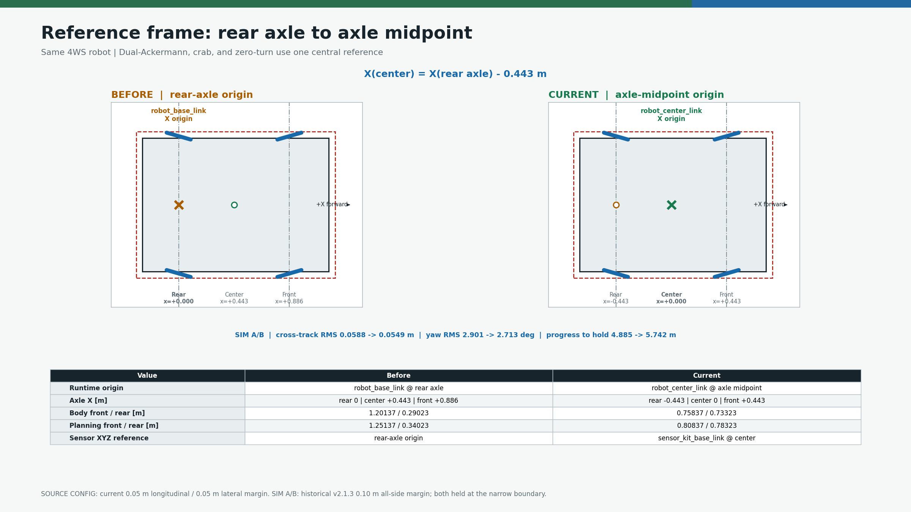
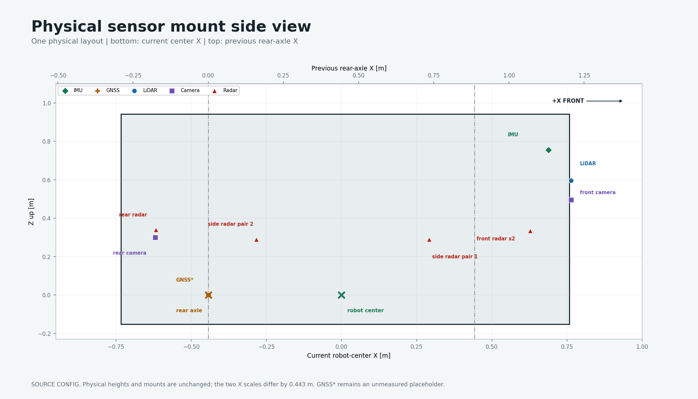
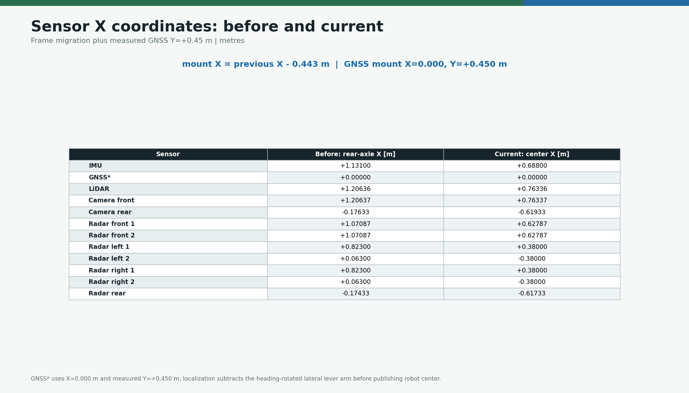

# 🔧 camrod_sensor_kit — URDF, static TF & RobotParams library

**camrod_sensor_kit** — Parameterized URDF generator, static TF publisher, and shared `RobotParams` C++ library for the CAMROD robot.

---

## 📋 Summary

`camrod_sensor_kit` has two responsibilities:

1. **Static TF tree** — expands `urdf/camrod_sensor_kit.xacro` with sensor pose parameters from `config/robot_params.yaml`, then launches `robot_state_publisher` to broadcast the complete sensor frame tree on `/tf_static` and `/robot_description`.
2. **Shared C++ library** — exports `camrod_sensor_kit_lib`, which provides the `RobotParams` struct and `loadRobotParams()` function used by all downstream C++ nodes that need robot geometry at runtime (footprint, wheelbase, sensor offsets).

> **Non-goals:** Does not publish dynamic transforms (all joints are fixed). Does not depend on runtime sensor data — the package completes its job at launch time. Does not perform any health monitoring or status reporting (status node removed in v1.10).

---

<!-- HH_260804 - Show the 4WS reference migration as a compact before/after
comparison; keep the exact sensor conversion in a separate table. -->
## Reference Frame Change







- Before: `robot_base_link` at the rear axle.
- Current: `robot_center_link` at the axle midpoint for Dual-Ackermann, crab,
  and zero-turn; legacy `robot_base_link` remains at `x=-0.443 m`.
- Unchanged: physical chassis, sensor mounts, wheelbase, and safety margin.
- Pending: the GNSS antenna lever arm is still not physically measured.

```bash
python3 camrod_bringup/scripts/render_module_readme_assets.py --module sensor-kit
```

---

## 🚀 Quick Start

```bash
# Build
cd ~/camrod_ws
colcon build --packages-select camrod_sensor_kit
source install/setup.bash

# Standalone: publish /tf_static + /robot_description only
ros2 launch camrod_sensor_kit sensor_kit.launch.py

# Override geometry config
ros2 launch camrod_sensor_kit sensor_kit.launch.py \
  params_file:=/absolute/path/to/robot_params.yaml

# Custom frame names
ros2 launch camrod_sensor_kit sensor_kit.launch.py \
  base_frame_id:=robot_center_link \
  rear_axle_frame_id:=robot_base_link \
  sensor_kit_base_frame_id:=sensor_kit_base_link

# Verify TF is live
ros2 topic echo /tf_static --once
ros2 run tf2_ros tf2_echo robot_center_link lidar_link
```

---

## Runtime Contract

| Source | Owner | Output |
|---|---|---|
| `config/robot_params.yaml` + xacro | `sensor_kit.launch.py` | `robot_description` |
| `robot_description` | `robot_state_publisher` | latched `/tf_static` |
| `robot_params.yaml` | `camrod_sensor_kit_lib` | `RobotParams` geometry snapshot |

```text
map -> odom -> robot_center_link
                 |-> robot_base_link       x = -0.443 m
                 `-> sensor_kit_base_link  x =  0.000 m
                       `-> fixed sensor frames
```

- `map -> odom` is owned by localization, not this package.
- All sensor joints are fixed; this package publishes no dynamic TF.
- Run one `robot_state_publisher` instance, either standalone or from bringup.

### RobotParams API

```cpp
find_package(camrod_sensor_kit REQUIRED)
#include "camrod_sensor_kit/robot_params.hpp"

camrod::RobotParams params = camrod::loadRobotParams(node);
```

Downstream nodes must receive the same `robot_params.yaml` at startup.

---

## 🚀 Launch Arguments

```bash
ros2 launch camrod_sensor_kit sensor_kit.launch.py [ARG:=VALUE ...]
```

| Argument | Default | Description |
|---|---|---|
| `params_file` | `config/robot_params.yaml` (from package share) | Robot geometry and sensor pose definitions |
| `module_namespace` | `sensor_kit` | ROS 2 node namespace |
| `base_frame_id` | `robot_center_link` | Canonical axle-midpoint robot frame |
| `rear_axle_frame_id` | `robot_base_link` | Legacy rear-axle compatibility child frame |
| `sensor_kit_base_frame_id` | `sensor_kit_base_link` | Sensor mount parent coincident with `robot_center_link` |
| `map_frame_id` | `map` | Fixed world frame |

---

## ⚙️ Config — `config/robot_params.yaml`

All sensor poses are relative to `sensor_kit_base_link`. YAML angles are in **degrees**; `loadRobotParams()` converts them to radians internally.

> HH_260623 - Full bringup uses `camrod_bringup/config/sensor_kit/robot_params.yaml` as the active override. Keep this package default and the bringup copy synchronized when mount offsets change.

### 🤖 Robot Body Parameters

| YAML key | Default (YAML) | C++ default | Unit | Notes |
|---|---|---|---|---|
| `robot.wheelbase` | `0.886` | `0.886` | m | Measured front-to-rear axle-center distance |
| `robot.center_offset_from_rear_axle` | `0.443` | `0.443` | m | `wheelbase / 2`; rear axle to `robot_center_link` |
| `robot.track_width` | `1.07` | `1.07000` | m | HH_260623 - body lateral envelope until separate wheel-center track is measured |
| `robot.length` | `1.49160` | `1.49160` | m | Measured body length; unchanged by the origin shift |
| `robot.width` | `1.07000` | `1.07000` | m | Measured body width; unchanged by the origin shift |
| `robot.height` | `1.09463` | `1.09463` | m | HH_260623 - measured full body height |
| `robot.body_extents.front` | `0.75837` | `0.75837` | m | Forward body extent from `robot_center_link`; old rear-axle value `1.20137` |
| `robot.body_extents.rear` | `0.73323` | `0.73323` | m | Rear body extent from `robot_center_link`; old rear-axle value `0.29023` |
| `robot.body_extents.left` | `0.53505` | `0.53505` | m | Left body extent from `robot_center_link` |
| `robot.body_extents.right` | `0.53495` | `0.53495` | m | Right body extent from `robot_center_link` |
| `robot.body_extents.top_z` | `0.94188` | `0.94188` | m | Top body Z from `robot_center_link` |
| `robot.body_extents.bottom_z` | `-0.15275` | `-0.15275` | m | Bottom body Z from `robot_center_link` |
| `robot.body_extents.planning_margin` | `0.10` | `0.10` | m | HH_260623 - safety margin added to Nav2/planning footprint |
| `robot.wheel_radius` | `0.15275` | `0.15275` | m | HH_260623 - Measured wheel radius, 152.75 mm |
| `robot.encoder_resolution` | `2048` | `2048` | ticks/rev | Encoder ticks per wheel revolution |
| `robot.drive_type` | `"ackermann"` | `"ackermann"` | — | Platform drive model |
| `ground_z_offset` | `0.0` | — | m | HH_260623 - 2D planning/RViz ground fallback; sensor mount Z values still carry physical heights |

> ⚠️ **Remaining geometry value to verify before deployment:**
>
> - `robot.track_width` currently mirrors the measured body width. Replace it with wheel-center track when the wheel-track measurement is available.

### 📡 Sensor Mount Poses (relative to `sensor_kit_base_link` at `robot_center_link`)

> HH_260803 - `sensor_kit_base_link` is fixed to `robot_center_link` with zero offset. Each X below is the previous rear-axle-relative X minus 0.443 m; Y/Z/RPY and every physical mount are unchanged. See [`../docs/V2_1_3_ROBOT_CENTER_MIGRATION.md`](../docs/V2_1_3_ROBOT_CENTER_MIGRATION.md) for the complete before/after table.

| Sensor | x (m) | y (m) | z (m) | roll (deg) | pitch (deg) | yaw (deg) |
|---|---|---|---|---|---|---|
| `imu` | 0.688 | 0.0 | 0.756 | 0.0 | 0.0 | 0.0 |
| `gnss` | -0.443 | 0.0 | 0.0 | 0.0 | 0.0 | 0.0 |
| `lidar` | 0.76336 | 0.0 | 0.59538 | 0.0 | 0.0 | 0.0 |
| `camera.front` | 0.76337 | 0.0 | 0.49568 | 0.0 | 0.0 | 0.0 |
| `camera.rear` | -0.61933 | 0.0 | 0.30013 | 0.0 | 0.0 | 180.0 |
| `radar.front1` | 0.62787 | -0.11005 | 0.33378 | 0.0 | 0.0 | 0.0 |
| `radar.front2` | 0.62787 | 0.11005 | 0.33378 | 0.0 | 0.0 | 0.0 |
| `radar.left1` | 0.29188 | 0.41005 | 0.29013 | 0.0 | 0.0 | 90.0 |
| `radar.left2` | -0.28334 | 0.41005 | 0.29013 | 0.0 | 0.0 | 90.0 |
| `radar.right1` | 0.29188 | -0.41005 | 0.29013 | 0.0 | 0.0 | -90.0 |
| `radar.right2` | -0.28334 | -0.41005 | 0.29013 | 0.0 | 0.0 | -90.0 |
| `radar.rear` | -0.61733 | 0.0 | 0.33978 | 0.0 | 0.0 | 180.0 |

> The GNSS `-0.443/0/0` value is only the converted old placeholder. Measure the actual antenna lever arm from `robot_center_link` before physical acceptance.

> HH_260623 - `radar.front1/front2` keep the sensing channel names. With the vehicle coordinate convention (+Y left), `front1` is currently placed at negative Y and `front2` at positive Y according to the measured wiring note.
> HH_260702 - The current field harness crosses the LEFT/RIGHT serial branches, so the sensing YAML maps LEFT1/LEFT2 to CH9344 USB4/USB5 and RIGHT1/RIGHT2 to USB2/USB3 while the TF frames stay physically left/right in this table.

### `urdf/camrod_sensor_kit.xacro`

Parameterized URDF: root `robot_center_link` body box, fixed rear-axle `robot_base_link` compatibility child, coincident `sensor_kit_base_link`, and one link+joint macro per sensor. All pose arguments (`{sensor}_xyz`, `{sensor}_rpy`) are injected by the launch file from the values above.

---

## 🔍 Validation

```bash
# Confirm /tf_static is published
ros2 topic echo /tf_static --once | grep frame_id

# Lookup each sensor frame from robot_center_link
for frame in imu_link gnss_link lidar_link camera_front_link camera_rear_link \
  radar_front1_link radar_front2_link radar_left1_link radar_left2_link \
  radar_right1_link radar_right2_link radar_rear_link; do
  ros2 run tf2_ros tf2_echo robot_center_link $frame
done

# Confirm the retained rear-axle compatibility frame
timeout 3 ros2 run tf2_ros tf2_echo robot_center_link robot_base_link -p 6

# Inspect URDF in RViz
ros2 run rviz2 rviz2

# Print loaded robot_params directly
ros2 param get /sensor_kit/robot_state_publisher robot_description | head -5
```

---

## 🩺 Troubleshooting

<details>
<summary><strong>TF lookup fails for sensor frame</strong></summary>

- Confirm `camrod_sensor_kit` is running: `ros2 node list | grep robot_state_publisher`
- Check that `params_file` points to the correct `robot_params.yaml`: `ros2 launch camrod_sensor_kit sensor_kit.launch.py --show-args`
- Ensure no TF tree cycles exist: `ros2 run tf2_tools view_frames`

</details>

<details>
<summary><strong>URDF wrong in RViz</strong></summary>

The URDF is generated at launch time from xacro. A stale `.yaml` file or wrong `params_file` argument will silently produce the wrong geometry. To force a rebuild: stop the node, edit `robot_params.yaml`, re-launch.

</details>

<details>
<summary><strong>`robot_params.yaml` change has no effect</strong></summary>

`robot_state_publisher` reads the URDF only at startup. Changes require a restart. Downstream C++ nodes calling `loadRobotParams()` also read parameters at construction time; they must be restarted to pick up YAML changes.

</details>

<details>
<summary><strong>Multiple `robot_state_publisher` conflicts</strong></summary>

If both `camrod_sensor_kit` standalone and a parent bringup launch start `robot_state_publisher`, they will conflict on `/robot_description` and `/tf_static`. Use `module_namespace` to isolate, or ensure only one instance runs per namespace.

</details>

---

## 🔗 Related Docs

- [`../README.md`](../README.md) — Top-level CAMROD workspace overview
- [`../camrod_platform/README.md`](../camrod_platform/README.md) — consumes `RobotParams` for footprint and drive model
- [`../camrod_sensing/README.md`](../camrod_sensing/README.md) — consumes `/tf_static` for all sensor frame lookups
- [`../camrod_control/README.md`](../camrod_control/README.md) - parking controllers consume `/tf_static` for geometry
- [`../PARAMETER_NAMING_STANDARD.md`](../PARAMETER_NAMING_STANDARD.md) — canonical parameter naming conventions
