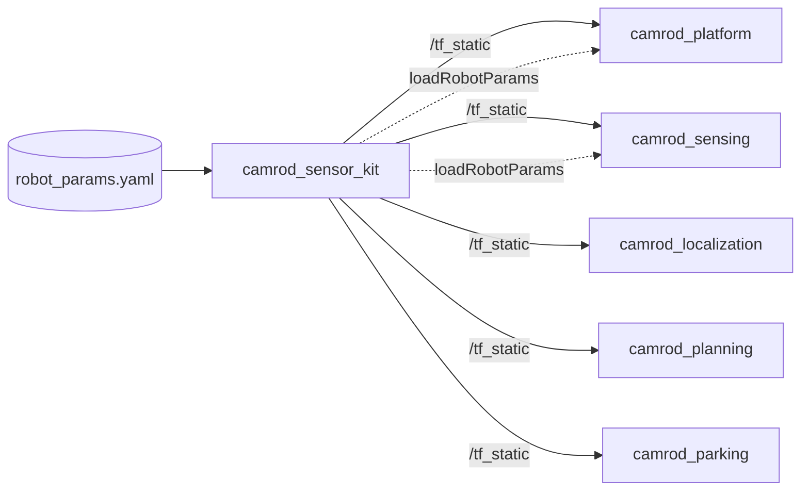
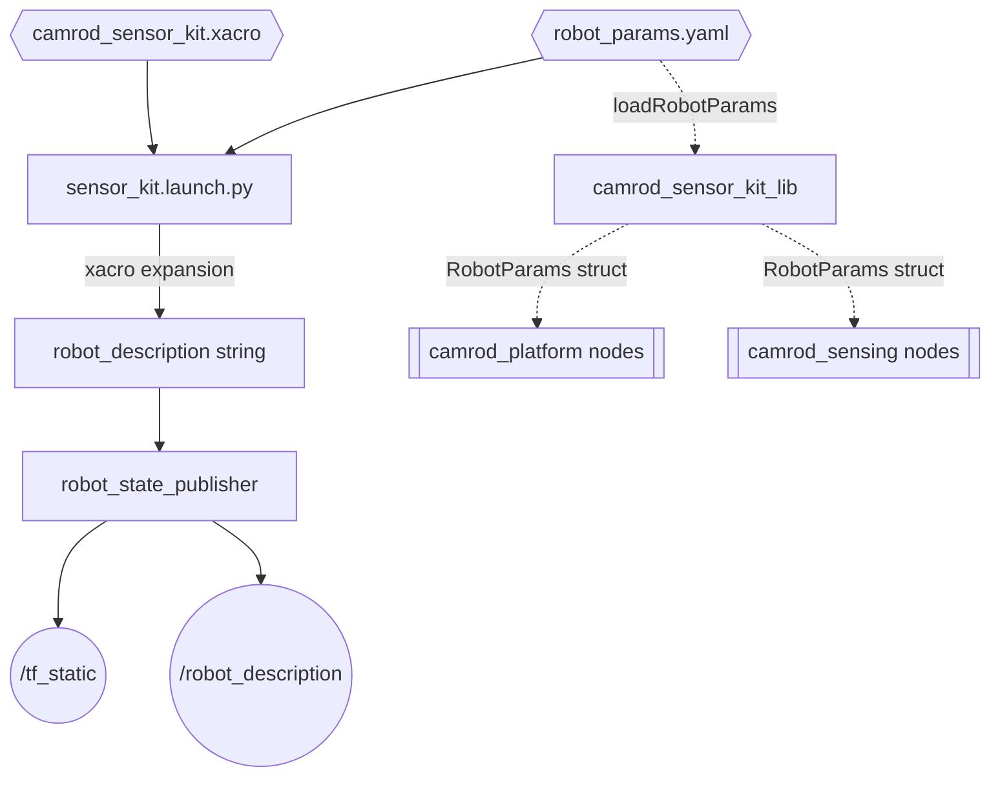

# camrod_sensor_kit

## 1. Title

**camrod_sensor_kit** — Parameterized URDF generator, static TF publisher, and shared `RobotParams` C++ library for the CAMROD robot.

---

## 2. Summary

`camrod_sensor_kit` has two responsibilities:

1. **Static TF tree** — expands `urdf/camrod_sensor_kit.xacro` with sensor pose parameters from `config/robot_params.yaml`, then launches `robot_state_publisher` to broadcast the complete sensor frame tree on `/tf_static` and `/robot_description`.
2. **Shared C++ library** — exports `camrod_sensor_kit_lib`, which provides the `RobotParams` struct and `loadRobotParams()` function used by all downstream C++ nodes that need robot geometry at runtime (footprint, wheelbase, sensor offsets).

**Non-goals:**
- Does not publish dynamic transforms; all joints are fixed.
- Does not depend on runtime sensor data. The package completes its job at launch time.
- Does not perform any health monitoring or status reporting (status node removed in v1.10).

---

## 3. Quick Start

```bash
# Build
cd ~/camrod_ws
colcon build --packages-select camrod_sensor_kit
source install/setup.bash

# Standalone: publish /tf_static + /robot_description only
ros2 launch camrod_sensor_kit sensor_kit.launch.py

# Override geometry config
ros2 launch camrod_sensor_kit sensor_kit.launch.py \
  params_file:=/absolute/path/to/robot_params.yaml

# Custom frame names
ros2 launch camrod_sensor_kit sensor_kit.launch.py \
  base_frame_id:=robot_base_link \
  sensor_kit_base_frame_id:=sensor_kit_base_link

# Verify TF is live
ros2 topic echo /tf_static --once
ros2 run tf2_ros tf2_echo robot_base_link lidar_link
```

---

## 4. System Position



Legend: `[node]`, `((topic))`, `{{file/hw}}`, `[[stack]]`, dashed = non-runtime (compile-time) dependency.

**Execution Modes:**

| Mode | How launched | What runs |
|---|---|---|
| Standalone | `ros2 launch camrod_sensor_kit sensor_kit.launch.py` | `robot_state_publisher` only under namespace `sensor_kit` |
| Inside platform launch | Included by `camrod_bringup` / `camrod_platform` launch files | Same `robot_state_publisher`; namespace may be overridden by the parent launch |

---

## 5. Runtime Architecture



The launch file reads `robot_params.yaml` at launch time, converts all degree-based pose fields to radians, then calls `xacro` to produce the robot description string. The URDF string is passed directly as a parameter to `robot_state_publisher`, which publishes all static joint transforms in a single `/tf_static` message.

---

## 6. Interface Contract

### Outputs

| Topic | Type | Consumer | Rate | Meaning |
|---|---|---|---|---|
| `/tf_static` | `tf2_msgs/TFMessage` | all packages doing sensor frame lookups | once at startup | Full static joint tree from `world` to each sensor link |
| `/robot_description` | `std_msgs/String` | RViz, URDF consumers | once at startup | URDF XML string expanded from xacro |

### Library Interface

```cpp
// In any downstream CMakeLists.txt:
find_package(camrod_sensor_kit REQUIRED)
ament_target_dependencies(your_node camrod_sensor_kit)

// In C++ source:
#include "camrod_sensor_kit/robot_params.hpp"
camrod::RobotParams params = camrod::loadRobotParams(node);
```

`loadRobotParams(node)` declares ROS parameters on `node` and returns a populated `RobotParams` snapshot. The node must be passed the robot_params.yaml config file at launch.

---

## 7. Key Behaviors

### Static TF Publication

| Attribute | Detail |
|---|---|
| Trigger | `robot_state_publisher` startup |
| Internal logic | xacro expansion produces URDF; RSP reads `robot_description` param and latches all fixed joint transforms |
| Output effect | `/tf_static` latched once; all packages that call `tf2::lookupTransform` for sensor frames can resolve immediately |
| Operator-visible symptom | TF lookup errors in any downstream package after a fresh start indicate this package did not start correctly |
| Related params | `params_file`, `base_frame_id`, `sensor_kit_base_frame_id` |
| Related topics | `/tf_static`, `/robot_description` |

### RobotParams Load

| Attribute | Detail |
|---|---|
| Trigger | Downstream C++ node calls `camrod::loadRobotParams(node)` at construction |
| Internal logic | Calls `node->declare_parameter()` for each field; YAML degree values are converted to radians internally |
| Output effect | Returns a `RobotParams` struct used for footprint polygon, wheelbase, and sensor offset calculations |
| Operator-visible symptom | If `robot_params.yaml` is not loaded (missing params_file), default C++ struct values are silently used |
| Related params | All fields under `robot.*`, `imu.*`, `gnss.*`, `lidar.*`, `camera.*` |
| Related topics | None |

---

## 8. Launch

```bash
ros2 launch camrod_sensor_kit sensor_kit.launch.py [ARG:=VALUE ...]
```

| Argument | Default | Description |
|---|---|---|
| `params_file` | `config/robot_params.yaml` (from package share) | Robot geometry and sensor pose definitions |
| `module_namespace` | `sensor_kit` | ROS 2 node namespace |
| `base_frame_id` | `robot_base_link` | Parent robot body frame name |
| `sensor_kit_base_frame_id` | `sensor_kit_base_link` | Sensor kit base frame under `robot_base_link` |
| `map_frame_id` | `map` | Fixed world frame |

---

## 9. Config

### `config/robot_params.yaml` — Robot Geometry and Sensor Poses

All sensor poses are relative to `sensor_kit_base_link`. YAML angles are in **degrees**; `loadRobotParams()` converts them to radians internally.

**Robot body parameters:**

| YAML key | Default (YAML) | C++ default | Unit | Notes |
|---|---|---|---|---|
| `robot.wheelbase` | 0.5 | 1.10 | m | **TODO:verify** — YAML value (0.5 m) is smaller than C++ default (1.10 m); confirm which reflects the physical platform |
| `robot.track_width` | 3.2 | 0.65 | m | **TODO:verify** — YAML value (3.2 m) appears too wide for the platform; likely a placeholder |
| `robot.length` | 0.8 | 1.40 | m | Robot body length |
| `robot.width` | 0.4 | 0.70 | m | Robot body width |
| `robot.height` | 0.8 | 1.20 | m | Robot body height |
| `robot.wheel_radius` | 0.08 | 0.15 | m | Effective rolling radius |
| `robot.encoder_resolution` | 2048 | 2048 | ticks/rev | Encoder ticks per wheel revolution |
| `robot.drive_type` | `"ackermann"` | `"ackermann"` | — | Platform drive model |
| `ground_z_offset` | 5.3 | — | m | **TODO:verify** — fallback Z offset when map-ground estimation is unavailable; 5.3 m is unusually large |

**Sensor mount poses (relative to `sensor_kit_base_link`):**

| Sensor | x (m) | y (m) | z (m) | roll (deg) | pitch (deg) | yaw (deg) |
|---|---|---|---|---|---|---|
| `imu` | 0.28 | 0.0 | 0.2 | 0.0 | 0.0 | 0.0 |
| `gnss` | 0.0 | 0.0 | 0.0 | 0.0 | 0.0 | 0.0 |
| `lidar` | 0.68 | 0.0 | 0.45 | 0.0 | 0.4 | 0.0 |
| `camera` | 0.68 | 0.0 | 0.2 | 0.0 | 0.0 | 0.0 |
| `radar.front` | 0.64 | 0.0 | 0.45 | 0.0 | 0.0 | 0.0 |
| `radar.left1` | -0.1 | 0.2 | 0.45 | 0.0 | 0.0 | 90.0 |
| `radar.left2` | 0.5 | 0.2 | 0.45 | 0.0 | 0.0 | 90.0 |
| `radar.right1` | -0.1 | -0.2 | 0.45 | 0.0 | 0.0 | -90.0 |
| `radar.right2` | 0.5 | -0.2 | 0.45 | 0.0 | 0.0 | -90.0 |
| `radar.rear` | -0.1 | 0.0 | 0.45 | 0.0 | 0.0 | 180.0 |

### `urdf/camrod_sensor_kit.xacro`

Parameterized URDF: `robot_base_link` body box, `sensor_kit_base_link` joint, and one link+joint macro per sensor. All pose arguments (`{sensor}_xyz`, `{sensor}_rpy`) are injected by the launch file from the values above.

---

## 10. Frame Hierarchy

```
world
└── map
    └── robot_base_link          (base platform body — all joints fixed)
        └── sensor_kit_base_link
            ├── imu_link
            ├── gnss_link
            ├── lidar_link
            ├── camera_link
            ├── radar_front_link
            ├── radar_left1_link
            ├── radar_left2_link
            ├── radar_right1_link
            ├── radar_right2_link
            └── radar_rear_link
```

- `world` and `map` are convention frames, not published by this package; they are connected by the localization pipeline.
- `robot_base_link` is the physical footprint origin for Nav2 and collision checking.
- `sensor_kit_base_link` is the reference origin for all sensor mount offsets.
- Radar sensors are attached directly to `sensor_kit_base_link`; there is no intermediate radar base frame.

---

## 11. Validation

```bash
# Confirm /tf_static is published
ros2 topic echo /tf_static --once | grep frame_id

# Lookup each sensor frame from robot_base_link
for frame in imu_link gnss_link lidar_link camera_link \
  radar_front_link radar_rear_link; do
  ros2 run tf2_ros tf2_echo robot_base_link $frame
done

# Inspect URDF in RViz
ros2 run rviz2 rviz2

# Print loaded robot_params directly
ros2 param get /sensor_kit/robot_state_publisher robot_description | head -5
```

---

## 12. Troubleshooting

**TF lookup fails for sensor frame**
- Confirm `camrod_sensor_kit` is running: `ros2 node list | grep robot_state_publisher`
- Check that `params_file` points to the correct `robot_params.yaml`: `ros2 launch camrod_sensor_kit sensor_kit.launch.py --show-args`
- Ensure no TF tree cycles exist: `ros2 run tf2_tools view_frames`

**URDF wrong in RViz**
- The URDF is generated at launch time from xacro. A stale `.yaml` file or wrong `params_file` argument will silently produce the wrong geometry.
- To force a rebuild: stop the node, edit `robot_params.yaml`, re-launch.

**`robot_params.yaml` change has no effect**
- `robot_state_publisher` reads the URDF only at startup. Changes require a restart.
- Downstream C++ nodes calling `loadRobotParams()` also read parameters at construction time; they must be restarted to pick up YAML changes.

**Multiple `robot_state_publisher` conflicts**
- If both `camrod_sensor_kit` standalone and a parent bringup launch start `robot_state_publisher`, they will conflict on `/robot_description` and `/tf_static`.
- Use `module_namespace` to isolate, or ensure only one instance runs per namespace.

---

## Related Docs

- [`../README.md`](../README.md) — Top-level CAMROD workspace overview
- [`../camrod_platform/README.md`](../camrod_platform/README.md) — consumes `RobotParams` for footprint and drive model
- [`../camrod_sensing/README.md`](../camrod_sensing/README.md) — consumes `/tf_static` for all sensor frame lookups
- [`../camrod_parking/README.md`](../camrod_parking/README.md) — consumes `/tf_static` for parking geometry
- [`../PARAMETER_NAMING_STANDARD.md`](../PARAMETER_NAMING_STANDARD.md) — canonical parameter naming conventions
