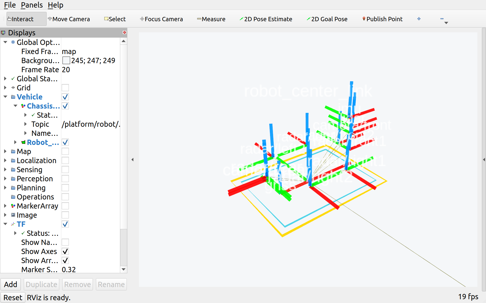
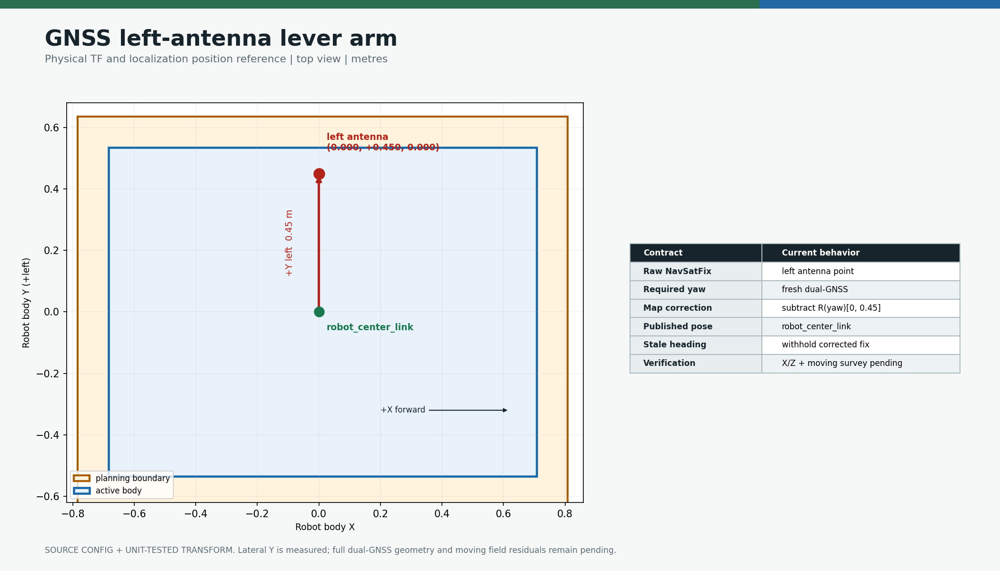
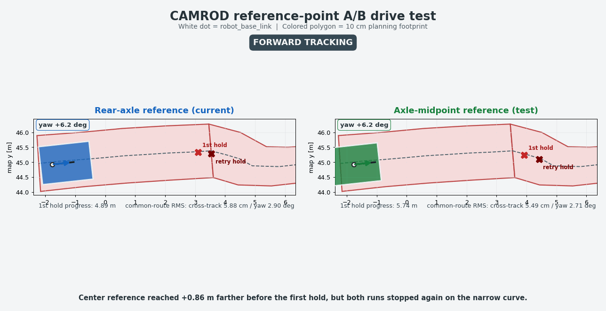

# camrod_sensor_kit

<!-- HH_260806 - Record the left-GNSS lever arm and activate the
fabrication-inclusive body envelope with a four-sided 10 cm planning margin. -->

Canonical robot geometry, URDF/xacro, static sensor TF, and the RobotParams
library shared by localization, planning, control, platform, and diagnostics.


## Actual Simulation Runtime



`2026-08-04 SIM RUNTIME CAPTURE`: the then-running 3D sensor TF graph. It is
historical runtime evidence; it predates the measured `gnss_link Y=+0.45 m`.
The source-derived tables and diagrams below use the current configuration.

## At A Glance

| Uses | Function | Main outputs |
|---|---|---|
| `robot_params.yaml` | Single source for body, wheelbase, margin, and sensor mounts | RobotParams API and xacro properties |
| URDF/xacro + `robot_state_publisher` | Publishes body, axle, wheel, and sensor frame tree | `/robot_description`, `/tf_static` |
| Axle-midpoint reference | Keeps Dual-Ackermann, crab, zero-turn, EKF, and footprint geometry consistent | `robot_center_link` |

## Reference Frame Migration

| Item | Before | Current |
|---|---|---|
| Runtime origin | rear axle `robot_base_link` | axle midpoint `robot_center_link` |
| Coordinate conversion | rear-axle X | non-GNSS mounts use `current X = previous X - 0.443 m` |
| GNSS position reference | converted placeholder `X=-0.443 m` | left antenna `(X=0,Y=+0.45) m`; localization corrects to center |
| Compatibility | primary frame | fixed child retained at rear axle |
| Physical mounts | rear-axle coordinates | non-GNSS X conversion retained; measured GNSS lateral offset added |

`robot_base_link` remains available for compatibility. It is no longer the
navigation/control reference.

## Robot Geometry

<!-- HH_260809 - Define the tapered-front rounded boundary at the sensor-kit
geometry source so every runtime consumer uses the same contour. -->

| Value | Current |
|---|---:|
| Wheelbase | `0.886 m` |
| Rear axle to center | `0.443 m` |
| Physical body boundary | `1.39160 x 1.07000 x 1.09463 m` |
| Body extents from center | front `0.70837`, rear `0.68323`, left `0.53505`, right `0.53495 m` |
| Front contour | side inset `0.12 m`, shoulder depth `0.12 m` |
| Physical corner radius | `0.05 m`, 4 arc segments per corner |
| Planning margin | front/rear/left/right `0.10 m` |
| Planning contour | `1.59160 x 1.27000 m` bounding extents, `R0.15 m` |
| Wheel radius | `0.15275 m` |

The base chassis and active collision envelopes remain separately identified:

| Envelope | Length | Width | Runtime role |
|---|---:|---:|---:|
| Base platform | `1.19160 m` | `0.87000 m` | Chassis-only reference |
| Active fabrication-inclusive body | `1.39160 m` | `1.07000 m` | Ordinary-motion stop and swept-body recovery envelope |
| Active planning contour | `1.59160 m` | `1.27000 m` | Exact `0.10 m` parallel offset of the tapered, rounded body |


<!-- HH_260810 - The source-derived animation documents the shared local
geometry transform; it is not runtime collision or vehicle-motion evidence. -->
The [regenerable visual record](../docs/assets/test_result/tapered-rounded-boundary-20260810/README.md)
contains all 30 physical/planning points and source hashes. Forward, curved,
crab, and zero-turn frames keep both contours rigidly attached to
`robot_center_link`.


<!-- HH_260810 - Confirm that the runtime overlay consumes this exact geometry
while retaining a separate field-measurement requirement. -->
The [measured ROS road replay](../docs/assets/test_result/tapered-rounded-boundary-road-sim-20260810/README.md)
validates the current map, source hashes, frame, taper, radii, margins, and all
30 points before rendering. It does not validate the fabricated body dimensions
or physical clearances.

Height remains `1.09463 m`. Viewed from above, the front face is shorter than the
rear face: each side tapers inward by `0.12 m` across a `0.12 m` shoulder, and all
six transitions are rounded. The configured front/rear and left/right extrema
remain unchanged, preserving the existing `robot_center_link` asymmetry and
measured totals. A controlled four-side check must still verify wheels, sensor
housings, brackets, cables, and payload before `FIELD-PASS`; notably the
configured front LiDAR/camera origins remain slightly ahead of the body-front
value.

The previous envelopes and the exact old/new conversion
are retained in the [2026-08-06 boundary adjustment record](../docs/assets/test_result/robot-boundary-adjustment-20260806/README.md).
That record's reduced `1.29160 x 0.87000 m` candidate is historical and is no
longer deployed.

The two contours have different runtime meanings. A cost-100 cell inside the
physical body stops ordinary motion. A virtual-boundary escape is admitted only
if it monotonically reduces current overlap and its swept physical body plus
endpoint planning contour are clear. Contact only in the outer `0.10 m`
margin uses the same projected speed/distance/time bounds. The [fresh simulation summary](../docs/assets/test_result/robot-boundary-adjustment-20260806/02-runtime-boundary-policy.png)
shows the earlier no-body-recovery behavior; current geometry/policy remains
field-pending.

## Physical Side View


## Sensor Mounts

All XYZ values are metres from `sensor_kit_base_link`, coincident with
`robot_center_link`. Roll/pitch are zero for the entries below.

| Sensor | X | Y | Z | Yaw |
|---|---:|---:|---:|---:|
| IMU | `+0.68800` | `0.00000` | `0.75600` | `0 deg` |
| GNSS left antenna* | `0.00000` | `+0.45000` | `0.00000` | `0 deg` |
| LiDAR | `+0.76336` | `0.00000` | `0.59538` | `0 deg` |
| Front camera | `+0.76337` | `0.00000` | `0.49568` | `0 deg` |
| Rear camera | `-0.61933` | `0.00000` | `0.30013` | `180 deg` |
| Radar front 1 / 2 | `+0.62787` | `-0.11005 / +0.11005` | `0.33378` | `0 deg` |
| Radar left 1 / 2 | `+0.29188 / -0.28334` | `+0.41005` | `0.29013` | `90 deg` |
| Radar right 1 / 2 | `+0.29188 / -0.28334` | `-0.41005` | `0.29013` | `-90 deg` |
| Radar rear | `-0.61733` | `0.00000` | `0.33978` | `180 deg` |


The NavSatFix solution is referenced to the left antenna. Localization computes
`p_center = p_fix - R(yaw) * [0.0, 0.45]`, so a turn rotates the correction in
the map frame instead of always subtracting map Y. A fresh valid dual-GNSS
heading is required before publishing the corrected position. Lateral offset is
measured; `pose_verified=false` remains because antenna X/Z, moving-base mount,
baseline direction, and moving residuals are not yet field accepted.



The focused ROS A/B applied exactly `0.450000 m`; center residual changed from
`0.449995 m` without correction to `0.000071 m` with correction. See the
[structured simulation record](../docs/assets/test_result/gnss-lever-arm-20260806/README.md).

## Measured A/B Simulation



| Common route metric | Rear-axle origin | Center origin | Delta |
|---|---:|---:|---:|
| Cross-track RMS | `0.0588 m` | `0.0549 m` | `-0.0039 m` |
| Cross-track p95 | `0.1215 m` | `0.1212 m` | `-0.0003 m` |
| Yaw-error RMS | `2.901 deg` | `2.713 deg` | `-0.188 deg` |
| Yaw-error p95 | `5.209 deg` | `5.153 deg` | `-0.056 deg` |
| Yaw-step sign reversals | `0` | `0` | `0` |

The center frame improved the compared segment and advanced `0.8566 m` farther
before the first boundary hold in the full runs. Both runs still encountered a
narrow mapped boundary, so this is not an all-route or physical-drive PASS.

## Frame Tree

```text
robot_center_link
  |-- robot_base_link              (rear-axle compatibility child, x=-0.443)
  |-- sensor_kit_base_link         (coincident)
  |   |-- imu_link / gnss_link / lidar_link
  |   |-- camera_front / camera_rear
  |   `-- radar_*_link
  |-- front_axle_link              (x=+0.443)
  `-- rear_axle_link               (x=-0.443)
```

## Run And Validate

```bash
ros2 launch camrod_sensor_kit sensor_kit.launch.py

ros2 run tf2_ros tf2_echo robot_center_link lidar_link
ros2 run tf2_ros tf2_echo robot_center_link gnss_link
ros2 run tf2_ros tf2_echo robot_center_link camera_rear
ros2 run tf2_ros tf2_echo robot_center_link robot_base_link
```

| Source | Purpose |
|---|---|
| `config/robot_params.yaml` | Canonical geometry and mounts |
| `urdf/camrod_sensor_kit.xacro` | Frame/joint/visual/collision model |
| RobotParams library | Typed access for C++ consumers |

Exact migration details are in the
[`robot_center_link` ledger](../docs/V2_1_3_ROBOT_CENTER_MIGRATION.md).
