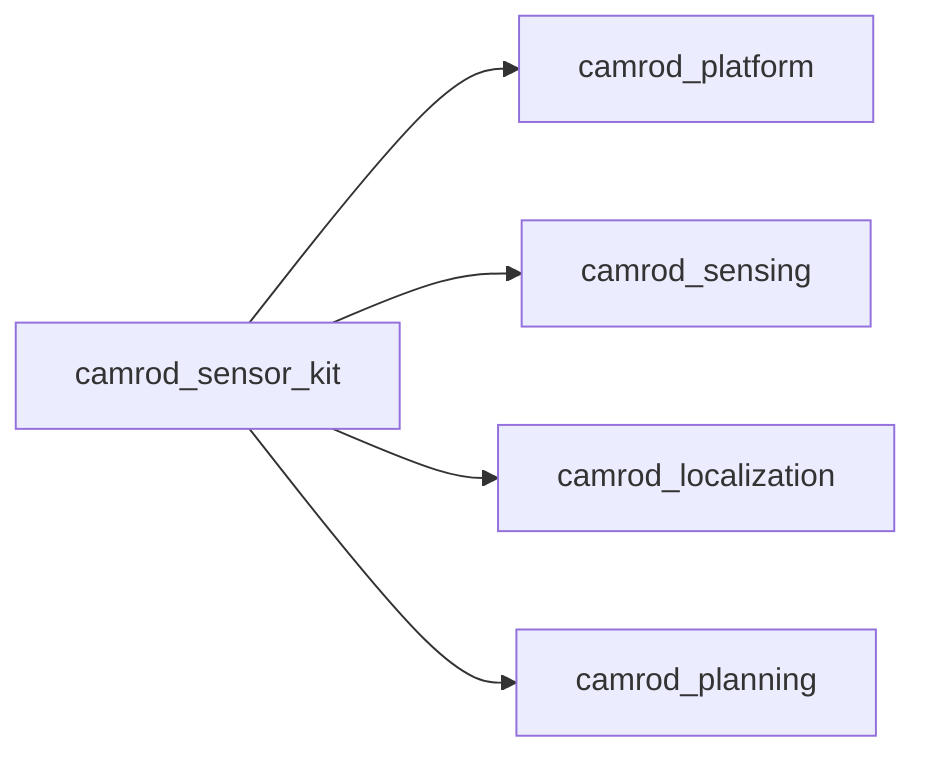

# camrod_sensor_kit

## Role
`camrod_sensor_kit` generates robot URDF from parameterized xacro and publishes core TF tree using `robot_state_publisher`.

## Package Diagram
```mermaid
graph TD
  A[robot_params.yaml] --> B[sensor_kit.launch.py]
  B --> C[xacro expansion]
  C --> D[robot_state_publisher]
  D --> E[/tf]
  D --> F[/tf_static]
```

## Node Data Flow
| Node | Main Inputs | Main Outputs |
|---|---|---|
| `robot_state_publisher` | generated `robot_description` from xacro + params | `/tf`, `/tf_static` |

## Inter-Package Connections


## Topic Summary
| Direction | Topic | Purpose |
|---|---|---|
| Out | `/tf` | dynamic frame tree publication |
| Out | `/tf_static` | static frame tree publication |

## Practical Usage
```bash
ros2 launch camrod_sensor_kit sensor_kit.launch.py
```

Example override:
```bash
ros2 launch camrod_sensor_kit sensor_kit.launch.py \
  params_file:=/absolute/path/robot_params.yaml \
  base_frame_id:=robot_base_link \
  sensor_kit_base_frame_id:=sensor_kit_base_link
```

## Config Files
- `config/robot_params.yaml`
- `urdf/camrod_sensor_kit.xacro`
