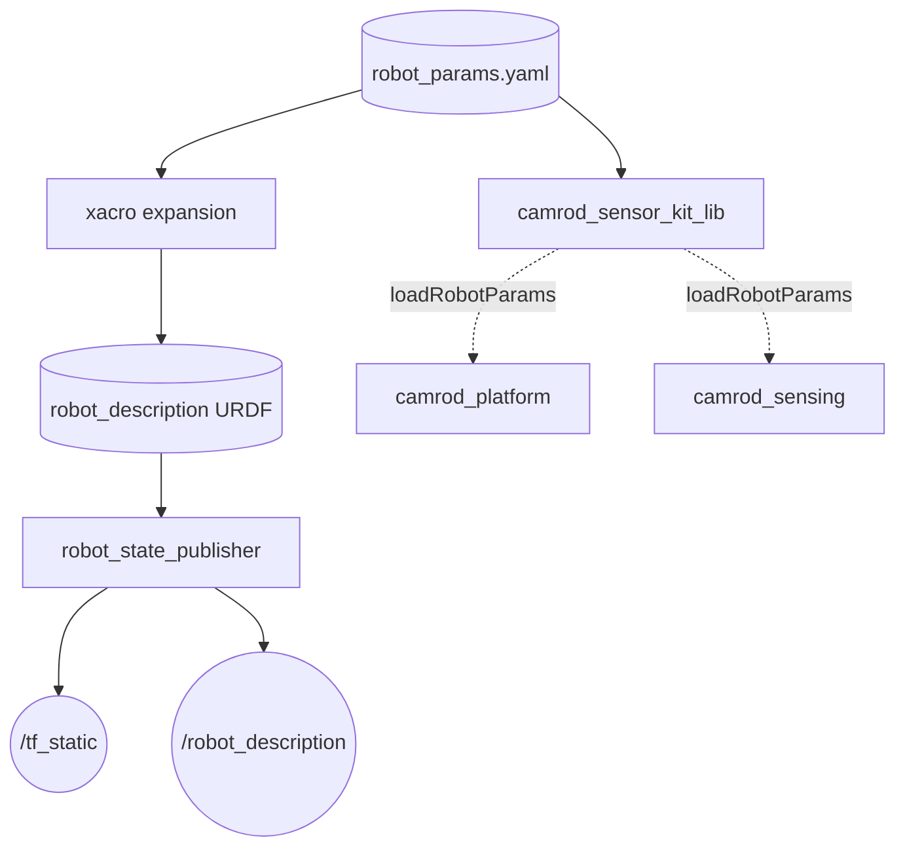
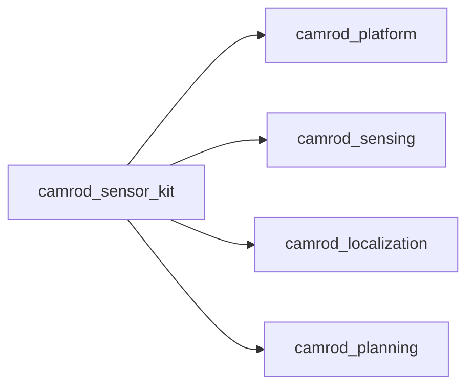

# camrod_sensor_kit

## Role
Robot URDF generation and static TF publication. Expands `urdf/camrod_sensor_kit.xacro` with sensor pose parameters from `config/robot_params.yaml` and starts `robot_state_publisher` to broadcast the full sensor frame tree. Also exports a reusable C++ library (`camrod_sensor_kit_lib`) providing `RobotParams` struct for packages that need robot geometry at runtime (footprint, wheelbase, sensor offsets).

## Package Diagram


Diagram legend: `[node]`, `((topic))`, `[(config file)]`.

## URDF Frame Tree

```
world
└── map
    └── robot_base_link          ← base platform body
        └── sensor_kit_base_link
            ├── imu_link
            ├── gnss_link
            ├── lidar_link
            ├── camera_link
            └── radar_base_link
                ├── radar_front_link
                ├── radar_left1_link
                ├── radar_left2_link
                ├── radar_right1_link
                ├── radar_right2_link
                └── radar_rear_link
```

All joints are fixed. Poses are fully parameterized from `robot_params.yaml`.

## Node Data Flow

| Node | Inputs | Outputs | Key Params |
|---|---|---|---|
| `robot_state_publisher` | `robot_description` (generated by xacro at launch) | `/tf_static`, `/robot_description` | — |

## Shared Library: `camrod_sensor_kit_lib`

Provides `loadRobotParams(node)` → `RobotParams` struct used by downstream C++ nodes:

| Field | Default | Description |
|---|---|---|
| `wheelbase_m` | 0.5 | Distance between front/rear axles |
| `track_width_m` | 3.2 | Lateral distance between wheels |
| `length_m` | 0.8 | Overall robot body length |
| `width_m` | 0.4 | Overall robot body width |
| `height_m` | 0.8 | Overall robot body height |
| `ground_z_offset_m` | 5.3 | Height of robot_base_link above ground |
| Per-sensor | x, y, z, roll, pitch, yaw | Mount offsets relative to sensor_kit_base_link |

## Inter-Package Connections


## Topic Summary

### Outputs (consumed by other packages)
| Topic | Type | Consumers |
|---|---|---|
| `/tf_static` | TransformStamped | all packages (sensor frame lookups) |
| `/robot_description` | String | RViz, any URDF consumer |

## Launch

```bash
# Standalone sensor kit (TF + URDF only)
ros2 launch camrod_sensor_kit sensor_kit.launch.py

# Override geometry config
ros2 launch camrod_sensor_kit sensor_kit.launch.py \
  params_file:=/absolute/path/robot_params.yaml

# Custom frame names
ros2 launch camrod_sensor_kit sensor_kit.launch.py \
  base_frame_id:=robot_base_link \
  sensor_kit_base_frame_id:=sensor_kit_base_link
```

Key launch arguments:

| Argument | Default | Description |
|---|---|---|
| `params_file` | `config/robot_params.yaml` | Robot geometry and sensor pose definitions |
| `base_frame_id` | `robot_base_link` | Base link frame name |
| `sensor_kit_base_frame_id` | `sensor_kit_base_link` | Sensor kit base frame name |
| `map_frame_id` | `map` | Fixed world frame |
| `module_namespace` | `sensor_kit` | ROS2 node namespace |

## Config Files

| File | Purpose |
|---|---|
| `config/robot_params.yaml` | Robot dimensions (wheelbase, track width, length, width, height) and all sensor mount poses (x, y, z, roll, pitch, yaw) relative to sensor_kit_base_link |
| `urdf/camrod_sensor_kit.xacro` | Parameterized URDF: robot_base_link body, sensor_kit joints, per-sensor link macros |
