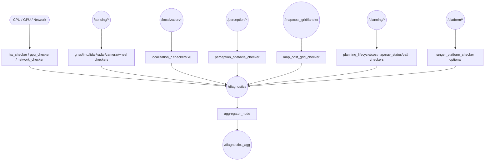
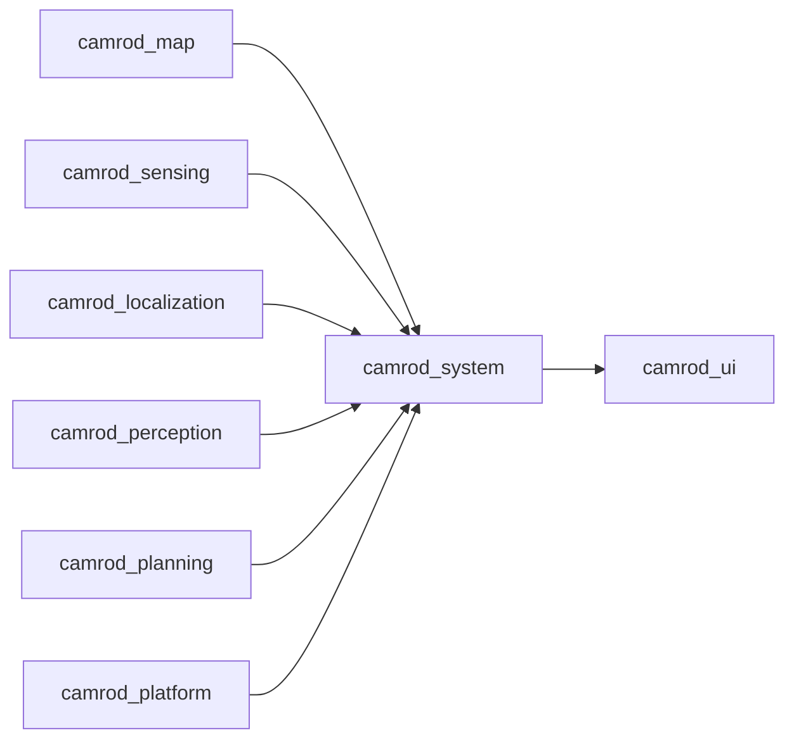

# camrod_system

## Role
Health monitoring and diagnostics aggregation for the full CAMROD stack. Each checker node subscribes to runtime topics from one module (hardware, sensing, localization, perception, map, planning, platform) and publishes `diagnostic_msgs/DiagnosticArray` entries to `/diagnostics`. `aggregator_node` collects all entries, detects stale reporters, groups them by subsystem, and publishes the consolidated result to `/diagnostics_agg`.

## Package Diagram


Diagram legend: `[node]`, `((topic))`, `{{hardware}}`.

## Node Data Flow

### Hardware Checkers

| Node | Inputs | Diagnostic Key | Key Params |
|---|---|---|---|
| `hw_checker_node` | OS proc/sys | `/hardware/{cpu,memory,disk,cpu_temp}` | cpu.warn: 70 %, cpu.error: 90 %, disk.warn: 80 %, temp.warn: 75 °C |
| `gpu_checker_node` | NVML | `/hardware/gpu0` | util.warn: 85 %, mem.warn: 80 %, temp.warn: 75 °C |
| `network_checker_node` | Network interfaces | `/hardware/network` | — |

### Sensing Checkers

| Node | Subscribed Topic | Diagnostic Key | Key Params |
|---|---|---|---|
| `gnss_checker_node` | `/sensing/gnss/ublox_gps_node/fix` | `/sensor/gnss/main` | expected_hz: 5.0, stale_timeout_s: 2.0 |
| `imu_checker_node` | `/sensing/imu/data` | `/sensor/imu` | expected_hz: 100.0, stale_timeout_s: 0.5 |
| `lidar_checker_node` | `/sensing/lidar/*/points` | `/sensor/lidar/{name}` | expected_hz: 10.0, min/max_point_count |
| `radar_checker_node` | `/sensing/radar/*/range` | `/sensor/radar/{name}` | stale_timeout_s: 1.0 |
| `camera_checker_node` | `/sensing/camera/*/image_raw` | `/sensor/camera/{name}` | expected_fps: 30.0, expected_width/height |
| `wheel_odometry_checker_node` | `/platform/status/wheel_odometry` | `/sensor/wheel_odometry` | stale_timeout_s: 1.0 |
| `cost_grid_checker_node` | `/planning/cost_grid/inflation` | `/sensor/cost_grid` | stale_timeout_s: 2.0 |
| `velocity_converter_checker_node` | `/sensing/platform_velocity_converter/twist_with_covariance` | `/sensor/velocity_converter` | stale_timeout_s: 1.0 |

### Localization Checkers

| Node | Subscribed Topic(s) | Diagnostic Key | Key Params |
|---|---|---|---|
| `localization_gnss_checker_node` | `/sensing/gnss/pose_with_covariance` | `/localization/gnss` | expected_hz: 5.0, cov_warn_threshold |
| `localization_mode_checker_node` | `/localization/mode`, `/localization/state` | `/localization/mode` | conf_warn: 0.6, innov_warn: 3.0 |
| `localization_pose_checker_node` | `/localization/pose_with_covariance` | `/localization/pose` | expected_hz: 30.0, cov_warn: 1.0 m², max_jump_m: 2.0 |
| `localization_init_checker_node` | `/localization/initial_match_ok` | `/localization/init` | stale_timeout_s: 5.0 |
| `localization_source_checker_node` | `/localization/pose_source` | `/localization/source` | — |
| `localization_lanelet_checker_node` | `/localization/lanelet_pose` | `/localization/lanelet` | stale_timeout_s: 2.0 |

### Map / Perception / Planning Checkers

| Node | Subscribed Topic(s) | Diagnostic Key | Key Params |
|---|---|---|---|
| `map_cost_grid_checker_node` | `/map/cost_grid/lanelet` | `/map/cost_grid` | stale_timeout_s: 5.0 |
| `perception_obstacle_checker_node` | `/perception/obstacles`, `/perception/camera/detections_2d` | `/perception/obstacles/{name}` | expected_hz: 10.0, min/max_count |
| `planning_lifecycle_checker_node` | Nav2 node `get_state` services | `/planning/lifecycle/{node}` | poll_rate_hz: 2.0, checked nodes: planner/controller/bt_navigator/behavior_server |
| `planning_costmap_checker_node` | Global/local costmap topics | `/planning/costmap/{name}` | stale_timeout_s: 3.0 |
| `planning_nav_status_checker_node` | Nav2 action status | `/planning/nav_status` | abort_rate_warn |
| `planning_path_checker_node` | `/planning/global_path`, `/planning/local_path` | `/planning/path/{name}` | stale_timeout: 3.0, min_points_warn: 5 |

### Aggregator

| Node | Inputs | Outputs | Key Params |
|---|---|---|---|
| `aggregator_node` | `/diagnostics` | `/diagnostics_agg` | config_file: diagnostics_config.yaml, timeout_s: 5.0, publish_rate_hz: 1.0 |

### System Tools (`system_tools.launch.py`)

A lightweight second diagnostics track launched by `system.launch.py` (`enable_system_tools: true`).
Checks that required ROS2 nodes and topics are live and produces a consolidated system-level health summary separate from the per-sensor module checkers.

| Node | Inputs | Outputs | Key Params |
|---|---|---|---|
| `system_checker_node` | ROS2 graph (`get_topic_names_and_types`, node list) | `/system/diagnostics` | required_nodes, required_topics, check_period_s: 1.0, startup_grace_s: 6.0 |
| `system_diagnostic_node` | `/system/diagnostics` | `/system/diagnostics_agg_tools` | publish_period_s: 0.5, stale_timeout_s: 2.0, known_modules list |
| `diagnostics_aggregator_node` | `/system/diagnostics` | `/system/diagnostics_agg_tools` | source_topic, output_topic (tools-only channel) |

## Inter-Package Connections


## Topic Summary

### Inputs (from other packages)
All module runtime topics — see node tables above for individual topic names.

### Outputs (consumed by other packages)
| Topic | Type | Consumers |
|---|---|---|
| `/diagnostics` | DiagnosticArray | aggregator_node |
| `/diagnostics_agg` | DiagnosticArray | camrod_ui (HTTP API), RViz |

When launched under bringup namespace `/system`, topics are remapped to `/system/diagnostics` and `/system/diagnostics_agg`.

## Launch

```bash
# Full system stack (all checkers + aggregator)
ros2 launch camrod_system system.launch.py

# Default diagnostics profile
ros2 launch camrod_system system.launch.py \
  config_profile:=default

# Disable Ranger platform checker
ros2 launch camrod_system system.launch.py \
  enable_platform:=false
```

Key launch arguments:

| Argument | Default | Description |
|---|---|---|
| `module_namespace` | `system` | ROS2 node namespace |
| `config_profile` | `default` | Diagnostics config profile directory |
| `enable_checkers` | `true` | Enable all module checker nodes |
| `enable_platform` | `false` | Enable Ranger-specific platform checker |
| `enable_system_tools` | `true` | Enable system_checker + system_diagnostic nodes |

## Config Files

All under `config/diagnostics/default/`:

| File | Purpose |
|---|---|
| `aggregator/diagnostics_config.yaml` | Master topic list: name, group, timeout_s for every checker diagnostic |
| `aggregator/robot_diagnostics_aggregator.yaml` | Aggregator node parameters (publish rate, global timeout) |
| `hw/hw_gpu_checker.yaml` | CPU/memory/disk/GPU thresholds and container host paths |
| `hw/network_checker.yaml` | Network interface check config |
| `sensing/gnss_checker.yaml` | GNSS expected Hz, stale timeout |
| `sensing/imu_checker.yaml` | IMU expected Hz, stale timeout |
| `sensing/lidar_checker.yaml` | LiDAR expected Hz, point count bounds |
| `sensing/radar_checker.yaml` | Radar stale timeout |
| `sensing/camera_checker.yaml` | Camera expected FPS, resolution, encoding |
| `sensing/wheel_odometry_checker.yaml` | Wheel odometry stale timeout |
| `sensing/cost_grid_checker.yaml` | Cost grid stale timeout |
| `sensing/velocity_converter_checker.yaml` | Velocity converter stale timeout |
| `localization/localization_gnss_checker.yaml` | GNSS→localization covariance thresholds |
| `localization/localization_mode_checker.yaml` | Mode/confidence/innovation thresholds |
| `localization/localization_pose_checker.yaml` | Pose Hz, covariance, jump thresholds |
| `localization/localization_init_checker.yaml` | Drop zone match stale timeout |
| `localization/localization_source_checker.yaml` | Pose source switching detection |
| `localization/localization_lanelet_checker.yaml` | Lanelet pose stale timeout |
| `map/map_cost_grid_checker.yaml` | Lanelet cost grid stale timeout |
| `perception/perception_obstacle_checker.yaml` | Obstacle point count and rate thresholds |
| `planning/planning_lifecycle_checker.yaml` | Nav2 nodes to monitor, poll rate |
| `planning/planning_costmap_checker.yaml` | Costmap stale timeout |
| `planning/planning_nav_status_checker.yaml` | Nav2 abort rate threshold |
| `planning/planning_path_checker.yaml` | Path min points, stale timeout |
| `platform/ranger_platform_checker.yaml` | Ranger-specific platform diagnostics |
