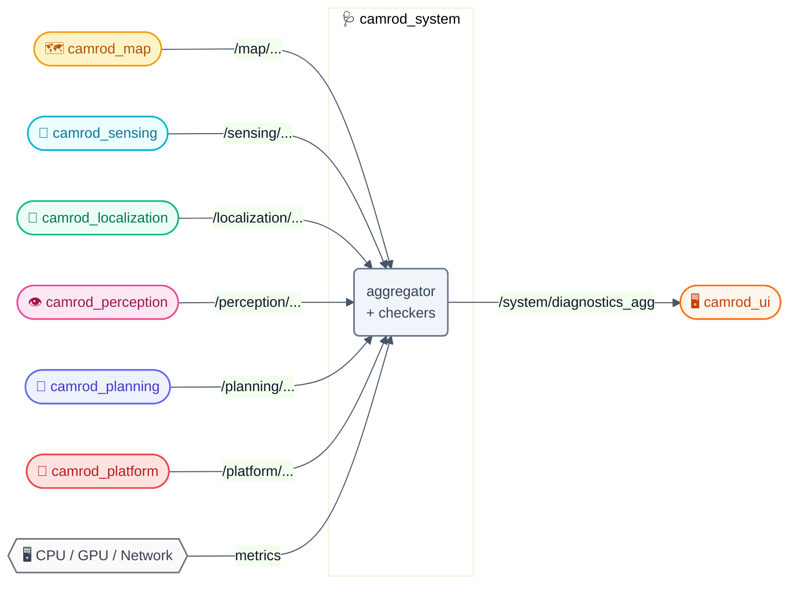
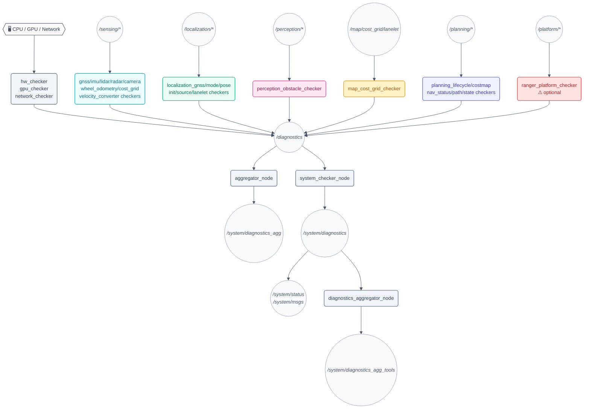
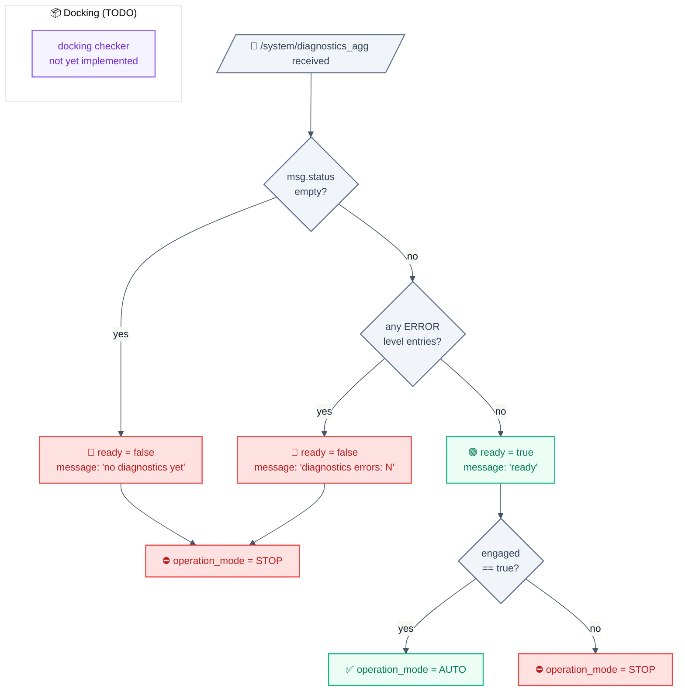
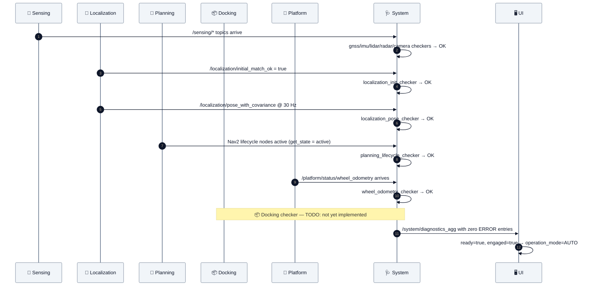

# 🩺 camrod_system — Diagnostic checkers & aggregator

**camrod_system** — Per-module diagnostic checkers and diagnostics aggregator for the full CAMROD stack.

---

## 📋 Summary

`camrod_system` provides the health monitoring layer for all CAMROD runtime packages. It runs more than 20 independent checker nodes, each subscribing to one module's runtime topics and publishing `diagnostic_msgs/DiagnosticStatus` entries to `/diagnostics`. A central `aggregator_node` collects all entries, detects stale reporters, groups them into a tree by subsystem, and publishes the consolidated result to `/system/diagnostics_agg`.

A separate lightweight system tools track (`enable_system_tools: true`) checks that required ROS 2 nodes/topics are alive from `config/system_checker.yaml` or `config/system_checker_sim.yaml`, verifies topic types/publisher counts, and publishes both diagnostics and semantic CAMROD status snapshots on `/system/status` and `/system/msgs`.

HH_260630 - The checker contract is now split into two complementary layers:
`system_checker.yaml` validates that the expected package graph is wired
together, while per-domain diagnostics validate message rate, staleness, and
data quality for the concrete topic produced by that node.
HH_260630 - `bringup.launch.py sim:=true` automatically selects
`system_checker_sim.yaml`, so fake-sensor simulation does not require hardware
driver nodes such as `ublox_gps_node`, `microstrain_inertial_driver`,
`vanjee_driver`, camera publishers, or `ranger_base_node`.
HH_260702 - Diagnostics are now operator-facing evidence, not automatic motion
policy. Planning soft-estop is owned by the planning state machine; map,
perception, LiDAR, radar, and hardware load entries are surfaced through
`/system/status` and `/system/msgs` so UI/field operators can see what is
degraded without every transient diagnostic forcing a route abort.
HH_260703 - Motion-critical stopping moved closer to the actuator path: the
planning cmd_vel gate now owns stale inflation-grid fail-closed behavior and
dynamic LiDAR/Radar stop latching. Camera FPS, raw Vanjee NaN placeholders,
costmap freshness dips, and other selected non-motion diagnostics remain visible
in `/system/status`, but planning state-machine auto-estop ignores those checker
names/prefixes by default.
HH_260707 - `system_diagnostic_node` now reads filtered `/system/diagnostics_agg`
instead of the raw `/diagnostics` stream. This preserves aggregator ignore rules
before publishing final `/system/status` and avoids reintroducing sim-only or
non-motion diagnostics that were already filtered from the operator tree.

> **Non-goals:** Reports health status only — does **not** enforce safety actions (e-stop, speed reduction, disengagement). Does not contain autonomous decision logic; consumers (e.g., `camrod_ui`) decide what to do with the health data. Does not check `camrod_docking` yet (TODO: docking checker category).

---

## 🚀 Quick Start

```bash
# Build
cd ~/camrod_ws
colcon build --packages-select camrod_system
source install/setup.bash

# Full stack (all checkers + aggregator)
ros2 launch camrod_system system.launch.py

# Disable Ranger platform checker (default)
ros2 launch camrod_system system.launch.py enable_platform:=false

# Watch aggregated diagnostics
ros2 topic echo /system/diagnostics_agg

# Watch semantic CAMROD module status
ros2 topic echo /system/status

# Watch per-checker raw diagnostics
ros2 topic echo /system/diagnostics
```

---

## 🗺️ System Position



> `camrod_system` is a **pure observer**. All upstream packages publish data regardless of whether the system checkers are running.

---

## 🏗️ Runtime Architecture



> When launched under the default namespace `system`, all topics are prefixed: `/system/diagnostics` and `/system/diagnostics_agg`.

---

## 🔑 Key Behaviors

### Required Topic / Node Manifest

`system_checker_node` is the graph-level manifest checker. Add package-level required nodes/topics in `config/system_checker.yaml` under `required_modules`.

```yaml
required_modules:
  - planning

planning:
  required_nodes:
    - /planning/planner_server
    - /planning/planning_state_machine
  required_topics:
    # HH_260617: "topic|ros_type|min_publishers"
    - "/planning/state_machine/state|avg_msgs/msg/PlanningState|1"
```

- **Existence**: missing nodes/topics produce `system_checker/<module>` WARN.
- **Type**: existing topic with wrong ROS type is reported in `type_mismatches`.
- **Publisher count**: `min_publishers=1` requires at least one active publisher; use `0` for command topics that may only have subscribers.
- **Value quality**: per-domain checker nodes decide data quality, e.g. GNSS fix/covariance, IMU acceleration, localization mode/confidence, path point count, Nav2 lifecycle state.
- **Semantic output**: `system_diagnostic_node` converts diagnostics into `avg_msgs/SystemStatus` on `/system/status` and `avg_msgs/AvgSystemMsgs` on `/system/msgs`.
- **Optional modules**: UI, docking, voice, and sensor-kit are not forced by the default manifest; they are added dynamically when their diagnostics appear.
- HH_260622 - `startup_grace_s` is 30 s by default because full bringup uses staggered launch and ROS graph discovery can lag even after map/planning nodes have started. After this startup window, missing required nodes/topics are reported normally.

### Current Checker Contract

| Layer | Config | Scope | Example |
|---|---|---|---|
| Graph manifest | `config/system_checker.yaml` | Real-hardware required nodes, topic names, ROS types, and minimum publisher counts | `/planning/cmd_vel|geometry_msgs/msg/Twist|1` |
| Sim graph manifest | `config/system_checker_sim.yaml` | Fake-sensor sim graph; public topic contracts remain, hardware driver nodes are omitted | `/bringup/fake_sensor_publisher`, `/sensing/lidar/points_filtered` |
| Default diagnostics | `config/diagnostics/default/` | Real hardware runtime rates and data-quality thresholds | real IMU 100 Hz, camera streams 10 fps, LiDAR obstacle cloud 6 Hz, LiDAR/radar cost grids 10 Hz; HH_260702 - lanelet map-cost and perception thresholds are tolerant of multi-second rebuilds/high CPU and remain diagnostic signals rather than direct motion stops |
| Planning auto-estop policy | `camrod_planning/config/planning_state_machine.yaml` | Converts aggregated diagnostics into `WARN_RECOVERY` / `ERROR_STOP` while excluding selected non-motion-critical checkers | HH_260703 - raw LiDAR placeholders, camera FPS dips, planning costmap stale/rate dips, and map/perception monitor transients stay visible without forcing every transient into `ERROR_STOP` |
| Sim diagnostics | `config/diagnostics/sim/` | `sim:=true` fake-sensor rates and intentionally absent hardware drivers | sim IMU 10 Hz, wheel odom 20 Hz, perception/fake obstacle topics |
| Aggregation | `aggregator/*.yaml` | Diagnostic tree grouping and stale reporter timeout | `/system/diagnostics_agg` for UI readiness |

HH_260702 - Latest sim evidence: baseline topic rates, all seven radar direction
topics, directional LiDAR/Radar cost-stop, obstacle-block status, campsite
maneuver, and drop-zone parking passed. Real full-stack tests with RViz/UI,
voice, cameras, YOLO, and docking enabled may push CPU/GPU to the high/critical
range; those diagnostics should be used to choose a lighter drive profile rather
than interpreted as proof that the planner itself failed.

### Module Readiness Decision Tree



### System Readiness Sequence



---

## 🧩 Checker Categories

| Category | Checker nodes | Config subdir | Parking |
|---|---|---|---|
| `hw` | hw_checker, gpu_checker, network_checker | `config/diagnostics/default/hw/` | — |
| `sensing` | gnss, imu, lidar, radar, camera, wheel_odometry, cost_grid, velocity_converter | `config/diagnostics/default/sensing/` | — |
| `localization` | localization_gnss, localization_mode, localization_pose, localization_init, localization_source, localization_lanelet | `config/diagnostics/default/localization/` | — |
| `perception` | perception_obstacle | `config/diagnostics/default/perception/` | — |
| `map` | map_cost_grid | `config/diagnostics/default/map/` | — |
| `planning` | planning_lifecycle, planning_costmap, planning_nav_status, planning_path, planning_state | `config/diagnostics/default/planning/` | — |
| `platform` | ranger_platform (optional) | `config/diagnostics/default/platform/` | — |
| `parking` | — (status via `system_diagnostic_node` /system/status snapshot) | — | HH_260617: parking state included in `/system/status` semantic snapshot; no dedicated checker node |
| `docking` | — | — | **TODO**: dedicated docking checker not yet implemented |

---

## 📡 Interface Contract

### Inputs

| Topic | Type | Required | Producer | Rate | Meaning |
|---|---|---|---|---|---|
| `/sensing/gnss/ublox_gps_node/fix` | `sensor_msgs/NavSatFix` | Yes | camrod_sensing | 5 Hz | GNSS fix for `gnss_checker` |
| `/sensing/imu/data` | `sensor_msgs/Imu` | Yes | camrod_sensing | 100 Hz | IMU data for `imu_checker` |
| `/sensing/lidar/points_filtered` | `sensor_msgs/PointCloud2` | Yes | camrod_sensing/fake_sensors | 6 Hz field target | Filtered obstacle-only LiDAR points for manifest and downstream perception |
| `/sensing/radar/*/range` | `sensor_msgs/Range` | Yes | camrod_sensing | variable | Radar ranges for `radar_checker` |
| `/sensing/camera/econ_front/image_rect/compressed` | `sensor_msgs/CompressedImage` | Yes | camrod_sensing | 10 Hz | Front camera frames for `camera_checker` |
| `/sensing/camera/econ_rear/image_raw` | `sensor_msgs/Image` | Yes | camrod_sensing | 10 Hz | Rear raw camera frames for docking/diagnostics |
| `/platform/status/wheel_odometry` | `nav_msgs/Odometry` | Yes | camrod_platform | variable | Wheel odometry for `wheel_odometry_checker` |
| `/planning/cost_grid/inflation` | `nav_msgs/OccupancyGrid` | Yes | camrod_sensing | 6 Hz | Merged inflated cost grid for `cost_grid_checker` and planning gate |
| `/sensing/platform_velocity_converter/twist_with_covariance` | `geometry_msgs/TwistWithCovarianceStamped` | Yes | camrod_sensing | variable | Velocity for `velocity_converter_checker` |
| `/sensing/gnss/pose_with_covariance` | `geometry_msgs/PoseWithCovarianceStamped` | Yes | camrod_localization | 5 Hz | GNSS-derived pose for `localization_gnss_checker` |
| `/localization/mode` | `avg_msgs/AvgLocalizationMode` | Yes | camrod_localization | variable | Localization mode for `localization_mode_checker` |
| `/localization/pose_with_covariance` | `geometry_msgs/PoseWithCovarianceStamped` | Yes | camrod_localization | 30 Hz | Pose estimate for `localization_pose_checker` |
| `/localization/initial_match_ok` | `std_msgs/Bool` | Yes | camrod_localization | event | Drop zone init flag for `localization_init_checker` |
| `/localization/pose_source` | `std_msgs/String` | Yes | camrod_localization | event | Active pose source for `localization_source_checker` |
| `/localization/lanelet_pose` | `geometry_msgs/PoseStamped` | Yes | camrod_localization | variable | Lanelet-projected pose for `localization_lanelet_checker` |
| `/map/cost_grid/lanelet` | `nav_msgs/OccupancyGrid` | Yes | camrod_map | variable | Lanelet cost grid for `map_cost_grid_checker` |
| `/perception/obstacles` | `sensor_msgs/PointCloud2` | Yes | camrod_perception | 10 Hz | Fused obstacles for `perception_obstacle_checker` |
| `/perception/camera/detections_2d` | `vision_msgs/Detection2DArray` | Yes | camrod_perception | variable | Camera detections for `perception_obstacle_checker` |
| `/planning/global_path` | `nav_msgs/Path` | Yes | camrod_planning | variable | Global path for `planning_path_checker` |
| `/planning/local_path` | `nav_msgs/Path` | Yes | camrod_planning | variable | Local path for `planning_path_checker` |
| `/planning/state_machine/state` | `avg_msgs/PlanningState` | Yes | camrod_planning | ~1 Hz | Mission/state-machine semantic health for `planning_state_checker` |

### Outputs

| Topic | Type | Consumer | Rate | Meaning |
|---|---|---|---|---|
| `/system/diagnostics` | `diagnostic_msgs/DiagnosticArray` | `aggregator_node` | ~1 Hz per checker | Raw per-checker status entries |
| `/system/diagnostics_agg` | `diagnostic_msgs/DiagnosticArray` | `camrod_ui`, RViz | 1 Hz | Aggregated tree of all module statuses |
| `/system/diagnostics_agg_tools` | `diagnostic_msgs/DiagnosticArray` | monitoring tools | 1 Hz | System tools lightweight aggregation |
| `/system/status` | `avg_msgs/SystemStatus` | `camrod_ui`, monitoring tools | 2 Hz | Semantic module-level status/warn/error summary |
| `/system/msgs` | `avg_msgs/AvgSystemMsgs` | CAMROD internal consumers | 2 Hz | Snapshot wrapper with system status and active module list |

---

## 🚀 Launch Arguments

```bash
ros2 launch camrod_system system.launch.py [ARG:=VALUE ...]
```

| Argument | Default | Description |
|---|---|---|
| `module_namespace` | `system` | ROS 2 node namespace; topics appear as `/system/diagnostics` |
| `config_profile` | `default` | Config profile directory under `config/diagnostics/`; falls back to `default` if profile dir missing |
| `diagnostics_config_root` | `config/diagnostics` | Root directory for `default/` and `sim/` diagnostics profiles; bringup passes its synchronized `config/system/diagnostics` tree |
| `enable_checkers` | `true` | Launch all module checker nodes and `aggregator_node` |
| `enable_platform` | `false` | Launch `ranger_platform_checker_node` (only if binary is installed) |
| `enable_system_tools` | `true` | Launch `system_checker_node`, `system_diagnostic_node`, `diagnostics_aggregator_node` |
| `system_checker_param_file` | `config/system_checker.yaml` | Parameter file for `system_checker_node`; bringup auto-selects `config/system_checker_sim.yaml` when `sim:=true` and the value is `__module_default__` |

---

## ⚙️ Config

All config files are under `config/diagnostics/default/`.

<details>
<summary><strong>Full diagnostics_agg YAML — sample payload</strong></summary>

```yaml
header:
  stamp: {sec: 1716300000, nanosec: 0}
status:
  - name: "Robot/Sensing/GNSS"
    level: 0          # 0=OK, 1=WARN, 2=ERROR
    message: "OK"
    hardware_id: ""
    values:
      - {key: "frequency", value: "5.1 Hz"}
      - {key: "status", value: "OK"}
  - name: "Robot/Localization/Init"
    level: 0
    message: "initial_match_ok received"
    hardware_id: ""
    values: []
  - name: "Robot/Planning/Lifecycle"
    level: 0
    message: "all lifecycle nodes active"
    hardware_id: ""
    values:
      - {key: "planner_server", value: "active"}
      - {key: "controller_server", value: "active"}
      - {key: "bt_navigator", value: "active"}
      - {key: "behavior_server", value: "active"}
```

</details>

| File | Purpose |
|---|---|
| `aggregator/diagnostics_config.yaml` | Master topic registry: `name`, `group`, `timeout_s` for each checker entry. `global.publish_rate_hz: 1.0`, `global.timeout_s: 5.0` |
| `aggregator/robot_diagnostics_aggregator.yaml` | `diagnostic_aggregator` analyzer tree configuration; `pub_rate: 1.0` |
| `hw/hw_gpu_checker.yaml` | CPU/memory/disk/GPU thresholds and container host paths |
| `hw/network_checker.yaml` | Network interface check config |
| `sensing/gnss_checker.yaml` | `expected_hz: 5.0`, `stale_timeout_s: 2.0` |
| `sensing/imu_checker.yaml` | default `expected_hz: 100.0`, sim override `expected_hz: 10.0` |
| `sensing/lidar_checker.yaml` | HH_260702 - raw expected 10 Hz with raw NaN ignored; filtered expected 6 Hz with freshness/rate and near-zero NaN as the motion-relevant LiDAR health signal |
| `sensing/radar_checker.yaml` | `stale_timeout_s: 1.0` |
| `sensing/camera_checker.yaml` | front compressed and rear raw streams, `expected_fps: 10.0`, `expected_width`, `expected_height` |
| `sensing/wheel_odometry_checker.yaml` | `stale_timeout_s: 1.0` |
| `sensing/cost_grid_checker.yaml` | LiDAR 10 Hz, radar 10 Hz, inflation 6 Hz, `stale_timeout_s: 2.0` |
| `sensing/velocity_converter_checker.yaml` | `stale_timeout_s: 1.0` |
| `localization/localization_gnss_checker.yaml` | `expected_hz: 5.0`, `cov_warn_threshold` |
| `localization/localization_mode_checker.yaml` | `conf_warn: 0.6`, `innov_warn: 3.0` |
| `localization/localization_pose_checker.yaml` | `expected_hz: 30.0`, `cov_warn: 1.0`, `max_jump_m: 2.0` |
| `localization/localization_init_checker.yaml` | `stale_timeout_s: 5.0` |
| `localization/localization_source_checker.yaml` | Pose source switching detection |
| `localization/localization_lanelet_checker.yaml` | `stale_timeout_s: 2.0` |
| `map/map_cost_grid_checker.yaml` | `stale_timeout_s: 5.0` |
| `perception/perception_obstacle_checker.yaml` | `expected_hz: 10.0`, `min_count`, `max_count` |
| `planning/planning_lifecycle_checker.yaml` | Nav2 nodes to poll, `poll_rate_hz: 2.0` |
| `planning/planning_costmap_checker.yaml` | HH_260708 - monitors both full Nav2 costmaps and `costmap_updates`; stale/rate drops stay WARN-level while cmd_vel safety uses live merged cost grids |
| `planning/planning_nav_status_checker.yaml` | `abort_rate_warn` threshold |
| `planning/planning_path_checker.yaml` | `stale_timeout: 3.0`, `min_points_warn: 5` |
| `platform/ranger_platform_checker.yaml` | Ranger-specific platform diagnostics |

### Canonical Parameter Names

| Name | Meaning |
|---|---|
| `publish_rate_hz` | How often the aggregator publishes `/system/diagnostics_agg` |
| `poll_rate_hz` | How often a checker actively polls a service (e.g., Nav2 lifecycle) |
| `stale_timeout_s` | Seconds before a topic is considered stale and elevated to WARN |
| `grace_period_s` | Post-startup grace window before a checker raises errors |
| `startup_grace_s` | Grace period for system_checker_node after launch |
| `fallback_warn_s` | Seconds in fallback state before WARN is raised |
| `fallback_error_s` | Seconds in fallback state before ERROR is raised |

---

## 🔍 Validation

```bash
# Confirm aggregator is running
ros2 node list | grep diagnostics_agg

# Watch aggregated output
ros2 topic echo /system/diagnostics_agg

# Check individual checker rate
ros2 topic hz /system/diagnostics
```

---

## 🩺 Troubleshooting

<details>
<summary><strong>/system/diagnostics_agg is empty</strong></summary>

- Confirm `aggregator_node` is running: `ros2 node list | grep diagnostics_agg`
- Confirm at least one checker is publishing: `ros2 topic hz /system/diagnostics`
- Check that `diagnostics_config.yaml` exists at the resolved `config_profile` path.
- If `enable_checkers:=false` was used, no checker nodes will run.

</details>

<details>
<summary><strong>One module stuck in WARN forever</strong></summary>

- Identify which topic is stale: `ros2 topic hz <topic_name>` against the topic listed in the checker YAML.
- Check the source package is running: `ros2 node list | grep <package>`.
- If the source is dead, restart the upstream package — `camrod_system` does not restart it automatically.
- Increase `stale_timeout_s` temporarily if the module needs more time after startup.

</details>

<details>
<summary><strong>UI shows WAITING_FOR_READY indefinitely</strong></summary>

`camrod_ui` sets `ready = false` when `/system/diagnostics_agg` contains any ERROR-level entry. Run `ros2 topic echo /system/diagnostics_agg` and look for `level: 2` entries.

Common causes: LiDAR not publishing, localization not initialized (`initial_match_ok` not received), Nav2 lifecycle nodes not in active state.

</details>

<details>
<summary><strong>Profile change ignored</strong></summary>

The `config_profile` argument selects a subdirectory under `config/diagnostics/`. If the directory does not exist, the launch file silently falls back to `default`.

Verify: `ls $(ros2 pkg prefix camrod_system)/share/camrod_system/config/diagnostics/`

</details>

---

## 🔗 Related Docs

- [`../README.md`](../README.md) — Top-level CAMROD workspace overview
- [`../camrod_sensing/README.md`](../camrod_sensing/README.md)
- [`../camrod_localization/README.md`](../camrod_localization/README.md)
- [`../camrod_perception/README.md`](../camrod_perception/README.md)
- [`../camrod_map/README.md`](../camrod_map/README.md)
- [`../camrod_planning/README.md`](../camrod_planning/README.md)
- [`../camrod_platform/README.md`](../camrod_platform/README.md)
- [`../camrod_docking/README.md`](../camrod_docking/README.md)
- [`../camrod_ui/README.md`](../camrod_ui/README.md) — consumes `/system/diagnostics_agg`
- [`../PARAMETER_NAMING_STANDARD.md`](../PARAMETER_NAMING_STANDARD.md) — canonical parameter naming conventions

## 2026-06-30 Runtime Update

> HH_260617: System diagnostics now include module-manifest checks and semantic status snapshots for parking.
> HH_260618: `system_checker` treats final parking as an alternative group: exactly one of `camrod_parking` or `camrod_docking` must be healthy. If neither is running, or if both graphs are accidentally active, `/system/diagnostics` reports ERROR.
> HH_260622: Rule-based parking phase progress is published through `/AMR_service_state` and mirrored by planning/UI; system still checks final-parking graph health via the alternative group.
> HH_260630: Default and sim diagnostics now monitor the same concrete runtime topics used by bringup, including front compressed camera, rear raw camera, seven radar topics, LiDAR/radar/inflation cost grids, planning state, and Nav2 lifecycle/path status.

### Parking Health Contract

`system_checker_node` checks the common final-parking capability:

| Alternative | Required nodes | Required topics |
|---|---|---|
| `parking` | `/parking/site_maneuver`, `/parking/drop_zone_parking` | `/parking/site_maneuver/status`, `/parking/drop_zone/status` |
| `docking` | `/docking/docking_server`, `/docking/lifecycle_manager_docking` | none |

`system_checker/final_parking` is OK only when exactly one alternative graph is healthy. The diagnostics aggregator tracks that capability-level status under `parking/manifest`; rule-based runtime statuses are classified when received, but they are not pre-created as stale entries in docking mode.

### Where to Add Required Topics

HH_260623 - Add graph-level required nodes/topics under the owning module in
`config/system_checker.yaml`; top-level aggregate lists were removed. Use
`topic|ros_type|min_publishers` format, for example:

```yaml
parking:
  required_topics:
    - "/parking/drop_zone/status|avg_msgs/msg/ModuleState|1"
```
