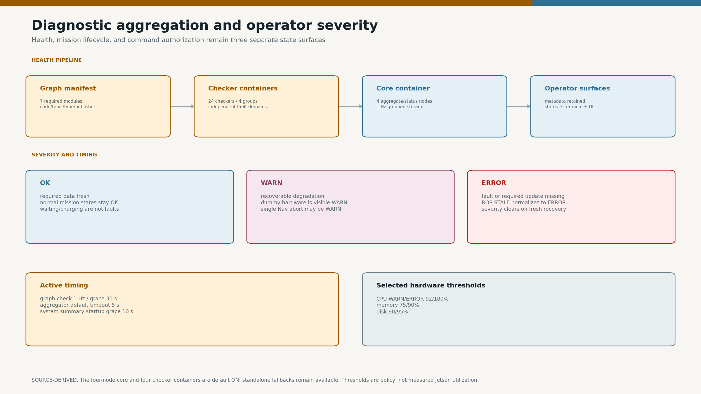
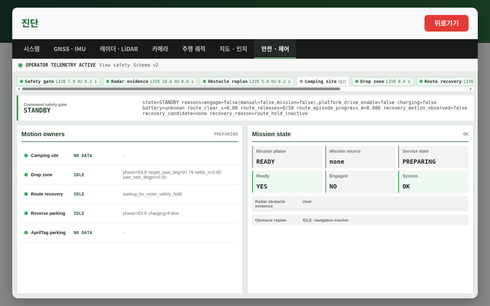
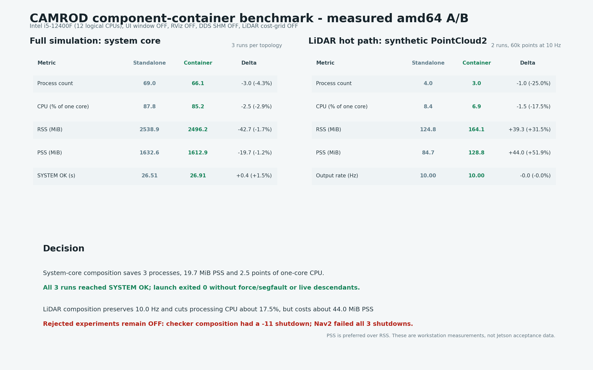

# camrod_system

<!-- HH_260805 - Document scoped checker fault domains and the remaining
Jetson acceptance work. -->

Graph readiness, dedicated sensor/planning/platform/hardware diagnostics,
metadata-preserving aggregation, and operator health summaries.



## Actual Simulation Runtime


`SIM RUNTIME CAPTURE`: live `SystemStatus` reported healthy while the service
state remained `MOVING_TO_SITE` and motion readiness was blocked by the control
hold. This demonstrates that health, service phase, and motion authorization
are separate surfaces.



`SIM BROWSER CAPTURE`: system health, service phase, command authorization, and
motion ownership remain separate fields in the current UI rather than one
sticky warning label.

## At A Glance

| Uses | Function | Main outputs |
|---|---|---|
| Required node/topic/type/publisher manifests | Detects incomplete runtime graph | Graph diagnostics by module |
| Dedicated checkers | Evaluates freshness, rate, covariance, status, and resources | `/system/diagnostics` |
| Diagnostics aggregator and system summary | Groups all current faults with component metadata | `/system/diagnostics_agg`, `/system/status`, terminal `[SYSTEM]` |

This package observes health. It never generates vehicle motion commands.

## Active Rate Contract

| Diagnostic input | Expected rate | Scope |
|---|---:|---|
| Physical GNSS and localization GNSS input | `5 Hz` | Receiver corrections; independent of EKF prediction |
| Selected localization pose | `20 Hz` | EKF/final-pose output |
| LiDAR raw / filtered cloud | `10 Hz` | Required physical sensing chain |
| Front / rear camera raw stream | `10 Hz` each | Rear monitoring JPEG is a separate `2 Hz` diagnostic stream |
| Optional LiDAR cost grid | `10 Hz` when enabled | Its node/topic are omitted when OFF; the shared checker still monitors radar + inflation |

## Runtime Composition

| Mode | Runtime boundary | Status |
|---|---|---|
| Production default | Four aggregate/status nodes in `/system/system_core_container`; 24 checkers in four serialized fault-domain containers | AMD64 full-stack startup, status transitions, and shutdown passed 3/3 final runs |
| Tool fallback | Four aggregate/status executables remain standalone | `use_system_tools_container:=false`; field-debug/A-B path |
| Checker fallback | `hardware_sensing=11`, `localization=6`, `autonomy_topics=6`, and `planning_lifecycle=1` retain separate containers or standalone executables | `use_checker_components:=false` restores per-checker processes |

<!-- HH_260805 - Scoped context lifetime supersedes the earlier component
shutdown rejection while preserving independently recoverable fault domains. -->
All 24 checkers retain standalone executables and component registrations.
Production composes them into four single-threaded containers so hardware,
localization, autonomy topics, and lifecycle-service checks remain separate.
The custom runtime explicitly detaches nodes and controls context/plugin
lifetime before process exit; this removed the former localization/autonomy
`-11` teardown race in three final full-graph runs.

<!-- HH_260805 - Compose only the stable, low-rate aggregate/status chain. -->
The filtered diagnostics aggregator, graph checker, terminal/system-state node,
and tools aggregator share one serialized component process with intra-process
delivery. Their standalone executables remain selectable. The checker groups
stay outside that core process, so a core-container failure cannot remove the
source measurements that diagnose it.

Repeated full-simulation runs reached `[SYSTEM] OK` and shut the core container
down cleanly.

## Measured amd64 A/B



`MEASURED WORKSTATION`: headless full simulation on an Intel i5-12400F,
three runs per topology, 15 one-second steady-state samples per run. CPU is the
sum for the launch process tree where one logical CPU equals `100%`; PSS is
preferred over RSS for shared-library accounting.

| Full-sim mean | Four standalone tools | `system_core_container` | Change |
|---|---:|---:|---:|
| Processes | `69.0` | `66.1` | `-3.0` |
| CPU | `87.8%` | `85.2%` | `-2.5 points` (`-2.9%`) |
| RSS | `2538.9 MiB` | `2496.2 MiB` | `-42.7 MiB` |
| PSS | `1632.6 MiB` | `1612.9 MiB` | `-19.7 MiB` |
| Startup to `[SYSTEM] OK` | `26.51 s` | `26.91 s` | `+0.40 s` |
| Controlled launch stop / no descendants | `3/3` | `3/3` | no regression |

Here, controlled stop means launch exit `0`, no force/segfault, and no live
descendants; it does not relabel ordinary Python SIGINT `-2` log entries as
per-node exit `0`. The system-core container itself finished cleanly.
The two extra ROS graph names in the composed run are component-manager
entities, not duplicate checker/status owners. The original 24-checker A/B
showed larger resource savings but failed one shutdown; its historical values
remain in the linked file. The scoped-container shutdown verdict is superseded
by the later 3/3 clean regression in
[`amd64-scoped-container-shutdown-20260805.json`](../docs/assets/module-guides/runtime/evidence/amd64-runtime-topology-20260805/amd64-scoped-container-shutdown-20260805.json).
Exact original per-run resource values are in
[`amd64-container-ab-20260805.json`](../docs/assets/module-guides/runtime/evidence/amd64-runtime-topology-20260805/amd64-container-ab-20260805.json).
Jetson CPU/GPU/PSS and ten-cycle restart acceptance remain in `TODOLIST.txt`.

## Optional LiDAR Grid

| Launch value | Loaded graph | Diagnostic contract |
|---|---|---|
| `enable_lidar_cost_grid:=false` (default) | No `/sensing/lidar/lidar_cost_grid`; no `/sensing/cost_grid/lidar` publisher required | Cost-grid checker monitors radar + inflation; graph checker removes only the optional LiDAR grid node/topic |
| `enable_lidar_cost_grid:=true` | LiDAR rasterizer component is loaded | Cost-grid checker and graph checker both require its node/topic |

The LiDAR hardware, raw/filtered cloud, and LiDAR checker remain required by
their selected real/dummy profile. This toggle suppresses only the unused
rasterizer, so it cannot hide a missing physical LiDAR stream.

## Three Separate State Surfaces

| Surface | Values | Purpose |
|---|---|---|
| Service lifecycle | moving, entering, waiting, returning, parking, charging, stopped | What the robot is doing |
| Command gate | standby, enabled, charging, route safety hold, blocked | Whether motion output is authorized |
| System health | `OK`, `WARN`, `ERROR` | Whether modules and data are healthy |

`SITE_ENTRY`, `WAITING_FOR_RETURN_REQUEST`, `WAITING_FOR_CHARGING`,
`CHARGING`, and `OPERATOR_STOPPED` are normal service states, not warnings.

## Severity Rules

| Level | Meaning | Recovery behavior |
|---|---|---|
| `OK` | Required source is present and healthy | Remains OK while fresh |
| `WARN` | Recoverable degradation or intentional dummy hardware | Clears when the checker reports fresh OK |
| `ERROR` | Fault, missing required update, or expired startup requirement | Clears only after valid recovery evidence |

ROS diagnostic `STALE` is normalized to `ERROR` while retaining the original
source/detail. The UI and terminal summary reflect new checker results; they do
not intentionally latch an old warning after cancel or recovery.

## Active Timing And Thresholds

| Item | Value |
|---|---:|
| Graph check period | `1.0 s` |
| Graph startup grace | `30.0 s` |
| System-summary startup grace | `10.0 s` |
| Aggregator publish rate | `1 Hz` |
| Aggregator default timeout | `5.0 s` |
| CPU WARN / ERROR | `92 / 100%` |
| Memory WARN / ERROR | `75 / 90%` |
| Disk WARN / ERROR | `90 / 95%` |
| CPU temperature WARN / ERROR | `75 / 90 C` |
| GPU utilization WARN / ERROR | `85 / 95%` |

These are alert thresholds, not measured Jetson utilization.

## Reported Jetson Stationary Profile


| Five-minute metric | Result |
|---|---:|
| 8-core CPU average | `99.26%` |
| GPU average | `36.95%` |
| RAM | `10.66 / 15.66 GB` |
| CPU temperature average | `60.6 C` |

The observed bottleneck was CPU, not GPU, RAM, or temperature. The profile also
included measurement processes and desktop tools; raw logs remain on the
Jetson. It is a diagnostic report, not a production driving benchmark.

## Expected Planning Handoffs

| Service phase | Nav2 abort/cancel interpretation |
|---|---|
| `MOVING_TO_SITE` or route travel | Unexpected abort remains WARN/ERROR |
| `SITE_ENTRY`, unload/wait, return maneuver, parking | Local controller owns motion; expected Nav2 cancel is suppressed |
| `OPERATOR_STOPPED` | Operator cancellation is explicit state, not a stale planning warning |

A single `ABORTED` result may be WARN when genuinely unexpected. The checker
uses current service context and recent status; a successful/cancelled terminal
transition can restore health.

The local-path checker follows the same ownership rule. During stationary or
local-controller states (`SITE_ENTRY`, parking, charging and charger/drop-zone
departure), an intentionally cleared Nav2 local path reports `OK` instead of a
one-tick `Path point count too low` error. A `3.0 s` local-path transition grace
covers serialized callback ordering. Each new navigation episode resets the
effective grace origin, and WARN-sized and ERROR-sized paths have independent
timers. An idle empty path or short valid approach therefore cannot consume the
next route's invalid-path grace; route-travel states still enforce freshness
immediately and persistent point-count limits after that grace.

<!-- HH_260807 - Link the final handoff and shutdown evidence to the checker contract. -->
The [same-goal handoff smoke and ten-cycle audit](../docs/assets/module-guides/bringup/test-results/b1-b10-service-endurance-20260807/README.md)
kept `/system` at OK through an expected `empty_route` transition and recorded
zero post-service-start system/path fault during `2210.611 s`. Robot and Guest
backend shutdown also left no failed or run-owned residual process.

## Required Runtime Groups

| Group | Requirement |
|---|---|
| map, sensing, localization, perception, planning, control, platform | Required nodes and generated topic contracts |
| final parking | Exactly one healthy reverse or AprilTag controller |
| UI | Backend graph contract when enabled |

Disabled physical hardware publishes a fresh `dummy_active` marker. Its checker
reports `DUMMY DATA / WARN`, never false `OK`. Global and per-channel radar
markers preserve which source is intentionally absent.

## Fault Metadata

Physical sensor diagnostics preserve:

| Field | Example use |
|---|---|
| `component_id` and location | Distinguish FRONT1 from LEFT2 |
| frame and mount XYZ/RPY | Locate the source on the robot |
| `pose_verified` | Keep the centered GNSS assumption distinct from a surveyed lever arm |
| live range/rate/status | Show the actual failing measurement |

Mount coordinates are relative to `robot_center_link`. GNSS reports
`0/0/0` with location `robot_center_assumed`; `pose_verified=false` remains
until both physical antenna locations and the position-reference behavior are verified.

## Run And Validate

```bash
ros2 launch camrod_system system.launch.py
ros2 launch camrod_system system.launch.py use_system_tools_container:=false
ros2 launch camrod_system system.launch.py use_checker_components:=true
ros2 launch camrod_system system.launch.py enable_lidar_cost_grid:=true

ros2 topic echo /system/status
ros2 topic echo /system/diagnostics_agg
ros2 topic echo /control/cmd_vel_safety_gate/status
```

The final default-off LiDAR-grid full-stack run monitored only radar and
inflation in `cost_grid_checker`, excluded only the optional LiDAR node/topic
from graph readiness, and reached `[SYSTEM] OK`. Four checker fault-domain
containers plus the separate system-core container stopped cleanly in 3/3
final amd64 runs and one default-argument run. Checker and system-core
composition are production defaults; their Jetson resource comparison is
still field-pending. DDS-SHM remains default-off and is eligible only for the
non-simulation physical LiDAR driver group.

| Config | Purpose |
|---|---|
| `config/system_checker.yaml` | Field graph manifest |
| `config/system_checker_sim.yaml` | Simulation graph manifest |
| `config/diagnostics/default/` | Field checker and aggregator values |
| `config/diagnostics/sim/` | Simulation-specific checker profile |
