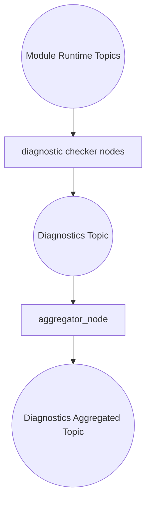
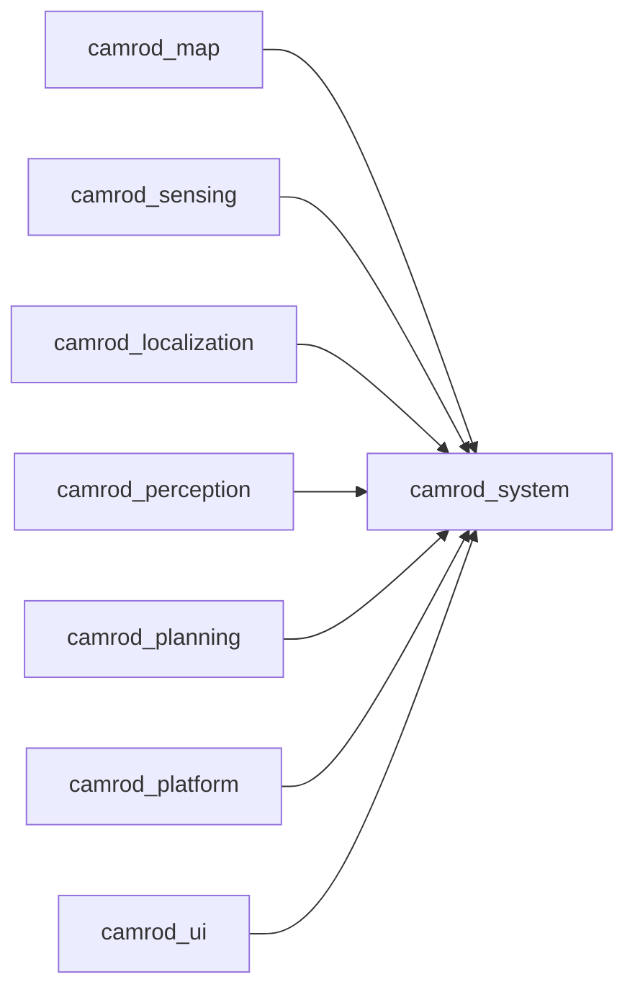

# camrod_system

## Role
`camrod_system` runs diagnostics checkers and aggregation for the full CAMROD stack.

## Package Diagram


Diagram legend: `[node/process]`, `((topic stream))`, `[(config or interface)]`, `[[external package or launch]]`.

## Node Data Flow
| Node / Group | Main Inputs | Main Outputs |
|---|---|---|
| Hardware checkers (`hw_checker`, `gpu_checker`, `network_checker`) | HW/network probes | `/system/diagnostics` statuses |
| Sensing checkers (`gnss`, `imu`, `lidar`, `radar`, `camera`, `wheel_odometry`, `cost_grid`, `velocity_converter`) | sensing topics | `/system/diagnostics` statuses |
| Localization checkers (`localization_*_checker`) | localization topics/signals | `/system/diagnostics` statuses |
| Map checker (`map_cost_grid_checker`) | `/map/cost_grid/lanelet` | `/system/diagnostics` status |
| Perception checker (`perception_obstacle_checker`) | perception obstacle topic | `/system/diagnostics` status |
| Planning checkers (`planning_lifecycle/costmap/nav_status/path`) | planning topics/services | `/system/diagnostics` statuses |
| Platform checker (`ranger_platform_checker`, optional build/runtime) | platform-specific topics | `/system/diagnostics` status |
| `aggregator_node` | `/system/diagnostics` (via remap from `/diagnostics`) | `/system/diagnostics_agg` |

## Inter-Package Connections


## Topic Summary
### Input Topics
| Input Topic | Purpose |
|---|---|
| map/localization/planning/perception/platform/sensing runtime topics | Health checks for module status and freshness |

### Output Topics
| Output Topic | Purpose |
|---|---|
| `/diagnostics` (package-only default) | Raw diagnostics stream |
| `/diagnostics_agg` (package-only default) | Aggregated diagnostics stream |
| `/system/diagnostics`, `/system/diagnostics_agg` (bringup namespace) | Same diagnostics streams when launched under `/system` namespace |

## Practical Usage
```bash
ros2 launch camrod_system system.launch.py
```

Examples:
```bash
ros2 launch camrod_system system.launch.py config_profile:=default
ros2 launch camrod_system system.launch.py enable_checkers:=true enable_platform:=false
```

## Config Files
- `config/diagnostics/default/*` (component checker YAMLs)
- `config/diagnostics/default/aggregator/diagnostics_config.yaml`
- backward-compatible wrapper launch: `launch/module_checkers.launch.py`
