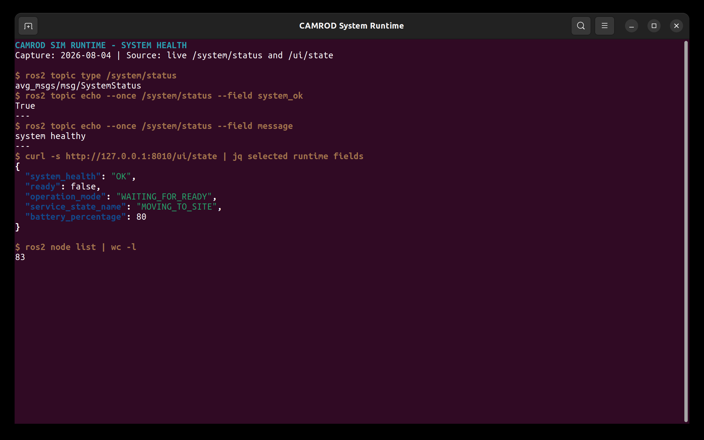

# camrod_system

<!-- HH_260804 - Present health aggregation, timing, thresholds, and lifecycle
separation visually instead of as a long diagnostics narrative. -->

Graph readiness, dedicated sensor/planning/platform/hardware diagnostics,
metadata-preserving aggregation, and operator health summaries.


## Actual Simulation Runtime



`SIM RUNTIME CAPTURE`: live `SystemStatus` reported healthy while the service
state remained `MOVING_TO_SITE` and motion readiness was blocked by the control
hold. This demonstrates that health, service phase, and motion authorization
are separate surfaces.

## At A Glance

| Uses | Function | Main outputs |
|---|---|---|
| Required node/topic/type/publisher manifests | Detects incomplete runtime graph | Graph diagnostics by module |
| Dedicated checkers | Evaluates freshness, rate, covariance, status, and resources | `/system/diagnostics` |
| Diagnostics aggregator and system summary | Groups all current faults with component metadata | `/system/diagnostics_agg`, `/system/status`, terminal `[SYSTEM]` |

This package observes health. It never generates vehicle motion commands.

## Runtime Composition

| Container | Checker nodes | Count |
|---|---|---:|
| `hardware_sensing_checker_container` | host/GPU/network, GNSS, IMU, LiDAR, radar, cameras, wheel odometry, sensing grids, velocity conversion | 11 |
| `localization_checker_container` | GNSS, mode, pose, initialization, source, lanelet localization | 6 |
| `autonomy_checker_container` | map, perception, planning lifecycle/costmap/Nav status/path/state | 7 |

Production uses one serialized executor per category, replacing 24 low-rate
checker processes with three process boundaries. Serialization prevents an
executor/DDS unload race during simultaneous shutdown. Every checker is still
built as a standalone executable for field isolation with
`use_checker_components:=false`.

The main diagnostics aggregator, graph checker, terminal/system-state node, and
tools aggregator remain separate. A fault in one of those policy/aggregation
layers therefore does not take all checker categories down with it. The
optional Ranger checker also remains standalone. No further `camrod_system`
grouping is planned without Jetson profiling that identifies a measurable
benefit; combining unrelated high-rate runtime packages would increase the
failure blast radius.

## Three Separate State Surfaces

| Surface | Values | Purpose |
|---|---|---|
| Service lifecycle | moving, entering, waiting, returning, parking, charging, stopped | What the robot is doing |
| Command gate | standby, enabled, charging, route safety hold, blocked | Whether motion output is authorized |
| System health | `OK`, `WARN`, `ERROR` | Whether modules and data are healthy |

`SITE_ENTRY`, `WAITING_FOR_RETURN_REQUEST`, `WAITING_FOR_CHARGING`,
`CHARGING`, and `OPERATOR_STOPPED` are normal service states, not warnings.

## Severity Rules

| Level | Meaning | Recovery behavior |
|---|---|---|
| `OK` | Required source is present and healthy | Remains OK while fresh |
| `WARN` | Recoverable degradation or intentional dummy hardware | Clears when the checker reports fresh OK |
| `ERROR` | Fault, missing required update, or expired startup requirement | Clears only after valid recovery evidence |

ROS diagnostic `STALE` is normalized to `ERROR` while retaining the original
source/detail. The UI and terminal summary reflect new checker results; they do
not intentionally latch an old warning after cancel or recovery.

## Active Timing And Thresholds

| Item | Value |
|---|---:|
| Graph check period | `1.0 s` |
| Graph startup grace | `30.0 s` |
| System-summary startup grace | `10.0 s` |
| Aggregator publish rate | `1 Hz` |
| Aggregator default timeout | `5.0 s` |
| CPU WARN / ERROR | `92 / 100%` |
| Memory WARN / ERROR | `75 / 90%` |
| Disk WARN / ERROR | `90 / 95%` |
| CPU temperature WARN / ERROR | `75 / 90 C` |
| GPU utilization WARN / ERROR | `85 / 95%` |

These are alert thresholds, not measured Jetson utilization.

## Reported Jetson Stationary Profile


| Five-minute metric | Result |
|---|---:|
| 8-core CPU average | `99.26%` |
| GPU average | `36.95%` |
| RAM | `10.66 / 15.66 GB` |
| CPU temperature average | `60.6 C` |

The observed bottleneck was CPU, not GPU, RAM, or temperature. The profile also
included measurement processes and desktop tools; raw logs remain on the
Jetson. It is a diagnostic report, not a production driving benchmark.

## Expected Planning Handoffs

| Service phase | Nav2 abort/cancel interpretation |
|---|---|
| `MOVING_TO_SITE` or route travel | Unexpected abort remains WARN/ERROR |
| `SITE_ENTRY`, unload/wait, return maneuver, parking | Local controller owns motion; expected Nav2 cancel is suppressed |
| `OPERATOR_STOPPED` | Operator cancellation is explicit state, not a stale planning warning |

A single `ABORTED` result may be WARN when genuinely unexpected. The checker
uses current service context and recent status; a successful/cancelled terminal
transition can restore health.

## Required Runtime Groups

| Group | Requirement |
|---|---|
| map, sensing, localization, perception, planning, control, platform | Required nodes and generated topic contracts |
| final parking | Exactly one healthy reverse or AprilTag controller |
| UI | Backend graph contract when enabled |

Disabled physical hardware publishes a fresh `dummy_active` marker. Its checker
reports `DUMMY DATA / WARN`, never false `OK`. Global and per-channel radar
markers preserve which source is intentionally absent.

## Fault Metadata

Physical sensor diagnostics preserve:

| Field | Example use |
|---|---|
| `component_id` and location | Distinguish FRONT1 from LEFT2 |
| frame and mount XYZ/RPY | Locate the source on the robot |
| `pose_verified` | Mark the GNSS lever arm as unverified |
| live range/rate/status | Show the actual failing measurement |

Mount coordinates are relative to `robot_center_link`. The GNSS
`-0.443/0/0` entry is a converted placeholder and remains unverified.

## Run And Validate

```bash
ros2 launch camrod_system system.launch.py
ros2 launch camrod_system system.launch.py use_checker_components:=false

ros2 topic echo /system/status
ros2 topic echo /system/diagnostics_agg
ros2 topic echo /control/cmd_vel_safety_gate/status
```

Five isolated composition cycles each loaded all `11 + 6 + 7 = 24` checker
components under `/system` and produced 15 clean container exits in total. A
subsequent 87-node full-stack run reached `[SYSTEM] OK` and all three containers
again stopped cleanly. The containers plus their main aggregator sampled about
`82 MiB` RSS on this amd64 workstation; this is a topology/shutdown check, not
a Jetson performance benchmark.

| Config | Purpose |
|---|---|
| `config/system_checker.yaml` | Field graph manifest |
| `config/system_checker_sim.yaml` | Simulation graph manifest |
| `config/diagnostics/default/` | Field checker and aggregator values |
| `config/diagnostics/sim/` | Simulation-specific checker profile |
