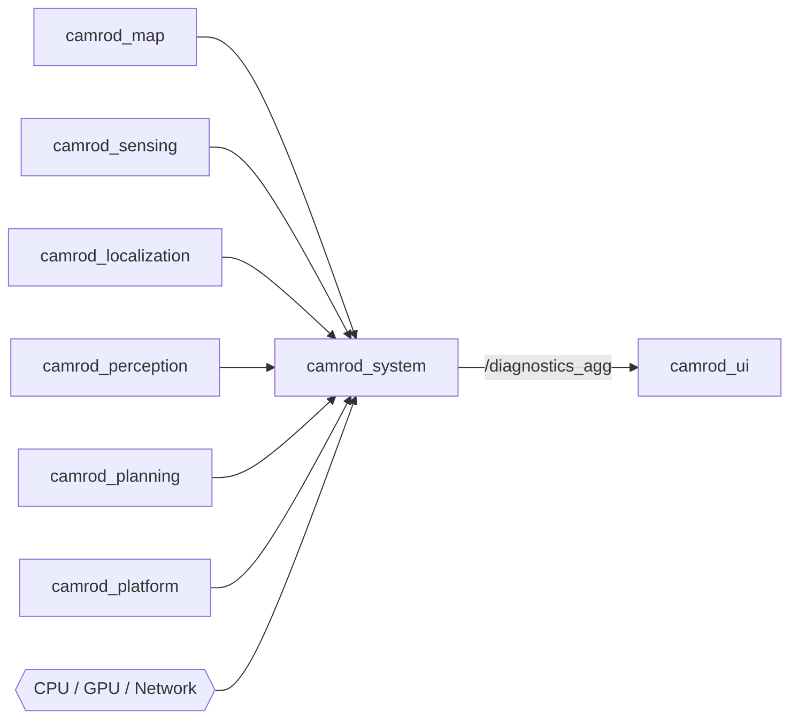
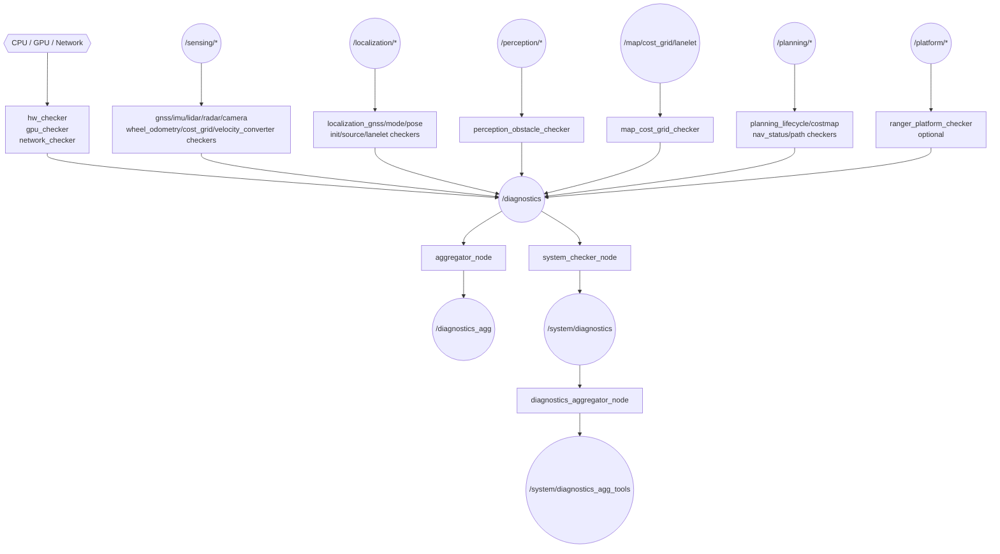
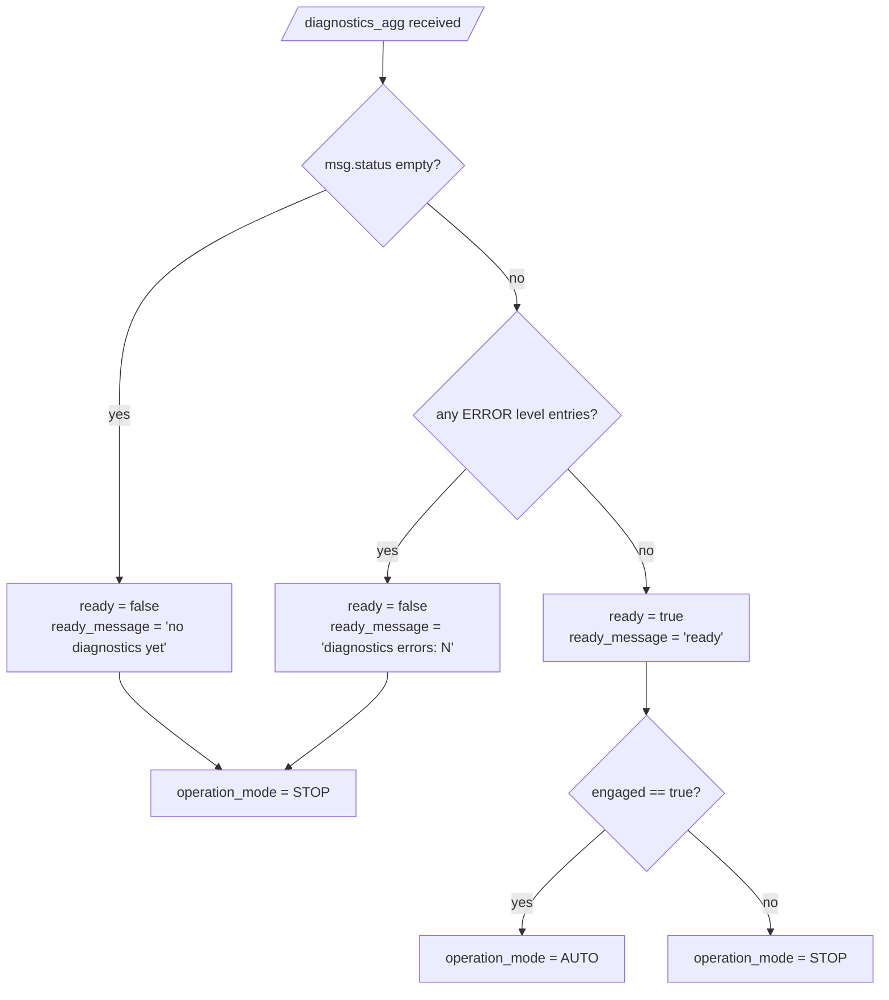

# camrod_system

## 1. Title

**camrod_system** — Per-module diagnostic checkers and diagnostics aggregator for the full CAMROD stack.

---

## 2. Summary

`camrod_system` provides the health monitoring layer for all CAMROD runtime packages. It runs more than 20 independent checker nodes, each subscribing to one module's runtime topics and publishing `diagnostic_msgs/DiagnosticStatus` entries to `/diagnostics`. A central `aggregator_node` collects all entries, detects stale reporters, groups them into a tree by subsystem, and publishes the consolidated result to `/diagnostics_agg`.

A separate lightweight system tools track (`enable_system_tools: true`) checks that required ROS 2 nodes and topics are alive and publishes a secondary summary to `/system/diagnostics_agg_tools`.

**Non-goals:**
- Reports health status only. Does **not** enforce safety actions (e-stop, speed reduction, disengagement).
- Does not contain autonomous decision logic. Consumers (e.g., `camrod_ui`) decide what to do with the health data.
- Does not check `camrod_parking` yet (TODO: parking checker category).

---

## 3. Quick Start

```bash
# Build
cd ~/camrod_ws
colcon build --packages-select camrod_system
source install/setup.bash

# Full stack (all checkers + aggregator)
ros2 launch camrod_system system.launch.py

# Disable Ranger platform checker (default)
ros2 launch camrod_system system.launch.py enable_platform:=false

# Watch aggregated diagnostics
ros2 topic echo /system/diagnostics_agg

# Watch per-checker raw diagnostics
ros2 topic echo /system/diagnostics
```

---

## 4. System Position



Legend: `[node]`, `((topic))`, `{{file/hw}}`, `[[stack]]`, dashed = non-runtime dependency.

`camrod_system` is a pure observer. All upstream packages publish data regardless of whether the system checkers are running.

---

## 5. Runtime Architecture



When launched under the default namespace `system`, all topics are prefixed: `/system/diagnostics` and `/system/diagnostics_agg`.

---

## 6. Interface Contract

### Inputs

| Topic | Type | Required | Producer | Rate | Meaning |
|---|---|---|---|---|---|
| `/sensing/gnss/ublox_gps_node/fix` | `sensor_msgs/NavSatFix` | Yes | camrod_sensing | 5 Hz | GNSS fix for `gnss_checker` |
| `/sensing/imu/data` | `sensor_msgs/Imu` | Yes | camrod_sensing | 100 Hz | IMU data for `imu_checker` |
| `/sensing/lidar/*/points` | `sensor_msgs/PointCloud2` | Yes | camrod_sensing | 10 Hz | LiDAR points for `lidar_checker` |
| `/sensing/radar/*/range` | `sensor_msgs/Range` | Yes | camrod_sensing | variable | Radar ranges for `radar_checker` |
| `/sensing/camera/*/image_raw` | `sensor_msgs/Image` | Yes | camrod_sensing | 30 Hz | Camera frames for `camera_checker` |
| `/platform/status/wheel_odometry` | `nav_msgs/Odometry` | Yes | camrod_platform | variable | Wheel odometry for `wheel_odometry_checker` |
| `/planning/cost_grid/inflation` | `nav_msgs/OccupancyGrid` | Yes | camrod_planning | variable | Inflated cost grid for `cost_grid_checker` |
| `/sensing/platform_velocity_converter/twist_with_covariance` | `geometry_msgs/TwistWithCovarianceStamped` | Yes | camrod_sensing | variable | Velocity for `velocity_converter_checker` |
| `/sensing/gnss/pose_with_covariance` | `geometry_msgs/PoseWithCovarianceStamped` | Yes | camrod_localization | 5 Hz | GNSS-derived pose for `localization_gnss_checker` |
| `/localization/mode` | `avg_msgs/AvgLocalizationMode` | Yes | camrod_localization | variable | ESKF mode for `localization_mode_checker` |
| `/localization/pose_with_covariance` | `geometry_msgs/PoseWithCovarianceStamped` | Yes | camrod_localization | 30 Hz | Pose estimate for `localization_pose_checker` |
| `/localization/initial_match_ok` | `std_msgs/Bool` | Yes | camrod_localization | event | Drop zone init flag for `localization_init_checker` |
| `/localization/pose_source` | `std_msgs/String` | Yes | camrod_localization | event | Active pose source for `localization_source_checker` |
| `/localization/lanelet_pose` | `geometry_msgs/PoseStamped` | Yes | camrod_localization | variable | Lanelet-projected pose for `localization_lanelet_checker` |
| `/map/cost_grid/lanelet` | `nav_msgs/OccupancyGrid` | Yes | camrod_map | variable | Lanelet cost grid for `map_cost_grid_checker` |
| `/perception/obstacles` | `sensor_msgs/PointCloud2` | Yes | camrod_perception | 10 Hz | Fused obstacles for `perception_obstacle_checker` |
| `/perception/camera/detections_2d` | `vision_msgs/Detection2DArray` | Yes | camrod_perception | variable | Camera detections for `perception_obstacle_checker` |
| `/planning/global_path` | `nav_msgs/Path` | Yes | camrod_planning | variable | Global path for `planning_path_checker` |
| `/planning/local_path` | `nav_msgs/Path` | Yes | camrod_planning | variable | Local path for `planning_path_checker` |

### Outputs

| Topic | Type | Consumer | Rate | Meaning |
|---|---|---|---|---|
| `/system/diagnostics` | `diagnostic_msgs/DiagnosticArray` | `aggregator_node` | ~1 Hz per checker | Raw per-checker status entries |
| `/system/diagnostics_agg` | `diagnostic_msgs/DiagnosticArray` | `camrod_ui`, RViz | 1 Hz | Aggregated tree of all module statuses |
| `/system/diagnostics_agg_tools` | `diagnostic_msgs/DiagnosticArray` | monitoring tools | 1 Hz | System tools lightweight aggregation |

---

## 7. Key Behaviors

### Checker → Aggregator Pipeline

| Attribute | Detail |
|---|---|
| Trigger | Each checker's subscription callback fires when a message arrives on its monitored topic |
| Internal logic | Checker computes level (OK/WARN/ERROR) based on rate, staleness, and value thresholds; publishes `DiagnosticStatus` to `/diagnostics` |
| Output effect | `aggregator_node` collects all entries; after `timeout_s` without a new message, entry is marked stale and elevated to WARN |
| Operator-visible symptom | One module stuck at WARN or ERROR in `/diagnostics_agg`; UI shows corresponding module in non-green state |
| Related params | `publish_rate_hz`, `stale_timeout_s`, per-checker thresholds |
| Related topics | `/system/diagnostics`, `/system/diagnostics_agg` |

### Staleness Detection

| Attribute | Detail |
|---|---|
| Trigger | `aggregator_node` publish timer fires (1 Hz) |
| Internal logic | Compares current time against last-received stamp for each registered topic; entries not updated within `timeout_s` (default: 5.0 s) are elevated to WARN |
| Output effect | Stale entries appear in `/diagnostics_agg` with a staleness message |
| Operator-visible symptom | A module appears yellow/WARN in the UI even though it was recently healthy |
| Related params | `stale_timeout_s` (per topic in `diagnostics_config.yaml`), `global.timeout_s` |
| Related topics | `/system/diagnostics_agg` |

### System Tools Liveness Check

| Attribute | Detail |
|---|---|
| Trigger | `system_checker_node` poll timer (period: `check_period_s: 1.0`) |
| Internal logic | Queries the ROS 2 graph for required nodes and topics; reports missing items as WARN/ERROR |
| Output effect | Results forwarded to `/system/diagnostics`, then to `/system/diagnostics_agg_tools` |
| Operator-visible symptom | Missing required node or topic appears as WARN in tools channel |
| Related params | `required_nodes`, `required_topics`, `check_period_s`, `startup_grace_s: 6.0` |
| Related topics | `/system/diagnostics`, `/system/diagnostics_agg_tools` |

### Module Readiness Decision Tree



### System Readiness Sequence

```mermaid
sequenceDiagram
  participant SENS as camrod_sensing
  participant LOC as camrod_localization
  participant PLAN as camrod_planning
  participant SYS as camrod_system
  participant UI as camrod_ui

  SENS->>SYS: /sensing/* topics arrive
  SYS->>SYS: gnss/imu/lidar/radar/camera checkers → OK
  LOC->>SYS: /localization/initial_match_ok = true
  SYS->>SYS: localization_init_checker → OK
  LOC->>SYS: /localization/pose_with_covariance arrives at 30 Hz
  SYS->>SYS: localization_pose_checker → OK
  PLAN->>SYS: Nav2 lifecycle nodes active (get_state = active)
  SYS->>SYS: planning_lifecycle_checker → OK
  SYS->>UI: /diagnostics_agg with zero ERROR entries
  UI->>UI: ready = true; if engaged: operation_mode = AUTO
```

### Checker Categories

| Category | Checker nodes | Config subdir | Parking (TODO) |
|---|---|---|---|
| `hw` | hw_checker, gpu_checker, network_checker | `config/diagnostics/default/hw/` | — |
| `sensing` | gnss, imu, lidar, radar, camera, wheel_odometry, cost_grid, velocity_converter | `config/diagnostics/default/sensing/` | — |
| `localization` | localization_gnss, localization_mode, localization_pose, localization_init, localization_source, localization_lanelet | `config/diagnostics/default/localization/` | — |
| `perception` | perception_obstacle | `config/diagnostics/default/perception/` | — |
| `map` | map_cost_grid | `config/diagnostics/default/map/` | — |
| `planning` | planning_lifecycle, planning_costmap, planning_nav_status, planning_path | `config/diagnostics/default/planning/` | — |
| `platform` | ranger_platform (optional) | `config/diagnostics/default/platform/` | — |
| `parking` | — | — | **TODO**: parking checker not yet implemented |

---

## 8. Launch

```bash
ros2 launch camrod_system system.launch.py [ARG:=VALUE ...]
```

| Argument | Default | Description |
|---|---|---|
| `module_namespace` | `system` | ROS 2 node namespace; topics appear as `/system/diagnostics` |
| `config_profile` | `default` | Config profile directory under `config/diagnostics/`; falls back to `default` if profile dir missing |
| `enable_checkers` | `true` | Launch all module checker nodes and `aggregator_node` |
| `enable_platform` | `false` | Launch `ranger_platform_checker_node` (only if binary is installed) |
| `enable_system_tools` | `true` | Launch `system_checker_node`, `system_diagnostic_node`, `diagnostics_aggregator_node` |
| `system_checker_param_file` | `config/system_checker.yaml` | Parameter file for `system_checker_node` |

---

## 9. Config

All config files are under `config/diagnostics/default/`.

| File | Purpose |
|---|---|
| `aggregator/diagnostics_config.yaml` | Master topic registry: `name`, `group`, `timeout_s` for each checker entry. `global.publish_rate_hz: 1.0`, `global.timeout_s: 5.0` |
| `aggregator/robot_diagnostics_aggregator.yaml` | `diagnostic_aggregator` analyzer tree configuration; `pub_rate: 1.0` |
| `hw/hw_gpu_checker.yaml` | CPU/memory/disk/GPU thresholds and container host paths |
| `hw/network_checker.yaml` | Network interface check config |
| `sensing/gnss_checker.yaml` | `expected_hz: 5.0`, `stale_timeout_s: 2.0` |
| `sensing/imu_checker.yaml` | `expected_hz: 100.0`, `stale_timeout_s: 0.5` |
| `sensing/lidar_checker.yaml` | `expected_hz: 10.0`, `min_point_count`, `max_point_count` |
| `sensing/radar_checker.yaml` | `stale_timeout_s: 1.0` |
| `sensing/camera_checker.yaml` | `expected_fps: 30.0`, `expected_width`, `expected_height` |
| `sensing/wheel_odometry_checker.yaml` | `stale_timeout_s: 1.0` |
| `sensing/cost_grid_checker.yaml` | `stale_timeout_s: 2.0` |
| `sensing/velocity_converter_checker.yaml` | `stale_timeout_s: 1.0` |
| `localization/localization_gnss_checker.yaml` | `expected_hz: 5.0`, `cov_warn_threshold` |
| `localization/localization_mode_checker.yaml` | `conf_warn: 0.6`, `innov_warn: 3.0` |
| `localization/localization_pose_checker.yaml` | `expected_hz: 30.0`, `cov_warn: 1.0`, `max_jump_m: 2.0` |
| `localization/localization_init_checker.yaml` | `stale_timeout_s: 5.0` |
| `localization/localization_source_checker.yaml` | Pose source switching detection |
| `localization/localization_lanelet_checker.yaml` | `stale_timeout_s: 2.0` |
| `map/map_cost_grid_checker.yaml` | `stale_timeout_s: 5.0` |
| `perception/perception_obstacle_checker.yaml` | `expected_hz: 10.0`, `min_count`, `max_count` |
| `planning/planning_lifecycle_checker.yaml` | Nav2 nodes to poll, `poll_rate_hz: 2.0` |
| `planning/planning_costmap_checker.yaml` | `stale_timeout_s: 3.0` |
| `planning/planning_nav_status_checker.yaml` | `abort_rate_warn` threshold |
| `planning/planning_path_checker.yaml` | `stale_timeout: 3.0`, `min_points_warn: 5` |
| `platform/ranger_platform_checker.yaml` | Ranger-specific platform diagnostics |

**Canonical parameter names used in checker YAML files:**

| Name | Meaning |
|---|---|
| `publish_rate_hz` | How often the aggregator publishes `/diagnostics_agg` |
| `poll_rate_hz` | How often a checker actively polls a service (e.g., Nav2 lifecycle) |
| `stale_timeout_s` | Seconds before a topic is considered stale and elevated to WARN |
| `grace_period_s` | Post-startup grace window before a checker raises errors |
| `startup_grace_s` | Grace period for system_checker_node after launch |
| `fallback_warn_s` | Seconds in fallback state before WARN is raised |
| `fallback_error_s` | Seconds in fallback state before ERROR is raised |

---

## 10. Validation

### Sample `/diagnostics_agg` payload (YAML)

```yaml
header:
  stamp: {sec: 1716300000, nanosec: 0}
status:
  - name: "Robot/Sensing/GNSS"
    level: 0          # 0=OK, 1=WARN, 2=ERROR
    message: "OK"
    hardware_id: ""
    values:
      - {key: "frequency", value: "5.1 Hz"}
      - {key: "status", value: "OK"}
  - name: "Robot/Localization/Init"
    level: 0
    message: "initial_match_ok received"
    hardware_id: ""
    values: []
  - name: "Robot/Planning/Lifecycle"
    level: 0
    message: "all lifecycle nodes active"
    hardware_id: ""
    values:
      - {key: "planner_server", value: "active"}
      - {key: "controller_server", value: "active"}
      - {key: "bt_navigator", value: "active"}
      - {key: "behavior_server", value: "active"}
```

---

## 11. Troubleshooting

**`/diagnostics_agg` is empty**
- Confirm `aggregator_node` is running: `ros2 node list | grep diagnostics_agg`
- Confirm at least one checker is publishing to `/system/diagnostics`: `ros2 topic hz /system/diagnostics`
- Check that `diagnostics_config.yaml` exists at the resolved `config_profile` path.
- If `enable_checkers:=false` was used, no checker nodes will run.

**One module stuck in WARN forever**
- Identify which topic is stale: `ros2 topic hz <topic_name>` against the topic listed in the checker YAML.
- Check the source package is running: `ros2 node list | grep <package>`.
- If the source is dead, restart the upstream package. `camrod_system` does not restart it automatically.
- Increase `stale_timeout_s` temporarily if the module needs more time after startup.

**UI shows WAITING_FOR_READY indefinitely**
- `camrod_ui` sets `ready = false` when `/diagnostics_agg` contains any ERROR-level entry.
- Run `ros2 topic echo /system/diagnostics_agg` and look for `level: 2` entries.
- Common causes: LiDAR not publishing, localization not initialized (`initial_match_ok` not received), Nav2 lifecycle nodes not in active state.

**Profile change ignored**
- The `config_profile` argument selects a subdirectory under `config/diagnostics/`. If the directory does not exist, the launch file silently falls back to `default`.
- Verify: `ls $(ros2 pkg prefix camrod_system)/share/camrod_system/config/diagnostics/`

---

## Related Docs

- [`../README.md`](../README.md) — Top-level CAMROD workspace overview
- [`../camrod_sensing/README.md`](../camrod_sensing/README.md)
- [`../camrod_localization/README.md`](../camrod_localization/README.md)
- [`../camrod_perception/README.md`](../camrod_perception/README.md)
- [`../camrod_map/README.md`](../camrod_map/README.md)
- [`../camrod_planning/README.md`](../camrod_planning/README.md)
- [`../camrod_platform/README.md`](../camrod_platform/README.md)
- [`../camrod_parking/README.md`](../camrod_parking/README.md)
- [`../camrod_ui/README.md`](../camrod_ui/README.md) — consumes `/diagnostics_agg`
- [`../PARAMETER_NAMING_STANDARD.md`](../PARAMETER_NAMING_STANDARD.md) — canonical parameter naming conventions
