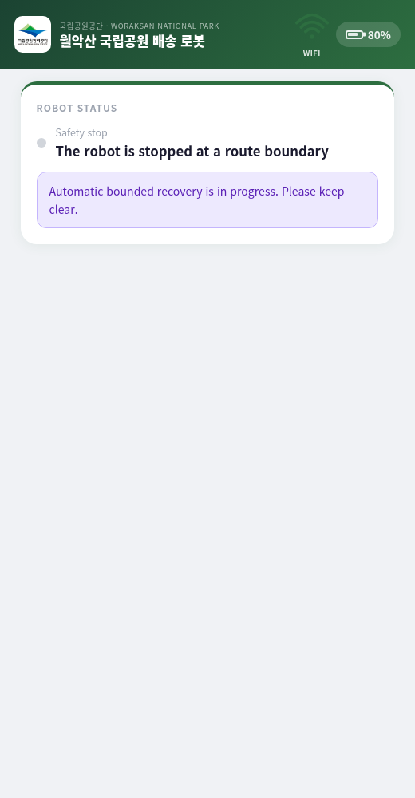

# camrod_ui

<!-- HH_260804 - Record the selectively merged kiosk, transport, and arrival
fixes while retaining the current mission/stop behavior. -->

Robot operator UI, Guest campsite UI, HTTP/WebSocket backends, ROS mission
bridge, diagnostics display, and managed local kiosk.


## At A Glance

| Surface | User actions | Shared feedback |
|---|---|---|
| Robot UI | Manual engage/stop, campsite dispatch, return, tuning, diagnostics | Service state, command gate, battery, health |
| Guest UI | Campsite selection and return request | Same service state, SOC admission, and safety overlay |
| Backend | Resolves mission key/goal and publishes typed ROS commands | WebSocket state snapshots and arrival events |

## Active Deployment Values

| Item | Full-bringup value |
|---|---:|
| Robot UI | `0.0.0.0:8010` |
| Guest UI | `0.0.0.0:8012` |
| Campsites | `B1..B13` |
| New mission battery | `>= 35%` |
| Battery feedback required | `true` |
| Low-battery current-mission latch | `< 35%` |
| Hard stop authority | control gate at `<= 20%`, not the UI |
| Guest disconnect lock grace | `60 s` |
| Guest heartbeat / stale close | `10 s` / `45 s` |
| Local operator window | fullscreen WebKit kiosk by default; Chromium/auto optional |

## Destination Dispatch

```text
site B<N>
  -> mission key camping_site_<N>
  -> service/operational goal from camping_sites.yaml
  -> /ui/selected_destination
  -> /planning/mission_key + /goal_pose
  -> /platform/drive_enable + /planning/mission_engage
  -> /service/state = MOVING_TO_SITE
```

Unknown battery or SOC below 35% blocks a new destination. If SOC falls below
35% during an active campsite mission, the current site phase finishes and the
UI waits for the normal return request; it does not command immediate motion
while users may be unloading.

## State Display

| Layer | UI label examples | Source |
|---|---|---|
| Operation | Moving to site, Entering site, Waiting for return, Charging | `/service/state` (17 states) |
| Motion authorization | Driving, Standby, Route safety hold | command-gate status |
| Health | System OK, warning, error | `/system/status` and aggregated diagnostics |
| Battery | Ready/block/charging and SOC | `/platform/status` |

Manual engage uses the same command-gate state and therefore displays driving
even when no campsite destination was selected. Operator stop publishes
`OPERATOR_STOPPED`; a previous planning warning is not the operation label.
The active campsite ID is retained separately from the transient destination
ack, so arrival notifications still identify the selected site after departure.

## Actual Browser Runtime


| Mission-ready dispatch | Route safety overlay |
|---|---|
|  |  |

`SIM BROWSER CAPTURE`: these are rendered Guest UI screens connected to the
running ROS backend, not generated UI mockups.

| Integration check | Result |
|---|---|
| Initial state | `80%` SOC, ready, 13 sites |
| Destination | Mission key and departure/moving state observed |
| Return | Return state and `MotionOperation.RETURN` observed |
| Safety | `ROUTE_SAFETY_HOLD` overlay observed |
| Cancel | `POST /ui/stop` HTTP 200; all local owners and Nav2 canceled; state `16 OPERATOR_STOPPED` observed |
| Robot site verification | `B6` virtual-key input at 1920x1080 and lowercase physical-key normalization at 1280x800; both produced the same destination frame |
| Robot UI negative paths | Wrong `B5` sends nothing, correction sends `B6`, cancel sends nothing, Guest return exits idle, and diagnostic keypad login remains valid |
| Current production bundle | At 1280x800, destination screen appeared in 1.1 ms and the 40-key verification keypad in 17.6 ms; queued same-frame `B`+`6` remained `B6`, cancel sent zero frames, and confirmation sent one frame |
| Current WebKit startup smoke | WebKitGTK 2.50.4 waited for backend readiness, loaded on the first render attempt, and shut down cleanly |
| Historical renderer sample | Before static status cues and the current startup path, forced WebKit was near 97% of one workstation CPU; the later Chromium sample was 0.5% combined |

This validates browser/backend/ROS integration. It is not a physical mission or
collision-safety test. The WebKit smoke check proves startup behavior, not
Jetson CPU usage; a production Jetson profile is still required.

## Key ROS Interfaces

| Direction | Topic | Purpose |
|---|---|---|
| Publish | `/ui/selected_destination` | Typed destination command |
| Publish | `/planning/mission_key` | Semantic mission selection |
| Publish | `/goal_pose` | Site operational goal |
| Publish | `/planning/mission_engage` | Mission motion authorization request |
| Publish | `/platform/drive_enable` | Platform drive-enable request |
| Publish | `/ui/camping_site_operation_request` | Return/adopt operation request |
| Subscribe | `/service/state` | Public lifecycle |
| Subscribe | `/control/cmd_vel_safety_gate/status` | Motion/safety overlay |
| Subscribe | `/platform/status` | SOC, charging, and platform state |
| Subscribe | `/system/diagnostics_agg` | Detailed health display |

## HTTP And WebSocket

| Method/path | Purpose |
|---|---|
| `GET /ui/health` | Backend liveness |
| `GET /ui/state` | Full UI state snapshot |
| `GET /ui/destination` | Current/valid destinations |
| `GET /ui/diagnostics` | Aggregated diagnostic detail |
| `POST /ui/destination?site=B6&run=true` | Select and dispatch a campsite |
| `POST /ui/engage?value=true|false` | Manual engage/disengage |
| `POST /ui/stop` | Operator stop |
| `WS /ws` | Real-time state updates |

Guest frames use one serialized writer. ROS publish work runs outside the
uvicorn event loop, and three missed 15-second receive windows release a stale
single-client slot. The browser heartbeat keeps a healthy idle session active.

## Build And Run

```bash
cd ~/camrod_ws/src/camrod_ui/camrod_ui_robot/assets/frontend
npm ci
npm run build

cd ~/camrod_ws
colcon build --packages-select camrod_ui --symlink-install
source install/setup.bash

ros2 launch camrod_ui ui.launch.py
curl http://127.0.0.1:8010/ui/health
curl http://127.0.0.1:8010/ui/state
```

`setup.py` installs the generated React `build/` tree; it does not run npm.
Regenerate that tree before colcon whenever frontend sources or public assets
change. Set `enable_operator_ui_window:=false` on headless hosts, or use
`operator_ui_window_fullscreen:=false` for a resizable maintenance window.
WebKit waits for the backend on a background readiness probe before its first
page load, retains the static React cache, uses always-on GPU compositing and
smooth touch scrolling, and disables only the unused WebGL context. This avoids
the repeated error-page reload path without changing the frontend or ROS API.
The policy requests acceleration from WebKitGTK; Jetson GPU utilization and
frame pacing remain a field measurement rather than a software-only claim.

Use `operator_ui_window_engine:=chromium` for an explicit Chromium-family kiosk
or `operator_ui_window_engine:=auto` to prefer Chromium and fall back to WebKit.
The optional launcher searches Chromium, Chrome, and Brave-compatible names;
`CAMROD_UI_BROWSER` overrides that executable selection only.

## Network Boundary

Full bringup binds ports 8010 and 8012 to all interfaces for robot-network
access. The current backend has no authentication and permissive CORS. Do not
expose either port to a public or untrusted network; use localhost, a trusted
robot LAN, firewalling, or an authenticated tunnel.

Evidence JSON: [`guest-mission-lifecycle.json`](../docs/evidence/v2.1.3/ui/guest-mission-lifecycle.json).
