# camrod_ui

<!-- HH_260807 - Make the documented renderer match the WebKit field default
while retaining the tested Chromium and auto alternatives. -->
<!-- HH_260807 - Preserve charger-departure authorization and deduplicate destination commands. -->
<!-- HH_260810 - Consolidate live module viewers into an on-demand operator telemetry workspace. -->
<!-- HH_260810 - Add confirmed operator-map manual goals and make RViz opt-in. -->
<!-- HH_260810 - Keep admin diagnostics mounted across service screens and use
a bounded client-leased telemetry WebSocket for the ARM64 deployment target. -->
<!-- HH_260818 - Add state-independent manual Return and a lazy docking view
for tag image/pose, parking paths, controller phases, battery, and charging. -->
<!-- HH_260819 - Make both Return controls share a stopped preemption barrier,
remove obsolete manual Parking ON/OFF, and wake telemetry leases by event. -->
<!-- HH_260819 - Add persistent public field-operation distance and service evidence. -->
<!-- HH_260825 - Queue charging campsite selections behind a stopped one-shot
departure dwell and expose that pending state to every UI snapshot. -->

Robot operator UI, Guest campsite UI, HTTP/WebSocket backends, ROS mission
bridge, diagnostics display, and managed local kiosk.

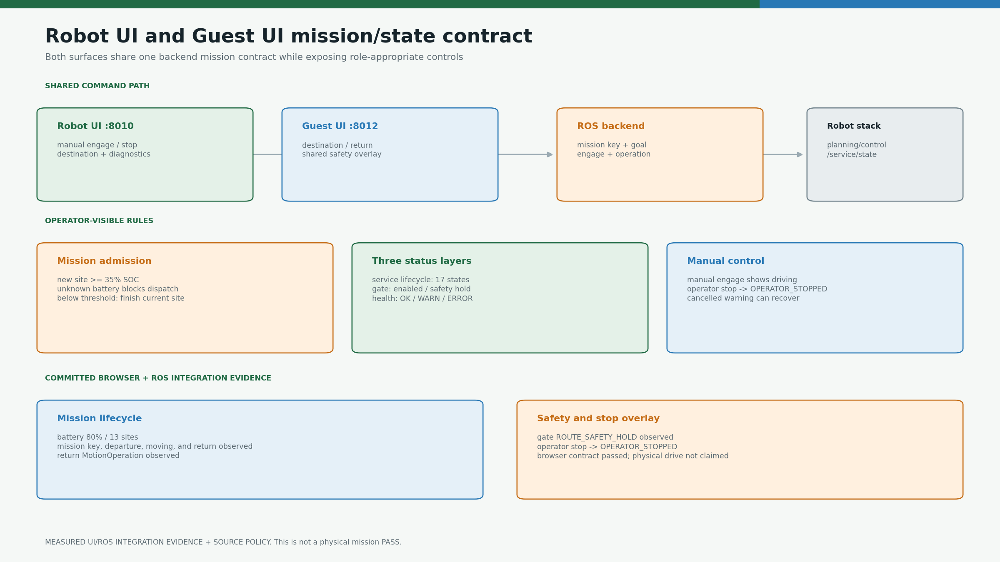

## At A Glance

| Surface | User actions | Shared feedback |
|---|---|---|
| Robot UI | Manual engage/stop, map-selected Goal Pose, campsite dispatch, return, tuning, diagnostics | Service state, command gate, battery, health |
| Guest UI | Campsite selection and return request | Same service state, SOC admission, and safety overlay |
| Backend | Resolves mission key/goal and publishes typed ROS commands | WebSocket state snapshots and arrival events |

## Active Deployment Values

| Item | Full-bringup value |
|---|---:|
| Robot UI | `0.0.0.0:8010` |
| Guest UI | `0.0.0.0:8012` |
| Campsites | `B1..B13` |
| New mission battery | `>= 35%` |
| Battery feedback required | `true` |
| Low-battery current-mission latch | `< 35%` |
| Hard stop authority | control gate at `<= 20%`, not the UI |
| Guest disconnect lock grace | `60 s` |
| Guest heartbeat / stale close | `10 s` / `45 s` |
| Local operator window | fullscreen WebKit by default; Chromium and `auto` explicit alternatives |
| Operator telemetry transport | latest-value WebSocket `10 Hz`; REST fallback `1 Hz` |
| Operator telemetry lease | `12 s`; browser heartbeat every `4 s`, immediate disconnect watcher |
| Docking telemetry | nine lazy subscriptions: tag debug/pose/detected, three paths, three controller states |
| Manual Return | one `POST /ui/manual_return` authority; `0.50 s` stopped preemption during ordinary travel, duplicate presses coalesced |
| Charging campsite selection | accepted and queued; `7.0 s` with manual, mission, and platform authorization closed before one station `EXIT` |
| Service evidence | `Asia/Seoul`; SQLite at `~/.local/state/camrod/service_metrics.sqlite3`; public summary plus 30-day detail |
| Confirmed-tent occupancy guard | `false` by default; set `bringup.control.enable_campsite_occupancy_guard: true` to block pre-entry dispatch |

See the [runtime parameter reference](../docs/RUNTIME_PARAMETER_REFERENCE.md)
for UI battery admission, telemetry rates, feature switches, manual Return,
parking, and the control/sensing files behind each displayed value.

## Destination Dispatch

```text
site B<N>
  -> mission key camping_site_<N>
  -> service/operational goal from camping_sites.yaml
  -> /ui/selected_destination
  -> /planning/mission_key + /planning/site_goal_pose_ros
  -> /platform/drive_enable + /planning/mission_engage
  -> /service/state = MOVING_TO_SITE
```

Unknown battery or SOC below 35% blocks a new destination. If SOC falls below
35% during an active campsite mission, the current site phase finishes and the
UI waits for the normal return request; it does not command immediate motion
while users may be unloading.

When a valid campsite is selected in `CHARGING` or
`WAITING_FOR_CHARGING`, the backend stores the destination but publishes no
site goal. A one-shot ROS timer keeps manual engage, mission engage, and
platform drive-enable false for `charging_departure_delay_s` (`7.0 s` in full
bringup). Expiry emits exactly one parking cancel and one drop-zone `EXIT`;
the campsite key and goal remain deferred until `exit_complete=true`.
Operator Stop, shutdown, and a duplicate destination safely cancel or reuse
the pending timer without reopening authorization.


The perception occupancy topic continues to report confirmed tent sites. The
UI/control admission guard is an explicit shared toggle and defaults to `false`
because the requested delivery site can legitimately contain the guest's tent.
When enabled, it blocks or cancels a pre-entry dispatch; `SITE_ENTRY` and later
phases are not interrupted by a newly observed tent.

## State Display

| Layer | UI label examples | Source |
|---|---|---|
| Operation | Moving to site, Entering site, Waiting for return, Charging | `/service/state` (17 states) |
| Motion authorization | Driving, Standby, Route safety hold | command-gate status |
| Health | System OK, warning, error | `/system/status` and aggregated diagnostics |
| Battery | Ready/block/charging and SOC | `/platform/status` |

<!-- HH_260810 - Separate boot readiness from every mission/goal source. -->
`INITIALIZING -> READY` requires healthy configured modules, a usable planning
action server/state, normal localization with `map -> robot_center_link`, a
healthy command gate, and platform feedback. It does **not** require an RViz
goal, campsite destination, path, or `/service/state` mission transition. A
`0.5 s` authoritative WebSocket heartbeat repairs startup snapshot ordering, so
the UI cannot remain stale until the next goal event. Operator-map `/goal_pose`,
maintenance RViz goals, and campsite goals enter the same post-ready
mission-phase policy while retaining separate manual/site input topics.

Operator stop publishes `OPERATOR_STOPPED`; a previous planning warning is not
the operation label. The active campsite ID is retained separately from the
transient destination ack, so arrival notifications still identify the
selected site after departure.

The administrator long-press entry and authenticated workspace are top-level
UI surfaces. They remain available during waiting, manual/campsite driving,
arrival, unload wait, return, parking, and charging; a service-state render
change no longer closes the diagnostics view or its telemetry lease.

## Field Operation Evidence

The public waiting screen shows the current or latest service distance, today's
distance and completed-service count, and all-time distance and completions.
Opening the strip shows per-day totals and recent service rows. It also shows
B1-B13 together as average distance/time bars and a quantitative table with
attempts, completions, completion rate, latest run, and active run. Active-run
percentages are relative to that site's completed-run average; they are not a
route-completion estimate. During an active campsite service the control
preview also shows the current trip distance.

A run begins only after destination occupancy and battery admission succeeds.
It completes at `WAITING_FOR_CHARGING`, `CHARGING`, or `DROP_ZONE_WAIT` and is
recorded as interrupted at `OPERATOR_STOPPED`. Interrupted distance remains in
the honest travelled-distance total but does not increment completed service
count. Planar `/platform/status.velocity` is trapezoid-integrated, including
lateral motion; duplicate timestamps, samples above `3.0 m/s`, and gaps above
`2.0 s` are rejected. The database is checkpointed during travel and reloaded
after process or workspace rebuilds. Evidence starts accumulating with the
first accepted service after this version is deployed; it does not invent
historical runs.

## Operator Telemetry Workspace

The administrator diagnostics modal now contains `System` plus seven live views:
`GNSS · IMU`, `Radar · LiDAR`, `Camera`, `Driving trajectory`,
`Map · Perception`, `Safety · Control`, and `Docking · Parking`. These views
consume the same ROS messages used by the standalone tools and RViz. The
trajectory view can publish a manual goal only after explicit confirmation;
no view changes sensor authority.

| Previous live tool / RViz display | UI replacement |
|---|---|
| `util/gnss_status_gui.py` | Fix, RTK carrier, satellites, accuracy, baseline, and heading |
| `util/gnss_imu_direction_check.py` | GNSS/IMU/localization heading comparison and EKF input health |
| `camrod_sensing/scripts/radar_status_gui.py` | Seven range channels, real mounts, rounded body, planning boundary, and LiDAR samples; finite raw `ECHO` is distinct from cost-producing `COST` evidence |
| `camrod_platform/scripts/velocity_kph_gui.py` | Speed, yaw rate, motion mode, and pose readout |
| `camrod_planning/scripts/path_visualizer_node.py` | Lanelet map, global/local/maneuver paths, driven trace, and tracking error |
| RViz map/perception layers | Lanelet polylines, four cost layers, obstacle cloud/boxes, body, and planning contour |
| RViz diagnostics and controller markers | Safety-gate reason, service state, maneuver owners, radar evidence, and obstacle replan status |
| Camera payload probe | Front/rear compressed frames, source rate, age, format, and payload size |
| AprilTag/parking RViz topics | Docking debug image, exact tag pose/distance, charging boolean, controller phases, exact lanelet-point path, and reverse/AprilTag paths |

## Manual Goal Pose

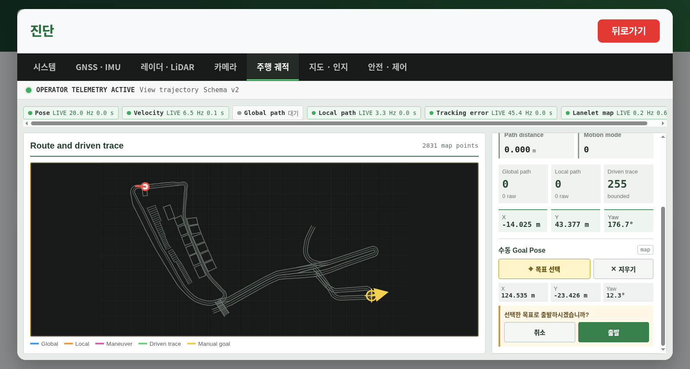

Open `Diagnostics -> Driving trajectory`, select `Goal`, then click the map for
`x/y` or drag from that point to set yaw. The goal remains a local draft until
the separate confirmation panel's departure command is pressed. A plain click
uses the current robot yaw. Tracking mode stays route-focused; selecting `Goal`
fits the complete available Lanelet map so an idle robot can choose a remote
destination.

| Stage | Contract |
|---|---|
| Browser | Converts the SVG pointer through the live view transform into finite `map` x/y/yaw values |
| Confirmation | Displays the selected coordinates and requires a second action; selection alone cannot move the robot |
| Admission | Requires UI `ready`, known SOC `>=35%`, no charging contact, and no campsite/return/parking/charger owner |
| Dispatch order | Publishes raw `PoseStamped` on `/goal_pose`, then `/platform/drive_enable=true` and `/planning/engage=true` |
| Planning | `goal_snapper` preserves requested yaw, snaps position to a reachable lanelet, and selects the manual RotationShim profile |
| Stop | Existing operator stop cancels Nav2/local owners and disables engage/drive-enable |

The isolated AMD64 simulation omitted the `rviz` argument and started no RViz
process. A reachable goal at `(-18.275650, 43.558984, -15.039 deg)` was selected
and confirmed with real browser pointer/button events, then observed on
`/goal_pose`. Both authorization topics, manual `DRIVING`, a bounded `500`-point
global path (`1024` raw), a `154`-point local path, and final Nav2 goal success
followed.
The detailed non-physical record is in the
[operator-map integration result](../docs/assets/module-guides/ui/test-results/operator-manual-goal-20260810/README.md).

Offline renderers under `camrod_bringup/scripts/visualization/` still generate
versioned documentation evidence; they are not live runtime viewers and were
not moved into the browser.

| Live sim check, 2026-08-10 | Observed result |
|---|---:|
| Localization pose | `20.0 Hz` |
| NavSatFix / IMU / seven radar channels | about `10.0 Hz` each |
| LiDAR browser decode | about `1.8 Hz`, capped at `2 Hz` and `480` samples |
| Lanelet browser geometry | `2,831` points in `357` bounded polylines |
| Physical / planning outline | `31 / 31` rounded points from runtime topics |
| Browser layout | no page overflow at `1600x1000` |
| Current simulated cameras | no publisher by launch policy; UI correctly reports `NO FRAME` and both target rates as `10 Hz` |

Camera, LiDAR, map, path, and auxiliary sensor subscriptions exist only during
an active telemetry lease. A dedicated WebSocket carries only the selected
view's latest bounded snapshot at up to `10 Hz`; command/state traffic remains
on `/ws`. Closing the view is detected by the server receive path and releases
the subscriptions immediately. A `4 s` browser heartbeat renews the lease, so
a silent client loss stops renewal and releases subscriptions after `12 s`.
REST polling remains a `1 Hz` compatibility fallback.
Compressed camera bytes are forwarded without decode/re-encode. Point clouds,
paths, driven traces, and map lines are bounded before JSON serialization.
FastAPI/WebSocket lease changes trigger a ROS GuardCondition immediately. A
separate `1 Hz` timer only expires abandoned leases, replacing the former
permanent 10 Hz executor poll without changing the visible 10 Hz stream.

<!-- HH_260810 - Quantify the per-view lease instead of describing the ARM64
load reduction as an unmeasured optimization. -->

| Telemetry view | Dynamic subscriptions | Reduction from former 32 always-on subscriptions |
|---|---:|---:|
| GNSS / IMU | `6` | `81.25%` |
| Radar / LiDAR | `11` | `65.63%` |
| Camera | `4` | `87.50%` |
| Trajectory | `7` | `78.13%` |
| Map / perception | `9` | `71.88%` |
| Safety / control | `7` | `78.13%` |
| Docking / parking | `7` | `78.13%` |

Every view change clears the previous lease's receive timestamps before new
samples are counted. A live GNSS -> proximity -> GNSS switch therefore reported
GNSS `10.01 Hz`, IMU `10.01 Hz`, and selected pose `20.02 Hz` after one second,
instead of retaining the idle gap and temporarily displaying `0.1 Hz`.

| GNSS and localization | Radar, LiDAR, and runtime boundaries |
|---|---|
|  | 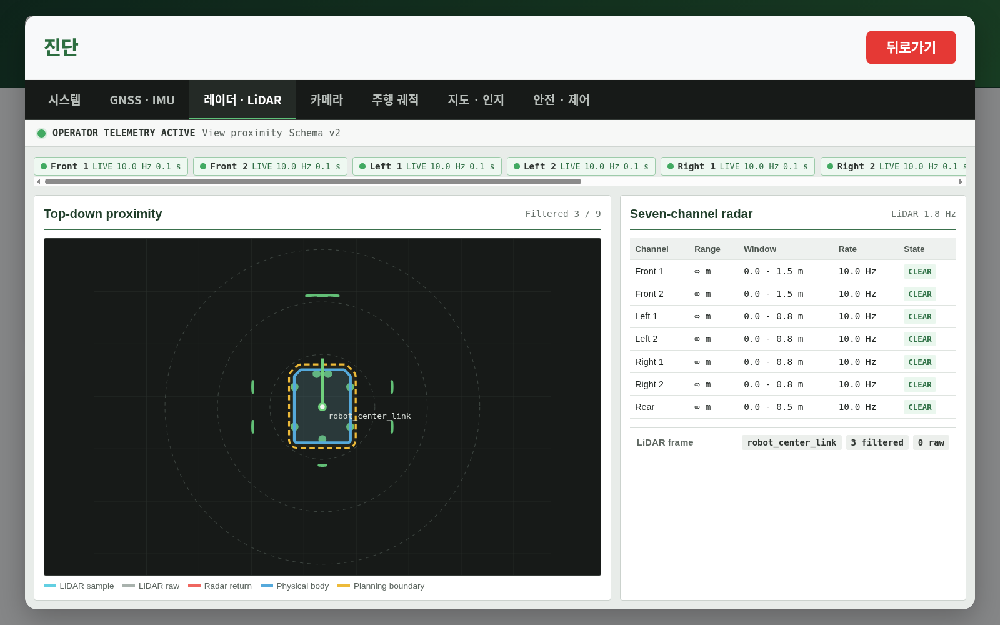 |

| Front/rear camera contract | Route and driven trace |
|---|---|
|  | 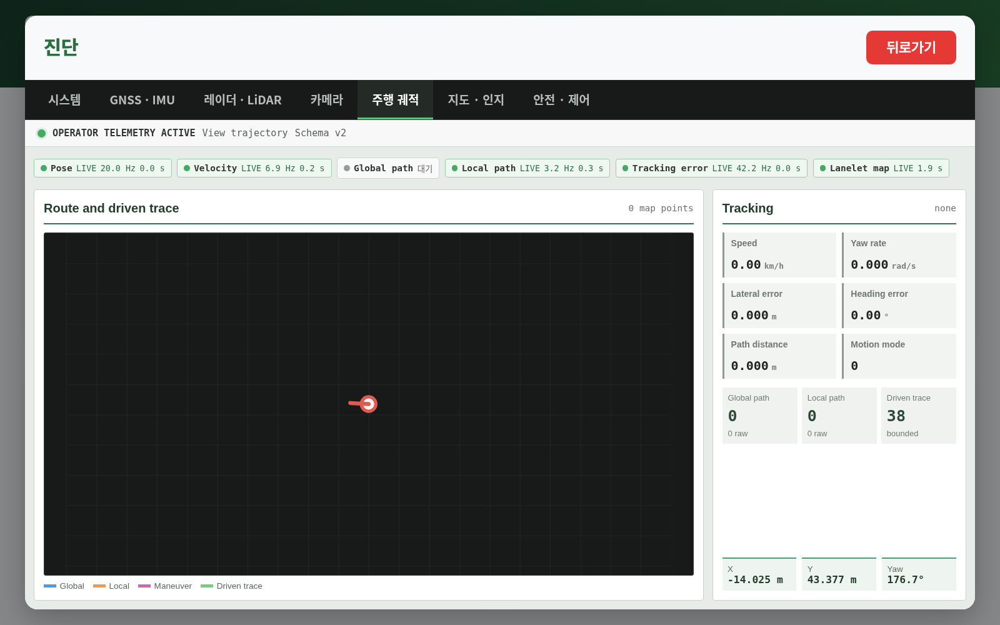 |

| Map and perception | Safety and command ownership |
|---|---|
| 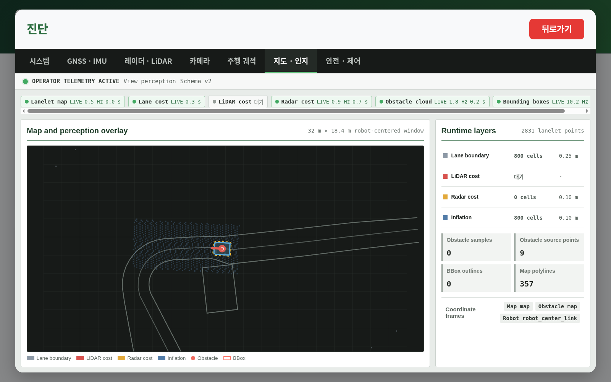 |  |

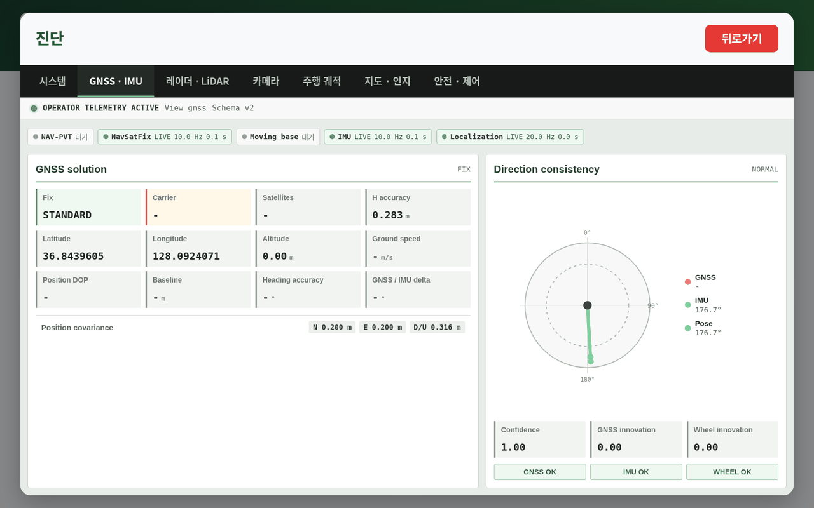

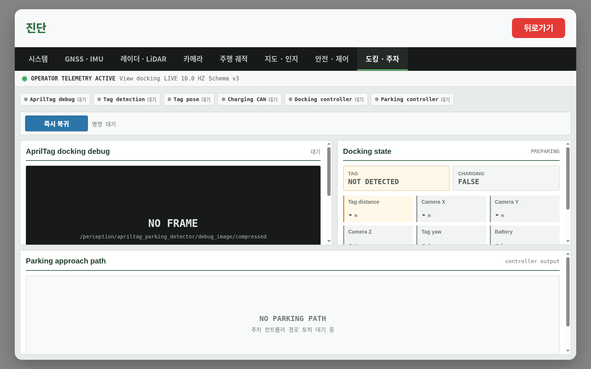

The [current docking UI capture](../docs/assets/module-guides/ui/test-results/docking-workspace-20260819/README.md)
uses the production frontend and ROS backend at schema v3 and `10 Hz`. It shows
pending tag/charging values because the UI-only capture had no physical rear
camera or charger; it verifies the screen and lazy transport, not tag accuracy.

### Measured AMD64 10 Hz Transport

<!-- HH_260810 - Keep transport timing separate from the earlier full-sim
per-view profile; this standalone measurement has no sensor publishers. -->

`MEASURED WORKSTATION`: Release-installed standalone UI backend on x86_64,
trajectory view, no camera/LiDAR/GNSS publishers. CPU is one-logical-core basis.
This verifies scheduling, bounded payload, and lease cleanup, not sensor decode
cost or ARM64 acceptance.

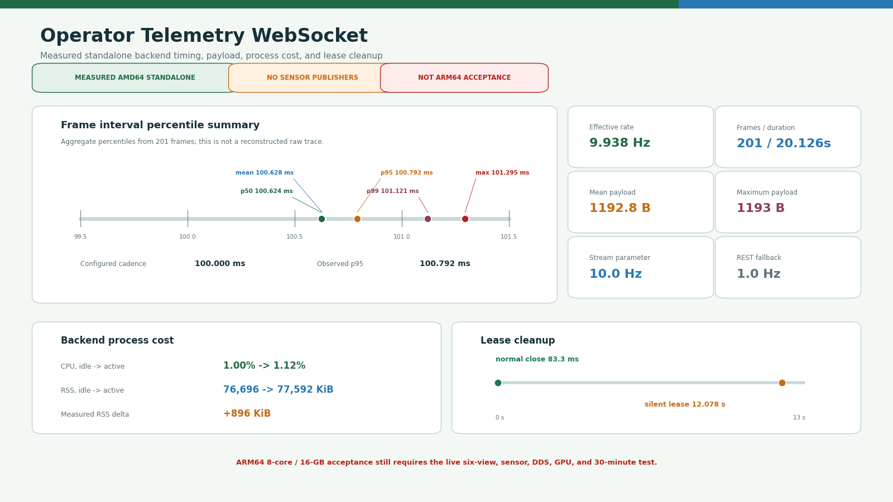

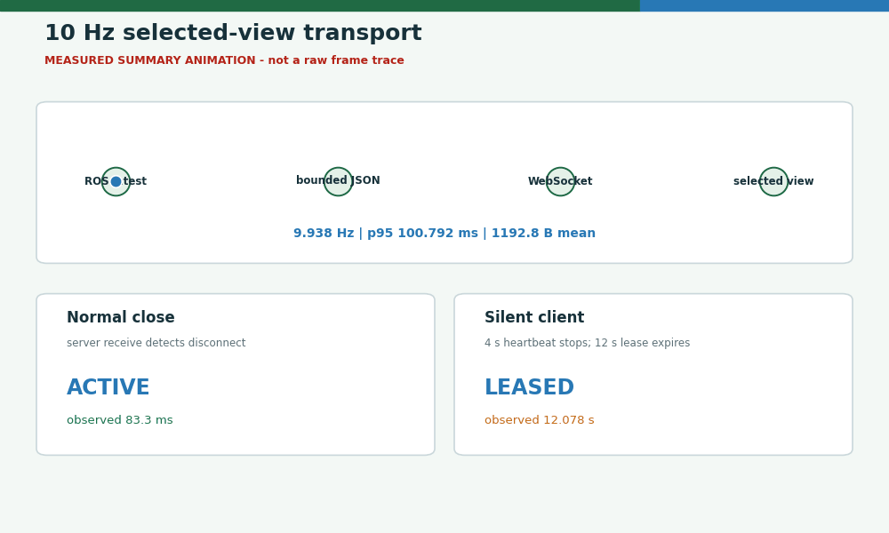

| Check | Observed result |
|---|---:|
| WebSocket frames / duration | `201 / 20.126 s` |
| Effective stream rate | `9.938 Hz` |
| Frame interval mean / p95 / max | `100.628 / 100.792 / 101.295 ms` |
| Mean / max JSON payload | `1192.8 / 1193 bytes` |
| Backend idle -> active CPU | `1.00% -> 1.12%` |
| Backend idle -> active RSS | `76,696 -> 77,592 KiB` |
| Normal close release detection | `83.3 ms` in the recorded run |
| Silent client lease expiration | `12.078 s` with no heartbeat |

The reproducible command and structured values are in
[`operator-telemetry-websocket-amd64-20260810`](../docs/assets/module-guides/ui/test-results/operator-telemetry-websocket-amd64-20260810/README.md).

### Current AMD64 Return/Lease A/B


On the same 45-process, 30-second, charging-idle full graph, event-driven lease
wakeup changed total CPU `81.88 -> 80.78%` and UI CPU `6.93 -> 6.53%` on the
Linux one-core basis. Summed RSS changed `1955.6 -> 1938.7 MiB`. RViz, browser,
and Guest UI were off in both runs. The [structured A/B record](../docs/assets/module-guides/ui/test-results/return-resource-amd64-20260819/README.md)
is AMD64 comparison evidence only; ARM64 8-core/16-GB acceptance remains open.

The [live preemption record](../docs/assets/module-guides/ui/test-results/manual-return-preemption-amd64-20260819/README.md)
uses the production HTTP endpoint and ROS graph after B6 moved `2.019 m`.
Command output reached zero in `5.01 ms`, duplicate requests produced one
planning recall at `0.508 s`, and a fresh `2.133 m` reverse path was observed.
Frontend tests bind both visible Return controls to that one endpoint.

### Historical AMD64 Per-View Cost


`HISTORICAL MEASURED WORKSTATION`: UI backend process only, 2 Hz API polling, six samples
per view on an i5-12400F host. CPU is one-logical-core basis; these values are a
relative implementation check, not an ARM64 acceptance result.

| View | Mean CPU | Mean PSS | Mean JSON payload |
|---|---:|---:|---:|
| Idle | `7.58%` | `79.32 MiB` | `2.53 KiB` |
| GNSS / IMU | `9.56%` | `79.34 MiB` | `3.19 KiB` |
| Radar / LiDAR | `11.86%` | `79.20 MiB` | `5.62 KiB` |
| Camera, no sim publishers | `7.91%` | `78.77 MiB` | `2.52 KiB` |
| Trajectory | `10.88%` | `79.03 MiB` | `7.73 KiB` |
| Map / perception | `14.45%` | `80.00 MiB` | `36.14 KiB` |
| Safety / control | `10.16%` | `81.27 MiB` | `3.35 KiB` |

All six historical browser captures used a `1600x1000` content viewport and had
document/workspace overflow `0` plus text-control overflow `0`. The stricter
`1280x657` headless pass also had no horizontal overflow, HTTP failure, or
console error. ARM64 8-core/16-GB soak, live camera frame pacing, and GPU use
remain field acceptance items.

## Actual Browser Runtime

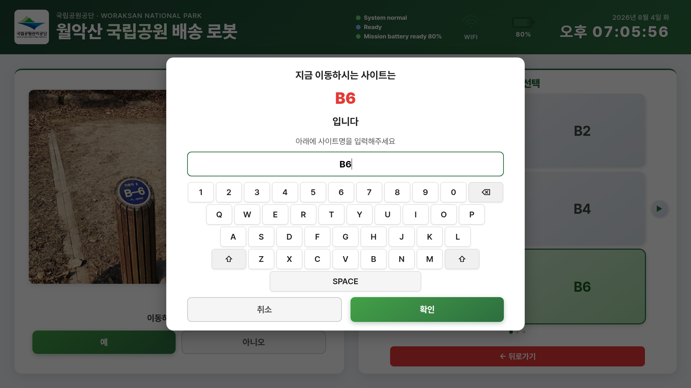

| Mission-ready dispatch | Route safety overlay |
|---|---|
| 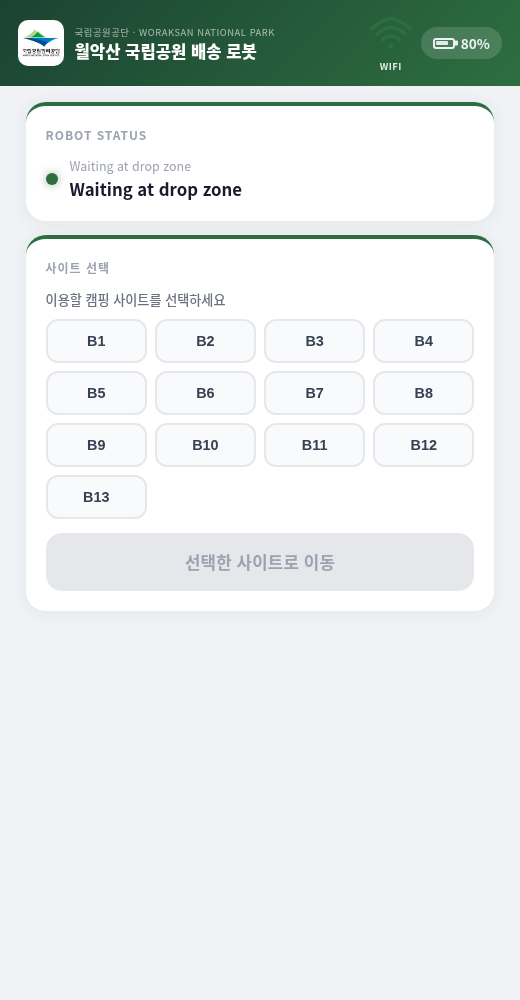 |  |

`SIM BROWSER CAPTURE`: these are rendered Guest UI screens connected to the
running ROS backend, not generated UI mockups.

| Integration check | Result |
|---|---|
| Initial state | `80%` SOC, ready, 13 sites |
| Goal-independent startup | No RViz/UI goal published; planning `WAIT_DZ`, UI `ready=true`, `mission_phase=READY` |
| Operator-map goal | No RViz process; click/drag marker and confirmation rendered with overflow `0`; `/goal_pose`, engage, drive-enable, manual `DRIVING`, and global/local paths observed |
| Destination | Mission key and departure/moving state observed |
| Return | Return state and `MotionOperation.RETURN` observed |
| Safety | `ROUTE_SAFETY_HOLD` overlay observed |
| Cancel | `POST /ui/stop` HTTP 200; all local owners and Nav2 canceled; state `16 OPERATOR_STOPPED` observed |
| Robot site verification | `B6` virtual-key input at 1920x1080 and lowercase physical-key normalization at 1280x800; both produced the same destination frame |
| Robot UI negative paths | Wrong `B5` sends nothing, correction sends `B6`, cancel sends nothing, Guest return exits idle, and diagnostic keypad login remains valid |
| Current production bundle | At 1280x800, destination screen appeared in 1.1 ms and the 40-key verification keypad in 17.6 ms; queued same-frame `B`+`6` remained `B6`, cancel sent zero frames, and confirmation sent one frame |
| WebKit fallback smoke | WebKitGTK 2.50.4 waited for backend readiness, loaded on the first render attempt, and shut down cleanly |
| Historical renderer sample | Before static status cues, forced WebKit was near 97% of one workstation CPU; a later Chromium sample was 0.5% combined |
| Chromium alternative contract | Private kiosk profile, GPU rasterization, zero-copy compositor, backend readiness wait, and process-group shutdown are unit-tested |
| Robot/Guest backend shutdown | Full-graph SIGINT smoke: both backends exited cleanly, with no traceback, failed process, or remaining child |
| Charging recall | Active charger contact no longer overwrites `DEPARTING_CHARGER`; B2/B3 departure completed in the three-cycle service soak |
| Duplicate destination | A repeated WebSocket destination while station exit is pending is idempotent; one maneuver owner and state transition remain |

This validates browser/backend/ROS integration. It is not a physical mission or
collision-safety test. Neither historical renderer sample proves current
Jetson CPU/GPU use; a production Jetson profile is still required.


The historical map-v17 simulation completed charging recall and next-site
departure twice after the initial cycle. Current `camrod_ui` regression tests
pass `72/72`; actual CAN timing, touchscreen latency, and Jetson kiosk
performance remain field work.

<!-- HH_260807 - Record the Humble shutdown-only conversion race separately
from operational backend failures. -->
On ROS 2 Humble, context teardown can raise a `RuntimeError` while converting a
queued message instead of `ExternalShutdownException`. Robot and Guest backends
now treat that exception as a normal shutdown only when `rclpy.ok()` is already
false. A live `RuntimeError` is still re-raised. The full Robot+Guest UI smoke
ended both processes with exit code 0 and left no backend process behind.

The filtered [shutdown and repeated-service record](../docs/assets/module-guides/bringup/test-results/b1-b10-service-endurance-20260807/README.md)
also covers nine successive charger recalls after the seeded B1 handoff. Each
recall reached `DEPARTING_CHARGER`, disconnected simulated charge feedback, and
accepted the next campsite without duplicating the destination or motion owner.

## Key ROS Interfaces

| Direction | Topic | Purpose |
|---|---|---|
| Publish | `/ui/selected_destination` | Typed destination command |
| Publish | `/planning/mission_key` | Semantic mission selection |
| Publish | `/goal_pose` | Confirmed operator-map or maintenance RViz manual goal |
| Publish | `/planning/site_goal_pose_ros` | Regulated campsite operational goal |
| Publish | `/planning/mission_engage` | Mission motion authorization request |
| Publish | `/platform/drive_enable` | Platform drive-enable request |
| Publish | `/ui/camping_site_operation_request` | Return/adopt operation request |
| Publish | `/planning/state_machine/return_to_drop_zone` | State-independent planning return recall |
| Publish | `/control/drop_zone_maneuver_controller/operation` | At-station yaw alignment before final parking |
| Publish | `/parking/operation` | Selected reverse/AprilTag parking start or cancel |
| Subscribe | `/service/state` | Public lifecycle |
| Subscribe | `/planning/goal_pose_snapped_ros` | Timestamp-correlated route anchor for same-site roadside adoption |
| Subscribe | `/planning/lanelet_pose` | Fresh lanelet agreement guard for B11-B13 operational stops |
| Subscribe | `/control/cmd_vel_safety_gate/status` | Motion/safety overlay |
| Subscribe | `/platform/status` | SOC, charging, and platform state |
| Subscribe | `/system/diagnostics_agg` | Detailed health display |
| Subscribe | AprilTag debug/pose/detected, three parking paths/statuses | Lazy docking workspace |

## HTTP And WebSocket

| Method/path | Purpose |
|---|---|
| `GET /ui/health` | Backend liveness |
| `GET /ui/state` | Full UI state snapshot |
| `GET /ui/destination` | Current/valid destinations |
| `GET /ui/diagnostics` | Aggregated diagnostic detail |
| `GET /api/service-metrics/summary` | Current/latest, today, all-time, and B1-B13 average/latest/current summaries without history arrays |
| `GET /api/service-metrics?days=30&recent_limit=50` | Date totals, recent services, and the same B1-B13 quantitative comparison |
| `POST /api/telemetry/session?active=true|false&view=<name>` | Acquire/release one bounded live-view lease |
| `GET /api/telemetry` | Sensor, localization, route, and safety snapshot |
| `GET /api/telemetry/map` | Bounded static Lanelet marker geometry |
| `GET /api/camera/front`, `/api/camera/rear`, `/api/camera/docking` | Latest compressed frame without re-encoding |
| `WS /ws/telemetry?view=<name>` | Selected-view latest snapshot at configured `1-20 Hz`; production default `10 Hz` |
| `POST /ui/destination?site=B6&run=true` | Select and dispatch a campsite |
| `POST /ui/manual_goal?x=<m>&y=<m>&yaw_deg=<deg>` | Validate and dispatch a confirmed operator-map goal |
| `POST /ui/manual_return` | Site: latch exit then plan at the shared snap; normal travel: cancel, stop for `0.50 s`, then publish one drop-zone recall; drop zone: align for parking; charging: no motion |
| `POST /ui/engage?value=true|false` | Manual engage/disengage |
| `POST /ui/stop` | Operator stop |
| `WS /ws` | Real-time state updates |

Guest frames use one serialized writer. ROS publish work runs outside the
uvicorn event loop, and three missed 15-second receive windows release a stale
single-client slot. The browser heartbeat keeps a healthy idle session active.

The manual Return publisher serializes physical exit and route planning.
Inside a campsite it latches RETURN and defers the planning recall until the
campsite controller reaches the shared snap anchor; during ordinary driving it
first cancels Nav2, closes mission/drive authorization for `0.50 s`, then opens
the gate and publishes exactly one drop-zone recall. Both visible Return
controls call this API; a second press while preempting or returning is
idempotent. At the drop zone it starts body-yaw alignment before the configured
parking method. The obsolete operator Parking ON/OFF command was removed so it
cannot bypass this service-owned handoff. With a true charging contact it reports
`already_charging` and publishes no motion. If the public state still says
`CHARGING` after CAN contact is lost, it restarts parking alignment instead of
creating a redundant Nav2 loop.

B11-B13 re-selection uses a separate fail-closed arrival contract. The backend
correlates the UI raw-goal timestamp with its real snapped route goal, requires
a fresh `/planning/lanelet_pose` that still agrees with that mission anchor,
and recognizes only the signed `0.30 m` roadside target within `0.60 m`
longitudinal and `0.15 m` lateral error. It never enlarges the generic `2.5 m`
site-center radius or falls back to the live vehicle pose. A match publishes
the normal campsite `adopt` request; the Return button then makes the
controller crab back to that cached lanelet snap before route planning resumes.

## Measured amd64 Renderer A/B

`MEASURED WORKSTATION`: three headless-RViz full-sim runs per renderer on an
Intel i5-12400F/RTX 3060 desktop, with 15 one-second steady-state samples per
run. Only `operator_ui_window_engine` changed.

| Mean | WebKit | Chromium | Chromium - WebKit |
|---|---:|---:|---:|
| Processes | `69.1` | `80.4` | `+11.3` |
| CPU, one-core basis | `89.3%` | `90.8%` | `+1.44 points` |
| PSS | `1926.2 MiB` | `2253.5 MiB` | `+327.3 MiB` |
| Startup to `[SYSTEM] OK` | `26.77 s` | `25.44 s` | `-1.33 s` |
| Controlled stop / no descendants | `3/3` | `3/3` | equal |

On this workstation WebKit is clearly lighter. Chromium's full stack reached
`[SYSTEM] OK` sooner on average, but this is not a browser first-paint/load
measurement. Host GPU utilization is not used because `nvidia-smi` also
included the desktop and personal browser. The field default is WebKit because
the robot image's Snap Chromium does not start; the Jetson
same-scene frame-pacing/GPU/rate comparison remains TODO 8/14. Exact runs are
in [`amd64-container-ab-20260805.json`](../docs/assets/module-guides/runtime/evidence/amd64-runtime-topology-20260805/amd64-container-ab-20260805.json).

## Build And Run

<!-- HH_260825 - Keep generated frontend assets package-local, but route colcon
outputs through the canonical workspace wrapper outside the source tree. -->

```bash
cd ~/camrod_ws/src/camrod_ui/camrod_ui_robot/assets/frontend
npm ci
npm run build

cd ~/camrod_ws/src
./colcon_build.sh --packages-select camrod_ui
cd ~/camrod_ws
source install/setup.bash

ros2 launch camrod_ui ui.launch.py
curl http://127.0.0.1:8010/ui/health
curl http://127.0.0.1:8010/ui/state
```

`setup.py` installs the generated React `build/` tree; it does not run npm.
Regenerate that tree before colcon whenever frontend sources or public assets
change. Set `enable_operator_ui_window:=false` on headless hosts, or use
`operator_ui_window_fullscreen:=false` for a resizable maintenance window.
WebKit is the standalone and full-bringup default because the robot's Snap
Chromium currently exits in `snap-confine` before opening a window. The launcher
waits for the backend before opening the first page.

Use `operator_ui_window_engine:=chromium` only on a host where Chromium can
start normally. That mode retains its isolated kiosk profile, GPU rasterization,
zero-copy compositor, and disabled background throttling. `auto` tries Chromium
first and then WebKit; `CAMROD_UI_BROWSER` overrides Chromium executable
selection. Actual Jetson renderer utilization and frame pacing remain field
measurements.

## Network Boundary

Standalone UI and full bringup bind ports 8010 and 8012 to all interfaces for
robot-network access. The current backend has no authentication and permissive
CORS. Do not expose either port to a public or untrusted network; use a trusted
robot LAN, firewalling, or an authenticated tunnel.

Evidence JSON: [`guest-mission-lifecycle.json`](../docs/assets/module-guides/ui/evidence/v2.1.3-guest-mission/guest-mission-lifecycle.json).
