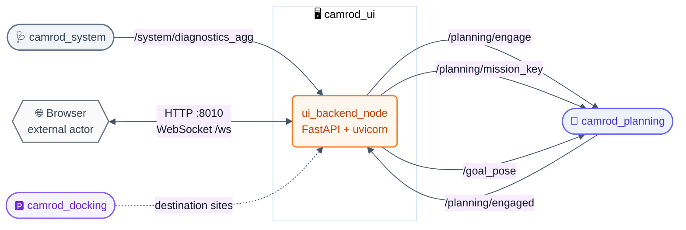
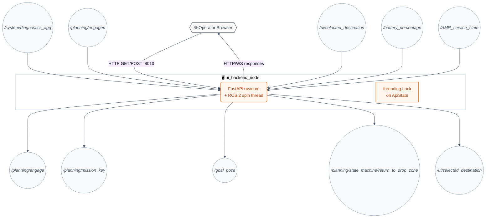
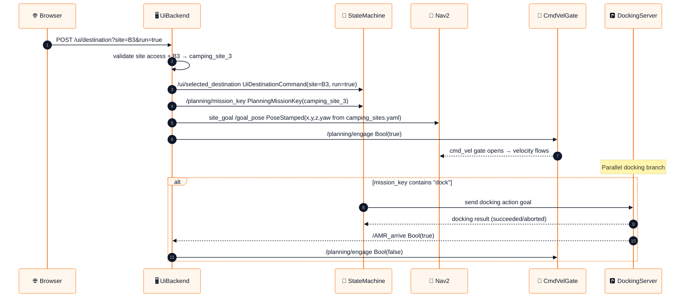
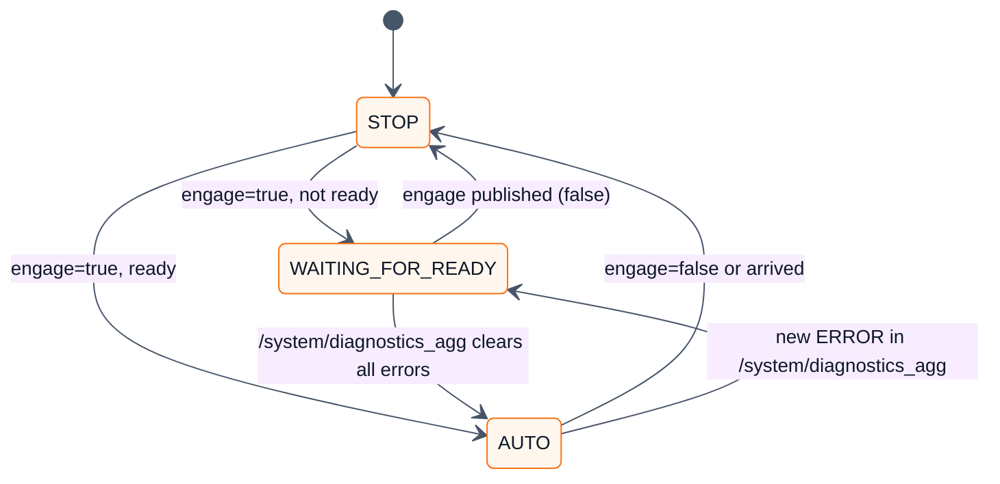
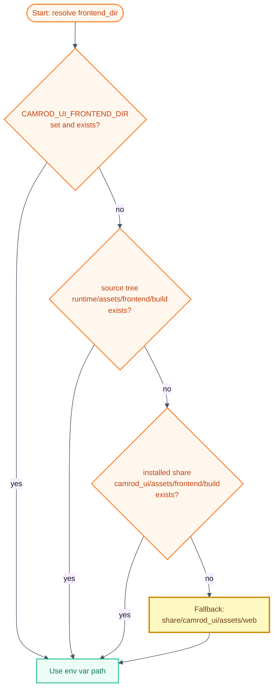

# 🖥️ camrod_ui — Operator HTTP backend & web UI

**camrod_ui** — FastAPI HTTP backend (port 8010) and React operator web UI for the CAMROD robot. Replaces the former `camrod_api` package.

---

## 📋 Summary

`camrod_ui` provides the operator control interface for CAMROD. `ui_backend_node` runs a FastAPI + uvicorn HTTP server in a daemon thread alongside the ROS 2 spin loop. It serves the static React frontend and exposes REST endpoints (and a `/ws` WebSocket channel) for system state, destination selection, engage/disengage control, campsite reservation/occupancy gating, and battery status.

On the ROS side it bridges operator intent to planning topics without making any autonomy decisions itself.

> **Non-goals:** Makes no path-planning or vehicle-control decisions. The UI backend can reject unsafe/invalid campsite commands using the reservation/occupancy gate, but it does not replace planning, localization, perception, or hardware safety checks. WebSocket is for real-time UI push only; it does not replace the REST API.

---

## 🚀 Quick Start

```bash
# Build
cd ~/camrod_ws
colcon build --packages-select camrod_ui
source install/setup.bash

# Default (localhost only)
ros2 launch camrod_ui ui.launch.py

# Expose to LAN
ros2 launch camrod_ui ui.launch.py ui_host:=0.0.0.0 ui_port:=8010

# Custom camping sites YAML
ros2 launch camrod_ui ui.launch.py camping_sites_yaml:=/path/to/camping_sites.yaml

# Custom reservation/occupancy gate YAML
ros2 launch camrod_ui ui.launch.py site_access_yaml:=/path/to/site_access.yaml

# Rebuild the React frontend
cd camrod_ui/camrod_ui_robot/assets/frontend
DISABLE_ESLINT_PLUGIN=true npm run build

# Public kiosk build with operating-hours gate enabled
REACT_APP_OPERATING_HOURS_GATE_ENABLED=true \
REACT_APP_OPERATING_HOURS_START=9 \
REACT_APP_OPERATING_HOURS_END=16 \
DISABLE_ESLINT_PLUGIN=true npm run build

# Health check
curl http://localhost:8010/ui/health
```

---

## 🗺️ System Position



---

## 🏗️ Runtime Architecture



`ui_backend_node` runs two concurrent execution contexts:
1. A ROS 2 spin thread for ROS subscriptions and publications.
2. A FastAPI+uvicorn asyncio event loop in a daemon thread for HTTP/WebSocket.

Thread safety between the two contexts is managed by a `threading.Lock` on `ApiState`.

---

## 🔑 Key Behaviors

### Destination Dispatch Sequence

**HH_260617 terminology:** `mission_key` is the semantic site id (`camping_site_3`), `site_goal` is the raw site-center pose on `/goal_pose`, and `route_goal` is the lanelet-snapped Nav2 pose produced by camrod_planning. Public topic names stay unchanged for compatibility.



### Operator Mode State Machine



`operation_mode` is derived from `engaged AND ready`:
- 🟢 `AUTO` — `engaged=true` AND `ready=true`
- 🟡 `WAITING_FOR_READY` — `engaged=true` AND `ready=false`
- 🔴 `STOP` — `engaged=false`

`ready` is `true` when `/system/diagnostics_agg` has at least one entry and zero ERROR-level statuses.

### Frontend Path Resolution



> Static files are served manually (not via Starlette `StaticFiles`) to support `--symlink-install` builds where symlinked files would otherwise fail the Starlette commonprefix security check. All paths not matching a real file fall back to `index.html` (SPA routing).

### Operating-Hours Gate

> HH_260619: Developer/test frontend builds bypass the public operating-hours gate by default.

The waiting screen accepts taps at any time unless the React bundle is built with `REACT_APP_OPERATING_HOURS_GATE_ENABLED=true`. This keeps development, route testing, and operator validation independent from public service hours.

| Build mode | Command |
|---|---|
| Developer/test | `DISABLE_ESLINT_PLUGIN=true npm run build` |
| Public kiosk | `REACT_APP_OPERATING_HOURS_GATE_ENABLED=true REACT_APP_OPERATING_HOURS_START=9 REACT_APP_OPERATING_HOURS_END=16 DISABLE_ESLINT_PLUGIN=true npm run build` |

### Reservation / Occupancy Gate

> HHL_260621: `site_access.yaml` is the first UI-side guard against human error. A campsite button is accepted only when the selected site is valid and the current site access record allows delivery.

> HHL_260622: Destination dispatch now validates the site-access record before publishing `/planning/engage`; a rejected campsite request cannot open the velocity gate.

The gate is intentionally a command filter, not a replacement for perception/cost safety. It prevents obvious business-logic errors before `/goal_pose` is published:

- `AVAILABLE`, `RESERVED`, `CHECKED_IN`: delivery can be allowed.
- `OCCUPIED`, `CHECKED_OUT`, `BLOCKED`: delivery is rejected by default.
- New delivery requests are accepted only while `/AMR_service_state.state` is `DROP_ZONE_WAIT` by default.
- `recall_allowed` can remain true for `OCCUPIED` / `CHECKED_OUT` so guest recall drives only to the road/staging target instead of entering the campsite.
- `require_reservation_code_for_delivery=true` forces `/ui/destination` to provide `reservation_code`.

```yaml
site_access:
  enabled: true
  require_reservation_code_for_delivery: false
  enforce_delivery_start_state: true
  delivery_allowed_amr_states: [0]
  sites:
    - site: B1
      status: RESERVED
      reservation_code: "1234"
      mission_key: camping_site_1
      delivery_allowed: true
      recall_allowed: true
      site_entry_allowed: true
```

### Mission Key Resolution for Sites

When `set_destination(site="B3", ...)` is called:

1. Check `site_to_mission_key_map` config for explicit mapping.
2. Parse `B<N>` → `camping_site_<N>` and require that key in loaded keypoints.
3. HHL_260623 - Reject unresolved sites instead of falling back to another campsite; this prevents a wrong UI selection from being silently dispatched to `camping_site_1`.

---

## 📡 Interface Contract

### Inputs

| Topic | Type | Required | Producer | Rate | Meaning |
|---|---|---|---|---|---|
| `/system/diagnostics_agg` | `diagnostic_msgs/DiagnosticArray` | Yes | camrod_system | 1 Hz | Module health; used to compute `ready` and `operation_mode` |
| `/planning/engaged` | `std_msgs/Bool` | Yes | camrod_planning | event | Current engagement state of `cmd_vel_gate` |
| `/ui/selected_destination` | `avg_msgs/UiDestinationCommand` | No | self (republish) | event | Destination command; consumed to dispatch mission key and site goal |
| `/battery_percentage` | `std_msgs/Int32` | No | external | event | Battery SOC 0–100; forwarded to WebSocket clients |
| `/AMR_service_state` | `avg_msgs/AvgAmrServiceState` | No | self / guest UI / external | event | Human-readable service state; arrival disengages, guest recall updates UI |

### Outputs

| Topic | Type | Consumer | Rate | Meaning |
|---|---|---|---|---|
| `/planning/engage` | `std_msgs/Bool` | camrod_planning (`cmd_vel_gate`) | event | Engage (`true`) or disengage (`false`) autonomy |
| `/planning/mission_key` | `avg_msgs/PlanningMissionKey` | camrod_planning (state machine) | event | `mission_key`: semantic site/key name (e.g., `camping_site_3`) |
| `/goal_pose` | `geometry_msgs/PoseStamped` | camrod_planning goal_snapper | event | `site_goal`: raw site-center pose in `map`, later snapped to a lanelet route goal |
| `/parking/site_maneuver/return` | `std_msgs/Bool` | camrod_parking site_maneuver | event | HHL_260622: Usage-complete command while the robot is inside a campsite; starts crab-out/reverse-out first |
| `/planning/state_machine/return_to_drop_zone` | `std_msgs/Bool` | camrod_planning state machine | event | Return-to-drop-zone command; emitted directly only when no site maneuver is active, otherwise emitted by `site_maneuver` after lanelet-snap return |
| `/ui/selected_destination` | `avg_msgs/UiDestinationCommand` | self (loop-back) | event | Destination command republished for inspection |

---

## 🚀 Launch Arguments

```bash
ros2 launch camrod_ui ui.launch.py [ARG:=VALUE ...]
```

| Argument | Default | Description |
|---|---|---|
| `enable_ui_backend` | `true` | Enable HTTP server node |
| `ui_host` | `127.0.0.1` | HTTP bind address (`0.0.0.0` = all interfaces) |
| `ui_port` | `8010` | HTTP bind port |
| `frontend_dir` | auto-resolved (see above) | Static web frontend directory |
| `camping_sites_yaml` | profile-aware `camrod_planning/config/camping_sites*.yaml` | Named goal positions YAML; HHL_260622 - standalone UI resolves `map_profile` from `camrod_map/config/map_info.yaml` |
| `site_access_yaml` | `camrod_ui/config/site_access.yaml` | Reservation/occupancy gate YAML |

Node-level parameters (set in `ui.launch.py`, not exposed as launch args):

| Parameter | Default | Description |
|---|---|---|
| `publish_mission_key` | `true` | publish `mission_key` on destination select |
| `publish_goal_pose` | `true` | publish `site_goal` on destination select |
| `publish_engage_from_destination` | `true` | Auto-engage when a destination is selected with `run=true` |
| `default_goal_frame_id` | `map` | frame_id for published `site_goal` poses |
| `parking_site_return_topic` | `/parking/site_maneuver/return` | HHL_260622: campsite-internal return command used before planning return |
| `site_names` | `[B1, B2, ..., B13]` | Valid site name list for validation |
| `enable_site_access_gate` | `true` | Reject blocked/unsafe campsite destination commands before publishing goals |
| `require_reservation_code_for_delivery` | `false` | Require matching `reservation_code` for delivery dispatch |
| `require_known_mission_key_for_delivery` | `true` | Reject a delivery command when the selected site has no configured planning mission key |
| `enforce_delivery_start_state` | `true` | Reject a new delivery unless `/AMR_service_state.state` is in `delivery_allowed_amr_states` |
| `delivery_allowed_amr_states` | `[0]` | Allowed AMR states for starting a new delivery; `0` = `DROP_ZONE_WAIT` |

---

## 🌐 REST API Reference

🟢 = GET &nbsp;&nbsp; 🔵 = POST &nbsp;&nbsp; 🔌 = WebSocket

| Method | Path | Request params | Response | Description |
|---|---|---|---|---|
| 🟢 `GET` | `/ui/state` | — | `ApiState` JSON snapshot | Full system state: engaged, ready, operation_mode, module_states, diagnostics, destination, battery_percentage |
| 🟢 `GET` | `/ui/health` | — | `{"ok": true, "node": "ui_backend"}` | Liveness check |
| 🟢 `GET` | `/ui/destination` | — | `{"destination": {…}, "valid_sites": […]}` | Current destination and valid site list |
| 🟢 `GET` | `/ui/site_access` | — | `{"enabled": bool, "sites": {…}}` | Current reservation/occupancy records |
| 🟢 `GET` | `/ui/diagnostics` | — | `{"status": […]}` | Diagnostics list from `/system/diagnostics_agg` |
| 🔵 `POST` | `/ui/return_to_drop_zone` | — | `{"success": true, "mode": "site_maneuver_return"}` or `planning_return` | HHL_260622: Single return command; uses campsite crab-out first when `site_maneuver` is active |
| 🔵 `POST` | `/ui/engage` | `?value=true\|false` | `{"success": bool, "value": bool}` | Publish engage command directly |
| 🔵 `POST` | `/ui/operation_mode` | `?auto=true\|false` | `{"success": bool, "auto": bool}` | Alias for engage; forwards as Bool |
| 🔵 `POST` | `/ui/auto` | — | `{"success": true}` | Shortcut: engage=true |
| 🔵 `POST` | `/ui/stop` | — | `{"success": true}` | Shortcut: engage=false |
| 🔵 `POST` | `/ui/destination` | `?site=B1&run=true\|false&reservation_code=1234` | `{"success": bool, "destination": {…}}` | Select destination and optionally dispatch goal+engage after access validation |
| 🔵 `POST` | `/ui/site_access/checkin` | `?site=B1&reservation_code=1234` | `{"success": bool, "site_access": {…}}` | Mark site as checked in and bind active reservation code |
| 🔵 `POST` | `/ui/site_access/checkout` | `?site=B1` | `{"success": bool, "site_access": {…}}` | Mark site checked out; delivery entry is blocked, recall can remain allowed |
| 🔵 `POST` | `/ui/site_access/status` | `?site=B1&status=OCCUPIED` | `{"success": bool, "site_access": {…}}` | Operator/dev override for site status |
| 🔌 `WS` | `/ws` | — | JSON push messages | Real-time push: `{"states": {…}}`, `{"engage": bool}`, `{"battery": int}`, `{"arrived": site}` |
| 🟢 `GET` | `/{full_path}` | — | Static file or `index.html` | Serve React SPA |

> ⚠️ **Security — `ui_host:=0.0.0.0` binding:**
>
> Binds on **all** network interfaces. Any host on the same LAN can send engage commands, select destinations, and dispatch goal poses. CORS is currently set to `allow_origins=["*"]` with **no authentication**.
>
> **Recommended deployment:** bind to `127.0.0.1` (default) and use an SSH tunnel or VPN when remote access is required. Do **not** expose port 8010 directly on a public or untrusted network.

### `camping_sites.yaml` Format

```yaml
camping_sites:
  - type: camping_site_1
    frame_id: map
    x: 10.5
    y: 3.2
    z: 0.0
    yaw_deg: 90.0
  - type: camping_site_2
    ...
```

Site names `B1`–`B13` map to `camping_site_1`–`camping_site_13` by the `B<N>` convention. Custom mappings can be provided via the `site_to_mission_key_map` node parameter.

---

## 🔍 Validation

```bash
# Check node is running
ros2 node list | grep ui_backend

# Check all publishers are active
ros2 topic list | grep -E "planning/engage|goal_pose|selected_destination"

# API health
curl http://localhost:8010/ui/health

# Full state snapshot
curl http://localhost:8010/ui/state | python3 -m json.tool

# Send engage
curl -X POST "http://localhost:8010/ui/engage?value=true"

# Select destination B3 and dispatch
curl -X POST "http://localhost:8010/ui/destination?site=B3&run=true"

# Watch what the backend publishes
ros2 topic echo /planning/engage
ros2 topic echo /goal_pose
ros2 topic echo /planning/mission_key
```

---

## 🩺 Troubleshooting

<details>
<summary><strong>UI page loads but engage does nothing</strong></summary>

- Check `ros2 topic echo /planning/engage` while clicking the engage button. If no message appears, the backend may not be receiving HTTP requests (wrong host/port, firewall rule).
- Verify `ui_host` and `ui_port` match the URL the browser is using.
- If the message appears on `/planning/engage` but the robot does not move, the issue is downstream in `camrod_planning`'s `cmd_vel_gate`, not in `camrod_ui`.

</details>

<details>
<summary><strong>Destination not in camping_sites.yaml</strong></summary>

`set_destination` validates against `site_names` (default: `B1`–`B13`). Unknown sites return `{"success": false, "message": "unknown site: X"}`.

Add the site to `site_names` via node parameter and ensure the corresponding entry exists in `camping_sites.yaml`. If `camping_sites_yaml` is empty or missing, `site_goal` dispatch is skipped; only the `mission_key` is published.

</details>

<details>
<summary><strong>WAITING_FOR_READY never clears</strong></summary>

The UI enters `WAITING_FOR_READY` when `engaged=true` but `ready=false`. `ready` is false when `/system/diagnostics_agg` has zero entries or at least one ERROR-level entry.

Run `ros2 topic echo /system/diagnostics_agg` and look for `level: 2` entries. If `/system/diagnostics_agg` is empty, `camrod_system` may not be running: `ros2 node list | grep diagnostics_agg`.

</details>

<details>
<summary><strong>Wrong frontend build served</strong></summary>

Resolution order: `CAMROD_UI_FRONTEND_DIR` env → source tree `camrod_ui_robot/assets/frontend/build` → installed `share/camrod_ui/assets/frontend/build` → `share/camrod_ui/assets/web`.

After a React rebuild (`DISABLE_ESLINT_PLUGIN=true npm run build`), confirm the `build/` directory exists in the expected location. Set `CAMROD_UI_FRONTEND_DIR=/absolute/path/to/build` to force a specific directory. If the installed path is stale after `colcon build`, run `colcon build --packages-select camrod_ui` again.

</details>

---

## 🔗 Related Docs

- [`../README.md`](../README.md) — Top-level CAMROD workspace overview
- [`../camrod_system/README.md`](../camrod_system/README.md) — produces `/system/diagnostics_agg`
- [`../camrod_planning/README.md`](../camrod_planning/README.md) — consumes `/planning/engage`, `/goal_pose`, `/planning/mission_key`
- [`../camrod_docking/README.md`](../camrod_docking/README.md) — camping site definitions used by destination dispatch
- [`../PARAMETER_NAMING_STANDARD.md`](../PARAMETER_NAMING_STANDARD.md) — canonical parameter naming conventions

## 2026-06-17 Runtime Update

> HH_260617: UI destination dispatch follows the mission/site/route naming contract.

A camping-site button publishes semantic intent and raw site-center pose only once per button action. Planning owns snapping to lanelet route goals. Parking starts later from `PlanningState`, not directly from the UI button, so UI dispatch does not bypass Nav2 or the safety gates.

| UI concept | ROS contract |
|---|---|
| Button destination | `PlanningMissionKey.mission_key` |
| Site center | `/planning/goal_pose` / `/goal_pose` |
| Lanelet snap route | produced by `camrod_planning` as `/planning/goal_pose_snapped_ros` (`geometry_msgs`) and `/planning/goal_pose_snapped` (`avg_msgs`) |
| Parking phase | produced by `camrod_parking` status topics |

> HHL_260622 - `/AMR_service_state` is now exposed in the HTTP/WebSocket snapshot as `amr_state`, `amr_description`, and `parking_phase`. For rule-based parking this lets the UI distinguish Nav2 road driving from campsite entry, unload wait, reverse-out, and drop-zone parking.
> HHL_260622 - The robot UI treats `site_maneuver:UNLOAD_WAIT` and
> `site_maneuver:WAIT_RETURN` as the customer-visible arrival state. The
> `Drop Zone 복귀` button publishes `usage_complete`, which the backend routes to
> `/parking/site_maneuver/return`; planning return starts only after the
> campsite maneuver reaches the lanelet snap pose.

| Snapshot field | Source | Meaning |
|---|---|---|
| `amr_state` | `/AMR_service_state.state` | Numeric service/mission phase |
| `amr_description` | `/AMR_service_state.description` | Producer-prefixed text such as `site_maneuver:WAIT_RETURN:...` |
| `parking_phase` | parsed description | Compact phase label for UI rendering |
