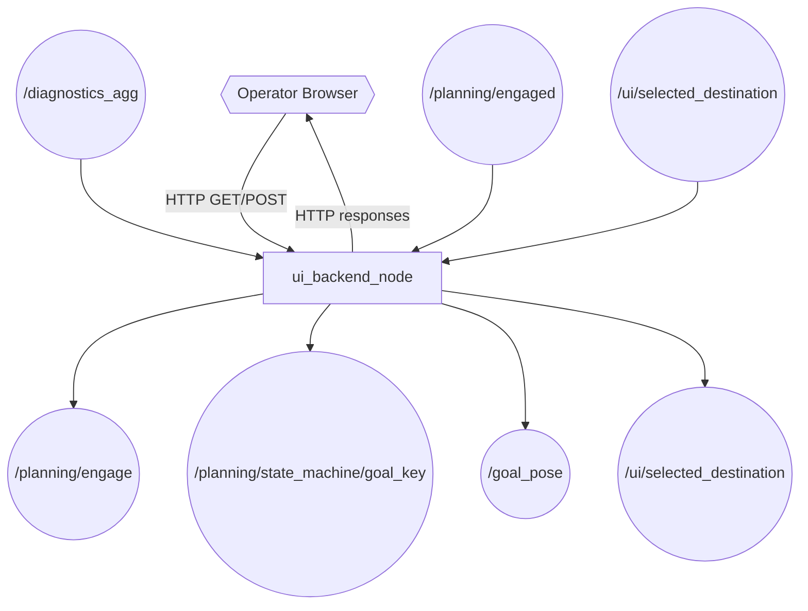
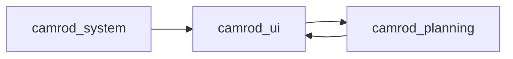

# camrod_ui

## Role
HTTP-based operator interface and ROS topic bridge. `ui_backend_node` serves a static web frontend and exposes REST endpoints for system state, destination selection, and engage/disengage control. On the ROS side it bridges `/planning/engage`, `/planning/state_machine/goal_key`, and `/goal_pose` to allow browser-based mission dispatch without direct ROS access. Replaces the former `camrod_api` package.

## Package Diagram


Diagram legend: `[node]`, `((topic))`, `{{external actor}}`.

## Node Data Flow

| Node | Inputs | Outputs | Key Params |
|---|---|---|---|
| `ui_backend_node` | `/diagnostics_agg`, `/planning/engaged`, `/ui/selected_destination`, HTTP requests | HTTP responses, `/planning/engage`, `/planning/state_machine/goal_key`, `/goal_pose` | ui_host: 127.0.0.1, ui_port: 8010, publish_engage_from_destination: true |

### HTTP API State

The node maintains an in-memory `ApiState` snapshot updated at each ROS callback:

| Field | Source | Description |
|---|---|---|
| `engaged` | `/planning/engaged` | Current robot engagement state |
| `ready` | `/localization/initial_match_ok` | System initialization readiness |
| `operation_mode` | engaged + ready | `AUTO` / `WAITING_FOR_READY` / `STOP` |
| `module_states` | `/diagnostics_agg` | Per-module diagnostic status |
| `destination` | `/ui/selected_destination` | Currently selected destination |

### Destination Dispatch Flow

When a destination is selected via HTTP:
1. Node publishes destination name to `/ui/selected_destination`
2. Looks up goal coordinates in `camping_sites_yaml`
3. Publishes `/planning/state_machine/goal_key` (if `publish_goal_key=true`)
4. Publishes `/goal_pose` in `map` frame (if `publish_goal_pose=true`)
5. Publishes `True` to `/planning/engage` (if `publish_engage_from_destination=true`)

## Inter-Package Connections


## Topic Summary

### Inputs (from other packages)
| Topic | Type | Source |
|---|---|---|
| `/diagnostics_agg` | DiagnosticArray | camrod_system (aggregator) |
| `/planning/engaged` | Bool | camrod_planning (cmd_vel_gate) |

### Outputs (consumed by other packages)
| Topic | Type | Consumers |
|---|---|---|
| `/planning/engage` | Bool | camrod_planning (cmd_vel_gate) |
| `/planning/state_machine/goal_key` | String | camrod_planning (state machine) |
| `/goal_pose` | PoseStamped | camrod_planning (Nav2 BT, goal_snapper) |
| `/ui/selected_destination` | String | (internal republish) |

## Launch

```bash
# Default (localhost:8010)
ros2 launch camrod_ui ui.launch.py

# Expose to LAN
ros2 launch camrod_ui ui.launch.py \
  ui_host:=0.0.0.0 ui_port:=8010

# Custom frontend build
ros2 launch camrod_ui ui.launch.py \
  frontend_dir:=/absolute/path/to/frontend/build

# Custom camping sites
ros2 launch camrod_ui ui.launch.py \
  camping_sites_yaml:=/path/to/camping_sites.yaml
```

Key launch arguments:

| Argument | Default | Description |
|---|---|---|
| `enable_ui_backend` | `true` | Enable HTTP server node |
| `ui_host` | `127.0.0.1` | HTTP bind address (0.0.0.0 = all interfaces) |
| `ui_port` | `8010` | HTTP bind port (auto-increments on conflict) |
| `frontend_dir` | (auto-resolved) | Static web frontend directory |
| `camping_sites_yaml` | (from camrod_planning) | Named goal positions YAML |
| `publish_goal_key` | `true` | Publish goal key on destination select |
| `publish_goal_pose` | `true` | Publish goal pose on destination select |
| `publish_engage_from_destination` | `true` | Auto-engage on destination select |
| `fallback_to_first_known_goal` | `true` | Use first loaded goal if none selected |

### Frontend Path Resolution Order

1. `CAMROD_UI_FRONTEND_DIR` environment variable
2. `CAMROD_API_FRONTEND_DIR` environment variable (legacy)
3. Source tree: `camrod_ui/runtime/assets/frontend/build`
4. Installed: `share/camrod_ui/assets/frontend/build`
5. Fallback: `share/camrod_ui/assets/web`
