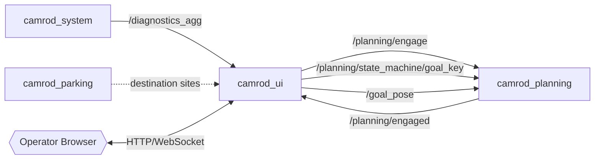
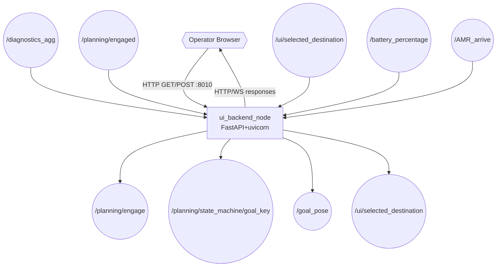
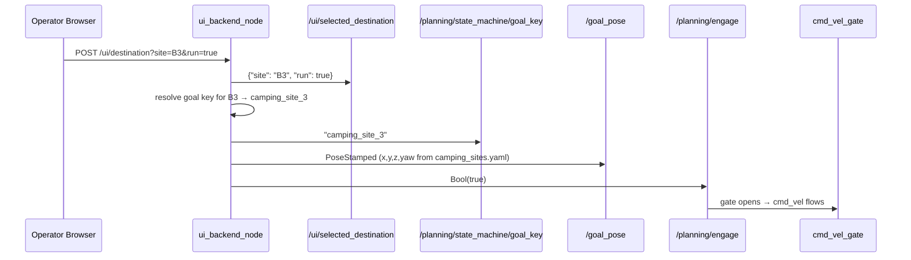
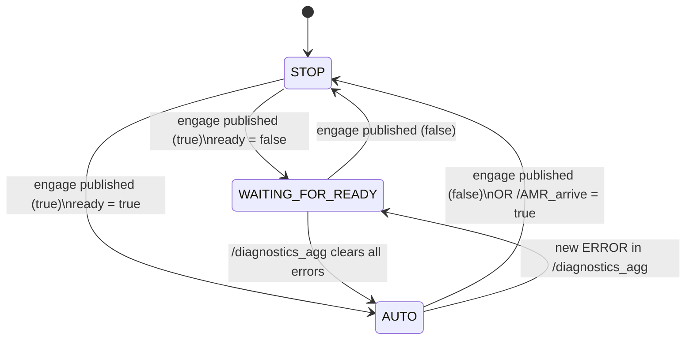
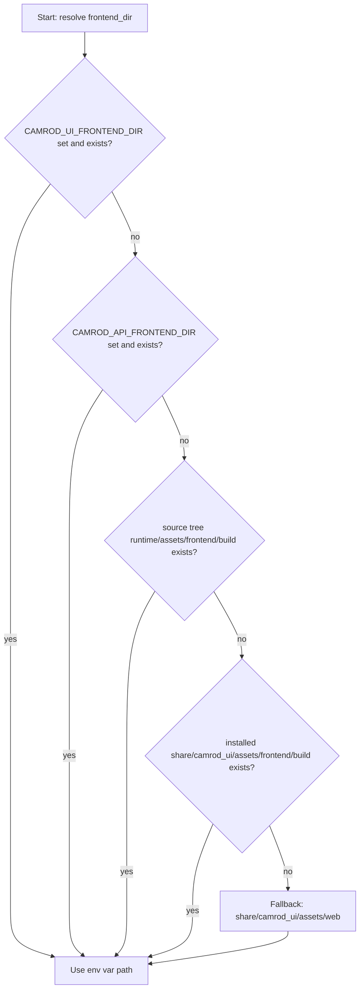

# camrod_ui

## 1. Title

**camrod_ui** — FastAPI HTTP backend (port 8010) and React operator web UI for the CAMROD robot.

---

## 2. Summary

`camrod_ui` provides the operator control interface for CAMROD. `ui_backend_node` runs a FastAPI + uvicorn HTTP server in a daemon thread alongside the ROS 2 spin loop. It serves the static React frontend and exposes REST endpoints (and a `/ws` WebSocket channel) for system state, destination selection, engage/disengage control, and battery status.

On the ROS side it bridges operator intent to planning topics without making any autonomy decisions itself.

**Non-goals:**
- Makes no autonomy decisions. Only proxies operator intent.
- Does not plan paths, monitor localization, or enforce safety constraints.
- WebSocket is for real-time UI push only; it does not replace the REST API.

Replaces the former `camrod_api` package.

---

## 3. Quick Start

```bash
# Build
cd ~/camrod_ws
colcon build --packages-select camrod_ui
source install/setup.bash

# Default (localhost only)
ros2 launch camrod_ui ui.launch.py

# Expose to LAN
ros2 launch camrod_ui ui.launch.py ui_host:=0.0.0.0 ui_port:=8010

# Custom camping sites YAML
ros2 launch camrod_ui ui.launch.py camping_sites_yaml:=/path/to/camping_sites.yaml

# Rebuild the React frontend
cd camrod_ui/runtime/assets/frontend
DISABLE_ESLINT_PLUGIN=true npm run build

# Health check
curl http://localhost:8010/ui/health
```

---

## 4. System Position



Legend: `[node]`, `((topic))`, `{{file/hw}}`, `[[stack]]`, dashed = non-runtime dependency.

---

## 5. Runtime Architecture



`ui_backend_node` runs two concurrent execution contexts:
1. A ROS 2 spin thread for ROS subscriptions and publications.
2. A FastAPI+uvicorn asyncio event loop in a daemon thread for HTTP/WebSocket.

Thread safety between the two contexts is managed by a `threading.Lock` on `ApiState`.

---

## 6. Interface Contract

### Inputs

| Topic | Type | Required | Producer | Rate | Meaning |
|---|---|---|---|---|---|
| `/diagnostics_agg` | `diagnostic_msgs/DiagnosticArray` | Yes | camrod_system | 1 Hz | Module health; used to compute `ready` and `operation_mode` |
| `/planning/engaged` | `std_msgs/Bool` | Yes | camrod_planning | event | Current engagement state of `cmd_vel_gate` |
| `/ui/selected_destination` | `std_msgs/String` | No | self (republish) | event | JSON `{"site": "B1", "run": true}`; consumed to dispatch goal |
| `/battery_percentage` | `std_msgs/Int32` | No | external | event | Battery SOC 0–100; forwarded to WebSocket clients |
| `/AMR_arrive` | `std_msgs/Bool` | No | external | event | Arrival signal; clears all site states and disengages |

### Outputs

| Topic | Type | Consumer | Rate | Meaning |
|---|---|---|---|---|
| `/planning/engage` | `std_msgs/Bool` | camrod_planning (`cmd_vel_gate`) | event | Engage (`true`) or disengage (`false`) autonomy |
| `/planning/state_machine/goal_key` | `std_msgs/String` | camrod_planning (state machine) | event | Named goal key (e.g., `camping_site_3`) |
| `/goal_pose` | `geometry_msgs/PoseStamped` | camrod_planning (Nav2 BT, goal_snapper) | event | Goal pose in `map` frame derived from `camping_sites.yaml` |
| `/ui/selected_destination` | `std_msgs/String` | self (loop-back) | event | JSON destination command republished for inspection |

---

## 7. Key Behaviors

### Destination Dispatch Flow



### Operation Mode State Machine



`operation_mode` is derived from `engaged AND ready`:
- `AUTO` — engaged=true AND ready=true
- `WAITING_FOR_READY` — engaged=true AND ready=false
- `STOP` — engaged=false

`ready` is true when `/diagnostics_agg` has at least one entry and zero ERROR-level statuses.

### Frontend Path Resolution Order



Static files are served manually (not via Starlette `StaticFiles`) to support `--symlink-install` builds where symlinked files would otherwise fail the Starlette commonprefix security check. All paths with `full_path` that do not match a real file fall back to `index.html` (SPA routing).

### Goal Key Resolution for Sites

When `set_destination(site="B3", ...)` is called:
1. Check `site_to_goal_key_map` config for explicit mapping.
2. Parse `B<N>` → `camping_site_<N>` and look up in loaded keypoints.
3. Fallback to `fallback_goal_key` (default: `camping_site_1`) if no match found.
4. Fallback to the lexicographically first known key if `fallback_to_first_known_goal=true`.

---

## 8. Launch

```bash
ros2 launch camrod_ui ui.launch.py [ARG:=VALUE ...]
```

| Argument | Default | Description |
|---|---|---|
| `enable_ui_backend` | `true` | Enable HTTP server node |
| `ui_host` | `127.0.0.1` | HTTP bind address (`0.0.0.0` = all interfaces) |
| `ui_port` | `8010` | HTTP bind port |
| `frontend_dir` | auto-resolved (see above) | Static web frontend directory |
| `camping_sites_yaml` | `camrod_planning/config/camping_sites.yaml` | Named goal positions YAML |

Node-level parameters (set in `ui.launch.py`, not exposed as launch args):

| Parameter | Default | Description |
|---|---|---|
| `publish_goal_key` | `true` | Publish goal key on destination select |
| `publish_goal_pose` | `true` | Publish goal pose on destination select |
| `publish_engage_from_destination` | `true` | Auto-engage when a destination is selected with `run=true` |
| `fallback_goal_key` | `camping_site_1` | Key to use when site resolution fails |
| `fallback_to_first_known_goal` | `true` | Use first loaded goal if fallback key also missing |
| `default_goal_frame_id` | `map` | frame_id for published goal poses |
| `site_names` | `[B1, B2, ..., B13]` | Valid site name list for validation |

---

## 9. Config

### REST API Reference

| Method | Path | Request params | Response | Description |
|---|---|---|---|---|
| `GET` | `/ui/state` | — | `ApiState` JSON snapshot | Full system state: engaged, ready, operation_mode, module_states, diagnostics, destination, battery_percentage |
| `GET` | `/ui/health` | — | `{"ok": true, "node": "ui_backend"}` | Liveness check |
| `GET` | `/ui/destination` | — | `{"destination": {…}, "valid_sites": […]}` | Current destination and valid site list |
| `GET` | `/ui/diagnostics` | — | `{"status": […]}` | Diagnostics list from `/diagnostics_agg` |
| `GET` | `/api/diagnostics` | — | `{"status": […]}` | Same as `/ui/diagnostics` (legacy path) |
| `POST` | `/ui/engage` | `?value=true\|false` | `{"success": bool, "value": bool}` | Publish engage command directly |
| `POST` | `/ui/operation_mode` | `?auto=true\|false` | `{"success": bool, "auto": bool}` | Alias for engage; forwards as Bool |
| `POST` | `/ui/auto` | — | `{"success": true}` | Shortcut: engage=true |
| `POST` | `/ui/stop` | — | `{"success": true}` | Shortcut: engage=false |
| `POST` | `/ui/destination` | `?site=B1&run=true\|false` | `{"success": bool, "destination": {…}}` | Select destination and optionally dispatch goal+engage |
| `WS` | `/ws` | — | JSON push messages | Real-time push: `{"states": {…}}`, `{"engage": bool}`, `{"battery": int}`, `{"arrived": site}` |
| `GET` | `/{full_path}` | — | Static file or `index.html` | Serve React SPA |

### Network and Security

**Risk of `ui_host:=0.0.0.0`:**
- Binds on all network interfaces. Any host on the same LAN can send engage commands, select destinations, and dispatch goal poses.
- CORS is currently set to `allow_origins=["*"]`. There is no authentication.
- **Recommended deployment:** bind to `127.0.0.1` (default) and use an SSH tunnel or VPN when remote access is required. Do not expose port 8010 directly on a public network.

### `camping_sites.yaml` Format

```yaml
camping_sites:
  - type: camping_site_1
    frame_id: map
    x: 10.5
    y: 3.2
    z: 0.0
    yaw_deg: 90.0
  - type: camping_site_2
    ...
```

Site names `B1`–`B13` map to `camping_site_1`–`camping_site_13` by the `B<N>` convention. Custom mappings can be provided via `site_to_goal_key_map` node parameter.

---

## 10. Validation

```bash
# Check node is running
ros2 node list | grep ui_backend

# Check all publishers are active
ros2 topic list | grep -E "planning/engage|goal_pose|selected_destination"

# API health
curl http://localhost:8010/ui/health

# Full state snapshot
curl http://localhost:8010/ui/state | python3 -m json.tool

# Send engage
curl -X POST "http://localhost:8010/ui/engage?value=true"

# Select destination B3 and dispatch
curl -X POST "http://localhost:8010/ui/destination?site=B3&run=true"

# Watch what the backend publishes
ros2 topic echo /planning/engage
ros2 topic echo /goal_pose
ros2 topic echo /planning/state_machine/goal_key
```

---

## 11. Troubleshooting

**UI page loads but engage does nothing**
- Check `ros2 topic echo /planning/engage` while clicking the engage button. If no message appears, the backend may not be receiving HTTP requests (wrong host/port, firewall rule).
- Verify `ui_host` and `ui_port` match the URL the browser is using.
- If the message appears on `/planning/engage` but the robot does not move, the issue is downstream in `camrod_planning`'s `cmd_vel_gate`, not in `camrod_ui`.

**Destination not in `camping_sites.yaml`**
- `set_destination` validates against `site_names` (default: `B1`–`B13`). Unknown sites return `{"success": false, "message": "unknown site: X"}`.
- Add the site to `site_names` via node parameter and ensure the corresponding entry exists in `camping_sites.yaml`.
- If `camping_sites_yaml` is empty or missing, goal pose dispatch is skipped; only the goal key is published.

**WAITING_FOR_READY never clears**
- The UI enters `WAITING_FOR_READY` when `engaged=true` but `ready=false`. `ready` is false when `/diagnostics_agg` has zero entries or at least one ERROR-level entry.
- Run `ros2 topic echo /system/diagnostics_agg` and look for `level: 2` entries.
- If `/diagnostics_agg` is empty, `camrod_system` may not be running; check `ros2 node list | grep diagnostics_agg`.

**Wrong frontend build served**
- The resolution order is: `CAMROD_UI_FRONTEND_DIR` env → `CAMROD_API_FRONTEND_DIR` env → source tree `runtime/assets/frontend/build` → installed `share/camrod_ui/assets/frontend/build` → `share/camrod_ui/assets/web`.
- After a React rebuild (`DISABLE_ESLINT_PLUGIN=true npm run build`), confirm the `build/` directory exists in the expected location.
- Set `CAMROD_UI_FRONTEND_DIR=/absolute/path/to/build` to force a specific directory.
- If the installed path is stale after `colcon build`, run `colcon build --packages-select camrod_ui` again to re-copy assets.

---

## Related Docs

- [`../README.md`](../README.md) — Top-level CAMROD workspace overview
- [`../camrod_system/README.md`](../camrod_system/README.md) — produces `/diagnostics_agg`
- [`../camrod_planning/README.md`](../camrod_planning/README.md) — consumes `/planning/engage`, `/goal_pose`, `/planning/state_machine/goal_key`
- [`../camrod_parking/README.md`](../camrod_parking/README.md) — camping site definitions used by destination dispatch
- [`../PARAMETER_NAMING_STANDARD.md`](../PARAMETER_NAMING_STANDARD.md) — canonical parameter naming conventions
