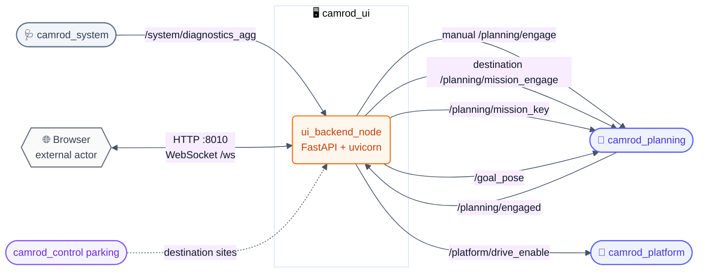
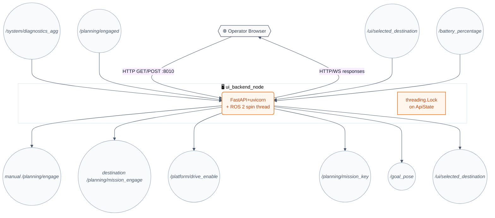
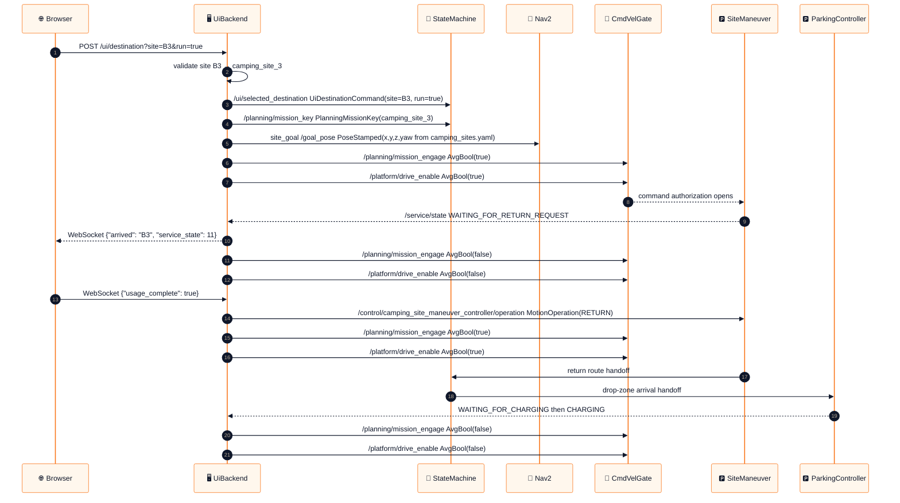
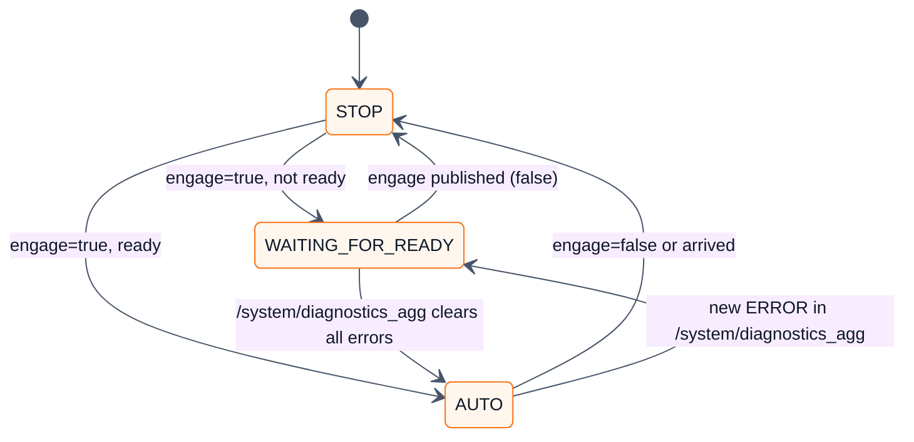
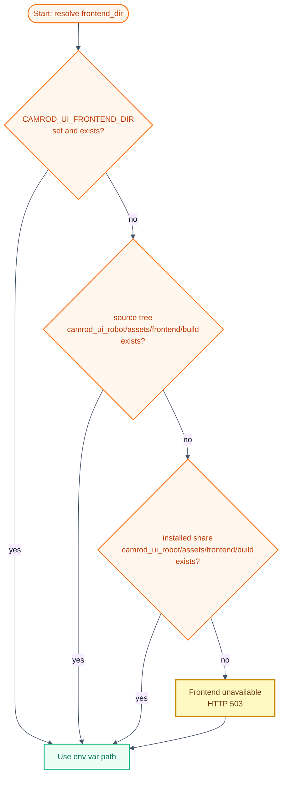

# 🖥️ camrod_ui — Operator HTTP backend & web UI

**camrod_ui** — FastAPI HTTP backend (port 8010) and React operator web UI for the CAMROD robot. Replaces the former `camrod_api` package.

---

## 📋 Summary

`camrod_ui` provides the operator control interface for CAMROD. `ui_backend_node` runs a FastAPI + uvicorn HTTP server in a daemon thread alongside the ROS 2 spin loop. It serves the static React frontend and exposes REST endpoints (and a `/ws` WebSocket channel) for system state, destination selection, engage/disengage control, and battery status.

On the ROS side it bridges operator intent to planning topics without making any autonomy decisions itself.

> **Non-goals:** Makes no autonomy decisions — only proxies operator intent. Does not plan paths, monitor localization, or enforce safety constraints. WebSocket is for real-time UI push only; it does not replace the REST API.
> HH_260720 - Operator engage controls arm the platform drive-enable latch with the planning engage topic. Campsite return publishes a typed operation to `/control/camping_site_maneuver_controller/operation`; final motion authorization remains in the control gate.

---

## 🚀 Quick Start

```bash
# Build
cd ~/camrod_ws
colcon build --packages-select camrod_ui
source install/setup.bash

# Default (localhost only)
ros2 launch camrod_ui ui.launch.py

# Expose to LAN
ros2 launch camrod_ui ui.launch.py ui_host:=0.0.0.0 ui_port:=8010

# Custom camping sites YAML
ros2 launch camrod_ui ui.launch.py camping_sites_yaml:=/path/to/camping_sites.yaml

# Rebuild the React frontend
cd camrod_ui/camrod_ui_robot/assets/frontend
DISABLE_ESLINT_PLUGIN=true npm run build

# Preferred workspace build path; runs npm install/npm run build automatically
cd /home/nvidia/camrod_ws/src
./colcon_build.sh --packages-select camrod_ui

# Public kiosk build with operating-hours gate enabled
REACT_APP_OPERATING_HOURS_GATE_ENABLED=true \
REACT_APP_OPERATING_HOURS_START=9 \
REACT_APP_OPERATING_HOURS_END=16 \
DISABLE_ESLINT_PLUGIN=true npm run build

# Health check
curl http://localhost:8010/ui/health
```

---

## 🗺️ System Position



---

## 🏗️ Runtime Architecture



`ui_backend_node` runs two concurrent execution contexts:
1. A ROS 2 spin thread for ROS subscriptions and publications.
2. A FastAPI+uvicorn asyncio event loop in a daemon thread for HTTP/WebSocket.

Thread safety between the two contexts is managed by a `threading.Lock` on `ApiState`.

---

## 🔑 Key Behaviors

### Destination Dispatch Sequence

**HH_260617 terminology:** `mission_key` is the semantic site id (`camping_site_3`), `site_goal` is the operational site target on `/goal_pose`, and `route_goal` is the lanelet-snapped Nav2 pose produced by camrod_planning. Public topic names stay unchanged for compatibility.



### Operator Mode State Machine



`operation_mode` is derived from `engaged AND ready`:
- 🟢 `AUTO` — `engaged=true` AND `ready=true`
- 🟡 `WAITING_FOR_READY` — `engaged=true` AND `ready=false`
- 🔴 `STOP` — `engaged=false`

<!-- HH_260721 - Separate the three-level health contract from service operation progress. -->
`ready` is `true` when `/system/diagnostics_agg` has at least one entry and zero
ERROR-level statuses. Incoming ROS `STALE` entries are normalized to `ERROR`
because missing fresh data is not safe for operation. The robot header displays
this health independently from the symbolic `AvgServiceState` progress such as
`DROP_ZONE_WAIT`, `MOVING_TO_SITE`, `WAITING_FOR_RETURN_REQUEST`,
`WAITING_FOR_CHARGING`, `CHARGING`, `DEPARTING_CHARGER`, and
`OPERATOR_STOPPED`. Operator and guest status labels are English and these
normal service states do not create a warning by themselves.

### Frontend Path Resolution



> Static files are served manually (not via Starlette `StaticFiles`) to support `--symlink-install` builds where symlinked files would otherwise fail the Starlette commonprefix security check. All paths not matching a real file fall back to `index.html` (SPA routing).

### Operating-Hours Gate

> HH_260619: Developer/test frontend builds bypass the public operating-hours gate by default.

The waiting screen accepts taps at any time unless the React bundle is built with `REACT_APP_OPERATING_HOURS_GATE_ENABLED=true`. This keeps development, route testing, and operator validation independent from public service hours.

| Build mode | Command |
|---|---|
| Developer/test | `DISABLE_ESLINT_PLUGIN=true npm run build` |
| Public kiosk | `REACT_APP_OPERATING_HOURS_GATE_ENABLED=true REACT_APP_OPERATING_HOURS_START=9 REACT_APP_OPERATING_HOURS_END=16 DISABLE_ESLINT_PLUGIN=true npm run build` |

### Mission Key Resolution for Sites

When `set_destination(site="B3", ...)` is called:

1. Check `site_to_mission_key_map` config for explicit mapping.
2. Parse `B<N>` → `camping_site_<N>` and look up in loaded keypoints.
3. Fallback to `fallback_mission_key` (default: `camping_site_1`) if no match found.
4. Fallback to the lexicographically first known key if `fallback_to_first_known_goal=true`.

---

## 📡 Interface Contract

### Inputs

| Topic | Type | Required | Producer | Rate | Meaning |
|---|---|---|---|---|---|
| `/system/diagnostics_agg` | `diagnostic_msgs/DiagnosticArray` | Yes | camrod_system | 1 Hz | Module health; used to compute `ready` and `operation_mode` |
| `/service/state` | `avg_msgs/AvgServiceState` | Yes | control, parking, UI | event | Normal service progress, separate from health severity |
| `/planning/engaged` | `std_msgs/Bool` | Yes | camrod_planning | event | Current engagement state of `cmd_vel_gate` |
| `/ui/selected_destination` | `avg_msgs/UiDestinationCommand` | No | self (republish) | event | Destination command; consumed to dispatch mission key and site goal |
| `/battery_percentage` | `std_msgs/Int32` | No | external | event | Battery SOC 0–100; forwarded to WebSocket clients |

### Outputs

| Topic | Type | Consumer | Rate | Meaning |
|---|---|---|---|---|
| `/planning/engage` | `std_msgs/Bool` | camrod_planning (`cmd_vel_gate`) | event | Engage (`true`) or disengage (`false`) autonomy |
| `/planning/mission_key` | `avg_msgs/PlanningMissionKey` | camrod_planning (state machine) | event | `mission_key`: semantic site/key name (e.g., `camping_site_3`) |
| `/goal_pose` | `geometry_msgs/PoseStamped` | camrod_planning goal_snapper | event | `site_goal`: raw site-center pose in `map`, later snapped to a lanelet route goal |
| `/ui/selected_destination` | `avg_msgs/UiDestinationCommand` | self (loop-back) | event | Destination command republished for inspection |
<!-- HH_260723 - Surface semantic campsite occupancy to the operator UI. -->
| `/perception/camping_sites/occupancy` | `avg_msgs/CampsiteOccupancy` | UI backend | 2 Hz + transient state | Occupied mission keys; matching destination buttons are disabled and dispatch is rejected |

---

## 🚀 Launch Arguments

```bash
ros2 launch camrod_ui ui.launch.py [ARG:=VALUE ...]
```

| Argument | Default | Description |
|---|---|---|
| `enable_ui_backend` | `true` | Enable HTTP server node |
| `ui_host` | `127.0.0.1` | HTTP bind address (`0.0.0.0` = all interfaces) |
| `ui_port` | `8010` | HTTP bind port |
| `frontend_dir` | auto-resolved (see above) | Static web frontend directory |
| `camping_sites_yaml` | `camrod_planning/config/camping_sites.yaml` | Named goal positions YAML |

Node-level parameters (set in `ui.launch.py`, not exposed as launch args):

| Parameter | Default | Description |
|---|---|---|
| `publish_mission_key` | `true` | publish `mission_key` on destination select |
| `publish_goal_pose` | `true` | publish `site_goal` on destination select |
| `publish_engage_from_destination` | `true` | Auto-engage when a destination is selected with `run=true` |
| `fallback_mission_key` | `camping_site_1` | fallback `mission_key` when site resolution fails |
| `fallback_to_first_known_goal` | `true` | Use first loaded goal if fallback key also missing |
| `default_goal_frame_id` | `map` | frame_id for published `site_goal` poses |
| `site_names` | `[B1, B2, ..., B13]` | Valid site name list for validation |

---

## 🌐 REST API Reference

🟢 = GET &nbsp;&nbsp; 🔵 = POST &nbsp;&nbsp; 🔌 = WebSocket

| Method | Path | Request params | Response | Description |
|---|---|---|---|---|
| 🟢 `GET` | `/ui/state` | — | `ApiState` JSON snapshot | Full system state: engaged, ready, operation_mode, module_states, diagnostics, destination, battery_percentage |
| 🟢 `GET` | `/ui/health` | — | `{"ok": true, "node": "ui_backend"}` | Liveness check |
| 🟢 `GET` | `/ui/destination` | — | `{"destination": {…}, "valid_sites": […]}` | Current destination and valid site list |
| 🟢 `GET` | `/ui/diagnostics` | — | `{"status": […]}` | Diagnostics list from `/system/diagnostics_agg` |
| 🟢 `GET` | `/api/diagnostics` | — | `{"status": […]}` | Same as `/ui/diagnostics` (legacy path) |
| 🔵 `POST` | `/ui/engage` | `?value=true\|false` | `{"success": bool, "value": bool}` | Publish engage command directly |
| 🔵 `POST` | `/ui/operation_mode` | `?auto=true\|false` | `{"success": bool, "auto": bool}` | Alias for engage; forwards as Bool |
| 🔵 `POST` | `/ui/auto` | — | `{"success": true}` | Shortcut: engage=true |
| 🔵 `POST` | `/ui/stop` | — | `{"success": true}` | Shortcut: engage=false |
| 🔵 `POST` | `/ui/destination` | `?site=B1&run=true\|false` | `{"success": bool, "destination": {…}, "dispatch": {…}}` | Select destination and optionally dispatch goal+engage |
| 🔌 `WS` | `/ws` | — | JSON push messages | Real-time push: `{"states": {…}}`, `{"engage": bool}`, `{"battery": int}`, `{"arrived": site}` |
| 🟢 `GET` | `/{full_path}` | — | Static file or `index.html` | Serve React SPA |

> ⚠️ **Security — `ui_host:=0.0.0.0` binding:**
>
> Binds on **all** network interfaces. Any host on the same LAN can send engage commands, select destinations, and dispatch goal poses. CORS is currently set to `allow_origins=["*"]` with **no authentication**.
>
> **Recommended deployment:** bind to `127.0.0.1` for lab-only or tunnel-based operation. Bringup defaults to `0.0.0.0` for robot-IP UI access, so do **not** expose port 8010 directly on a public or untrusted network.
>
> HH_260706 - HTTP destination selection applies the camping-site command immediately and returns a `dispatch` result. `/ui/selected_destination` is still republished for inspection, but the backend ignores its own immediate echo to avoid duplicate mission-key/goal dispatch.

### `camping_sites.yaml` Format

```yaml
camping_sites:
  - type: camping_site_1
    frame_id: map
    x: 10.5
    y: 3.2
    z: 0.0
    yaw_deg: 90.0
  - type: camping_site_2
    ...
  # HH_260721 - Optional operational pose for a physically inaccessible semantic area.
  - type: camping_site_12
    x: 8.57397
    y: 21.3498
    service_mode: roadside_stop
    service_x: 12.7921
    service_y: 22.52
    service_yaw_deg: -74.495
```

Site names `B1`–`B13` map to `camping_site_1`–`camping_site_13` by the `B<N>` convention. Custom mappings can be provided via the `site_to_mission_key_map` node parameter.
<!-- HH_260721 - Keep area occupancy geometry separate from the dispatched operational pose. -->
When `service_*` is present, the backend publishes that pose while retaining
the original `corners` for physical-area arrival/adoption checks.

---

## 🔍 Validation

```bash
# Check node is running
ros2 node list | grep ui_backend

# Check all publishers are active
ros2 topic list | grep -E "planning/engage|goal_pose|selected_destination"

# API health
curl http://localhost:8010/ui/health

# Full state snapshot
curl http://localhost:8010/ui/state | python3 -m json.tool

# Send engage
curl -X POST "http://localhost:8010/ui/engage?value=true"

# Select destination B3 and dispatch
curl -X POST "http://localhost:8010/ui/destination?site=B3&run=true"

# Watch what the backend publishes
ros2 topic echo /planning/engage
ros2 topic echo /goal_pose
ros2 topic echo /planning/mission_key
```

---

## 🩺 Troubleshooting

<details>
<summary><strong>UI page loads but engage does nothing</strong></summary>

- Check `ros2 topic echo /planning/engage` while clicking the engage button. If no message appears, the backend may not be receiving HTTP requests (wrong host/port, firewall rule).
- Verify `ui_host` and `ui_port` match the URL the browser is using.
- If the message appears on `/planning/engage` but the robot does not move, the issue is downstream in `camrod_planning`'s `cmd_vel_gate`, not in `camrod_ui`.

</details>

<details>
<summary><strong>Destination not in camping_sites.yaml</strong></summary>

`set_destination` validates against `site_names` (default: `B1`–`B13`). Unknown sites return `{"success": false, "message": "unknown site: X"}`.

Add the site to `site_names` via node parameter and ensure the corresponding entry exists in `camping_sites.yaml`. If `camping_sites_yaml` is empty or missing, `site_goal` dispatch is skipped; only the `mission_key` is published.

</details>

<details>
<summary><strong>WAITING_FOR_READY never clears</strong></summary>

The UI enters `WAITING_FOR_READY` when `engaged=true` but `ready=false`. `ready` is false when `/system/diagnostics_agg` has zero entries or at least one ERROR-level entry.

Run `ros2 topic echo /system/diagnostics_agg` and look for `level: 2` entries. If `/system/diagnostics_agg` is empty, `camrod_system` may not be running: `ros2 node list | grep diagnostics_agg`.

</details>

<details>
<summary><strong>Wrong frontend build served</strong></summary>

<!-- HH_260721 - Keep troubleshooting paths synchronized with setup.py data-file layout. -->
Resolution order: `frontend_dir` launch argument / `CAMROD_UI_FRONTEND_DIR` →
source tree `camrod_ui_robot/assets/frontend/build` → installed
`share/camrod_ui/camrod_ui_robot/assets/frontend/build`. The backend returns
HTTP 503 when no built frontend exists.

After a React rebuild (`DISABLE_ESLINT_PLUGIN=true npm run build`), confirm the `build/` directory exists in the expected location. Set `CAMROD_UI_FRONTEND_DIR=/absolute/path/to/build` to force a specific directory. If the installed path is stale after `colcon build`, run `colcon build --packages-select camrod_ui` again.

</details>

---

## 🔗 Related Docs

- [`../README.md`](../README.md) — Top-level CAMROD workspace overview
- [`../camrod_system/README.md`](../camrod_system/README.md) — produces `/system/diagnostics_agg`
- [`../camrod_planning/README.md`](../camrod_planning/README.md) — consumes `/planning/engage`, `/goal_pose`, `/planning/mission_key`
- [`../camrod_control/README.md`](../camrod_control/README.md) - maneuver and parking status consumed by the UI
- [`../PARAMETER_NAMING_STANDARD.md`](../PARAMETER_NAMING_STANDARD.md) — canonical parameter naming conventions

## 2026-06-17 Runtime Update

> HH_260617: UI destination dispatch follows the mission/site/route naming contract.

A camping-site button publishes semantic intent and its configured operational pose only once per button action. Planning owns snapping to lanelet route goals. Parking starts later from `PlanningState`, not directly from the UI button, so UI dispatch does not bypass Nav2 or the safety gates.

HH_260701 - If the robot was manually driven into a campsite first, selecting
the same site in the UI now adopts the parked state instead of sending another
route goal. `ui_backend_node` checks the latest `/localization/pose` against the
configured campsite polygon or center radius, publishes an
`AvgServiceState.WAITING_FOR_RETURN_REQUEST` arrival notification, and sends
`UiDestinationCommand(run=true)` on `/control/camping_site_maneuver_controller/adopt`. The control
node then enters `WAIT_RETURN`, so the operator can use the return button even
when the original entry did not come from the UI camping-site button.

<!-- HH_260721 - Describe parked-to-site dispatch as a maneuver handoff, not a direct goal. -->
When `/platform/status.is_charging=true` or the latest service state is
`DROP_ZONE_WAIT` or `CHARGING`, selecting a campsite is accepted only when the
latest battery percentage is available and at or above
`minimum_mission_dispatch_battery_percent` (default `35`). Accepted selections
store the destination as pending. The backend publishes the mission key to open charging departure, sends
`MotionOperation.CANCEL` to `/parking/operation` to release final-parking state,
then sends `MotionOperation.EXIT` to `/control/drop_zone_maneuver_controller/operation`,
and waits for `/control/drop_zone/exit_complete=true`. Only then does it publish
the selected operational site pose on `/goal_pose`. A failed or cancelled exit clears the
pending destination and disables motion. During the handoff, the UI displays
`DEPARTING_CHARGER` or `DEPARTING_DROP_ZONE`; it changes to `MOVING_TO_SITE`
only after the bounded exit maneuver succeeds.

If battery drops below `low_battery_return_threshold_percent` during an active
campsite mission, the backend does not stop the robot immediately. It broadcasts
a UI warning, lets the current site phase reach `WAITING_FOR_RETURN_REQUEST`,
and waits there until the operator/user sends the ordinary return request. It
does not auto-send `MotionOperation.RETURN`, so the robot will not leave while
people may still be unloading cargo. New campsite dispatch remains blocked
until battery reaches the dispatch minimum again.

<!-- HH_260724 - Make the battery policy visible as persistent UI state, not only as a modal edge. -->
The robot UI header always shows diagnostic health, `/service/state`, and the
current battery mission policy. The battery line reports critical stop at
`<=20%`, mission hold below `35%`, finish-current-mission return pending,
waiting for user return, or active low-battery return. The `/ui/state` snapshot
also carries `battery_return_pending`, `battery_return_started`, and
`battery_return_waiting_for_user` so browser refreshes preserve the displayed
state.

<!-- HH_260724 - Manual engage and operator cancel must be visible without pretending they are campsite missions. -->
Manual ENGAGE is displayed as `Manual driving` in the UI header when no campsite
button owns the current mission. Turning ENGAGE off, pressing the moving-state
stop button, or cancelling a destination dispatch now routes through `/ui/stop`
or `run=false`: the backend publishes `engage=false`, closes mission engage,
requests Nav2 action cancel, cancels local maneuver controllers, clears active
site buttons, and publishes `/service/state=OPERATOR_STOPPED`.

| UI concept | ROS contract |
|---|---|
| Button destination | `PlanningMissionKey.mission_key` |
| Site center | `/planning/goal_pose` / `/goal_pose` |
| Lanelet snap route | produced by `camrod_planning` as `/planning/goal_pose_snapped_ros` (`geometry_msgs`) and `/planning/goal_pose_snapped` (`avg_msgs`) |
| Parking phase | produced by `camrod_control` parking controller status topics |
| Already-at-site adoption | `/control/camping_site_maneuver_controller/adopt` with `avg_msgs/UiDestinationCommand` |

Important destination parameters:

| Parameter | Default | Meaning |
|---|---|---|
| `arrival_pose_topic` | `/localization/pose` | Pose used to detect whether the robot is already inside the selected campsite |
| `immediate_site_arrival_enabled` | `true` | Enables already-at-site adoption on UI destination selection |
| `site_arrival_center_radius_m` | `2.5` | Fallback radius around the configured campsite center when no polygon match is available |
| `site_arrival_pose_timeout_s` | `2.0` | Maximum age of the pose used for already-at-site detection |
| `camping_site_maneuver_controller_adopt_topic` | `/control/camping_site_maneuver_controller/adopt` | Control handoff used to enter `WAIT_RETURN` after manual site entry |
| `drop_zone_maneuver_controller_operation_topic` | `/control/drop_zone_maneuver_controller/operation` | Typed `EXIT`/`CANCEL` handoff used before leaving a parked drop zone |
| `drop_zone_exit_complete_topic` | `/control/drop_zone/exit_complete` | Releases the pending campsite goal only after straight exit and lane-yaw alignment |
| `require_battery_for_mission_dispatch` | `true` | Requires a fresh battery percentage before accepting a new campsite dispatch |
| `minimum_mission_dispatch_battery_percent` | `35.0` | Minimum SOC for a new campsite dispatch; return-to-drop-zone remains available |
| `low_battery_return_after_current_mission` | `true` | Latches low battery during a campsite mission and requires the next user return request to go back to charge |
| `low_battery_return_threshold_percent` | `35.0` | SOC threshold that starts the finish-current-mission return latch |
