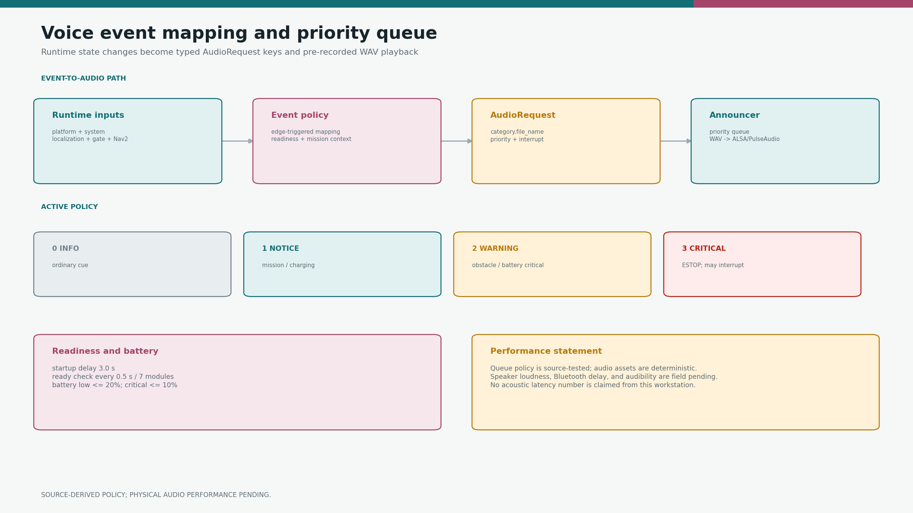
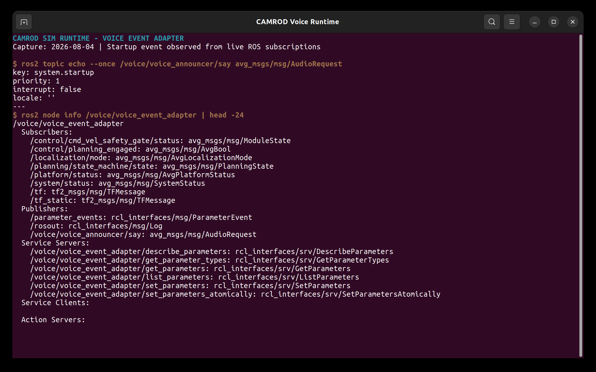

# camrod_voice

<!-- HH_260804 - Replace package-tree and release-history prose with the
event pipeline, priorities, readiness contract, and measurable limits. -->

Runtime-event adapter and priority-queued playback of pre-recorded Korean WAV
announcements.



## Actual Simulation Runtime



`SIM RUNTIME CAPTURE`: a live adapter emitted `system.startup` as an
`avg_msgs/AudioRequest`, and ROS graph inspection shows its real subscriptions
and output topic. Speaker playback and outdoor audibility remain field-pending.

## At A Glance

| Uses | Function | Main outputs |
|---|---|---|
| Planning, platform, localization, gate, system, TF, and Nav2 action state | Maps state edges to stable audio keys | `avg_msgs/AudioRequest` |
| C++ priority queue + SDL2_mixer | Selects, interrupts, and plays WAV assets | `avg_msgs/VoiceState` and speaker audio |
| `resource/audio/ko-KR/` | Resolves `category.file_name` keys | Deterministic packaged prompts |

Voice is operator feedback only. Disabling it does not remove any safety or
motion condition.

## Priority Policy

| Priority | Meaning | Example |
|---:|---|---|
| `0` | Info | Repeated travel reminders under the music bed |
| `1` | Notice | Startup, ready, mission, arrival, resume, charging, low battery |
| `2` | Warning | Obstacle hold |
| `3` | Critical | Estop/release; may interrupt when requested |

## Event Mapping

| Runtime event | Audio key | Priority |
|---|---|---:|
| Startup delay expires | `system.startup` | 1 |
| First complete readiness | `system.ready` | 1 |
| Announcer node shuts down | `system.shutdown` | — |
| Engaged departure to site | `navigation.to_campsite` | 1 |
| Engaged departure to drop zone | `navigation.to_dropzone` | 1 |
| Trip to site under way, every period | `system.announce1` + `system.announce2` | 0 |
| Trip to drop zone under way, every period | `navigation.return_to_dropzone` | 0 |
| Site/manual goal reached | `navigation.arrived_campsite` | 1 |
| Engaged cost/route hold | `safety.obstacle` | 2 |
| Hold still blocking, every period | `navigation.please_step_aside` | 1 |
| Announced hold clears | `safety.thankyou` | 1 |
| Parking controller leaves idle | `docking.started` | 1 |
| Parking controller reports `PARKED` | `docking.succeeded` | 1 |
| Parking controller reports `ERROR` | `docking.failed` | 2 |
| Estop asserted / released | `safety.estop` / `safety.estop_released` | 3 |
| Battery `<= 20%` | `battery.low` | 1 |
| Charging starts | `battery.charging` | 1 |
| Charging and `>= 99%`, every period | `battery.full` | 1 |

`WAIT_DZ` intentionally has no navigation announcement. Generic planning
recovery does not trigger obstacle speech; the final command gate's actual
cost/route hold does.

A trip is one latched identity — travel context, mission key, and goal source —
held from the departure cue until arrival, a mission change, or disengage. It
deliberately survives a `WARN_RECOVERY` tick, because a single low-rate sensor
sample flips that state while the robot keeps driving the same route: without
the latch every blip replayed the departure cue, restarted the bed, and reset
the reminder schedule before it could come due.

## Background Music

`system.bgm` is a looping bed on the SDL2_mixer music stream while speech plays
on a reserved chunk channel, so the two sound together. The adapter latches
`voice_announcer/bgm` for the whole trip; the announcer starts the bed only
once the queue is idle, which puts it after the departure cue, and ducks it for
every cue that follows. A safety hold keeps the bed running — arrival, ending
the trip, or disengaging releases it.

`system.shutdown` is not an adapter event. The announcer plays it from its own
destructor after `SIGINT`, bounded by `shutdown_timeout_s` so it stays inside
the launch `SIGTERM` window.

## Repeated Cues

Three cues repeat instead of firing once, all polled at `1 Hz` and all ended by
the condition itself rather than a counter:

| Cue | Runs while | Ends on |
|---|---|---|
| `system.announce1` + `announce2` / `return_to_dropzone` | Trip under way | Arrival or disengage |
| `navigation.please_step_aside` | Announced hold still blocking | Hold clears (then `safety.thankyou`) |
| `battery.full` | Charging and `>= battery_full_threshold` | Charger removed or level drops |

## Active Values

| Item | Value |
|---|---:|
| Startup delay | `3.0 s` |
| Readiness check | `0.5 s` |
| Required readiness modules | 7 (`map`, `sensing`, `localization`, `planning`, `control`, `platform`, `system`) |
| Required frame | `map -> robot_center_link` |
| Maximum ready localization mode | `NORMAL (0)` |
| Low battery cue | `20%` |
| First travel reminder / repeat period | `30 s` / `90 s` |
| Blocked-route explanation period | `20 s` |
| Charge-complete cue period | `60 s` |
| Bed level, ducked level | `0.55` / `0.12` |
| Shutdown cue budget | `4.5 s` |

`system.ready` is announced once after required modules are non-error, Nav2 is
available, planning is idle, localization is normal, TF exists, the gate is
standby/charging, platform estop is released, and engage is false.

That strict idle snapshot controls only the one-shot `system.ready` cue. After
`system.startup`, mission, obstacle, and docking cues follow their direct
planning, engage, command-gate, and parking-phase evidence, so beginning a
service while the gate is leaving an idle hold cannot mute voice for the rest of
the process. Every emitted `AudioRequest` is logged at INFO; the announcer's
`Playing [...]` line is the separate downstream playback-stage evidence.

## Topics

| Direction | Topic | Purpose |
|---|---|---|
| Publish | `/voice/voice_announcer/say` | Audio request queue input |
| Publish | `/voice/voice_announcer/bgm` | Latched music-bed request |
| Publish | `/voice/voice_announcer/state` | Playback state |
| Subscribe | `/platform/status` | Estop, SOC, charging |
| Subscribe | `/system/status` | Module readiness/health |
| Subscribe | `/localization/mode` | Localization admission |
| Subscribe | `/control/cmd_vel_safety_gate/status` | Actual obstacle/safety state |
| Subscribe | `/control/planning_engaged` | Manual-or-mission engage |
| Subscribe | `/parking/*_parking_controller/status` | Docking phase |
| Action check | `/planning/navigate_to_pose` | Nav2 readiness |

## Build And Run

```bash
cd ~/camrod_ws
colcon build --packages-select camrod_voice --symlink-install
source install/setup.bash

ros2 launch camrod_voice voice.launch.py
ros2 launch camrod_voice voice.launch.py enable_voice_adapter:=false
```

System dependencies are `libsdl2-dev` and `libsdl2-mixer-dev`.

## Bluetooth Provisioning

`setup_bt_audio.sh` installs an opt-in reconnect service for an already paired
amplifier. It is not run by ROS bringup.

```bash
bluetoothctl pair AA:BB:CC:DD:EE:FF
bluetoothctl trust AA:BB:CC:DD:EE:FF
sudo ./setup_bt_audio.sh AA:BB:CC:DD:EE:FF "CamrodAmp"
```

The helper validates the target and refuses to overwrite conflicting existing
service files. Speaker loudness, Bluetooth delay, and outdoor audibility remain
physical acceptance items; no acoustic latency is claimed from simulation.
