# CAMROD Module Visual Guide

<!-- HH_260805 - Index current generated diagrams and historical runtime screens
separately, including scoped runtime and the unverified GNSS center contract. -->
<!-- HH_260806 - Index the fresh body-hard-stop versus planning-margin
simulation and retain its provisional-geometry field caveat. -->
<!-- HH_260807 - Index the final B1-B10 lifecycle and fixed-preview A/B assets
with their exact simulation scope and current-map avoidance limitation. -->
<!-- HH_260810 - Index the active source-derived tapered/rounded geometry and
rigid-motion media separately from historical rectangular runtime evidence. -->
<!-- HH_260810 - Add the matching historical map-v17 ROS road replay and preserve
the distinction between simulation behavior and physical-road acceptance. -->
<!-- HH_260819 - Add current B1-B13 Return and event-driven UI scheduler
evidence while retaining physical-road and ARM64 acceptance limits. -->

This guide explains what each README image proves. Runtime decisions still
come from ROS topics, controller state, diagnostics, and safety gates.

## Evidence Labels

| Label | Source | Valid claim |
|---|---|---|
| `SOURCE-DERIVED` | Checked-in YAML, messages, launch defaults, and code constants | Topology and displayed values match the repository |
| `SOURCE INVENTORY` | Files and package manifests | Interface/file/dependency counts match source |
| `MEASURED ROS SIM` | Committed JSON or raw ROS logs from a running simulation | Listed rates, events, displacement, and state changes were observed in that run |
| `MEASURED WORKSTATION` | Repeated process-tree samples on the recorded amd64 host | Relative CPU/PSS/process/rate effects apply to that host and method, not Jetson acceptance |
| `POLICY REGRESSION` | Structured cases bound to current source, config, and unit tests | The decision table is verified; no live ROS or physical mission is claimed |
| `SIM RUNTIME CAPTURE` | RViz, ROS CLI, or browser connected to a live `sim:=true` graph | The displayed topics/layers/states existed in that run; no physical performance claim |
| `FIELD REPORT / RAW LOG EXTERNAL` | Committed normalized summary backed by a report that references Jetson-only raw paths | Listed stationary values were reported; the repository cannot independently replay the raw capture |
| `ALGORITHM SCHEMATIC` | Seeded synthetic data + active thresholds | Processing concept is reproducible; the points are not sensor evidence |
| `FIELD PENDING` | No matching physical capture | No physical accuracy, throughput, latency, or safety PASS is claimed |

Configured grid size, target rate, threshold, or timeout is **not** measured
performance. Every package README keeps those columns separate.

<!-- HH_260805 - Keep semantic safety colors stable while making package
families visually distinguishable and retaining reproducible provenance. -->
Architecture figures use a distinct paired palette for each package family;
safety red remains common so a stop/failure keeps the same meaning. These
colors are presentation only and do not encode ROS severity or runtime state.

`docs/assets/module-guides/` contains derived PNG/GIF output plus the adjacent
JSON or concise log provenance needed to reproduce and audit measured labels.
Unreferenced raw logs are intentionally excluded from source control.

## Asset Index

| Package | Generated visual | Evidence/value source | Current verdict |
|---|---|---|---|
| `camrod_bringup` | `full-stack-mission-contract.png`, `mission-lifecycle-contract.gif` | Launch/state/battery/parking contracts | Expected sequence only |
| `camrod_bringup` | `simulation-evidence-20260804.png` | Full-bringup JSON + raw logs | 81-node startup and pose chain pass; B6/B12 round trip fails closed |
| `camrod_bringup` | `test-results/b1-b10-service-endurance-20260807/` PNG/GIF | Raw runner JSON, filtered logs, geometry/scope JSON and SHA manifest | B1-B10 service 10/10; cycle 1 seeded, cycles 2-10 full outbound; field pending |
| `camrod_bringup` | `field-stationary-report-20260731.png` | Normalized JSON + physical test report | Radar-off/front-camera lifetime pass; rear rate/RTK/CPU limits visible; raw files external |
| `camrod_common/avg_msgs` | `interface-contract-and-dependencies.png` | Message/service files and manifests | 86 messages, 2 services, 12 direct package dependents |
| `camrod_control` | `command-safety-and-recovery.png`, boundary stop/recovery PNGs and GIFs | Gate/recovery YAML + historical map-v14 and v2.1.4 release-map automatic-owner JSON | Bounded crab/reverse-yaw and retry latch observed; mission incomplete |
| `camrod_control` / `camrod_bringup` | `test-results/worak-crab-fusion-safety-20260818/` JSON | Fresh map-v22 B1 phase result, directional gate matrix, and long-return timeout | Exact site entry/exit and semantic/radar matrix pass; complete drop-zone return timed out; field pending |
| `camrod_control` / `camrod_planning` / `camrod_bringup` | `test-results/camping-site-full-return-20260819/` JSON/PNG/GIF | Current-map B1-B13 UI Return exits plus B11 full service | Exit 13/13; B11 forward loop, parking, charging pass in AMD64 sim; physical clearance pending |
| `camrod_sensor_kit` / `camrod_platform` / `camrod_planning` / `camrod_control` | `test-results/tapered-rounded-boundary-20260810/` PNG/GIF | Current sensor-kit geometry, exact C++-equivalent contour generation, and Nav2 local/global footprint match | Shape and rigid transforms are source-derived; runtime collision and field clearance are not claimed |
| `camrod_bringup` / `camrod_sensor_kit` / `camrod_platform` / `camrod_planning` / `camrod_control` | `test-results/tapered-rounded-boundary-road-sim-20260810/` PNG/GIF | Raw historical map-v17 ROS pose/command/gate timeline, recorded map SHA, exact 30-point contours, summary, and manifest | Physical body clear, planning-only contact, bounded reverse-yaw, same-route completion; physical road pending |
| `camrod_runtime` / `camrod_bringup` | `runtime/test-results/nav2-lifecycle-shutdown-20260810/` JSON/log | Post-fix no-goal SYSTEM OK, UI READY, parent-only SIGINT, and all process exits | AMD64 44/44 clean; ARM64 resources and physical operation pending |
| `camrod_control` / `camrod_planning` | `test-results/robot-boundary-adjustment-20260806/02-runtime-boundary-policy.png` | Five organized raw JSON records plus consolidated result | Historical normal route, margin stop/crab, and physical no-motion policy pass; field envelope pending |
| `camrod_control` / `camrod_planning` | `test-results/rpp-lookahead-service-ab-20260807/rpp-lookahead-service-ab.png` | Source-profile JSON/logs and SHA manifest | Fixed `1.1 m` completed B1/B2 2/2; scaled preview recontacted in `0.850 s` |
| `camrod_localization` | `pose-generation-and-timing.png` | EKF YAML + 30-second probe | 10 Hz inputs -> 20 Hz selected pose; field accuracy pending |
| `camrod_map` | `lanelet-map-and-cost-grids.png` | Map/grid YAML | Route/planning grid values match source; service access missing |
| `camrod_map` / `camrod_planning` / `camrod_bringup` | `park-operating-points.png` | Current OSM, Park origin, synchronized campsite/drop-zone YAML | B1-B13 and drop-zone coordinates match source; field clearance pending |
| `camrod_perception` | `yolo-lidar-and-parking-pipelines.png` | Perception/AprilTag YAML + rear-container ownership | LiDAR sim path available; physical YOLO/fusion/tag pending |
| `camrod_planning` | `nav2-servers-and-mission-states.png`, `robot-center-narrow-route-risk-map.png` | Nav2 config, scoped planner/controller default, state contracts, and footprint sweep | Hybrid Nav2 stopped cleanly 3/3; narrow corridor remains invalid |
| `camrod_platform` | `ranger-command-and-status.png` plus `test-results/normal-crab-selection-20260819/` PNG/GIF | Ranger/visualization YAML and the active lateral deadband | Ordinary commands remain Dual-Ackermann; deliberate site/recovery lateral commands select crab |
| `camrod_runtime` | `scoped-component-lifecycle.png`, `scoped-component-lifecycle.gif` | Runtime C++ cleanup contract + three final/default AMD64 full-simulation shutdown records | Six-container clean shutdown measured; Jetson resources and physical behavior pending |
| `camrod_sensing` | `sensor-processing-and-cost-fusion.png` | Sensor/grid YAML + front/rear/LiDAR composition toggles | Bounded hot paths shown; class-associated raster ON, raw-LiDAR cost OFF |
| `camrod_sensing` | `ground-segmentation-schematic.png` | Ground-filter YAML + seeded points | Algorithm schematic, not a point-cloud capture |
| `camrod_sensor_kit` | `reference-frame-before-after.png`, `rear-axle-vs-robot-center-drive.gif` | Geometry YAML + A/B JSON | Compared center-frame route metrics pass; narrow boundary remains |
| `camrod_sensor_kit` | `sensor-mount-side-view.png`, `sensor-x-before-after.png`, `gnss-left-antenna-lever-arm.png` | Geometry/localization YAML | Exact non-GNSS conversion and measured GNSS Y correction; remaining survey is pending |
| `camrod_system` | `diagnostic-severity-and-surfaces.png`, `runtime-topology-amd64-ab-20260805.png` | Manifests plus 3-run system-core and 2-run LiDAR amd64 A/B JSON | Core container saves 3 processes/19.7 MiB PSS; LiDAR saves 17.5% CPU but adds 44.0 MiB PSS; Jetson pending |
| `camrod_system` | `test-results/return-handoff-nav-status-20260810/` PNG/GIF | Deployed `3.0 s` config, UUID-aware policy source, and unit regression cases | Outgoing goal suppressed only inside grace; new/late return abort stays visible; field mission pending |
| `camrod_ui` | Mission guide, Robot/Guest captures, seven operator-telemetry views, workspace GIF, resource PNG, and `test-results/docking-workspace-20260819/` | UI policy + live sensor/map/path/safety/docking APIs + backend profile JSON + production screenshot | Seven lazy views render without overflow; camera publishers and ARM64 frame pacing remain field-pending |
| `camrod_control` / `camrod_bringup` | `test-results/campsite-return-docking-20260819/` and `test-results/b8-return-docking-20260819/` PNG/GIF | Full-graph B8 JSON plus canonical control/parking YAML | Same-anchor seven-phase return reaches `DONE`; parking slowdown is source-derived; physical docking remains pending |
| `camrod_ui` | `test-results/operator-telemetry-websocket-amd64-20260810/` PNG/GIF | Standalone x86_64 measurement JSON | `9.938 Hz`, p95 `100.792 ms`, close `83.3 ms`, silent lease `12.078 s`; sensor/ARM64 cost pending |
| `camrod_ui` / `camrod_bringup` | `test-results/manual-return-preemption-amd64-20260819/` JSON/PNG | Production HTTP endpoint plus isolated full ROS graph after `2.019 m` outbound motion | Zero in `5.01 ms`, one recall at `0.508 s`, fresh `2.133 m` reverse path; physical ARM64 braking pending |
| `camrod_voice` | `voice-events-and-priority.png` | Voice adapter YAML/policy | Queue/readiness policy documented; acoustic performance pending |

Package-guide files and structured release results are under
`docs/assets/module-guides/<package>/{guide,evidence,test-results}/`. The
checked-in inventory contains **81 PNGs and 20 GIFs** under `module-guides`; the former top-level
`test_result` content is organized under each package's `test-results/`
directory. Generated evidence keeps
its source JSON/log and checksum manifest beside the visual whenever available.

## Package Technology Proof


<!-- HH_260810 - Make every package verdict visible without converting source
inventory, fake sensors, or runtime topic presence into a physical PASS. -->
The 14-frame GIF gives each package one technology, one observed claim, and one
explicitly unproven item. `camrod_common/avg_msgs` stays `SOURCE INVENTORY`
because simulation cannot prove an interface definition; perception, sensing,
voice, Jetson resources, physical motion, and surveyed road width keep their
field limits.

## Historical Runtime Screen Index

<!-- HH_260805 - These 2026-08-04 captures predate the v2.1.5 GNSS TF value;
use current generated sensor-kit figures for exact mount coordinates. -->

| Package | Live screen | Observed runtime content |
|---|---|---|
| root / `camrod_bringup` | `bringup/runtime-full-stack-b6-20260804.png` | B6 lanelet route, vehicle, sensing, localization, planning |
| `camrod_common`, `avg_msgs` | `common/runtime-interface-terminal-20260804.png` | Live topic type, generated `SystemStatus`, graph endpoints |
| `camrod_control` | `control/runtime-boundary-retry-latch-20260804.png`, `runtime-retry-latch-terminal-20260804.png` | Footprint contact, retry latch, all-zero final command |
| `camrod_localization` | `localization/runtime-pose-tf-20260804.png` | Selected poses, GNSS, center/base TF chain |
| `camrod_map` | `map/runtime-lanelet-map-20260804.png` | Published lanelet geometry and robot pose |
| `camrod_perception` | `perception/runtime-obstacle-bboxes-20260804.png` | Fused obstacle points and boxes |
| `camrod_planning` | `planning/runtime-b6-global-local-path-20260804.png` | B6 goal, global path, local path |
| `camrod_platform` | `platform/runtime-robot-geometry-20260804.png`, `runtime-status-terminal-20260804.png` | Robot boundary/frame and normalized simulated Ranger/BMS status |
| `camrod_sensing` | `sensing/runtime-lidar-radar-costs-20260804.png` | Filtered LiDAR, radar sectors, dynamic costs |
| `camrod_sensor_kit` | `sensor-kit/runtime-sensor-tf-20260804.png` | Loaded camera/GNSS/IMU/LiDAR/radar TF geometry |
| `camrod_system` | `system/runtime-health-terminal-20260804.png` | `SystemStatus`, UI state, live graph count |
| `camrod_ui` | `ui/robot-ui-site-verification-keypad.png`, `operator-manual-goal-20260810.png`, `guest-mission-dispatch-ready.png`, `guest-route-safety-hold.png` | Robot site verification, operator-map Goal Pose, Guest mission dispatch, and safety overlay |
| `camrod_voice` | `voice/runtime-event-terminal-20260804.png` | Live `system.startup` request and adapter graph |

Capture metadata, exact launch command, event times, operator stop result, and
the concise raw excerpt are in
[`runtime-visual-capture-20260804.json`](assets/module-guides/bringup/evidence/runtime-capture-20260804/runtime-visual-capture-20260804.json).

<!-- HH_260810 - Current browser-native module telemetry replaces daily RViz/Tk
inspection while retaining the historical raw captures above. -->
Current UI captures are
[`GNSS/IMU`](assets/module-guides/ui/evidence/ui-captures/operator-telemetry-gnss-20260810.png),
[`radar/LiDAR/boundaries`](assets/module-guides/ui/evidence/ui-captures/operator-telemetry-proximity-20260810.png),
[`camera`](assets/module-guides/ui/evidence/ui-captures/operator-telemetry-camera-20260810.png),
[`map/path/trace`](assets/module-guides/ui/evidence/ui-captures/operator-telemetry-trajectory-20260810.png),
[`confirmed manual Goal Pose`](assets/module-guides/ui/evidence/ui-captures/operator-manual-goal-20260810.png),
[`map/perception`](assets/module-guides/ui/evidence/ui-captures/operator-telemetry-perception-20260810.png),
and [`safety/control`](assets/module-guides/ui/evidence/ui-captures/operator-telemetry-safety-20260810.png).
The seventh [`docking/parking`](assets/module-guides/ui/test-results/docking-workspace-20260819/operator-docking-workspace.png)
view adds tag image/pose, paths, controller phase, battery, charging, and the
same serialized Return authority used by diagnostics.
They were recorded from the running simulation graph through the same FastAPI
backend served to the robot display, not from an offline illustration script.
The manual-goal capture adds a command surface: pointer selection remains a
draft until the separate confirmation action, after which the backend publishes
the established `/goal_pose` planning input. The adjacent
[integration record](assets/module-guides/ui/test-results/operator-manual-goal-20260810/README.md)
separates browser rendering, ROS topic observations, and remaining field work.

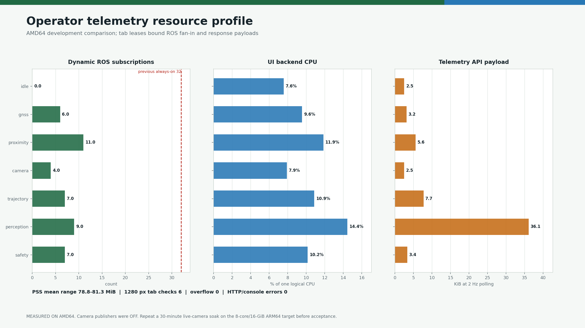

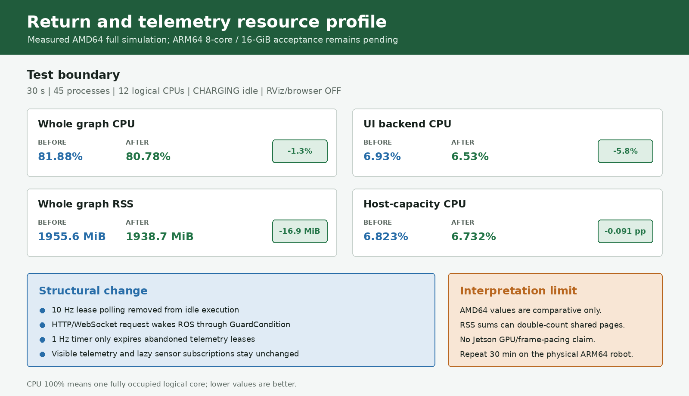

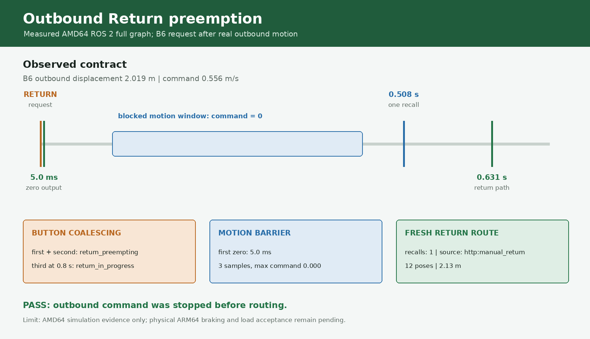

The adjacent JSON records backend-only CPU/PSS and 2 Hz payload size. Its
largest measured view was perception at `14.45%` of one logical core,
`80.00 MiB` PSS, and `36.14 KiB`; ARM64 8-core/16-GB acceptance is still open.
The current full-graph A/B replaces permanent 10 Hz lease polling with an
event-triggered guard and 1 Hz expiry timer, reducing AMD64 total/UI CPU and
summed RSS while preserving the visible 10 Hz stream. It is not Jetson
acceptance. The live preemption run separately proves that outbound motion is
zeroed before one fresh return route is issued; both frontend controls share
that production endpoint.

## Key Measured Results

| Module | Measurement | Result | Limit |
|---|---|---|---|
| Bringup | Map-v17 B1-B10 endurance | `10/10`, `2210.611 s`, restart `0`; cycles 2-10 include full outbound/RETURN/parking/charging | Cycle 1 seeded; physical CAN/road pending |
| Platform/bringup | Current normal-to-B8 run | Normal Nav2 `3.73 m`, maximum `linear.y=0.000 m/s`; then B8 same-anchor seven-phase `DONE`, IN/OUT path updates `2`, mixed-axis commands `0` | AMD64 simulation; physical wheel-mode acceptance pending |
| Localization | 30-second stationary probe | Selected pose `20.000 Hz`, age p95 `1.83 ms` | No field ground truth or motion disturbance |
| Sensor kit/planning | Common route A/B | Cross-track RMS `0.0588 -> 0.0549 m`; yaw RMS `2.901 -> 2.713 deg` | One simulated route segment |
| Control | One-sided automatic crab | `0.3375 m`; output `<= 0.05 m/s` | Mission did not complete |
| Control | Same-goal RPP retry | `0.4726 m`, yaw `-2.0008 deg` | A second boundary hold occurred |
| Control | Rapid retry containment | Map v14 recontact `0.276 s` (v13 `0.267/0.372 s`); one release; final Twist zero | Physical wheel response pending |
| Control/planning | 3 km/h preview A/B | Scaled preview recontact `0.850 s`; fixed `1.1 m` B1/B2 `2/2` | AMD64 simulation; field tuning pending |
| Control/bringup | Final planning-margin recovery | B2-B10 hold/motion/release `9/9/9`; retry latch `0`; service continued | Physical margin/body contact pending |
| Control | Repeatable map-v14 probes | route recontact `0.366 s`; static reverse `0.0721 m`; crab-left `0.3321 m`; final Twist zero | Route remains fail-closed |
| Control | v2.1.4 release-map route/static probes | `REVERSE_YAW_RIGHT`; max `0.05 rad/s`; recontact `0.335/0.400 s`; final Twist zero | Retry contained; route remains fail-closed |
| Control | v2.1.4 release-map one-side probe | `CRAB_LEFT`; `0.3378 m`; max lateral `0.05 m/s` | Hold released; mission incomplete |
| Control/planning | Reduced-boundary route (historical) | `10.0403 m`; goal error `0.2932 m`; no route hold | Earlier `1.29160 x 0.87000 m` body |
| Control | Reduced-boundary margin contact (historical) | ordinary output `0.0 m/s`; `CRAB_RIGHT` `0.133 m` at max `0.05 m/s` | Policy evidence retained; geometry superseded |
| Control | Reduced-boundary body contact (historical) | candidate none; owner motion false; recovery output `0.0 m/s` | Hard-stop policy evidence |
| Control/bringup | B11-B13 roadside arrival | `CRAB_IN -> UNLOAD_WAIT -> WAIT_RETURN`; all PASS without zero-turn | Return geometry field-pending |
| UI | Browser/backend/ROS lifecycle | Mission, return, safety hold, state 16, B6 keypad, and six leased telemetry views observed | No physical movement or ARM64 frame-pacing claim |
| Sensing/perception | Physical stationary report | Radar-off `600.063 s`; front camera `9.167 Hz` and `2750/2750` decode | Raw logs external; no accuracy or motion claim |
| Sensing | Rear camera field report | Raw `3.633 Hz` vs `10 Hz` target | Rate failed |
| Localization/system | Physical stationary report | Final pose `14.99 Hz`; CPU `99.26%` | Header-age p95 `352.5 ms`; CPU saturated |

## Boundary Contact And Recovery

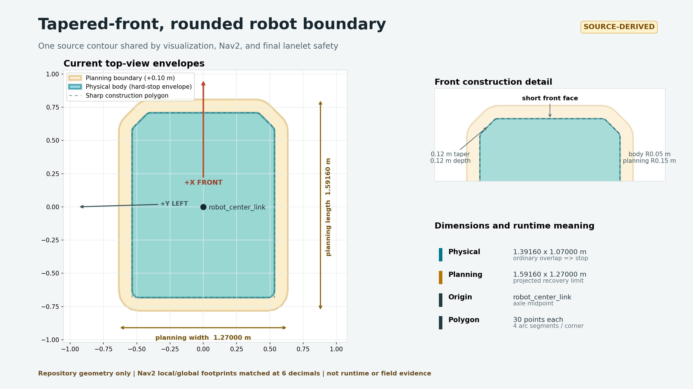

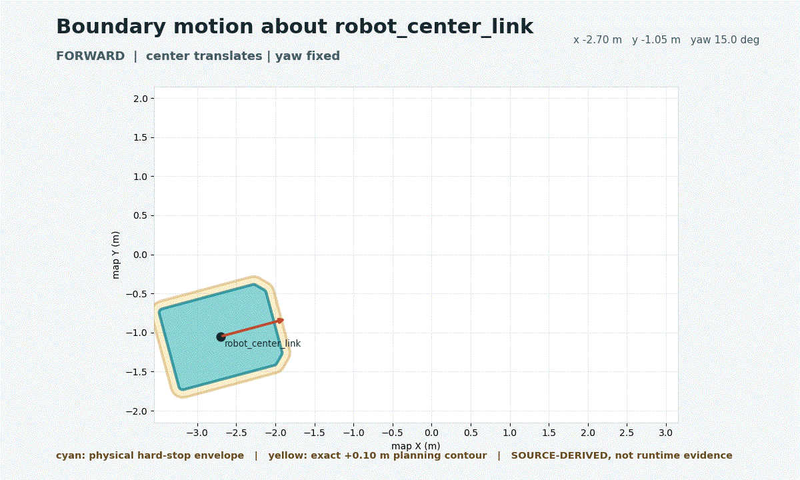

The [2026-08-10 visual record](assets/module-guides/sensor-kit/test-results/tapered-rounded-boundary-20260810/README.md)
is the current shape reference: physical `1.39160 x 1.07000 m`, exact `0.10 m`
planning offset `1.59160 x 1.27000 m`, and 30 points per contour. Its forward,
curve, crab, and zero-turn GIF is a source-derived rigid transform, not a ROS
collision or recovery run. The measured assets below retain their original map,
geometry, and runtime labels.


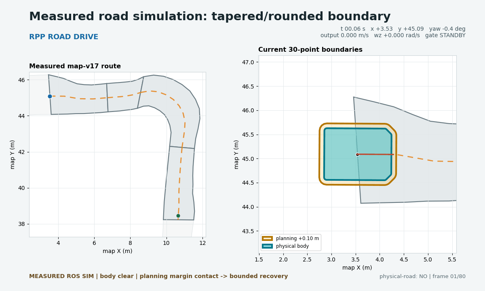

The [measured map-v17 ROS record](assets/module-guides/control/test-results/tapered-rounded-boundary-road-sim-20260810/README.md)
is the historical runtime companion to the source-derived shape. Across 511 poses,
only the planning contour reached cost 100; bounded `REVERSE_YAW_RIGHT` moved
`0.0972 m`, changed yaw `-4.545 deg`, released the hold, and completed the same
route. The record explicitly carries `field_claim=false`.

| First complete-footprint contact | Current narrow-route risk |
|---|---|
| 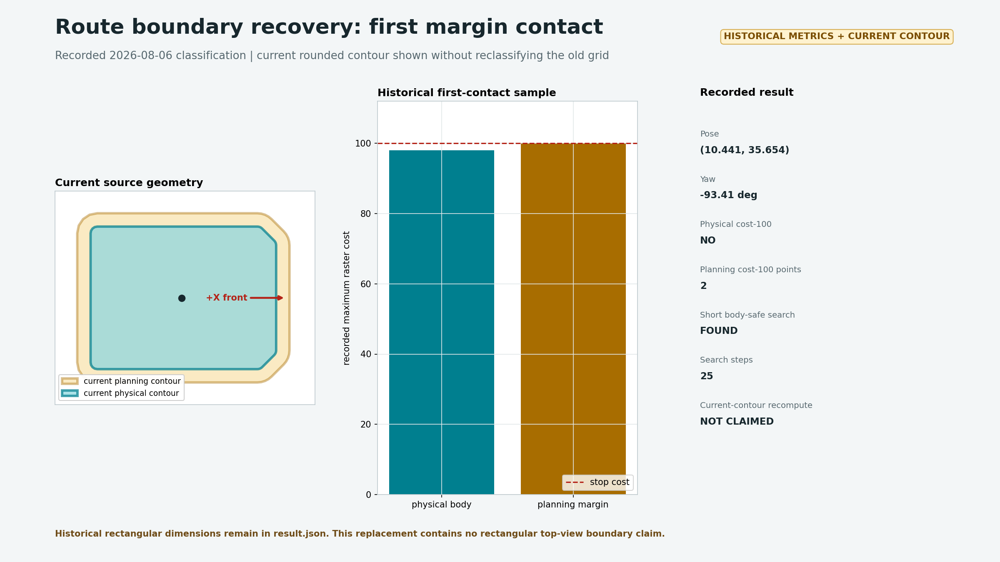 | 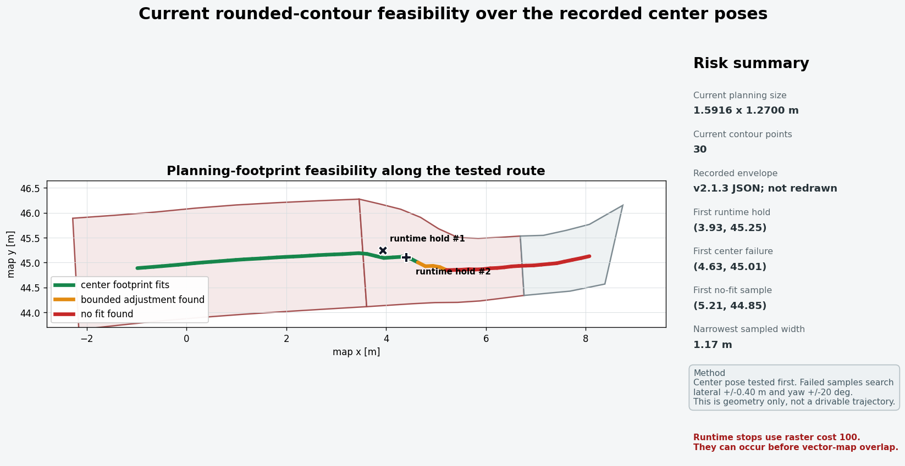 |

| Earlier manual gate probe | Current production command owner |
|---|---|
| 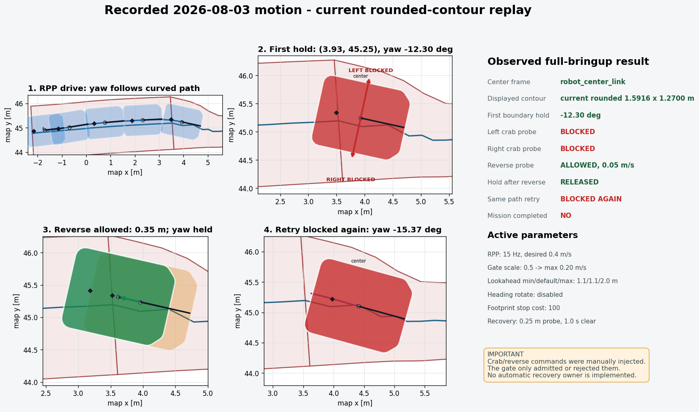 | 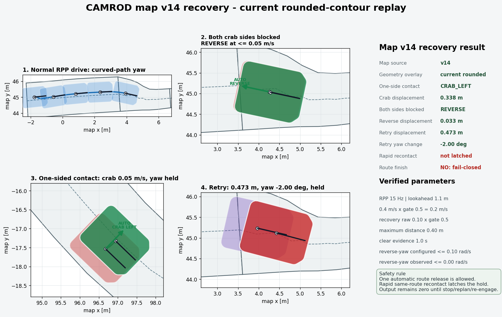 |

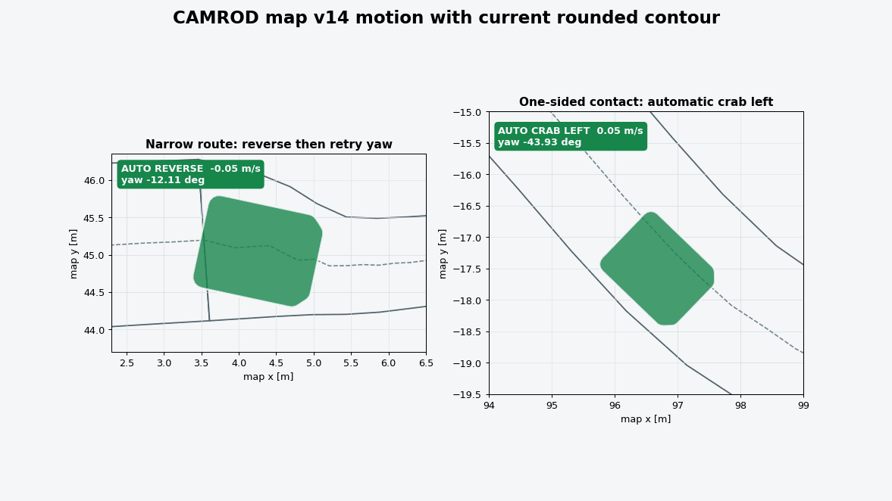

| v2.1.4 release-map measured result | Release staged decision policy |
|---|---|
| 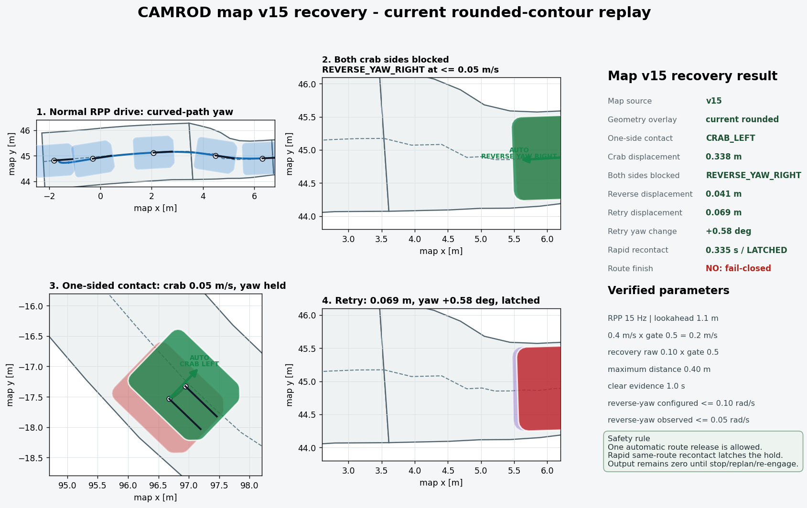 | 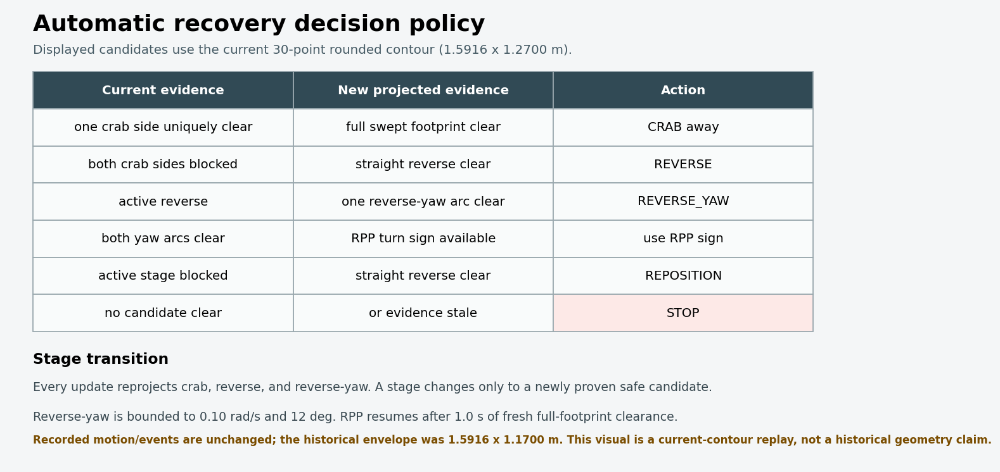 |

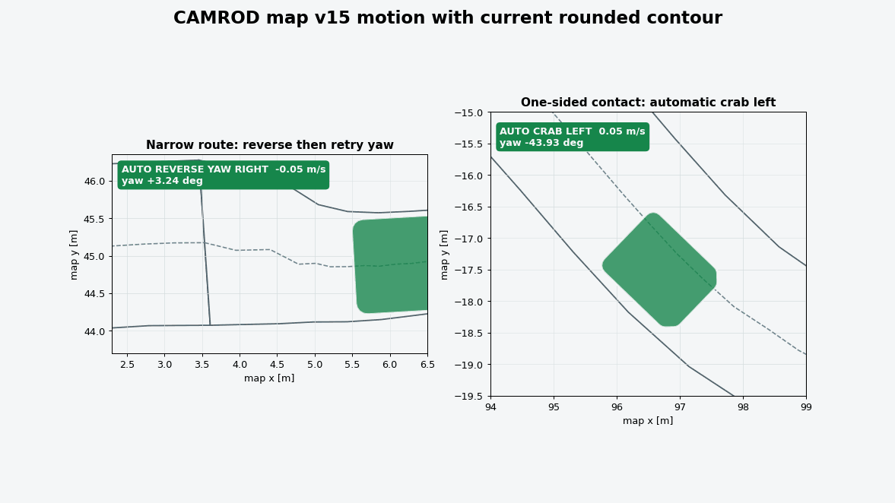

| Historical map-v14 measured result | Historical translation-only policy |
|---|---|
| 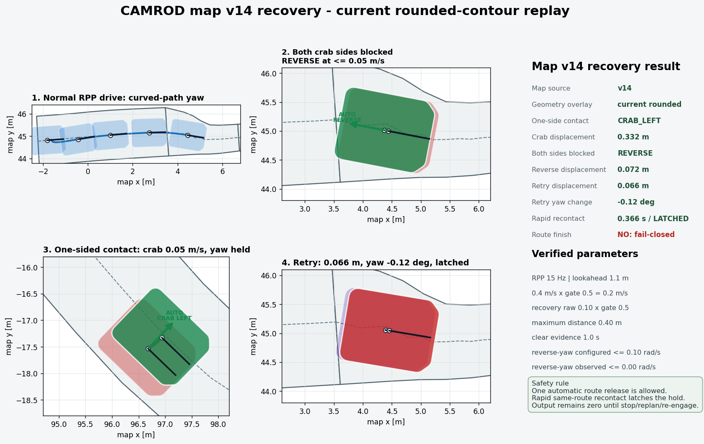 | 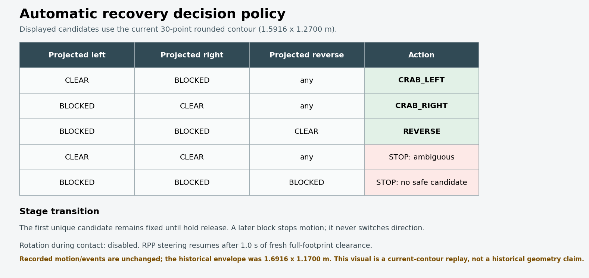 |

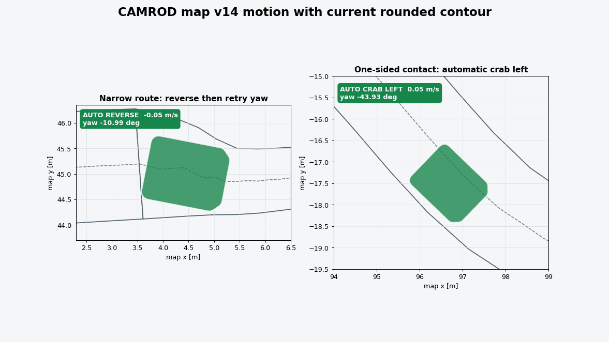

| Live RViz contact | Live gate status and zero output |
|---|---|
|  | 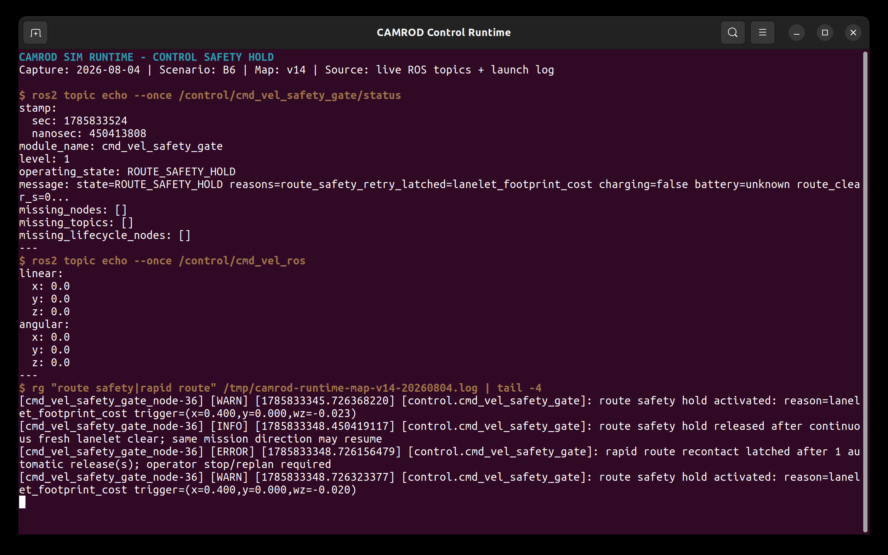 |

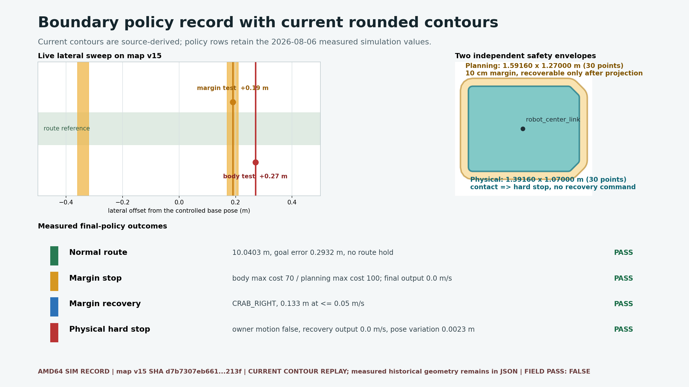

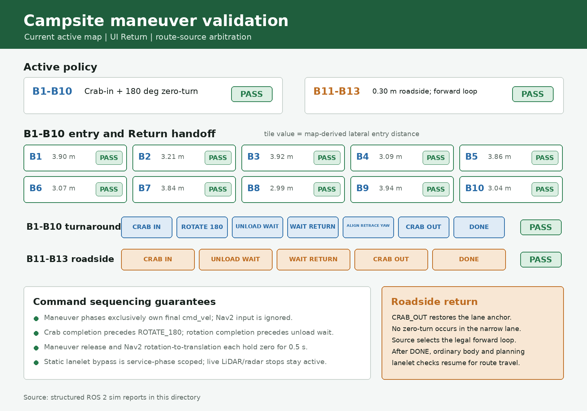

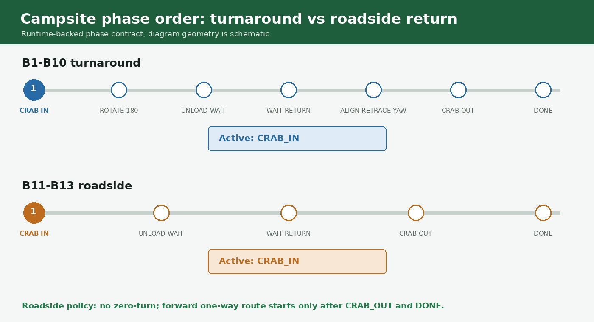

The current-map result covers all 13 UI Return exits. B1-B10 turn on site and
may retrace the reverse shortest path. B11-B13 cap lateral movement at `0.30 m`,
skip zero-turn, restore the lane anchor through `CRAB_OUT -> DONE`, and select
the forward one-way loop. A complete B11 run continued through drop-zone
alignment, reverse parking, charger contact, controller `PARKED`, and public
`CHARGING`. This remains AMD64 simulation rather than physical-road acceptance.

| Contact geometry | Allowed action |
|---|---|
| Physical body touches virtual cost 100/unknown | Ordinary command stays zero; permit only monotonic-overlap-reducing escape with swept body and endpoint planning clearance |
| Only the outer 10 cm planning margin touches | Ordinary command remains zero; use the same separately projected bounded-candidate proof |
| Exactly one lateral candidate clear | Pure crab away from contact |
| Lateral candidates blocked and reverse clear | Reverse to create room |
| Reverse active; one yaw arc clear | Switch to that projected reverse-yaw arc |
| Both yaw arcs clear and RPP requests a turn | Use the RPP turn sign at `<= 0.10 rad/s` |
| Active crab becomes blocked | Reposition with projected straight reverse, then reevaluate |
| No projected candidate clear | Remain stopped |
| Fresh saved route clear for `1.5 s` after observed recovery motion | Release hold; retained RPP resumes yaw |
| 50 releases reached in one contact region | Block same-direction Nav2 resume; keep projected-safe inward escape eligible |
| Signed forward progress reaches `0.75 m` past the original contact | Reset the regional release counter; lateral/backward oscillation does not reset it |

Dynamic-obstacle handling is a separate contract. The command safety gate
stops immediately on valid obstacle evidence. A planner change from
`LaneletRoute` to `SmacLattice` requires the blockage to persist for `20.0 s`
and requires fresh map evidence proving at least `2.50 m` contiguous width and
`0.60 m` clearance on both sides. The timeout never delays the safety stop.

Active contact recovery permits only a projected reverse-yaw correction:
translation `<= 0.10 m/s`, yaw rate `<= 0.10 rad/s`, yaw change `<= 12 deg`,
total travel `<= 0.40 m`, and total duration `<= 10 s`. Every transition is
checked with constant-twist swept endpoint geometry, fresh pose/lanelet data,
the full planning footprint, and dynamic obstacles. The map-v14 PNG/GIF
predates this staged policy and remains historical. The map-v15 PNG/GIF
exercises the current owner dynamically on release SHA `e0b50f...e36d`, not on
the active map-v16 SHA `fd9c18...d0cf`; both retry routes ended in the
fail-closed latch. Physical validation remains pending.

The reduced-boundary current-site run used the prior map-v15 SHA
`d7b730...213f`. It completed the
controlled `10.0403 m` route without a hold, recovered the `+0.19 m`
margin-only placement with `CRAB_RIGHT`, and retained a motionless hold at the
`+0.27 m` physical-body placement. This validates policy separation only; it
does not validate the now-active fabrication-inclusive body dimensions.

## Mission State Interpretation

| Layer | Examples | Priority/meaning |
|---|---|---|
| Parking internal phase | `PARKED` | Controller has reached its terminal pose |
| Public service state | `DROP_ZONE_WAIT`, `WAITING_FOR_CHARGING`, `CHARGING` | Charging feedback determines the visible state |
| Gate state | `ENABLED`, `ROUTE_SAFETY_HOLD`, battery stop | Final command authorization |
| Health state | `OK`, `WARN`, `ERROR` | Data/module health only |

`CHARGING` is public-state priority when CAN charging feedback is true even
though the parking controller is also internally `PARKED`. Expected site-entry
Nav2 cancellation is a control handoff, not a latched planning warning.

## Regeneration

Run from the repository root after changing referenced YAML, messages, code
constants, or evidence JSON:

```bash
python3 camrod_bringup/scripts/visualization/render_module_readme_assets.py
python3 camrod_bringup/scripts/visualization/render_tapered_rounded_boundary.py
python3 camrod_bringup/scripts/visualization/render_tapered_rounded_road_sim.py
```

Render one package or a subset:

```bash
python3 camrod_bringup/scripts/visualization/render_module_readme_assets.py --module control
python3 camrod_bringup/scripts/visualization/render_module_readme_assets.py \
  --module sensing --module perception --module ui
```

Supported module names:

```text
bringup common control localization map planning perception platform
sensing sensor-kit system ui voice
```

Regression checks regenerate into a temporary directory and verify all asset
dimensions plus the 10 GIF frames:

```bash
pytest -q camrod_bringup/test/test_module_readme_assets.py
pytest -q camrod_bringup/test/test_tapered_rounded_boundary_assets.py
pytest -q camrod_bringup/test/test_tapered_rounded_road_sim_assets.py
```

The renderer recreates source-derived diagrams only. `SIM RUNTIME CAPTURE`
files are intentionally not synthesized by it; repeat them from the exact
bringup command and record the matching metadata/raw log. Neither process
mutates runtime configuration.

## Field Evidence To Add

| Module | Required real-robot evidence |
|---|---|
| sensing/perception | Re-run and commit raw front-camera/radar-off evidence; rear-camera rate, six active radar channels plus REAR acceptance, calibration, detection/fusion/tag output |
| localization | Surveyed GNSS lever arm, GNSS-to-center residuals, yaw, wheel slip, vibration, moving latency |
| planning/control | All lane widths, physical oscillation, boundary stop distance, crab/reverse recovery, safe re-engage |
| platform | CAN latency, steering-angle settling, BMS current sign, actuator accuracy |
| voice | Speaker connection delay, audibility, interruption, and outdoor acceptance |
| bringup | Complete site arrival, explicit return, return route, selected parking, `PARKED`, and charging feedback |

Use production Jetson configuration unchanged while collecting these captures:

```bash
ros2 run camrod_bringup pose_latency_probe.py \
  --duration 60 --output-json "$HOME/camrod_field_logs/pose-chain.json"
ros2 run camrod_bringup camera_payload_probe.py --duration 300 --min-rate-hz 5
camrod_bringup/scripts/field_test_tool.sh snapshot
camrod_bringup/scripts/field_test_tool.sh record-recovery
```

Preserve raw log/bag/JSON first, then derive PNG/GIF with the command, baseline
commit, duration, and pass criteria. The active tapered-front, rounded planning
polygon has `1.59160 x 1.27000 m` bounding extents and is an exact `0.10 m`
offset from the body contour; sensor housings and swept clearance still require
field verification. Current AMD64 simulation demonstrates B1-B10 turnaround
and B11-B13 roadside exit sequencing; one B11 run also completes the forward
loop, parking, and simulated charging. Physical B11-B13 clearance and all
physical parking/charging acceptance remain field-pending.
