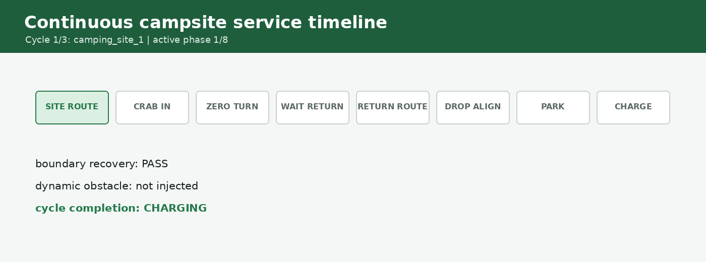

# CAMROD v2.1.5 Release Notes

<!-- HH_260805 - Release the scoped runtime remediation and align the
unverified GNSS position contract with robot_center_link. -->
<!-- HH_260806 - Add the provisional boundary reduction and enforce an
unrecoverable physical-body contact independently of the planning margin. -->
<!-- HH_260806 - Supersede the temporary GNSS center assumption with the
measured left-antenna lever arm and heading-aware center correction. -->
<!-- HH_260806 - Finalize map-v16 campsite sequencing and replace the reduced
body candidate with the fabrication-inclusive measured envelope. -->
<!-- HH_260806 - Correct the post-tag Nav2 stop-go regression without weakening physical-body safety. -->
<!-- HH_260806 - Remove the 2-degree RPP curve-rotation loop and retain the measured 1.1 m lookahead. -->
<!-- HH_260806 - Add the 3 km/h operational profile and delayed-measurement EKF contract. -->
<!-- HH_260807 - Add map-v17 repeated service, B2 recovery, and safe obstacle preflight evidence. -->
<!-- HH_260807 - Finalize fixed 1.1 m preview, single-owner platform status,
and service-handoff path diagnostics. -->
<!-- HH_260807 - Record the final B1-B10 no-restart service endurance and
route-snap campsite return contract. -->

Release date: 2026-08-07 (Asia/Seoul)

Previous baseline: `v2.1.4` / `f83975d5e`

## Release Summary

v2.1.5 closes the post-v2.1.4 runtime work as one reviewable baseline. It
eliminates the reproduced AMD64 checker/Nav2 component shutdown faults,
prevents full-graph DDS shared-memory exhaustion by scoping SHM to physical
LiDAR only, and converts the measured left-GNSS antenna solution to
`robot_center_link`. It separates physical-body contact from recoverable
planning-margin contact, restores the fabrication-inclusive measured body as
the active hard-stop envelope, serializes campsite/Nav2 command ownership, and
sets the active service cruise reference to `3.0 km/h` while preserving each
operational linear-speed ratio.

Only the GNSS lateral offset is measured. Rover X/Z, moving-base XYZ, baseline
direction, receiver position reference, moving residuals, sensor housings, and
four-side swept clearance remain unverified. Jetson/physical mission acceptance
remains in `TODOLIST.txt`.

## Active Contract

| Item | v2.1.5 value | Meaning |
|---|---:|---|
| Navigation base | `robot_center_link` | Axle midpoint for localization, planning, control, and platform |
| GNSS physical TF | left antenna `(0,+0.45,0) m` | ROS body `+Y` is left; X/Z retain current values |
| GNSS estimator output | heading-corrected robot center | `p_center = p_fix - R(yaw)[0,0.45]` |
| GNSS verification | `pose_verified=false` | Remaining dual-GNSS geometry and moving residuals require field acceptance |
| Physical body | `1.39160 x 1.07000 m` | Fabrication-inclusive measured total used by the hard-stop layer |
| Planning boundary | `1.49160 x 1.17000 m` | Physical body plus `0.05 m` on every side |
| Physical-body map contact | `lanelet_physical_body_cost` | Hard stop; every automatic recovery candidate is rejected |
| Planning-margin contact | `lanelet_footprint_cost` | Ordinary output zero; projected bounded escape may be admitted |
| Checker topology | `24` checkers in `4` serialized containers | Standalone executables remain field fallbacks |
| System core | `4` nodes in one serialized container | Aggregate/status fault domain |
| Nav2 topology | planner/controller container | Smoother, behavior, BT, and lifecycle servers remain standalone |
| LiDAR cost grid | default `OFF` | Node/topic/checker requirement activate together |
| DDS shared memory | default `OFF`, physical LiDAR only | Never exported to simulation or the full ROS graph |
| Operator renderer | Chromium | WebKit remains the measured lighter fallback |
| Campsite policy | B1-B10 `turnaround`; B11-B13 `roadside_stop` | Constrained sites stop without an on-site zero-turn |
| Command handoff | `0.5 s` zero hold | Applied only when an explicit campsite/drop-zone maneuver releases ownership to Nav2 |
| Normal Nav2 stream | no source handoff | RotationShim/RPP rotation and translation remain one continuous owner |
| RPP curve tracking | continuous, fixed `1.1 m` | Velocity scaling is disabled; gross yaw alignment is isolated in the gate |
| RPP cruise | raw `1.666667 m/s`, gate `0.5` | Final platform reference `0.833333 m/s` (`3.0 km/h`) |
| Field EKF/controller | `20 Hz`, `1.0 s` lag history | IMU/wheel prediction at 50 ms; pose WARN/ERROR below `18/14 Hz`; physical dual-GNSS remains `1 Hz` |
| Lanelet safety raster | `600 x 600 @ 0.05 m` | Independent local occupancy grid for body/margin checks; Nav2 retains its `0.25 m` planning grid |
| Active map | version `17`, SHA `8cd05c...5e021` | User-edited active/copy OSM pair remains byte-identical |

## Body Boundary History And Runtime Policy

The prior body was `1.49160 x 1.07000 m`; the prior planning rectangle was
`1.59160 x 1.17000 m`. v2.1.5 preserves those values and their bag hashes in
the test record. The initially tagged reduced candidate was:

| Side | Body extent | Planning extent |
|---|---:|---:|
| Front | `0.65837 m` | `0.70837 m` |
| Rear | `0.63323 m` | `0.68323 m` |
| Left | `0.43505 m` | `0.48505 m` |
| Right | `0.43495 m` | `0.48495 m` |

An initial physical-contact simulation exposed that the gate sampled only the
larger planning polygon: it issued `0.05 m/s` recovery and moved `0.0652 m`
while the body was already on map cost 100. The corrected gate samples the
body first. Only margin-only contact can reach the projected crab/reverse/yaw
selector; body contact has no automatic escape path.

| Fresh map-v15 scenario | Measured result |
|---|---|
| Normal route | PASS: `10.0403 m`, goal error `0.2932 m`, no route hold |
| Margin ordinary command | PASS: body max `70`, planning max `100`, output `0.0 m/s` |
| Margin recovery | PASS: `CRAB_RIGHT`, `0.133 m`, max `0.05 m/s` |
| Physical-body contact | PASS: no candidate, no owner motion, output `0.0 m/s` |

These are AMD64 simulation policy results, not evidence that the reduced
rectangle contains the real wheels, sensors, brackets, cables, or payload. The
candidate is now historical. The active configuration uses:

| Side | Physical body | Planning boundary |
|---|---:|---:|
| Front | `0.70837 m` | `0.75837 m` |
| Rear | `0.68323 m` | `0.73323 m` |
| Left | `0.53505 m` | `0.58505 m` |
| Right | `0.53495 m` | `0.58495 m` |

The active totals are `1.39160 x 1.07000 m` body and
`1.49160 x 1.17000 m` planning. The body/outer-margin decision policy is
unchanged; current four-side and swept-clearance field acceptance remains open.

## Campsite Sequencing

- B1-B10 are explicitly `turnaround`. All ten full site-maneuver runs observed
  `CRAB_IN -> ROTATE_180 -> UNLOAD_WAIT -> WAIT_RETURN ->
  ALIGN_RETRACE_YAW -> CRAB_OUT -> DONE`; map-derived lateral entry distances
  ranged from `1.79 m` to `5.31 m`.
- B11-B13 are explicitly `roadside_stop`. Their lateral move is capped at
  `0.60 m`; all three arrival-only runs observed
  `CRAB_IN -> UNLOAD_WAIT -> WAIT_RETURN` with no zero-turn and no RETURN.
- While a campsite/drop-zone phase owns motion, Nav2 commands cannot overwrite
  its crab or rotation. A `0.5 s` stationary handoff precedes Nav2 resumption.
  Pure Nav2 rotation/translation changes no longer create a second handoff;
  that behavior caused the reproduced B7 stop-go cycle.
- Static road-lanelet cost is bypassed only in explicit campsite motion phases.
  Dynamic LiDAR/radar stops remain active.
- The prior B11 on-lane return alignment encountered
  `lanelet_physical_body_cost` and remained stopped. Safe B11-B13 return
  geometry is therefore field-pending, not released as a completed scenario.

Structured reports and reproduction commands are in
[`camping-site-sequencing-20260806`](assets/test_result/camping-site-sequencing-20260806/README.md).

## Map-v17 Continuous Service And Safety

The final amd64 full graph ran B1 -> B2 -> B3 for `677.237 s` with no bringup
restart. Every cycle completed campsite routing, `CRAB_IN`, `ROTATE_180`,
unload/wait, a RETURN sent only after `WAITING_FOR_RETURN_REQUEST`, `CRAB_OUT`,
the return route, drop-zone alignment, reverse parking,
`WAITING_FOR_CHARGING`, `CHARGING`, and the next station departure. Cycle 2
also stopped for a 3 s map-fixed obstacle and resumed the same mission after
clear.

The UI backend now preserves `DEPARTING_CHARGER` while a station exit is active,
even if delayed CAN feedback still reports charger contact. Duplicate
destination frames during that pending exit are idempotent. B2 and B3 both
departed from simulated charging without a second motion owner or state reset.
The extended soak runner no longer publishes normalized `/platform/status`.
It changes only the fake raw-BMS battery input and observes the production
`ranger_platform_bridge` conversion, leaving that bridge as the topic's sole
publisher. This removes the validation-only `CHARGING`/`DROP_ZONE_WAIT`
oscillation while testing the same ownership boundary used by hardware.

The post-release-candidate soak also exposed a one-second diagnostic race:
Nav2 retained `EXECUTING` for one checker tick after a campsite or drop-zone
controller had intentionally cleared `/planning/local_path`. The path checker
now consumes `/service/state` and reports that expected service-owned handoff
as `OK`. Independent bounded `3.0 s` timers begin when point count crosses the
WARN and ERROR thresholds. A warning-sized but usable approach path therefore
does not consume the later invalid-path grace or flash an arrival warning;
freshness and persistent point-count faults remain active during route travel.

Three dedicated B2 trials selected `REVERSE_YAW_RIGHT`, completed the original
mission, and produced no second hold or rapid-recontact latch. The route clear
proof is now `1.5 s` and starts only after the final gate has admitted a real
recovery command. Candidate yaw arcs sample the physical body throughout the
continuous twist, not only at the endpoint.

The widest measured road lanelet in map v17 is approximately `3.00 m`. A
centered obstacle, the `1.17 m` planning footprint, and active inflation left
no safe SmacLattice path. The monitor therefore performs
`ComputePathToPose(SmacLattice)` before replacing the active LaneletRoute goal.
The no-path result latched once, produced no planner selector or repeated Nav2
ABORT, and kept the original mission available. Removing the obstacle resumed
that goal and moved `0.242 m` without a new command.

This is a safe no-path PASS, not a successful avoidance claim. A positive
free-space bypass remains field-pending until a surveyed road is wide enough
for the current footprint and inflation. JSON, log, hashes, reproduction, and
claim limits are in the
[`v2-1-5-service-validation-20260807`](assets/test_result/v2-1-5-service-validation-20260807/README.md)
directory.

## Final B1-B10 Service Endurance

[Open the measured ten-cycle GIF](assets/test_result/b1-b10-service-endurance-20260807/b1-b10-service-endurance.gif).

The final AMD64 graph completed B1-B10 `10/10` in `2210.611 s` with no
bringup restart. Cycle 1 was deliberately seeded at the B1 route endpoint to
isolate the site handoff. Cycles 2-10 each completed charger departure, the
full outbound route, campsite crab-in and 180-degree turn, unload wait,
operator-timed RETURN, return route, drop-zone alignment, reverse parking,
waiting for charging, charging, and the next recall.

B5 stopped its final command for a transient obstacle, then resumed the same
mission after clear. B2-B10 generated nine planning-margin holds; all nine
observed bounded recovery motion, completed the 1.5-second clear proof, and
continued service. No rapid-retry latch, physical-body hold, process fault, or
post-service-start system/path fault was recorded. This does not prove a
successful detour: the active map has no surveyed lane wide enough for the
configured footprint and inflation, so positive avoidance remains field work.

Nav2 can legally report goal reached before the body reaches the exact snapped
route pose. Reusing that early arrival as the campsite return target left B4
`0.27 m` from a centerline whose planning margin has only about `0.136 m`
clearance per side. Automatic service now keeps the actual arrival pose for
entry measurement but retains `/planning/goal_pose_snapped` as a separate
return anchor. Crab-out corrects both map axes and slows near the anchor; all
ten handoffs finished within `0.03-0.04 m` before Nav2 resumed.

Raw reports, filtered logs, B4 geometry, path/UI shutdown smokes, SHA manifest,
and regeneration commands are in
[`b1-b10-service-endurance-20260807`](assets/test_result/b1-b10-service-endurance-20260807/README.md).
These are deterministic simulation results, not Jetson, physical boundary,
CAN charging, or road acceptance.

## B7 Stop-Go Regression

The user B7 log contained 15 `stationary command-source handoff` events and 15
matching input-stale events before the first lanelet hold. A corrected full
simulation ran `224.92 s` and `27.1492 m` before its first real margin contact
with zero handoff and zero post-start stale events. The independent `0.05 m`
safety raster also passed an earlier point where the `0.25 m` grid had stopped
the robot despite `12.41 cm` exact planning-boundary clearance.

At `(10.747, 43.654)`, the physical body still had `4.54 cm` vector clearance,
but the configured 5 cm planning margin exceeded the lanelet by `4.55 mm`.
That event remains a recoverable `lanelet_footprint_cost`; it is not hidden or
relabeled as clear-road success. See the
[structured result](assets/test_result/cmd-vel-stop-go-20260806/README.md).

## RPP Curve Tracking

The former 2-degree `use_rotate_to_heading` threshold was evaluated against
every RPP carrot, not only the initial route heading. It produced 403 raw
rotation/translation switches in the reproduced route and appeared as
right-oversteer plus stop-turn-forward motion.

RPP now tracks ordinary curves continuously. The final gate owns one gross
start alignment (`75 deg` enter, `5 deg` release, zero linear velocity), while
manual RotationShim uses `45 deg`/`5 deg` hysteresis. On the same map, the
selected `1.1 m` B8 run traveled `59.931 m`, emitted zero raw R/T switches,
recovered one planning-margin contact, and reached `GOAL_REACHED`. A controlled
`1.2 m` comparison recontacted the margin `0.999 s` after release and was
rejected. See the [structured comparison](assets/test_result/rpp-curve-tracking-20260806/README.md).

The final source-profile service A/B then exercised the active `3.0 km/h`
command path. Velocity-scaled preview grew to about `1.5 m`, recreated the
same boundary `0.850 s` after release, and latched safely. With scaling disabled,
fixed `1.1 m` completed B1 and B2 in `422.848 s` without a bringup restart,
including obstacle stop/clear/resume, B2 `REVERSE_YAW_RIGHT`, explicit RETURN,
parking, and charging. The final gate now evaluates and logs the same scaled
`0.833333 m/s` command that it publishes.

Raw excerpts, structured inputs, and reproduction are in the
[`rpp-lookahead-service-ab-20260807`](assets/test_result/rpp-lookahead-service-ab-20260807/README.md)
directory. These are AMD64 deterministic-simulation results, not Jetson or
physical-road acceptance.

## 3 km/h Speed And Localization Latency

The final gate retains `speed_scale=0.5`. Raw active controller/maneuver
limits were scaled by `3.0 / 0.72 = 4.166667` so the final platform outputs
retain their previous operational ratios:

| Operation | Cruise ratio | Final limit |
|---|---:|---:|
| RPP cruise | `100%` | `3.000 km/h` |
| RPP curvature floor / final approach | `50% / 25%` | `1.500 / 0.750 km/h` |
| Campsite crab | `60%` | `1.800 km/h` |
| Campsite reverse / drop-zone exit / reverse parking | `40%` | `1.200 km/h` |
| AprilTag approach / insertion | `50% / 12.5%` | `1.500 / 0.375 km/h` |
| Optional yaw-zone approach 1 / 2 | `62.5% / 50%` | `1.875 / 1.500 km/h` |
| Zero-turn / gross yaw alignment | `0%` | `0 km/h` |

The route-boundary recovery controller remains the safety exception at raw
`0.10 m/s`, final `0.18 km/h`, with the existing `0.40 m`, `10 s`, and
`12 deg` bounds. Angular limits were not scaled.

With its planar mode active, the real EKF fuses absolute GNSS position and
dual-GNSS yaw, IMU yaw rate, and wheel `vx/vy` plus yaw rate. The remaining 3D
states are clamped and absolute IMU yaw remains disabled. The real EKF,
local-path/tracking heartbeat, Nav2 controller, and final-pose diagnostic target
are synchronized at `20 Hz`; delayed-data history changes from `0.3 s`
to `1.0 s` because the prior 15 Hz stationary physical sample measured
selected-pose age up to `747.6 ms`. Physical dual-GNSS remains at `1 Hz`.

The EKF process-noise and measurement-covariance values remain unchanged. The
bundled filter scales process noise by elapsed time, so increasing publication
cadence does not itself justify rescaling `Q`; GNSS heading rejection and
wheel/IMU weighting remain pending a common moving Jetson rosbag.

The isolated AMD64 12 m smoke run reached `3.000001 km/h`, published selected
pose at `20.024 Hz`, measured a `6.485 cm` maximum step, and recorded zero
steps over `20 cm`. It uses fake 10 Hz GNSS and the 20 Hz simulation EKF, so it
does not validate the physical 1 Hz dual-GNSS or Jetson moving case. See the
[structured result](assets/test_result/three-kph-localization-20260806/README.md).

## GNSS Left-Antenna Correction

Before v2.1.5, `gnss_link` used `x=-0.443 m`. That value was only the old
rear-axle `0.0 m` placeholder converted to the axle-midpoint coordinate system;
it was not measured on the robot.

The initially tagged v2.1.5 contract temporarily placed GNSS at `(0,0,0)` to
remove that mismatch. The physical clarification now identifies NavSatFix as
the left antenna, `0.45 m` from center. TF alone is therefore insufficient:
the position itself must be corrected with vehicle heading.

| Source | Converted placeholder | Initial center assumption | Current correction |
|---|---:|---:|---:|
| Package/bringup TF | `(-0.443,0,0)` | `(0,0,0)` | `(0,+0.45,0)` |
| Xacro fallback | `(-0.443,0,0)` | `(0,0,0)` | `(0,+0.45,0)` |
| Default/sim diagnostic mount | `-0.44300,0,0` | `0,0,0` | `0,+0.45000,0` |
| Localization position | direct NavSatFix | direct NavSatFix | subtract heading-rotated lever arm |
| Verification flag | `false` | `false` | `false` |

The adapter requires a fresh usable dual-GNSS heading before applying the
correction. Jump rejection then operates on the corrected center position.
Simulation publishes a left-antenna NavSatFix and matching raw heading, so it
executes the same transform instead of disabling it.

The focused AMD64 ROS A/B matched 30 timestamps. The correction displacement
was `0.450000 m`; center residual was `0.449995 m` with correction disabled and
`0.000071 m` mean/max with production correction enabled. The test also fixed
an existing fake WGS84 northing inverse error. This remains simulation evidence,
not a field GNSS PASS. [Structured result](assets/test_result/gnss-lever-arm-20260806/README.md).

The GNSS correction itself leaves IMU, LiDAR, camera, radar, axle, controller,
map, parking, body, and planning coordinates unchanged. A separate boundary
update uses the confirmed base-platform
`1.19160 x 0.87000 m` and fabrication-inclusive `1.39160 x 1.07000 m` totals
as chassis and active-body values respectively. Lanelet map revision 16 is a
separate historical user geometry change; the current synchronized deployment
pair is revision 17.

## Runtime And Shutdown

- Added `camrod_runtime` single- and multithreaded scoped component containers.
  Manager, components, and executor share one explicit `rclcpp::Context`.
- Shutdown joins the deferred signal handler, detaches component callback
  groups, destroys node instances before plugin unload, and releases explicit
  executor Context ownership in a deterministic order.
- ROS 2 Humble can retain Context owners into DSO static destruction. After all
  owned resources are explicitly finalized, the container bypasses only that
  unsafe process-exit destructor phase to prevent CycloneDDS `tev`/`recv`
  workers from executing unmapped RMW code.
- Twenty-four checkers run in four process fault domains: hardware/sensing,
  localization, autonomy/topics, and planning/lifecycle. The system-core
  aggregate/status container remains separate.
- Nav2 composes planner and controller only. Vendor servers that own private
  default-context executors remain standalone, preserving lifecycle behavior.
- Robot and Guest UI treat both `KeyboardInterrupt` and
  `ExternalShutdownException` as normal launch shutdown.

Native tracing and the four final simulation runs are recorded in
[`amd64-scoped-container-shutdown-20260805.json`](evidence/v2.1.5/runtime-topology/amd64-scoped-container-shutdown-20260805.json).

## Transport And Sensor Containers

- Removed global CycloneDDS/iceoryx environment injection. Even when requested,
  DDS-SHM resolves active only for `sim:=false` with the physical LiDAR driver.
- LiDAR preprocessing and ground segmentation retain intra-process transport;
  the optional transient-local cost grid keeps DDS transport and defaults OFF.
- Rear physical capture, image rectification, and AprilTag detection can share
  one conditional component container. Standalone ownership remains available.
- Front camera/YOLO and the other existing component paths keep their established
  topic ownership; no duplicate publishers are introduced.

The measured AMD64 process/CPU/PSS comparisons remain in
[`amd64-container-ab-20260805.json`](evidence/v2.1.5/runtime-topology/amd64-container-ab-20260805.json).

## Measured AMD64 A/B

<!-- HH_260805 - Keep workstation measurements separate from Jetson acceptance
and report one logical CPU as 100 percent. -->

The full-simulation samples used an Intel i5-12400F, `sim:=true`, and disabled
RViz, UI window, DDS-SHM, and LiDAR cost-grid. Values are process-tree means;
CPU `100%` means one logical CPU, not the whole workstation.

| System core, 3 runs | Standalone | Container | Change |
|---|---:|---:|---:|
| Processes | `69.0` | `66.1` | `-3.0` (`-4.3%`) |
| CPU | `87.8%` | `85.2%` | `-2.5 points` |
| RSS | `2538.9 MiB` | `2496.2 MiB` | `-42.7 MiB` |
| PSS | `1632.6 MiB` | `1612.9 MiB` | `-19.7 MiB` |
| Startup to `[SYSTEM] OK` | `26.51 s` | `26.91 s` | `+0.40 s` |
| Controlled stop | `3/3` | `3/3` | equal |

| Isolated LiDAR, 2 runs at 60k points/10 Hz | Standalone | Container | Change |
|---|---:|---:|---:|
| Processes | `4` | `3` | `-1` |
| CPU | `8.36%` | `6.90%` | `-17.5%` |
| RSS | `124.84 MiB` | `164.11 MiB` | `+39.27 MiB` |
| PSS | `84.75 MiB` | `128.76 MiB` | `+44.01 MiB` |
| Output | `10.005 Hz`, `324/324` | `10.002 Hz`, `324/324` | zero loss |

| Operator window, 3 runs | WebKit | Chromium | Chromium - WebKit |
|---|---:|---:|---:|
| Processes | `69.1` | `80.4` | `+11.3` |
| CPU | `89.3%` | `90.8%` | `+1.44 points` |
| RSS | `3005.2 MiB` | `3920.1 MiB` | `+915.0 MiB` |
| PSS | `1926.2 MiB` | `2253.5 MiB` | `+327.3 MiB` |
| Startup to `[SYSTEM] OK` | `26.77 s` | `25.44 s` | `-1.33 s` |

WebKit was materially lighter on this AMD64 host. The startup difference is
system readiness, not browser first-paint or frame pacing, so Chromium remains
the requested default and Jetson measurement remains required. The resource
A/B predates the scoped shutdown correction; the later four-run lifecycle
record supersedes only its checker/Nav2 shutdown verdict, not its resource
samples.

## Validation

- Three explicit-topology full-simulation runs and one default-argument run
  reached managed Nav2 active and `[SYSTEM] OK`.
- Each run cleanly stopped six component containers. There were zero `-11`,
  forced-kill, UI event-loop, iceoryx capacity, or residual-process failures.
- GNSS geometry, package/bringup mirrors, diagnostic metadata, and regenerated
  sensor-kit assets are protected by source contracts.
- The active and named-copy map-v17 OSM files remain byte-identical at SHA
  `8cd05c66f846cae8718b5af148d123718f403a086f2e7d16165da89fb625e021`;
  they load 55 lanelets, 14 areas, and 1,652 nodes.
- The earlier complete baseline wrapper rebuilt 11 selected packages and passed
  `58/58` CTest targets / `523` xUnit cases. After the final service fixes, the
  canonical wrapper rebuilt the five changed control/planning/system/ui/bringup
  packages. Their scoped run passed `37/37` CTest targets and `303` package-
  report cases with zero errors/failures and eight expected planning cppcheck
  skips; direct UI pytest passed `30/30`.
- The UI production bundle compiled successfully. `npm audit` still reports 39
  existing dependency findings (`11` low, `7` moderate, `19` high, `2`
  critical); no unreviewed `npm audit fix --force` dependency upgrade was made.
- A final release-candidate run on ROS domain 207 reached managed Nav2 active
  and `[SYSTEM] OK`, returned top-level exit `0`, and stopped all six containers
  cleanly. Startup-only map/costmap WARN/ERROR states resolved to OK; they did
  not remain latched.
- A fresh full-bringup map-v15 run after the body-guard correction reached
  `[SYSTEM] OK`; normal route, margin stop, margin `CRAB_RIGHT`, and physical
  hard-stop scenarios all passed with final zero output.
- Historical isolated map-v16 reports retain B1-B10 turnaround 10/10 and
  B11/B12/B13 arrival-only results. The final map-v17 graph completed B1-B10
  service `10/10` in `2210.611 s` with zero restart; cycle 1 was a seeded site
  handoff and cycles 2-10 were complete charger-departure services.
- Optional LiDAR cost-grid ON reached `[SYSTEM] OK` in its scoped container.
  A 20 s centered obstacle produced one safe no-path preflight, no fallback
  selector/ABORT loop, and resumed the original route after clear.
- Map-v17 B2-B10 planning-margin recovery passed `9/9` with observed recovery
  motion before release and no retry latch. All route-snap return handoffs were
  within `0.03-0.04 m`; post-start system/path faults were zero.
- Exact machine-readable build and run results are recorded in
  [`amd64-scoped-container-shutdown-20260805.json`](evidence/v2.1.5/runtime-topology/amd64-scoped-container-shutdown-20260805.json)
  and summarized in `DONE.txt`.

## Field Work Still Required

1. Measure rover X/Z and moving-base antenna XYZ from `robot_center_link`,
   baseline length/direction, and the receiver's reported position reference.
2. Validate the implemented heading-aware lever-arm correction during straight,
   turn, and crab motion before setting `pose_verified=true`.
3. Run Jetson production topology versus standalone resource A/B and ten clean
   mission/cancel/restart cycles.
4. Verify the complete body/wheel/sensor/bracket/cable/payload envelope against
   the active fabrication-inclusive boundary, then repeat the margin and body-contact
   tests on the physical robot.
5. Select and validate a safe B11-B13 return pose/yaw/path; do not treat the
   arrival-only simulation as return approval.
6. Complete rear-camera rate, seven-channel radar, GNSS reacquisition, IMU
   startup, wheel response, parking/docking, charging, and full-route field tests.
7. Confirm the synchronized 20 Hz EKF/controller cadence under moving Jetson
   load; retain the working 1 Hz dual-GNSS correction profile during this test.
8. Repeat the complete site-return-park-charge-next-site sequence at least three
   times with physical CAN feedback and no process restart.
9. Survey a lane wider than the current map-v17 road maximum and prove one
   successful SmacLattice bypass without reducing footprint or inflation.

Exact procedures and pass/fail thresholds remain in [`TODOLIST.txt`](../TODOLIST.txt).
