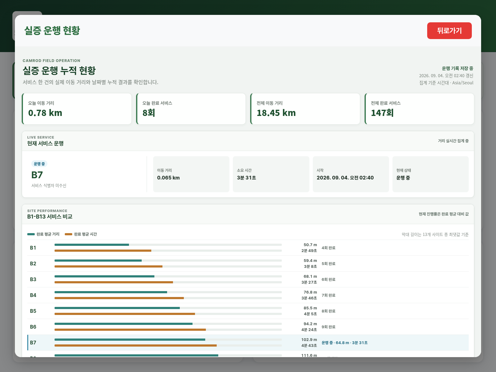
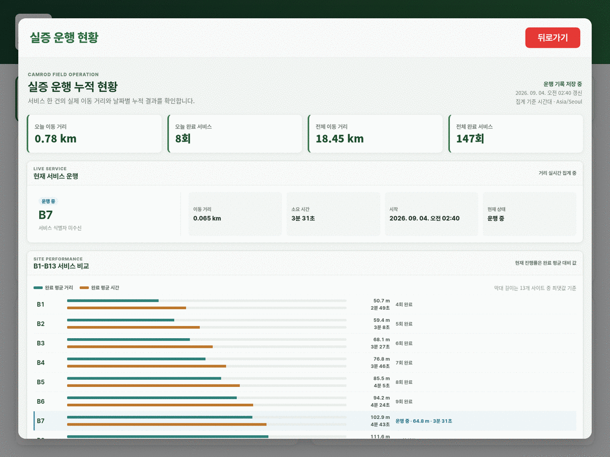
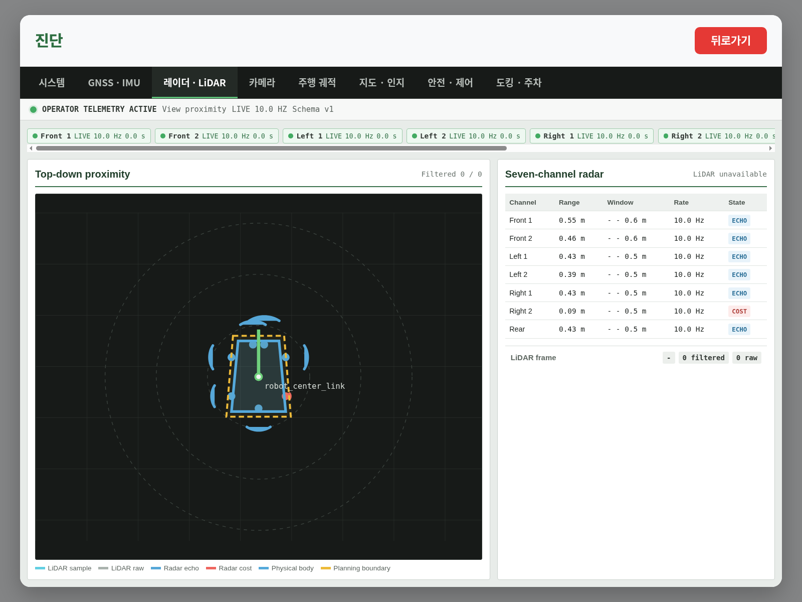

# CAMROD v2.2.3 Release Notes

<!-- HH_260904 - Document the evidence boundary between AMD64 verification and
pending physical-robot acceptance for radar, campsite, and docking behavior. -->

## Scope

`v2.2.3` advances the `v2.2.2` field baseline without changing the user-owned
Lanelet2 map. It separates raw radar echoes from stop-producing radar cost,
clarifies the Site 7 post-turn settle phase, makes the drop-zone parking handoff
position-deterministic, and adds B1-B13 service metrics to the operator UI.

## Radar Authority

| Item | v2.2.3 behavior |
|---|---|
| Side stop-candidate range | `0.10 m` from the sensor face |
| Rear channel | Driver-disabled (`sensor_enabled[6]=false`); its configured usable window remains quarantined |
| Raw finite sample | UI label `ECHO`; never sufficient by itself to claim a stop |
| Stop-producing sample | UI label `COST` only when fresh `/sensing/radar/obstacle_evidence` names that sensor after fixed-return and route clipping |
| `0.43 m` side sample | Outside the active side cost window; displayed as `ECHO`, not `COST` |

Historical test profiles admitted longer side/rear ranges. They are not the
current runtime contract. Current physical logs contain side cost evidence at
`0.090 m`; the physical `0.43 m` no-stop case remains a field acceptance test.

## Site 7 And Physical Pause Diagnosis

The observed `ALIGN_RETRACE_YAW` after `ROTATE_180` is a required yaw/rate
settling phase. It can be stationary even though its old name looked like a
second alignment maneuver. Status detail now reports `action=stationary_settle`
when no correction is needed and `action=corrective_turn` otherwise.

Static lanelet cost is intentionally bypassed only while the bounded campsite
maneuver owns motion. Dynamic radar and classified-fusion stopping remain
active. A physical-only pause that repeats after map edits therefore requires
the same-timestamp radar evidence, fusion source, and final-gate reason; this
release does not weaken those safety sources.

## Deterministic Drop-Zone Parking

Automatic return now uses this sequence:

```text
Nav2 GOAL_REACHED
  -> POSITION_PARKING_POINT (mission-correlated snapped lanelet point)
  -> 0.5 s stopped position settle
  -> ALIGN_PARKING_YAW (90-degree station heading)
  -> reverse or AprilTag parking
  -> WAITING_FOR_CHARGING / CHARGING
```

The correction stops within `0.05 m`, is limited to `0.75 m`, uses at most
`0.20 m/s` raw (`0.10 m/s` after the final `0.5` gate scale), and times out at
`12 s`. Missing, stale-mission, wrong-frame, non-finite, or out-of-envelope
targets fail closed. The operator docking tab displays the exact-point path and
controller status before the reverse/tag paths.

## Unknown Cost Contract

Dynamic obstacle cells with value `-1` remain non-obstacles. Camera-LiDAR
fusion still paints only valid classified detections. Lanelet safety unknown or
out-of-grid cells remain fail-closed because they represent unverified road
geometry, not an unknown object class.

## B1-B13 Evidence UI

The field-evidence view now presents all 13 sites together:

- completed-run average distance and duration bars;
- completed/attempt count and completion rate;
- latest terminal run distance and duration;
- current run distance and duration;
- current values as percentages of the site's completed averages.

The percentages are historical-average comparisons, not route-completion
estimates. Aggregation reuses the existing in-memory/SQLite records in one
linear pass and adds no polling loop or persistence cadence.

## UI Evidence

<!-- HH_260904 - Keep visual UI proof in the versioned module asset tree and
identify deterministic fixture data separately from field measurements. -->






The [artifact record](assets/module-guides/ui/test-results/v2-2-3-radar-service-metrics-20260904/README.md)
states the fixture scope and provides SHA-256 checksums. These screenshots do
not replace physical radar or ARM64 acceptance.

## Verification

- Latest `origin/develop` baseline: `9756edf2d` (`v2.2.2`).
- AMD64 Release build: `camrod_control` and `camrod_perception` passed.
- Native result set: 144 tests, 0 errors, 0 failures, 4 skips.
- UI/config/document contracts: 166 passed.
- React production bundle: passed; desktop and mobile layouts had no horizontal overflow.
- Package/deployment `control.yaml` and `parking.yaml` mirrors are byte-identical.
- `git diff --check`: passed.

## Field Acceptance Still Required

- Prove `0.43 m` side returns stay ECHO-only and `0.09 m` objects produce COST
  and final zero output on the physical robot.
- Record B7 post-turn `action`, yaw error, yaw rate, and final command.
- Correlate each physical campsite pause with radar/fusion/gate evidence.
- Verify the exact-point, 90-degree alignment, and straight reverse sequence at
  every physical drop-zone arrival direction.
- Run the evidence UI and docking telemetry soak on the target ARM64 8-core,
  16 GB host.
