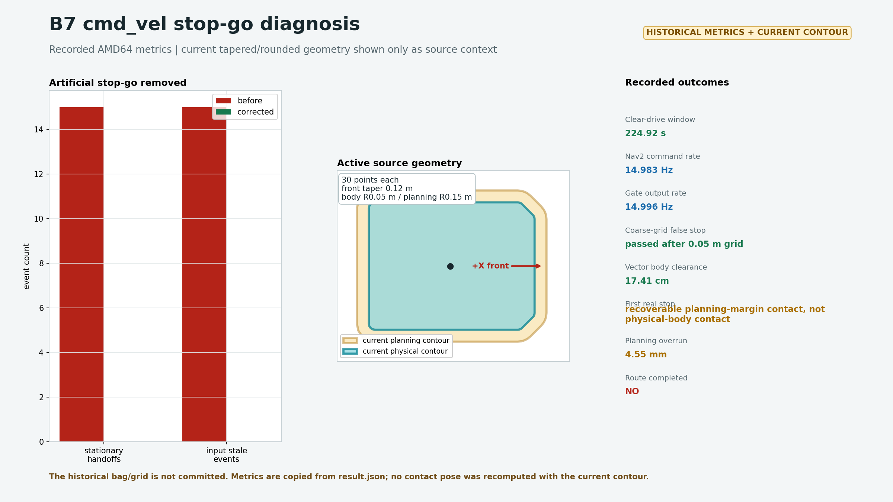

# B7 Cmd_vel Stop-Go Regression - 2026-08-06

<!-- HH_260806 - Separate the artificial Nav2 source handoff from real body and planning-margin contact. -->

이 결과는 사용자가 B7 주행 중 관찰한 반복 정지를 AMD64 full-bringup
simulation에서 재현하고, **제어 인계 오류**, **격자 오검출**, **실제 계획
마진 접촉**을 각각 분리한 기록이다.



## Root Cause

`RotationShim`과 RPP는 일반 곡선에서도 순수 회전과 병진 명령을 바꿔
보낸다. 기존 gate는 이 정상적인 Nav2 내부 전환을 별도 command owner
handoff로 오인해 매번 `0.5 s` zero hold를 시작했다. 그 사이 입력 watchdog
`0.35 s`도 만료되어 사용자 로그에서 handoff와 stale 경고가 항상 한 쌍으로
나타났다.

정상 Nav2 명령은 이제 하나의 연속 owner로 처리한다. `0.5 s` zero hold는
명시적 campsite/drop-zone maneuver가 끝나고 Nav2로 소유권을 돌려줄 때만
유지한다.

## Before And After

| Metric | User log before correction | Corrected full-route simulation |
|---|---:|---:|
| Observed clear-drive window | `49.12 s` | `224.92 s` |
| Stationary source handoff | `15` | `0` |
| Input stale after navigation began | `15` | `0` |
| Nav2 input rate | not recorded | `14.983 Hz` |
| Gate output rate | not recorded | `14.996 Hz` |
| Maximum Nav2 input gap | not recorded | `0.0695 s` |
| Maximum gate output gap | not recorded | `0.1002 s` |
| Traveled pose path before a real hold | not recorded | `27.1492 m` |

The corrected run used the full `62.42 m` B7 route. It passed both locations
that had previously been attributed to a visibly clear boundary without a
handoff or stale event.

## Boundary Classification

The independent safety grid now uses `0.05 m` cells in a robot-centered
`30 x 30 m` window. Nav2 keeps its existing `0.25 m`, `240 x 240 m` planning
grid; the two products have different responsibilities.

| Pose | Exact Lanelet2 vector result | Runtime result |
|---|---|---|
| `(8.418, 45.236, 6.8 deg)` | Body clearance `17.41 cm`; planning clearance `12.41 cm` | Passed after replacing the coarse safety lookup |
| `(10.747, 43.654, -79.4 deg)` | Body clearance `4.54 cm`; 5 cm planning margin exceeds the lane by `4.55 mm` | Correctly raised `lanelet_footprint_cost` |

The second stop is not a physical-body collision. It is a recoverable outer
margin contact. An isolated replay at that exact pose selected
`CRAB_LEFT -> REVERSE_YAW_LEFT`, moved away, and released the hold to Nav2.
The unchanged forward challenge later recontacted the opposite margin and the
existing one-release/5-second policy latched zero output. Raising the retry
count is not presented as a fix.

## Outcome

- Artificial clear-road stop-go: corrected and regression-tested.
- Coarse `0.25 m` lanelet-cell false stop: corrected with an independent
  `0.05 m` safety raster and planning-margin cell-center semantics.
- Physical-body contact: remains fail-closed on any lethal touched cell.
- B7 end-to-end mission: not claimed as PASS; the active map/path still reaches
  a real 5 cm margin contact near `(10.75, 43.65)`.

The machine-readable measurements are in [`result.json`](result.json). The
raw bag is not committed because it is `195.7 MiB`; its path and SHA-256 are
recorded in that file.

## Reproduction

```bash
ROS_DOMAIN_ID=92 ros2 launch camrod_bringup bringup.launch.py \
  sim:=true rviz:=false enable_operator_ui_window:=false \
  enable_api_ui:=false enable_guest_ui:=false enable_lidar_cost_grid:=false \
  map_path:=/home/hong/camrod_ws/src/lanelet2_maps.osm

ROS_DOMAIN_ID=92 ros2 run camrod_bringup sim_validation_runner.py --ros-args \
  -p quick:=true -p run_gate_matrix:=false -p skip_manual_goal:=true \
  -p run_camping:=true -p camping_mission_key:=camping_site_7 \
  -p camping_prepare_near_route:=false -p camping_timeout_s:=480.0 \
  -p camping_wait_drop_zone:=false -p expect_lidar_cost_grid:=false
```
