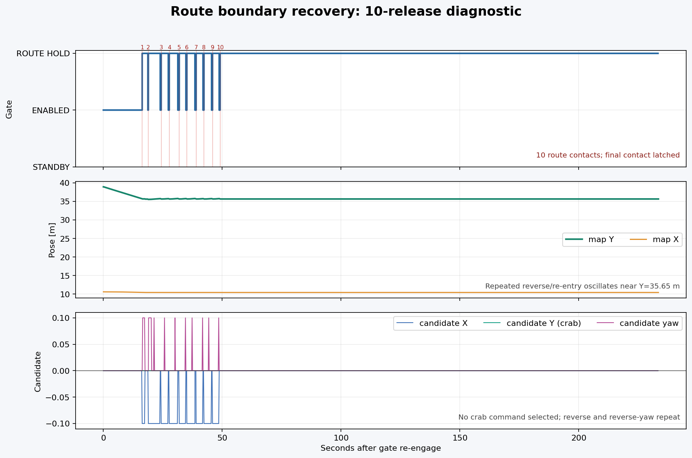
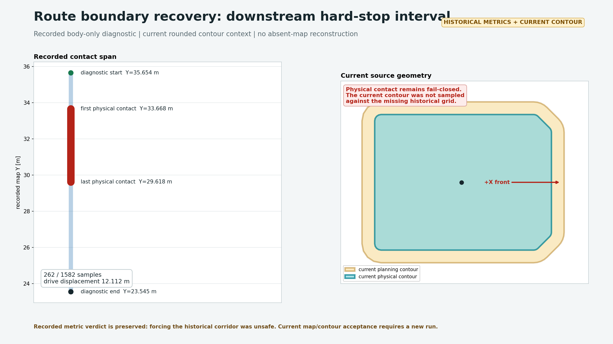

# Route Boundary Recovery Test Result - 2026-08-06

<!-- HH_260806 - Archive the live route-boundary retry and body-clearance diagnosis. -->

이 디렉터리는 AMD64 시뮬레이션에서 수행한 **lanelet 경계 정지 및 자동
복구 진단** 결과다. 목적은 다음 세 원인을 분리하는 것이다.

1. 자동 복구 횟수가 `1`회라서 통과하지 못하는가?
2. 현재 복구 제어가 안전한 crab/yaw 조합을 찾지 못하는가?
3. 로봇 본체 크기로도 지도 경계를 침범하여 실제로 통과할 수 없는가?

이 시험은 campsite 도착 후 실행되는 `CRAB_IN` 기능 시험이 아니다. Nav2
주행 중 `/control/cmd_vel_safety_gate`가 lanelet 경계를 감지한 상황을
대상으로 한다.

> Geometry history: this recording used the previous `1.49160 x 1.07000 m`
> physical body and `1.59160 x 1.17000 m` planning boundary. The later
> provisional reduction is analyzed separately in the
> [boundary adjustment replay](../robot-boundary-adjustment-20260806/README.md).

## Test Environment

| Item | Value |
|---|---|
| Date | `2026-08-06` |
| Host | AMD64 simulation PC |
| Sensor source | Simulation/fake sensor publisher |
| Real robot motion | Not performed |
| Active map | `lanelet2_maps.osm` |
| Map SHA-256 | `d7b7307eb66175f8963aa638af6b48cf6007169db6f35a89ac21a8c79bab213f` |
| Lanelet grid | `960 x 960`, `0.25 m/cell`, stop cost `100` |
| Physical body | front `0.75837 m`, rear `0.73323 m`, left `0.53505 m`, right `0.53495 m` |
| Planning footprint | physical body plus `0.05 m` on every side |

## Recorded Experiments

### 1. Margin-contact inspection

At `(10.4414, 35.6537)`, yaw `-93.41 deg`:

| Check | Result |
|---|---|
| Planning-margin perimeter | Two sampled points reached cost `100` |
| Physical-body perimeter | No cost `100`; maximum sampled cost was `98` |
| Center-to-cost-100 lateral clearance | left about `0.77 m`, right about `0.74 m` |

The first stop is therefore a **margin-only contact**. A bounded maneuver can be
possible here, but it must continue checking the complete physical body and the
projected motion.

### 2. Ten-release retry diagnostic

`route_safety_recovery_max_auto_releases` was changed from `1` to `10` only for
this diagnostic. The retained Nav2 goal moved the simulated robot about `3.2 m`,
then it repeatedly stopped and released near map `Y=35.65 m`.

| Metric | Result |
|---|---:|
| Route contacts after re-engage | `10` |
| Final gate state | `ROUTE_SAFETY_HOLD` latched |
| Candidate samples: none | `1538` |
| Candidate samples: reverse | `169` |
| Candidate samples: reverse-yaw-left | `26` |
| Candidate samples: crab | `0` |

Increasing the retry count repeated the same reverse/re-entry behavior. It did
not create a new escape direction, so retry count alone is not the solution.

### 3. Body-safe local action search

An offline state-space search evaluated forward, reverse, crab, and yaw actions
against the same lanelet grid using the physical-body footprint.

| Target | Search result |
|---|---|
| Local path index `13`, about `2.6 m` ahead | Found a body-safe 25-step sequence |
| Local path index `31`, about `6.0 m` ahead | No body-safe connection; `10,134` states expanded |

The short solution was `F10, FL2, F4, FR2, CR1, FR2, F4`, with `0.1 m`
translation and `2 deg` yaw discretization. This proves that the first
margin-only stop has a control-strategy limitation: a short forward/yaw/crab
combination exists even though the online selector chose no crab.

### 4. Body-only drive diagnostic

The planning-margin lanelet guard was temporarily disabled in simulation while
the physical body remained the offline acceptance criterion. This is a
diagnostic bypass, not a production operating mode.

| Metric | Result |
|---|---:|
| Enabled-drive displacement | `12.112245 m` |
| Pose samples | `1582` |
| Physical-body cost-100 samples | `262` |
| Planning-margin cost-100 samples | `1574` |
| First physical-body contact | `(10.2574, 33.6676)` |
| Last physical-body contact | `(9.8755, 29.6184)` |

The robot can move beyond the first margin stop, but from approximately
`Y=33.67 m` to `Y=29.62 m` the physical body itself intersects cost `100`.
Forcing continuous motion through that section would violate the current
robot/map clearance contract.

## Conclusion

| Question | Answer |
|---|---|
| Is one retry the only reason it stops? | No. Ten retries repeat the same local behavior and finally latch. |
| Is the first stop recoverable in principle? | Yes. It is margin-only, and the offline search found a short body-safe action sequence. |
| Can the complete shown corridor be forced through safely? | No. The physical body later intersects the lanelet cost-100 region. |
| Why was crab not selected online? | Neither lateral candidate became a uniquely safe projected direction at the recorded contacts. |
| What should change next? | Use progress-aware local forward/reverse/crab/yaw search for margin recovery; keep physical-body contact as a hard stop. |

The correct production behavior is therefore two-layered:

- Planning-margin contact may start bounded recovery and re-evaluation.
- Physical-body contact must remain fail-closed until the map or route geometry
  provides real clearance.

Simply raising the auto-release count would make the robot repeat the same
motion and is not accepted as a fix.

## Campsite Crab Scope

This result does not validate campsite entry. With the current runtime
configuration, campsite entry uses `site_entry_mode: crab` and starts only when
all of these mission conditions are present:

- planning state is `GOAL_REACHED` for `DELIVERY_TO_SITE` or `RECALL_TO_SITE`;
- the active key starts with `camping_site_` and the goal source is not manual;
- localization is within `0.3 m` of the snapped route goal;
- a valid route-goal/site-goal pair exists and the campsite is not occupied.

Then the maneuver controller enters `CRAB_IN` at `0.24 m/s`. Moving or
teleporting the robot to the snap coordinate by itself does not trigger crab,
and an existing controller `ERROR` must be reset by cancel/new mission flow.

## Raw Evidence

Raw rosbag files stay in `/tmp` and are not committed because they total about
`100 MiB`. Their hashes bind the figures and metrics to the source recordings.

| Bag | DB3 SHA-256 |
|---|---|
| `/tmp/camrod_route_recovery_live_20260806_run2` | `d85ca74c55dceafe1b69db1116c0d5d32ff3e2cbb5f79d71494d87eaa4dd2a92` |
| `/tmp/camrod_lanelet_snapshot_20260806` | `43d74c40f5d2a9a05367003a8817a508a3add05e0ab1e10cda97eb8c74021fd5` |
| `/tmp/camrod_body_only_drive_test_20260806` | `9b8470ad5e079631d1ebb55f4b57bb907d86f4cb52ead76e71099c8e0f340474` |

Machine-readable values are in [`result.json`](result.json). After the test,
`lanelet_safety_footprint_enable=true`, maximum auto releases `=1`, both engage
inputs `=false`, and the gate was restored to `STANDBY`.
