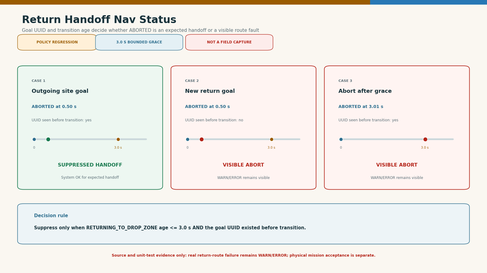
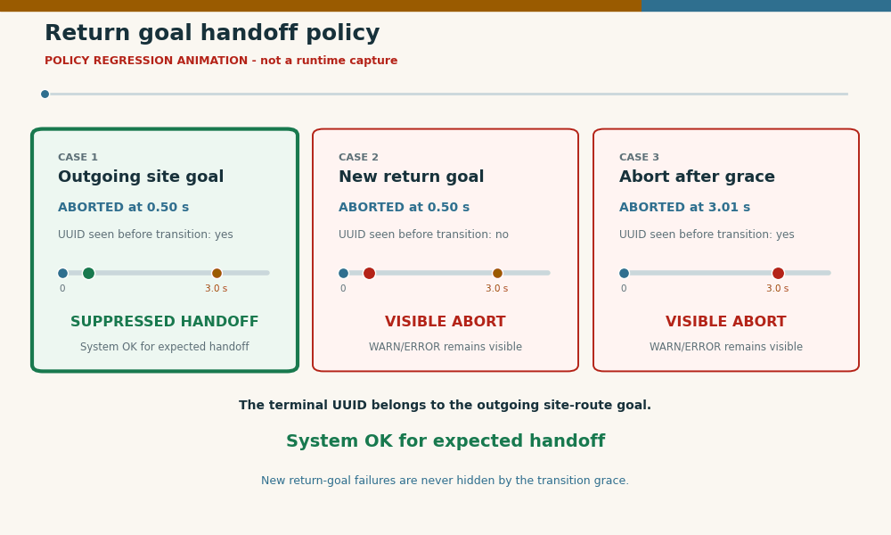

# Return Handoff Nav Status Regression

<!-- HH_260810 - Preserve the UUID-aware return-handoff policy result without
presenting a unit regression as a live robot or ROS mission capture. -->





## Scope

`POLICY REGRESSION`: this result checks the decision implemented by
`planning_nav_status_policy.hpp` and exercised by
`test_planning_nav_status_tracker.cpp`. It is not a physical drive or live ROS
screen recording.

## Result

| Return transition case | Expected diagnostic behavior |
|---|---|
| Outgoing goal UUID, `ABORTED` at `0.5 s` | Suppressed as the expected site-route handoff |
| New return-goal UUID, `ABORTED` at `0.5 s` | Visible; contributes to WARN/ERROR normally |
| Any otherwise eligible UUID, `ABORTED` at `3.01 s` | Visible because the `3.0 s` grace expired |

The machine-readable cases and source paths are in
[`policy-cases.json`](policy-cases.json).

## Reproduction

```bash
python3 camrod_bringup/scripts/visualization/render_operator_transport_handoff_results.py
colcon test --packages-select camrod_system camrod_bringup
```

The renderer creates a policy summary, not fabricated runtime telemetry. A
physical return mission still has to verify that an old terminal status clears
while a genuinely failed return route remains visible in UI and terminal.
