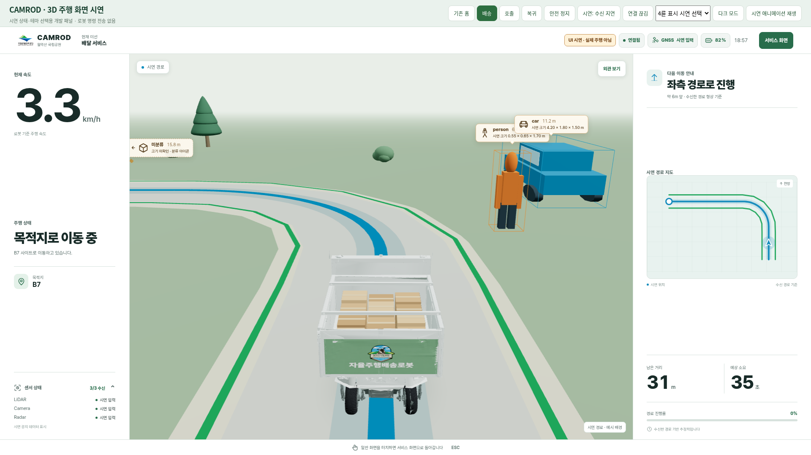

# 차선·주변 환경 표현 개선

## 결과와 범위

2026-10-02: 요청에 따라 CAMROD·시뮬레이터 실행 서비스와 운용 브라우저를 먼저
종료했다. 이후 로봇과 연결되지 않는 별도 브라우저 UI 시연으로만 표현을 검증했다.
실차/시뮬레이터 주행이나 수동 개입 후 재개 성공을 증명하는 자료가 아니다.

이번 변경은 공통 Robot UI 코드로 `develop`, `virtual/carla` 작업본에 동일하게
반영했다. 시뮬레이터 수동주행/재개 기능은 공통 변경에 포함하지 않았다.
구현·검증 단계에서는 커밋·태그·원격 push를 하지 않았으며, 이후 사용자 요청으로
이 변경과 아래 후속 곡선 개선을 함께 커밋·배포한다.

## 무엇을 어떻게 바꿨는가

| 파일 | 변경 |
|---|---|
| `navigationRoadVisuals.js` | 기존 각 구간 사각형 대신 일정 폭의 면과 둥근 연결부·끝단을 생성. 실제 좌표를 보간/이동하지 않고, 서로 다른 차선·큰 경로 간격은 연결하지 않음 |
| `navigationMath.js` | 파란 경로 표시도 같은 둥근 선 생성기를 사용. 기존 15m 경로 불연속 기준 유지 |
| `navigationSceneryVisuals.js` | 각진 관목을 겹친 둥근 형태로, 단일 각뿔 나무를 3단의 둥근 수관으로 변경. 부드러운 표면 법선과 기존 녹색 계열 유지 |
| `RangerNavigationScene.js` | 새 표시 모듈 연결. 반투명 경로 띠의 중첩 이음매를 줄이도록 차분한 불투명 바탕색 사용. 렌더링 수치 기록 추가 |
| `DrivingPreview.js` | 로컬 시연에만 합성 차선 두 개 추가. 동일 입력으로 녹색 차선과 주변 배경을 비교하기 위한 자료이며, 운용 지도/센서에는 적용하지 않음 |

초록색 차선의 표시 폭은 **0.10m** 그대로다. 이 1차 개선에서는 표시 면의
연결부/끝단만 둥글게 했다. 이후 요청에 따른 **좌·우 바운더리 꺾임 자체의
화면용 곡선 처리**와 최종 검증은 [후속 문서](navigation_boundary_curves_20261002.md)에
기록했다. 두 단계 모두 원본 지도·실제 주행 경로를 변경하지 않는다.
독립된 차선·끊긴 데이터·중복 점·급회전에서도 과도하게 길어진 모서리를 만들지 않는다.

관목·나무의 배치 중심은 유지하며 각각 반경 `0.65 × scale`, `0.95 × scale` 이내다.
기존 전체 도로·주행 경로·캠핑사이트·드롭존 침범 방지 조건도 유지했다.
주변 식물은 예시 배경이며 인지 객체나 실제 지형으로 표시하지 않는다.

### 함께 수정한 경로 깜빡임

브라우저의 `requestAnimationFrame` 인수는 프레임 시작 시각이다. 같은 프레임에서
React가 먼저 새 데이터를 받으면, 이 인수가 수신 시각보다 앞설 수 있었다.
음수 경과 시간을 잘못된 입력으로 판단해 경로·인지 표시가 순간적으로 숨겨졌다.

화면 갱신에서도 수신 코드와 같은 `performance.now()` 시계를 사용하도록 수정했다.
정상 수신은 유지되며 **실제 stale/연결 끊김 기준은 완화하지 않았다.**
회귀 시험은 늦게 수신한 같은 프레임의 데이터를 정상 표시하고, 추가 수신 없이
시간이 지나면 실제로 stale 처리되는 두 경우를 모두 검사한다.

## 검증

- `virtual/carla`: 프런트엔드 15개 suite / **265개** 테스트 통과.
- `develop`: 프런트엔드 14개 suite / **254개** 테스트 통과.
- 공통 UI Python 계약·주행 데이터 캐시 **102개** 테스트 통과.
- 두 작업본 모두 production build 성공.
- 최종 브라우저 시연: 밝은/어두운 화면 모두 정상 위치 수신, 기본 차선 표시,
  객체 라벨 3개 표시. JavaScript 예외·제어 API 요청·WebSocket 연결 없음.
- 새 주석은 해당 코드에 영어 `HH_261002 - ...` 형식으로 기록했다.

식물은 기존과 같이 최대 **3개 인스턴싱 배치**로 그린다. 별도 고해상도 텍스처나
동적 그림자를 추가하지 않았고 렌더링 해상도 상한도 바꾸지 않았다.
동일 시연 입력의 밝은 화면 삼각형은 120,094 → 128,666(약 7.1% 증가)이었다.
이는 기하량 비교이며, 실제 전체 운용 CPU/GPU·FPS 성능 측정 결과는 아니다.

## 시각 자료

모두 실제 브라우저 렌더링 캡처이며 AI 생성 이미지가 아니다. 화면 상단에
**UI 시연 · 실제 주행 아님**을 표시했다. GIF는 합성 주행 위치 입력의 UI 시연이다.

[밝은 화면 PNG](evidence/navigation_smoothing_20261002/after/light.png)
· [어두운 화면 PNG](evidence/navigation_smoothing_20261002/after/dark.png)
· [움직임 GIF](evidence/navigation_smoothing_20261002/after/navigation_smooth.gif)
· [개선 전 같은 지도 입력 PNG](evidence/navigation_smoothing_20261002/before_matched/light.png)
· [캡처 검사 JSON](evidence/navigation_smoothing_20261002/after/capture.json)

개선 전 캡처에는 위 시간 계산 문제로 경로·인지 표시가 일시적으로 사라질 수 있다.
주행 제어, 안전 게이트, 맵 파일, 센서 토픽, 미션/배터리 정책은 이번에 수정하지 않았다.
