# 🎨 CAMROD Diagram Palette

Visual reference for the unified CAMROD color palette used in all Mermaid diagrams.

---

## Palette Swatches

```mermaid
%%{init: {
  'theme': 'base',
  'themeVariables': {
    'fontFamily': 'ui-sans-serif, system-ui, sans-serif',
    'fontSize': '13px',
    'primaryColor': '#EEF2FF',
    'primaryTextColor': '#0F172A',
    'lineColor': '#CBD5E1'
  },
  'flowchart': { 'curve': 'basis', 'htmlLabels': true, 'padding': 10 }
}}%%
graph LR
  classDef sensing      fill:#ECFEFF,stroke:#06B6D4,stroke-width:2px,color:#0E7490;
  classDef localization fill:#ECFDF5,stroke:#10B981,stroke-width:2px,color:#047857;
  classDef mapping      fill:#FEF3C7,stroke:#F59E0B,stroke-width:2px,color:#B45309;
  classDef perception   fill:#FCE7F3,stroke:#EC4899,stroke-width:2px,color:#9D174D;
  classDef planning     fill:#EEF2FF,stroke:#6366F1,stroke-width:2px,color:#4338CA;
  classDef platform     fill:#FEE2E2,stroke:#EF4444,stroke-width:2px,color:#B91C1C;
  classDef parking      fill:#F5F3FF,stroke:#8B5CF6,stroke-width:2px,color:#6D28D9;
  classDef system       fill:#F1F5F9,stroke:#64748B,stroke-width:2px,color:#334155;
  classDef ui           fill:#FFF7ED,stroke:#F97316,stroke-width:2px,color:#C2410C;
  classDef iface        fill:#F0FDFA,stroke:#14B8A6,stroke-width:2px,color:#115E59;
  classDef topic        fill:#F8FAFC,stroke:#94A3B8,stroke-width:1.5px,color:#475569,font-style:italic;
  classDef config       fill:#FFFBEB,stroke:#D97706,stroke-width:2px,color:#92400E;
  classDef hardware     fill:#FAFAFA,stroke:#6B7280,stroke-width:2px,color:#374151;
  classDef highlight    fill:#FEF9C3,stroke:#CA8A04,stroke-width:3px,color:#713F12;

  SEN["🎯 sensing\n#ECFEFF / #06B6D4"]
  LOC["📍 localization\n#ECFDF5 / #10B981"]
  MAP["🗺️ mapping\n#FEF3C7 / #F59E0B"]
  PER["👁️ perception\n#FCE7F3 / #EC4899"]
  PLN["🧭 planning\n#EEF2FF / #6366F1"]
  PLT["🤖 platform\n#FEE2E2 / #EF4444"]
  PKG["🅿️ parking\n#F5F3FF / #8B5CF6"]
  SYS["🩺 system\n#F1F5F9 / #64748B"]
  UI["🖥️ ui\n#FFF7ED / #F97316"]
  IFC["📨 interface\n#F0FDFA / #14B8A6"]
  TOP["📡 topic\n#F8FAFC / #94A3B8"]
  CFG["⚙️ config\n#FFFBEB / #D97706"]
  HW["🛠️ hardware\n#FAFAFA / #6B7280"]
  HI["✨ highlight\n#FEF9C3 / #CA8A04"]

  SEN --- LOC --- MAP --- PER --- PLN --- PLT --- PKG
  SYS --- UI --- IFC --- TOP --- CFG --- HW --- HI

  class SEN sensing
  class LOC localization
  class MAP mapping
  class PER perception
  class PLN planning
  class PLT platform
  class PKG parking
  class SYS system
  class UI ui
  class IFC iface
  class TOP topic
  class CFG config
  class HW hardware
  class HI highlight
```



*Figure 1 — All 14 CAMROD palette swatches. Each node shows the layer name, fill color, and stroke color.*

---

<!-- HH_260720 - Rename the removed package palette role to control-owned parking. -->
## Palette Reference Table

| Layer / Role | Class name | Fill | Stroke | Text | Usage |
|:---|:---|:---:|:---:|:---:|:---|
| 🎯 Sensing / Hardware | `sensing` | `#ECFEFF` | `#06B6D4` | `#0E7490` | camrod\_sensing nodes, sensor hardware |
| 📍 Localization | `localization` | `#ECFDF5` | `#10B981` | `#047857` | camrod\_localization nodes |
| 🗺️ Mapping | `mapping` | `#FEF3C7` | `#F59E0B` | `#B45309` | camrod\_map nodes, config files |
| 👁️ Perception | `perception` | `#FCE7F3` | `#EC4899` | `#9D174D` | camrod\_perception nodes |
| 🧭 Planning | `planning` | `#EEF2FF` | `#6366F1` | `#4338CA` | camrod\_planning nodes |
| 🤖 Platform / Actuation | `platform` | `#FEE2E2` | `#EF4444` | `#B91C1C` | camrod\_platform nodes, safety boundary |
| 🅿️ Parking | `parking` | `#F5F3FF` | `#8B5CF6` | `#6D28D9` | camrod\_control parking nodes |
| 🩺 System / Diagnostics | `system` | `#F1F5F9` | `#64748B` | `#334155` | camrod\_system, camrod\_sensor\_kit |
| 🖥️ UI / External actor | `ui` | `#FFF7ED` | `#F97316` | `#C2410C` | camrod\_ui, browser clients |
| 📨 Interface | `iface` | `#F0FDFA` | `#14B8A6` | `#115E59` | avg\_msgs, shared interfaces |
| 📡 Topic (data stream) | `topic` | `#F8FAFC` | `#94A3B8` | `#475569` | Any ROS topic node (italic label) |
| ⚙️ Config / File | `config` | `#FFFBEB` | `#D97706` | `#92400E` | YAML config files, parameter sets |
| 🛠️ Hardware | `hardware` | `#FAFAFA` | `#6B7280` | `#374151` | Physical hardware devices |
| ✨ Highlight | `highlight` | `#FEF9C3` | `#CA8A04` | `#713F12` | Critical nodes, safety boundaries |

---

## Copy-Paste: classDef Block

Paste this block after the init block in every Mermaid flowchart:

```
classDef sensing      fill:#ECFEFF,stroke:#06B6D4,stroke-width:1.5px,color:#0E7490;
classDef localization fill:#ECFDF5,stroke:#10B981,stroke-width:1.5px,color:#047857;
classDef mapping      fill:#FEF3C7,stroke:#F59E0B,stroke-width:1.5px,color:#B45309;
classDef perception   fill:#FCE7F3,stroke:#EC4899,stroke-width:1.5px,color:#9D174D;
classDef planning     fill:#EEF2FF,stroke:#6366F1,stroke-width:1.5px,color:#4338CA;
classDef platform     fill:#FEE2E2,stroke:#EF4444,stroke-width:1.5px,color:#B91C1C;
classDef parking      fill:#F5F3FF,stroke:#8B5CF6,stroke-width:1.5px,color:#6D28D9;
classDef system       fill:#F1F5F9,stroke:#64748B,stroke-width:1.5px,color:#334155;
classDef ui           fill:#FFF7ED,stroke:#F97316,stroke-width:1.5px,color:#C2410C;
classDef iface        fill:#F0FDFA,stroke:#14B8A6,stroke-width:1.5px,color:#115E59;
classDef topic        fill:#F8FAFC,stroke:#94A3B8,stroke-width:1px,color:#475569,font-style:italic;
classDef config       fill:#FFFBEB,stroke:#D97706,stroke-width:1.5px,color:#92400E;
classDef hardware     fill:#FAFAFA,stroke:#6B7280,stroke-width:1.5px,color:#374151;
classDef highlight    fill:#FEF9C3,stroke:#CA8A04,stroke-width:2.5px,color:#713F12;
```

---

## Related Docs

- [README_STYLE_GUIDE.md](./README_STYLE_GUIDE.md) — full visual rules
- [PACKAGE_README_TEMPLATE.md](./PACKAGE_README_TEMPLATE.md) — starter template
- [../../PARAMETER_NAMING_STANDARD.md](../../PARAMETER_NAMING_STANDARD.md)
