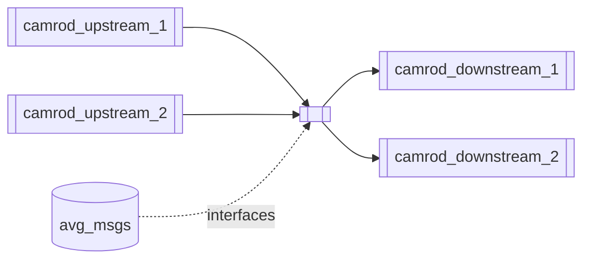
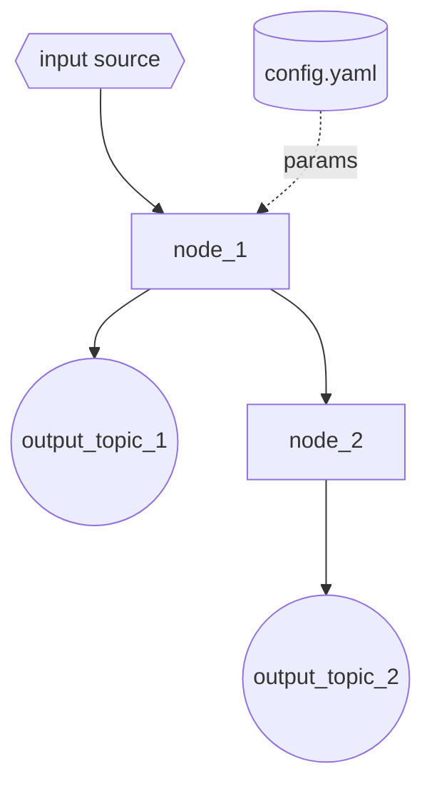

# `<package_name>` — <one-line role>

<!-- SECTION 2: Summary -->
## Summary

**Role:** <one sentence describing what this package does>

| | |
|---|---|
| **Main inputs** | `<topic_1>`, `<topic_2>` |
| **Main outputs** | `<topic_out_1>`, `<topic_out_2>` |
| **Upstream** | `camrod_X`, `camrod_Y` |
| **Downstream** | `camrod_A`, `camrod_B` |

**Non-goals:** This package does NOT <X>. <Y> is handled by `<other_package>`.

---

<!-- SECTION 3: Quick Start -->
## Quick Start

```bash
ros2 launch <package_name> <main>.launch.py
```

Common overrides:

```bash
ros2 launch <package_name> <main>.launch.py \
  <arg_1>:=<value> \
  <arg_2>:=<value>
```

---

<!-- SECTION 4: System Position -->
## System Position

Where this package sits relative to upstream and downstream packages.



---

<!-- SECTION 5: Runtime Architecture -->
## Runtime Architecture

Internal nodes and data flow within this package.



---

<!-- SECTION 6: Interface Contract -->
## Interface Contract

### Inputs

| Topic | Type | Required | Producer | Rate / Trigger | Meaning |
|-------|------|----------|----------|----------------|---------|
| `/input/topic_1` | `pkg/MsgType` | Yes | `camrod_X` | 10 Hz | Description |
| `/input/topic_2` | `pkg/MsgType` | No | `camrod_Y` | on change | Description |

### Outputs

| Topic | Type | Consumer | Rate / Trigger | Meaning |
|-------|------|----------|----------------|---------|
| `/output/topic_1` | `pkg/MsgType` | `camrod_A` | 10 Hz | Description |

### TF Frames (if applicable)

| Frame | Parent | Type | Published by |
|-------|--------|------|-------------|
| `frame_a` | `frame_b` | static | `node_name` |

### Services / Actions (if applicable)

| Name | Type | Direction | Description |
|------|------|-----------|-------------|
| `/service/name` | `pkg/Srv` | server | Description |

---

<!-- SECTION 7: Key Behaviors -->
## Key Behaviors

Brief intro: this section explains the non-obvious logic inside this package.

**Behavior 1: <behavior name>**
- **Trigger:** <condition that activates this>
- **Internal logic:** <what the node does>
- **Output effect:** <what changes on the topics/TF>
- **Operator-visible symptom:** <what you see in UI or RViz>
- **Related params:** `param_name_s`, `another_param_hz`
- **Related topics:** `/relevant/topic`

**Behavior 2: <behavior name>**
- **Trigger:**
- **Internal logic:**
- **Output effect:**
- **Operator-visible symptom:**
- **Related params:**
- **Related topics:**

---

<!-- SECTION 8: Launch -->
## Launch

### `<main>.launch.py`

| Argument | Type | Default | Description |
|----------|------|---------|-------------|
| `arg_1` | bool | `true` | Description |
| `arg_2` | string | `''` | Description |

---

<!-- SECTION 9: Config -->
## Config

Which file to edit for which scenario.

| Scenario | File | Key param(s) |
|----------|------|-------------|
| Tune <X> | `config/<file>.yaml` | `param_name_s` |
| Change <Y> | `config/<other>.yaml` | `param_name_hz` |

---

<!-- SECTION 10: Validation -->
## Validation

Commands to confirm the package is running correctly after launch.

```bash
# Confirm the main output is publishing
ros2 topic hz /output/topic_1

# Check a specific value
ros2 topic echo --once /output/topic_1

# Verify TF (if applicable)
ros2 run tf2_ros tf2_echo parent_frame child_frame

# Check node is alive
ros2 node list | grep <package_name>
```

---

<!-- SECTION 11: Troubleshooting -->
## Troubleshooting

| Symptom | Likely cause | What to check |
|---------|-------------|---------------|
| `<symptom 1>` | `<cause>` | `<action>` |
| `<symptom 2>` | `<cause>` | `<action>` |

---

<!-- SECTION 12: Related Docs -->
## Related Docs

- [Root README](../README.md)
- [camrod_upstream_1](../camrod_upstream_1/README.md)
- [camrod_downstream_1](../camrod_downstream_1/README.md)
- [PARAMETER_NAMING_STANDARD](../PARAMETER_NAMING_STANDARD.md)
- [Style Guide](../docs/templates/README_STYLE_GUIDE.md)
