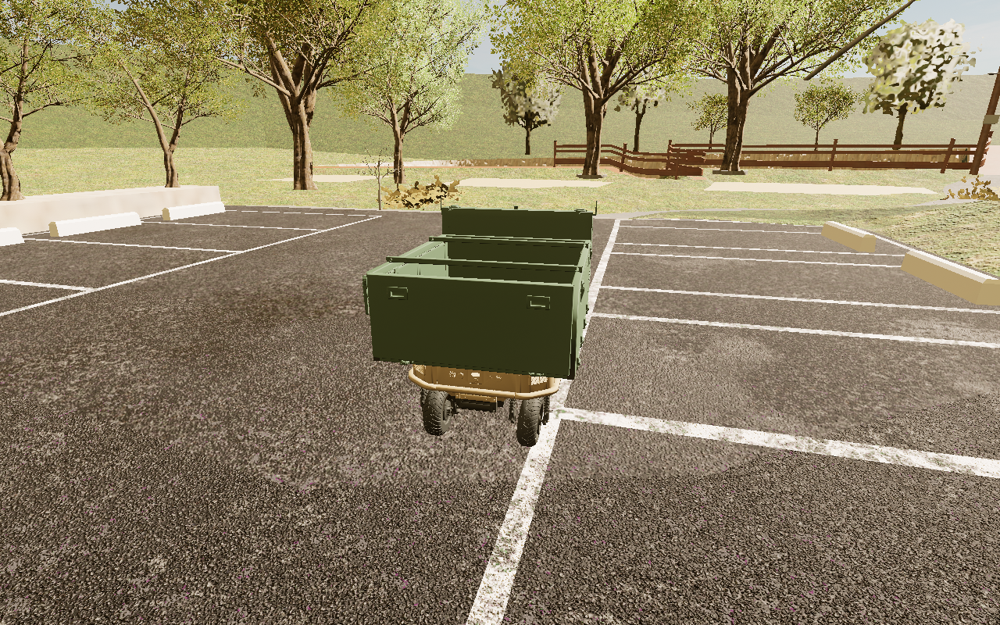
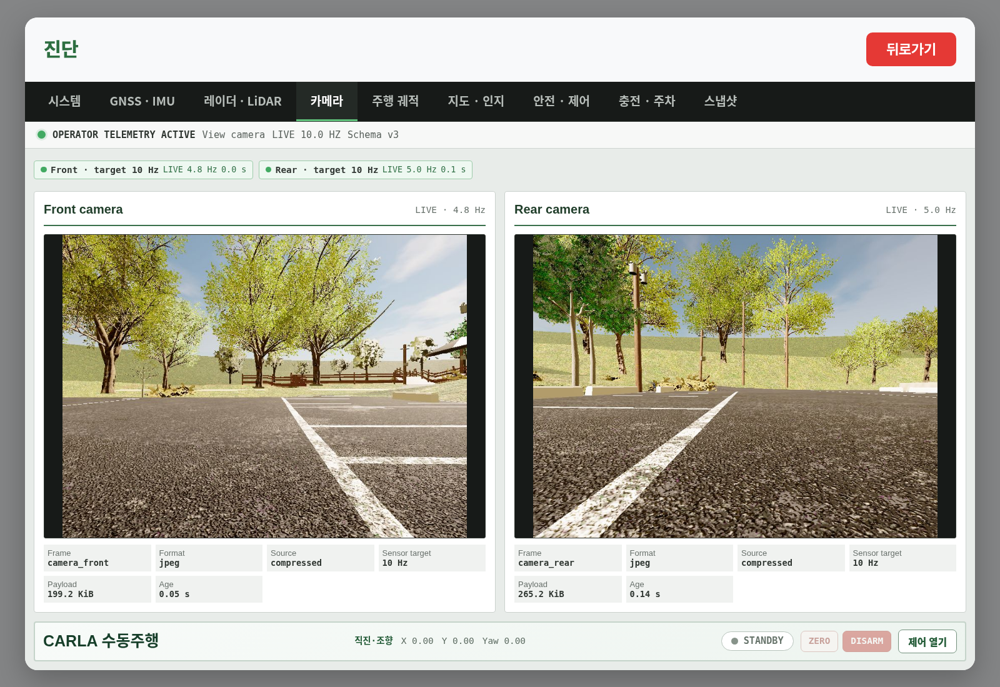
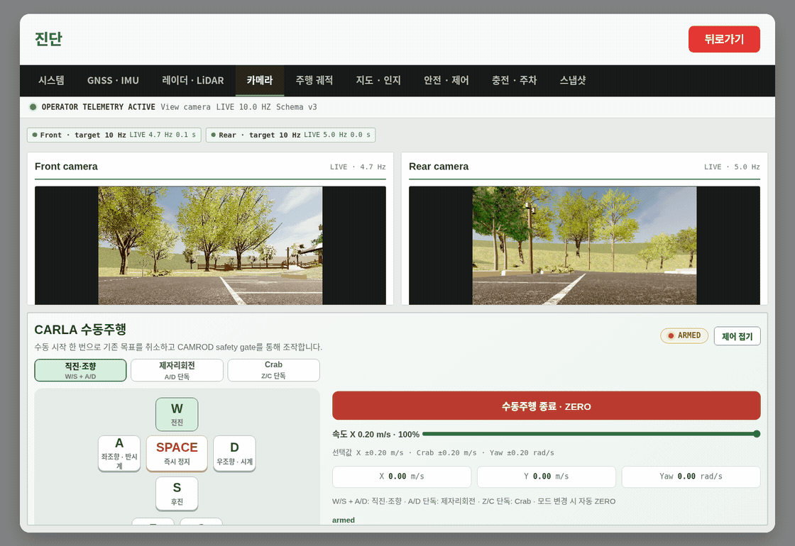

# develop v2.2.9 갱신 및 Ranger/CARLA 실제 연동 확인

검증일: 2026-09-30. **최신 소스 병합, 빌드, 실제 센서 연결, 드롭존 출차,
짧은 UI 수동주행까지 확인했다. B1~B13 왕복·recall·도킹 전체 완료 보고서는 아니다.**

## 1. Git 기준과 보존 사항

| 항목 | 확인 결과 |
|---|---|
| 원격 `origin/develop` | `fe6f7815fc13eee1b482bee9e5d2b3badddec9a0` |
| `v2.2.9^{}` | 위 develop과 동일 |
| 로컬 `develop` | 위 커밋으로 갱신. CARLA 변경을 추가하지 않음 |
| 기존 `virtual/carla` | `d3ea6c4eeafd9b4bb0a17d9366c7afdd01654364` |
| 최신 develop 병합 커밋 | `0c7e20ef6` — 이후 연동 보정·증거 커밋을 추가 |

로컬 develop 작업 폴더는 `../.codex-develop-20260904`, 실제 실행 소스는
`~/camrod_ws/src`의 `virtual/carla`이다. develop 작업 폴더를 CARLA 버전으로
바꾸거나 CARLA 파일을 develop에 추가하지 않았다. 이번 작업은 로컬 갱신·검증이며
원격 push 및 태그 이동은 하지 않았다.

기존 미커밋 수정(virtual 29개, develop 27개)은 버리지 않고 다음 브랜치에 보존했다.
최신 실행에는 과거 보정값을 덧씌우지 않고 v2.2.9 설정을 사용했다.

- `backup/pre-v229-virtual-20260930`: `075803a317c79c56ce3d2fd5ff627944f16c9aa5`
- `backup/pre-v229-develop-20260930`: `9cf23b6b7c5c4d3e718307e06d44c412ee978651`
- 원본 패치/빌드/실행 로그: `~/camrod_ws/_maintenance/20260930_v229/`

### 원격 최신 버전 자체에서 달라진 기능

지도 v26, 활성 주차 영역 `dz_area_7144`, 사이트/경로·코너 주행 파라미터,
키오스크 안전 안내와 서비스 선택, 음성 완료 후 출발 절차,
스냅샷 UI·버퍼·자동 캡처 기능을 반영했다.

**v2.2.9 원격 자체가 이전 `MissionRecords` 화면, `mission_recorder_node`,
일부 CAN/미션 기록·이관 코드를 제거한 상태다.** 이를 CARLA 쪽에서 임의로
되살리지 않았다. 새 스냅샷은 이전 미션 저널 기능 전체와 같은 기능이 아니다.
기존 운행 데이터 파일을 삭제하거나 변환하지 않았다.

기존 virtual 브랜치에는 제어/런치/UI의 시뮬레이터 전용 변경도 존재한다.
이번 작업은 그 위로 develop을 병합한 것이며, 두 브랜치 모든 파일이
바이트 단위로 동일해졌다는 뜻은 아니다. 과거 B1~B13 증거도 새 버전 증거로
재사용하거나 새 버전 전체 합격으로 표시하지 않는다.

## 2. 추가로 고친 연동 부분

| 파일/영역 | 변경 이유와 내용 |
|---|---|
| `camrod_bringup/launch/_bringup_impl.py` | 최신 snapshot 런치 인자와 기존 external simulator/실제 센서 입력 인자를 함께 유지하도록 병합 충돌 해결 |
| `camrod_ui/.../App.js`, `TelemetryWorkspace.js`, `ui_backend_node.py` | 최신 서비스·스냅샷 UI와 CARLA 수동제어, 실제 후방 카메라 대체 표시, WebSocket 초기 상태 직렬화 유지 |
| `camrod_carla_adapter/launch/camrod_carla_full.launch.py` | 예전 CARLA 방향 오차 진입 `75° / 전방 2.0 m` 덮어쓰기를 최신 `135° / 1.2 m`로 변경. 이탈 기준은 develop의 `25°` 유지 |
| 같은 CARLA 런치 | develop 스냅샷 YAML의 토픽 목록은 재사용하고 `offload.enabled=false`, 자동/수동 저장 경로를 시뮬레이션 전용 폴더로 변경. 자식 프로세스 `XDG_STATE_HOME`도 분리 |
| `ranger_spawn_camrod_{full_sensors,control_only}.json` | 새 `dz_area_7144` 중심 `(-8.47366, 40.391)`과 차체 방향 `91.7873°`에 맞게 소환 위치 갱신 |
| `woraksan_lane_anchor_alignment.yaml` | 최신 소환 기준 설명 갱신. 지리 좌표 변환 자체는 변경하지 않음 |
| `camrod_sensor_kit/config/robot_params.yaml` | 예전 virtual의 기본 GNSS x=0.0을 최신 develop 기본값 0.65 m와 일치시킴. CARLA 실행에서는 기존 `runtime_sensor_mount.py`가 실제 spawn 센서 위치로 입력 보정과 TF를 함께 생성 |
| `camrod_carla_adapter/package.xml` | 스냅샷·YAML 재작성에 사용하는 실행 의존성 명시 |
| UI/연동 테스트 | 최신 안전 안내 확인 절차, 현재 WebSocket 초기 프레임, 현재 카메라 표시, 새 스냅샷 격리·소환 좌표를 검증하도록 갱신 |

새 소환 위치는 CARLA `cast_ray`로 실제 바닥 z=`-0.9365966 m`를 확인했다.
소환 z=`-0.4365966 m`에서 물리적으로 바닥에 내려앉는다. 차체 강제 이동을
주행 성과로 계산하지 않았고, 지형·턱·Ranger 모델·토크는 이번에 변경하지 않았다.

## 3. 실행 환경 및 빌드/테스트

- ROS 2 Humble, CARLA 0.9.15 소스 설치, UE 4.26, RTX 3060.
- CAMROD 소스: `~/camrod_ws/src`; Ranger 패키지: `~/Downloads/ranger-carla-4ws-pipeline`.
- 기존 사용자 정의 `Woraksan_camrod_b2_b4_clearance_b3safe_tag_tilt10_v224_dropzone` 맵 재사용.
- 기존 물리 4WS 승인 자료와 현재 바이너리/소스 해시의 일치를 `doctor`가 재검증했다.
  이번에 UE/CARLA를 새로 빌드했다는 뜻은 아니다.
- 기존 GPU용 TensorRT 8.6.1.6 엔진을 런타임 검증하여 재사용했다.
- ROS domain 188. 센서는 CARLA camera/LiDAR/radar/GNSS/IMU actor가 생성한다.

| 검사 | 결과 |
|---|---|
| UI production build 및 설치 번들 일치 검사 | 통과 (`main.c48664eb.js`) |
| 메시지·스냅샷·UI·bringup·제어·위치추정·지도·계획·센서 TF·진단·음성·adapter 12개 패키지 빌드 | 성공; 최종 adapter/센서 설정도 다시 빌드 |
| UI·센서 처리·좌표변환·스냅샷 격리 등 선택 회귀 테스트 | **642 passed** |
| CARLA 실행/빌드/구성 소스 검사 | **145 passed** |
| 제어 CTest 실행 파일 8개: 주차, 출차, recall/return, AprilTag 등 | **8/8 passed** (실제 도킹 주행 완료 증거는 아님) |
| 실행 `doctor` | baseline/물리 4WS gate, ROS 패키지, Python 확장, YOLO 엔진 확인 통과 |
| 실제 전·후방 카메라 및 LiDAR 입력 | **약 9.56~9.58 Hz**, 구조·최신성 검사 통과 |
| UI `/ui/health`, `/ui/state` | 정상; 시험 종료 시 `ready=true`, `engaged=false`, `STOP` |
| 스냅샷 상태 | 서비스 사용 가능, 실제 토픽 버퍼링 중, NAS offload=false |

원격 develop 그대로의 UI 테스트 중 3개는 새 안전 안내 화면의 확인 단계를
누락한 구형 테스트 절차로 실패함을 별도 확인했다. virtual에서는 실제 확인
핸들러를 실행하도록 테스트를 고쳤다. 원격 develop 소스 자체를 수정하지 않았다.

## 4. 실제 Ranger 제어 결과

### B7 요청 → 출차 → 경로 주행 시작

UI의 정상 `/ui/destination?site=B7&run=true` API로 요청했다. 직접 CARLA 제어,
위치 순간이동, 가짜 위치/센서 발행으로 진행시키지 않았다.

- 요청 응답: 성공. `site goal pending drop-zone straight exit and yaw alignment`.
- 요청 후 약 **13.3 s**: 음성 출발 절차 뒤 `DEPARTING_DROP_ZONE`.
- 약 **38.1 s**: `MOVING_TO_SITE`로 전환.
- 약 **51.6 s**: 시작점과의 평면 변위 **5.244 m**, 1초 간격 위치 샘플의
  누적 평면 이동거리 **6.802 m**. 이는 실증 거리 DB의 공식 적산값은 아니다.
- 계획한 짧은 연동 시험 범위에 도달해 정상 UI STOP으로 종료.

**B7 도착 완료/복귀 성공으로 해석하면 안 된다.** B1~B13 전체, return,
recall, 배터리 자동복귀, 실제 AprilTag 도킹은 이번 실행에서 완료하지 않았다.
특히 새 7144 주차 위치와 기존 UE 충전기/태그 배치의 일치는 별도 확인이 필요하다.

### 실제 UI 수동제어

새 드롭존 내부에서 먼저 실행한 수동 입력은 `lanelet_physical_body_cost`에 의해
정지했다. 이 결과를 실패/제한 자료로 보존했다. 안전 조건을 끄지 않았으며,
위의 정상 출차 이후 주행 영역에서 같은 UI 입력을 다시 실행했다.

| 약 2.5초 입력 | 실제 평면 변위 | CARLA yaw 변화 |
|---|---:|---:|
| 전진 | 0.274 m | -0.228° |
| 후진 | 0.267 m | -0.054° |
| 좌 크랩 | 0.200 m | -0.048° |
| 우 크랩 | 0.191 m | +0.097° |
| 좌 제자리 회전 | 0.014 m | -8.536° |
| 우 제자리 회전 | 0.017 m | +8.253° |

회전 부호는 CARLA 좌표계다. 모든 명령은 실제 Robot UI 로그인 후 키 입력으로
전달했다. 측정은 CARLA actor의 실제 transform/velocity 읽기만 사용했다.
시험 종료 시 키 해제, ZERO/DISARM, 정상 UI STOP을 실행했다.

## 5. 실제 PNG/GIF 및 원본 결과

증거 폴더: [`evidence/virtual_carla/v2_2_9_20260930`](evidence/virtual_carla/v2_2_9_20260930).
AI 생성 이미지나 테스트 결과를 합성한 화면이 아니다.







GIF는 입력 중 취득한 실제 프레임을 3 fps로 재생한다. 입력 사이 대기 구간은
포함하지 않으므로 정확한 소요 시간은 GIF 길이가 아니라 원본 JSON의 시간값을 본다.

- `departure.json`: 요청 응답, 시간별 위치/서비스 상태, 시험 STOP 응답.
- `road_manual_actual_runtime.json`: 각 키 입력의 전후 위치·회전·속도 샘플.
- `dropzone_manual_blocked.json`: 드롭존 내부 수동 입력이 차단된 결과.
- `sensor-streams.json`: 실제 카메라/LiDAR 주기·최신성·프레임 구조 검사.
- `04_snapshot_buffer.png`: 실제 새 스냅샷 UI.
- `unit-tests.xml`, `source-tests.log`, `control-tests.log`: 테스트 원본.

기존 실차 실증 DB의 SHA256은 이전 확인값과 동일하다:
`43e292886f786f0c359675b88b8219af150ac24d8a4a171c205db48db5c46261`.
시험 자료/스냅샷/SQLite는 `_maintenance/20260930_v229/state` 아래로 격리했다.

## 6. 이 PC에서 다시 실행

현재 실행 중인 서버/bridge/spawn/CAMROD에 같은 명령을 중복 실행하지 않는다.
화면만 보려면 `http://127.0.0.1:8010`으로 접속한다. 종료 후 재실행할 때는
각 터미널에서 아래 공통 설정을 읽고, 명령을 순서대로 하나씩 실행한다.

```bash
cd /home/hong/camrod_ws/src
source /home/hong/camrod_ws/_maintenance/20260930_v229/runtime.env
```

```bash
# 먼저 설정/설치 검사 (서버가 없어도 정적 검사는 가능)
./scripts/virtual_carla/run.sh doctor

# 별도 터미널마다 공통 설정을 읽은 뒤, 아래 순서로 하나씩:
./scripts/virtual_carla/run.sh server
./scripts/virtual_carla/run.sh bridge
./scripts/virtual_carla/run.sh pacer
./scripts/virtual_carla/run.sh spawn
./scripts/virtual_carla/run.sh camrod

# 선택: 실제 Ranger 추적 시점 / 운영자 UI 창
./scripts/virtual_carla/run.sh spectator
./scripts/virtual_carla/run.sh operator-ui
```

`pacer`의 ready와 `spawn`의 All objects spawned, CAMROD의 readiness ready를
차례로 확인한다. 드롭존 안에서 수동 버튼으로 억지로 출차시키는 대신 정상
사이트 미션을 요청하여 출차 제어 절차를 거친다. 이번 시작 설정은 이 PC의
기존 설치·검증 자료 경로를 사용하므로 타 PC 전체 환경 설치 검증과는 다르다.
